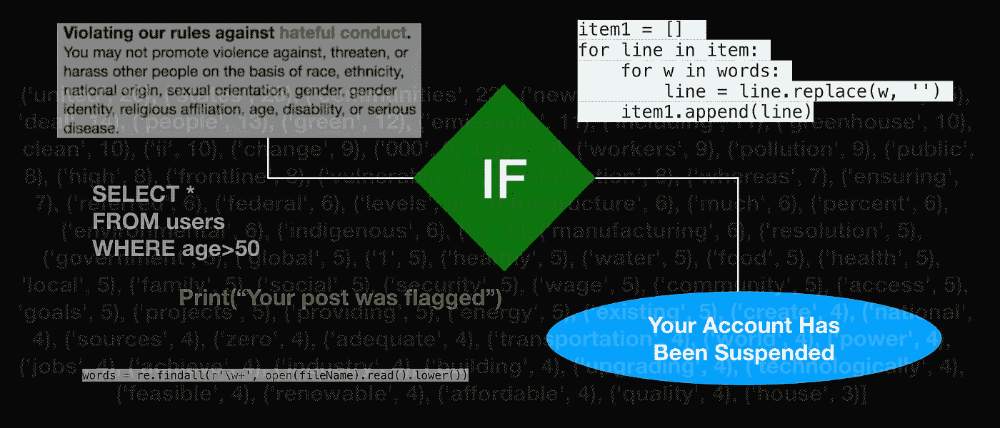
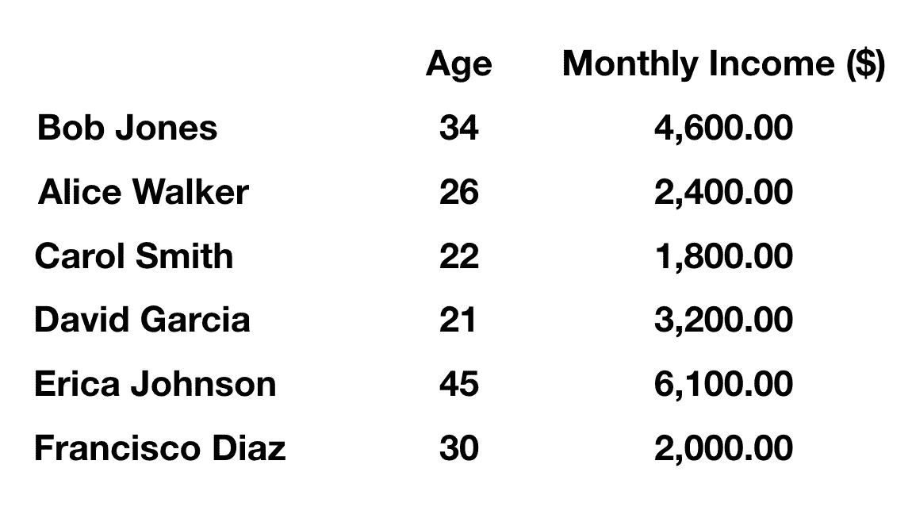
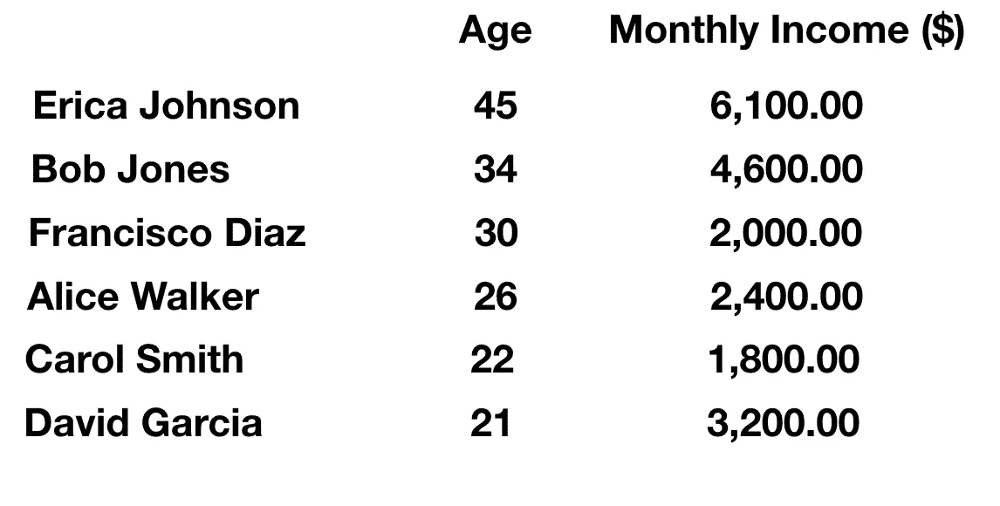
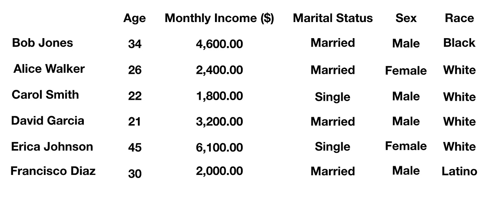

# 算法本身并没有偏见，它是一种预期的结果，会带来意想不到的后果

> 原文：<https://medium.datadriveninvestor.com/algorithms-are-not-inherently-biased-its-a-result-of-expectations-with-unintended-consequences-1d8c144f52af?source=collection_archive---------5----------------------->

对于科技公司如何在软件中使用算法，倾向于支持他们的政治意识形态或偏见，有很多批评。Twitter、脸书和谷歌等公司因监管内容时的偏袒而受到批评。Twitter 被指控禁止比自由派用户更多的保守派和右翼用户。众所周知，脸书支持更多支持自由主义和左派观点的内容。据观察，谷歌在搜索结果中对左派内容的排名高于右派和保守派。我不会列举所有的例子，但是你可以阅读这篇关于这是如何发生的文章。似乎主流媒体“假新闻”有某种偏见，倾向于某种意识形态而不是另一种。

一些批评人士将其归咎于这些科技公司使用的算法。算法基本上就是遵循软件中处理数据的过程和例程的代码。无非就是编程的时候怎么会有偏差？问题不在于代码本身，而在于谁在编写代码。换句话说，它确实可以追溯到最初创造它的科技公司。算法本身是无偏的，它只是用来处理数据的工具。正是开发人员基于他们想看到的东西创建了这些算法，从而产生了偏见。

 [## 算法诱人的商业逻辑——数据驱动的投资者

### 某些机器行为总是让我感到惊讶。我对他们从自己的成就中学习的能力感到惊讶…

www.datadriveninvestor.com](https://www.datadriveninvestor.com/2019/03/22/the-seductive-business-logic-of-algorithms/) 

算法由开发工具生成，这些开发工具是编程语言，如 C++、Java、JS、C#等。编程语言遵循的编码规则就是所谓的语法。这些规则由开发环境解析器解释，解析器将代码翻译成计算机可以理解和执行的机器语言。这需要编译代码的过程。当语法不正确时，代码将返回一个错误并停止执行。因此，每一种编程语言都需要有规则，否则就无法工作。这些规则用于创建代码，但是决定代码做什么是由编写代码的人决定的。

## 数据处理中的偏差

算法是根据程序员希望它做的事情创建的。例如，假设我是程序员，我想创建一个程序，根据列表中个人的年龄对以下数据集进行排序(见下文)。

Sample data of individual’s age and monthly income. There is no bias with the data itself. (This is fictitious data for this example only)

数据存储在一个名为“Persons”的数据库表中，我将根据标准或条件从中提取信息。假设我们想根据年龄对数据进行排序。让我们使用这个 **SQL** 语句。

**SELECT * FROM Persons BY Age desc**

然后，我们应该可以看到表中“年龄”列的降序结果。

Data results from a SQL query to arrange data according to ‘Age’.

既然我们得到了结果，我们就有了我们的“偏见”或标准。偏见是根据个人的年龄来安排数据。也许这样做的原因是为了看看年龄和收入之间是否存在相关性，看看老年人总体上是否更稳定。这只是一个例子，并不是实际的数据洞察，但您可以看到这个例子显示了什么。在编写代码的人根据他们想看到的东西设定标准之前，它是没有偏见的。这同样适用于大型科技公司如何编写他们的软件来遵循他们的政策，这些政策可以基于他们的价值观，即意识形态。

现在，我们添加其他细节，如“婚姻状况”、“性别”和“种族”。这才是真正有趣的地方，因为这可以证明偏见有时可能是错误的，因为刻板印象和错误的假设。即使基于贝叶斯推理也不一定完全准确。

Expanding the data with columns ‘Marital Status’, ‘Sex’ and ‘Race’. With all this data people can base their impressions of it based on their experiences, values, beliefs and even stereotypes.

这就是算法中可能出现偏差的地方。如果一家广告和营销研究公司正在分析人口统计数据，他们可能会对个人的性别、种族甚至年龄有成见。例如，他们可以根据种族对目标进行编程，但这本身并不是一个绝对值。例如，拉丁美洲人并不是一个真正的种族，而是一个民族，然而一些市场研究公司会这样对待它。您注意到在这个样本数据中，David Garcia 被列为“白人”男性，尽管他有一个拉丁/西班牙姓氏。事实上，拉丁美洲人可以是来自中南美洲和/或西班牙裔国家(墨西哥、古巴、波多黎各等)的任何种族。).

另一个偏见是性别陈规定型观念，人们可能认为已婚男性收入最高，但数据显示，单身女性的月收入最高。还有一个男性名叫卡罗尔，尽管卡罗尔更多地与女性联系在一起。对于关系数据库，它甚至可以深入到细节中。不带任何偏见，无非就是数据。当你没有足够的数据并把它放在上下文中，对结果的解释会导致偏见。当编程到软件中时，这些偏差会导致数据处理中的问题。

更多数据的好处是，它实际上可以帮助消除偏见，呈现事实。在过去，如果没有关系数据库和高级数据分析，就会有更多基于刻板印象的偏见。20 世纪初，美国的普通人会认为任何有西班牙姓氏的人都是墨西哥人，他们并不知道其他国家也有类似的血统。在当时的背景下，没有像今天这样多的关于种族和民族的信息。今天的人们也比以前受到了更好的教育，获得了更多的信息。其他诸如“男人总是比女人赚得多”之类的刻板印象被证明是错误的，因为有些女性高管和男性同事挣得一样多。

当把数据处理成有用的信息时，来自用户上下文的解释产生了偏见。我将给出另一个例子，这次使用文本和词汇的 **NLP(自然语言处理)**。NLP 的使用有助于分析书面文本和语音来收集信息。用于处理数据的算法实际上是不偏不倚的，因为它们除了提供信息之外什么也不做。下面是一个我用来分析“绿色新政”文件转录的例子，通过统计词汇或文本中出现频率最高的词。我列出了抄写中出现频率最高的 10 个单词。我将在本文末尾提供我的原始数据的链接。

*('联合'，26)，('州'，26)，('社区'，23)，('新'，19)，('气候'，16)，('经济'，15)，('交易'，14)，('人民'，13)，('绿色'，12)，('排放'，11)，……]*

正如你所看到的，我设置了 NLP 程序来统计词汇，但排除了最常用的词，如“the”、“and”、“we”等。我从 Python 中使用的 NLTK 库中应用了一个“停用词”列表来过滤掉这些词，以获得更准确的结果。

从结果中，我们看到文本中重复最多的词与“美国”“人民”和他们的“社区”有关，以及“新”“气候”“经济”协议如何通过更多地使用“绿色”技术来解决“排放”问题。这可能是一个没有真正阅读整个文件的人对它的解释，他没有考虑到进步左派或保守右派的背景。到目前为止，可以说“绿色新政”是通过新的经济政策来应对气候变化，从而改善环境。

因此，这是一个真正的公正的结果，提供了简单的信息。用伪代码解释一下，我想让我的程序做的事情如下:

*   取文本文件的名称“绿色新政”并加载到内存中。
*   使用 NLP 的 NLTK 库模块处理文本文件。
*   创建最常出现的单词的列表或数组。
*   将结果打印到标准输出。

然而，当一个人解释它，并把它放到他们的信仰和价值观的背景下，它就变了。对于所有这些，总是有事实核查和反驳。我只是概述了这样一个文档的作者可能有很好的动机，但包含了算法默认无法知道的隐藏议程。考虑到对立意识形态的价值背景，可以设置一个辩论来争论基于这些信念的文件。阅读整份文件可以帮助读者进一步理解支持者和反对者的主要观点。在这种情况下，你不可能真正保持中立，因为这涉及到一项政策。这个决定是二元的，是我们接受还是不是我们不接受。根据该制度的运作方式，如果大多数人投票反对，那么该制度就无法实施。

数据可以根据一个人想看的内容进行处理。然后，人们根据他们的知识和信念来解释这些信息。这就是为什么当涉及到气候变化等问题时，基于相同的数据方法会有相反的观点。一方因此对数据做出不同的解释，即解释中的偏差。

## 社交媒体中的偏见

有人指责科技巨头基于意识形态偏袒某些用户。用户因违反政策在某些平台上被禁止。违反政策是基于管理层的意识形态和信念。它似乎不是中立的，虽然我不能肯定地这样说，而是基于观察。

在社交媒体中，公司使用基于软件的人工智能过滤器来分析用户在其平台上发布的推文或帖子。你不能让一个人监控所有的事情，因为这个平台有数百万用户。这就是为什么实现一种自然语言处理形式的内容分析软件被用来分析用户在 Twitter 这样的平台上的帖子中的文本。现在，某些用户在被删除之前会被标记并收到警告。根据推特[规则](https://help.twitter.com/en/rules-and-policies/twitter-rules):

> **所有访问或使用 Twitter 服务的个人必须遵守 Twitter 规则中规定的政策。否则，Twitter 可能会采取以下一项或多项强制措施:**
> 
> **要求你删除被禁止的内容，然后才能再次发表新帖子，并与其他 Twitter 用户互动；**
> 
> 暂时限制你发表帖子或与其他 Twitter 用户互动的能力；
> 
> **要求您通过电话号码或电子邮件地址验证帐户所有权；或者**
> 
> **永久暂停您的帐户。**

我们用一家叫“Texter”的公司来虚构一个例子。该公司实施了一项政策，对所有使用种族诽谤的用户进行标记。现在，NLP 被设置为跟踪用户的帖子，并在这些术语出现时进行标记。现在假设我们有两个用户“JohnA”和“SomeGuy”发布了一个被标记为种族歧视的单词。他们都会收到警告，这是公平的，也是政策的一部分。现在，当我们考虑上下文时，可能会有一个问题。如果“JohnA”在一个笑话中使用了这个词，而不是有意进行种族诽谤，那会怎么样呢？“JohnA”也恰好是他作为一种模仿而取笑的种族。然而，人工智能并不认为它在这种背景下。这是技术的限制，所以这就是为什么要实施基于策略的标准。所以现在“短信者”在他们的分析算法中设计了一个策略。

A policy implemented in algorithm based on the company ideology

现在让我们说，政策也倾向于同意那些更符合政治意识形态或信仰体系的观点。像“支持枪支”、“反堕胎”或“更严格的边界”这样的词被认为是冒犯性的，即使它可能并不意味着从用户的角度来看。过滤器将捕捉用户帖子中的这些词，然后应用公司的政策。这就像试图管理一个支持一方而不支持另一方的平台。这可能会影响美国公民的重要权利，如宪法第一和第二修正案所涵盖的权利。

必须监督这些政策的社交媒体公司将意识到，这个过程中有如此多的因素。这不是解决问题的万能方法。这就像拿一把猎枪打一只苍蝇的比喻。它影响着平台上的每一个人，无论他们正在做的事情实际上是否对社区有害。然后，基于该规则，该策略可能看起来是有偏见的，并且这对所有用户都没有好处。规则是规则，但当它过于偏颇时，它并没有真正的帮助。

## 人工智能中的偏见

算法在 AI 应用中也会有偏差。当机器学习结果产生基于程序员或用户假设的偏见时，它是没有帮助的。当考虑到上下文时，它实际上是根据开发人员的需求做出决策的。社交媒体和社交服务系统中的软件真的可以做到不偏不倚吗？这就是问题所在，但是从开发者的角度来看，这个算法是有偏差的。开发考虑环境因素的系统需要更多的工作，但是这会实现一个更中立的立场吗？这真的很难讲，因为总是有许多因素要考虑。

2017 年，脸书实施了一种旨在消除在线仇恨言论的算法。结果并不完全是想要的结果，因为它倾向于对某些群体有利。这对每个本应免受仇恨言论影响的人都不公平。当时人工智能被认为不够先进，无法理解人类背景下的仇恨言论是怎么回事。被标记的帖子会在网站上停留几个小时，而实际上发布仇恨和偏见帖子的人也不会被禁止。人们还观察到，脸书对另类右翼和保守的用户和群体比对其他人更严厉。对数十亿用户进行调节对在脸书工作的人来说已经够难的了，但对人工智能来说并不容易。也许它也更偏向于谁为平台上的广告付费，不知何故，这让一些公司逃脱了一些事情，如排除某些种族查看他们的广告位置。

社交媒体是算法偏见的核心原因是因为它在全球拥有庞大的用户群。它处于在线人类活动的中心，因此它是一个影响许多人的巨大平台。算法只是工具，但它本身并不能做出决策。仍然是为社交媒体和科技公司工作的真实的人将代码带入上下文来处理信息。他们制定政策来禁止或阻止他们不想要的东西。更多的监管和更好的机器学习算法会解决问题并消除偏见吗？

## 如何解决这个问题

在网络世界中，算法可以是无偏见的，但它们总是基于开发者的设计，这引入了偏见。这不是一个容易解决的问题。实际上没有开发人员会有偏见，但这是预期结果的结果。这方面的一个例子是亚马逊开发的简历筛选工具，它被证明对女性有偏见。亚马逊的意图根本不是这样，事实上，该系统应该筛选最合格的个人，包括男性和女性。

我想引用一篇出现在[福布斯](https://www.forbes.com/sites/theyec/2018/06/27/how-can-we-eliminate-bias-in-our-algorithms/#34b7c085337e)杂志上的文章:

> **“……是时候让人工智能走出象牙塔，向更多不同的人开放，这些人可以权衡这项技术可能带来的潜在社会风险。对一些公司来说，这可能意味着让一个人工智能伦理学家的外部小组审查任何影响整个社会的人工智能产品。”——Sascha Eder，福布斯杂志**

增加算法的透明度也是一个好主意。如果一个平台声称意识形态中立，他们必须通过不惩罚一个群体多于另一个群体来表明这一点。相反的观点可能是一个群体比另一个群体更极端。如果两个组的用户都犯了同样严重的违规行为，但是一个用户受到了惩罚，而另一个用户没有受到惩罚，那该怎么办？如果它想避免被认为有偏见，就应该平等对待不同的群体。这里的问题是，某些“利益集团”实际上可能比其他人更多地赞助平台，因此有一个让他们对平台保持好感的议程。这就是为什么在这方面需要更多的透明度。

如果我们不能完全消除现有平台上的偏见，那么新的平台将会出现，试图这样做。不依赖于中央权威的分散平台可能是一种解决方案。没有任何政策规定，用户几乎没有节制和限制。这实际上是真实世界的运作方式，因为在现实中，没有人能阻止你说你喜欢的话。你的媒介是空气，你的信息在空气中传播被听到。当然，违反法律的某些行为仍然会产生后果，例如仇恨言论等。

那么，有没有不偏不倚的解决方案呢？人们总是会有某种偏见。我现在对此没有任何结论，因为我们总是要考虑到以后可能发生的事情。今天不可能的事情在未来总有可能成为可能。以洲际航班为例。如果你生活在 16 世纪，你会说飞到另一个地方是不可能的。然后到了 20 世纪，就变得可能了。正是因为技术进步、新发现和创新，才解决了现实世界的问题。数据集的改进、更好的方法、更快的处理器和更可靠的数据都可以有所帮助。这是否能解决算法偏差的问题还不完全清楚。否则，这可以通过更大的社区与开发人员合作来解决，以最小化偏见并创造公平。算法的影响越大，偏差越小或没有偏差产生的结果越好。

*来自“绿色新政”NLP 的原始数据:*

 [## 原始数据

### 在线存储照片和文档。从任何 PC、Mac 或手机访问它们。在 Word、Excel 或……上创建和协同工作

1drv.ms](https://1drv.ms/f/s!AiOsbGja3gU5jjwWdNMsxv_2Thq7)