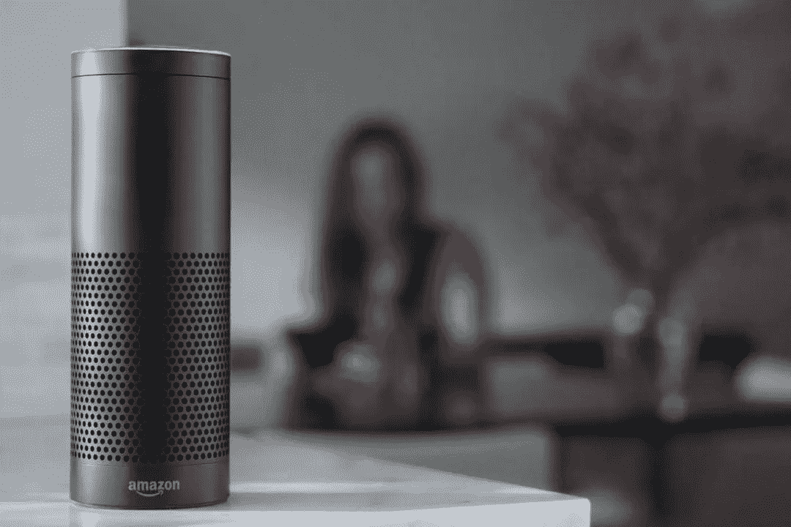

# 算法和机器人无处不在

> 原文：<https://medium.datadriveninvestor.com/algorithms-bots-are-here-there-everywhere-7861934193bf?source=collection_archive---------46----------------------->

Amazon’s smart home assistant Echo (photo courtesy of Amazon.com)

看起来一定很奇怪。

最近一个周二晚上 11 点左右，我坐在我的丰田雅力士(Toyota Yaris)里，俯身看着我的 MacBook Pro 笔记本电脑，摇摇欲坠地保持着乘客座位上的平衡。

我当然感到不舒服，引人注目。我把这些想法放在一边，集中精力做手头的工作。

我的 iPhone 8 被扔在仪表板上，它的屏幕黑屏，空白，没人在家，但仍然机器人般地对我大喊指令(是 Siri)。

一场个人电脑崩溃正在全面爆发，这是我的一种慢性轻度担忧，随着世界几乎完全转向数字操作系统，这种担忧也在加剧。

*纽约时报*发表了一篇援引美国官员的报道，称[俄罗斯黑客有能力摧毁整个电网](https://www.nytimes.com/2018/03/15/us/politics/russia-cyberattacks.html))，这丝毫没有减少我基于恐惧的思维循环。

事实上，发表在*休斯顿纪事报*上的一篇专栏文章明确指出[俄罗斯在其破坏美国民主的运动中增加了对美国电网的攻击](https://www.houstonchronicle.com/opinion/editorials/article/Russian-threat-bigger-than-Trump-they-re-after-13130971.php):

> *“…。严肃的头脑应该把注意力转向真正的威胁——俄罗斯黑客，他们的犯罪活动现在包括侵入为我们的家庭和企业供电的计算机系统。”*

早在这些故事(不，它们不是“假新闻”)刺激我的中枢神经系统之前，我就想知道为什么这个世界似乎在抛弃有线电视，而转向数字电视，这并不方便也不智能:与假扮成招聘人员的机器人交谈，或者在网上预订和购买一切，往往比用传统方式更令人沮丧——你知道，打电话，实际上是与人交谈。逃离那些组织混乱、令人沮丧的“电话树”

那电网的情况呢？

对它做一个思想实验，看看你有什么感觉。

那天晚上，在我的车里，通过 Safeway 的 wifi，我感到很脆弱。自从几个月前我关闭了那个账户，我的座机就被打包放在我的阁楼里了。

一股对付费电话时代的怀旧之情涌上心头。如果你真的需要打电话，这曾经是最好的最后手段。

我绝不是勒德分子，也不反对任何科技产品。我已经欣然接受了我的职业从地面到数字的转变，并且充满了好奇。问题是硬件正在迅速消失，让位给一个有线的，正如许多专家认为的那样，容易被黑客攻击的世界。

加入各种形式的人工智能，它们渗透到我们日常生活的许多方面——从我最喜欢的 Coinstar 机器，它现在可以在我做出选择之前识别我过去对亚马逊优惠券而不是现金的偏好，到医院手术室，一位亲密的家庭朋友的癌症肿瘤在机器人手臂的手术帮助下成功“烧掉”。

那天晚上在我的车里，我意识到我的生活越来越多地被大数据和算法的组合所统治。这不是让我的生活“更好”，这是硅谷常说的咒语，我觉得它在控制我的日常生活。而且不总是好的。

数学家和数据科学家 Cathy O'Neil 也是如此，她创造了“数学毁灭武器”这个术语，这是她最近出版的书的标题。这是她关于这个概念的 TED 演讲。绝对值得一看。

回到我周二晚上的电脑停电。

崩溃开始于前一天晚上，当时我的互联网提供商登录莫名其妙地从我的 wifi 网络中消失了。在检查了我的路由器(整个开/关程序运行了三次)后，我克制住自己打电话给客户服务的本能，导航到我的电脑设置，自己进行调查和分类。

与此同时，我用 iPhone 的蓝牙设置保持在线。我哪儿也去不了，所以大约凌晨 1 点，我放弃了，上床睡觉，因为我知道我的智能/智能手机会让我保持联系。那天晚上，我倒在床上，睡得很沉，下意识地划掉我的待办事项清单，其中大部分都涉及到我的 iPhone 或笔记本电脑。

但是后来我的智能/智能手机莫名其妙地爆炸了。所以我在车里，从 Safeway 上下载 wifi，试图理清我的数字混乱。经过许多电话和长时间的解释，我在大约一天左右的时间里解决了这个问题。所以我又上线了。

但是，由于硅谷和政治家们似乎愿意让机器人、Echo 和 AI 等个人家庭助理控制我们的日常生活，以令人眩晕的速度恢复在线越来越意味着失去控制。

我只是希望我们可以在这些工具变得如此智能之前关闭它们——也就是说，超越基本的人类智能——以至于我们无法做到。

*最初发表于*[T5【https://www.linkedin.com】](https://www.linkedin.com/pulse/algorithms-bots-here-everywhere-catherine-maddux/)*。*