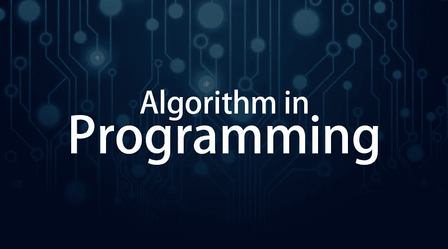

# 编程中的算法

> 原文：<https://medium.datadriveninvestor.com/algorithms-in-programming-8a66a5abb08e?source=collection_archive---------0----------------------->

让电脑做任何事。我们写程序。要编写程序，我们必须一步一步地告诉计算机我们想做什么。然后计算机一步一步“执行”程序，给我们输出。

当我们告诉计算机做什么时，我们也告诉计算机如何去做。这就是计算机**算法**发挥作用的地方。算法是一种基本技术，我们用它来告诉计算机如何做事。为了理解算法的概念，让我们讨论一个例子。

 [## 创建折衷书架的程序员指南|数据驱动的投资者

### 每个开发者都应该有一个书架。他的内阁中可能的文本集合是无数的，但不是每一个集合…

www.datadriveninvestor.com](https://www.datadriveninvestor.com/2019/03/25/a-programmers-guide-to-creating-an-eclectic-bookshelf/) 

假设我必须从家到大学，有三种不同的算法可以用来到达我的目的地:

**优步算法:**

1.  预订一辆出租车。
2.  等出租车来。
3.  上车，把地址告诉司机。

**总线算法:**

1.  准时到达公共汽车站。
2.  赶上大学班车。
3.  到达时下车

**汽车算法:**

1.  上车吧。
2.  把车开到学院。

正如你所看到的，所有这些算法都完成了完全相同的目标，但每种算法都以完全不同的方式完成。每种算法也有不同的成本和旅行时间。例如，使用优步是最快、最方便的方式，但也是最昂贵的方式。乘公共汽车不那么昂贵，但是你需要准时才能赶上公共汽车，如果你把它与其他算法相比，它也更慢。开自己的车可以节省你的时间和金钱，但是为了使用这个选项，你需要先买一辆车。我们根据环境选择算法。

在计算机编程中，有许多不同的方法/算法来完成给定的任务。每种算法在不同的情况下都有自己的优缺点。一些算法运行得更快，但它们占用更多的内存空间，另一些算法运行得更慢，但它们占用的空间更少。有些在输入数量较少时效果最佳，有些在输入数量较多时效果最佳。通过了解不同算法的优点和缺点，你可以选择最适合手头任务的算法。

# 算法的性质

1.  **输入**-算法具有来自指定集合的输入值。
2.  **输出**-从每组输入值中，一个算法从指定的组中产生输出值。输出值是问题的解决方案。
3.  **明确性**-算法的步骤必须精确定义。
4.  **正确性**-算法应该为每组输入值产生正确的输出值。
5.  **有限性**-一个算法应该在集合中的任何输入经过有限(但可能很大)步后产生期望的输出。
6.  **有效性**——必须能够在有限的时间内准确地执行算法的每一步。
7.  **通用性**-该过程应该适用于所有期望形式的问题，而不仅仅是一组特定的输入值

# **每个程序员都必须知道的算法:**

这里列出了程序员在日常生活中最常用的算法。

# 1.排序算法

排序算法是编程面试中被问得最多的问题。所以如果你想进入编程世界赚点钱。你需要学习排序算法。**排序算法**背后的思想是以特定的顺序排列列表/数组中的项目。在主要的编程语言中，都有内置的排序库。你可以用它来简化你的工作。没有理由为生产应用程序从头开始实现自己的排序算法，但是，在学习它们的同时，您会发现编程语言的高级特性。这会给你作为开发者的优势。除此之外，排序算法帮助你理解程序的准确性和速度。例如，如果您使用 [**冒泡排序**](https://www.geeksforgeeks.org/bubble-sort/) 算法对一个包含 300，000 个整数的列表进行排序，大约需要 9 分钟才能完成，但是如果您使用 [**快速排序**](https://www.geeksforgeeks.org/quick-sort/) ，它会在几秒钟内给出结果。只有当你真正理解排序算法时，你才能理解这种类型的性能变化。

**这里有一些你可能想学习的排序算法:**

*   [选择排序](https://www.geeksforgeeks.org/selection-sort/)
*   [冒泡排序](https://www.geeksforgeeks.org/bubble-sort/)
*   [插入排序](https://www.geeksforgeeks.org/insertion-sort/)
*   [合并排序](https://www.geeksforgeeks.org/merge-sort/)
*   [快速排序](https://www.geeksforgeeks.org/quick-sort/)
*   [堆排序](https://www.geeksforgeeks.org/heap-sort/)

重要的是，您应该知道何时何地使用哪种排序算法。排序算法的一些实际应用包括:

1.  在 excel 表格中排序或在电子商务网站中按价格排序。
2.  在委员会考试中按分数排序。

# 2.搜索算法

搜索算法是许多程序的重要组成部分。一些搜索包括在数据库中查找条目，例如在政府数据库中查找您的记录。虽然程序员可以从众多的搜索类型中进行选择，但他们会选择与数据库的大小和结构最匹配的算法来提供用户友好的体验。

一般的搜索问题看起来像:在元素列表`a1,a2,...an`中定位元素`x`。这个搜索问题的解决方案是等于`x`的术语在列表中的位置，如果`x`不在列表中，则为 0。

**这里有一些你可能想学习的搜索算法:**

*   [线性搜索](https://www.geeksforgeeks.org/linear-search/)
*   [二分搜索法](https://www.geeksforgeeks.org/binary-search/)
*   [跳转搜索](https://www.geeksforgeeks.org/jump-search/)
*   [斐波那契搜索](https://www.geeksforgeeks.org/fibonacci-search/)
*   [指数搜索](https://www.geeksforgeeks.org/exponential-search/)

我希望这篇文章能帮助你了解一两件关于算法的事情。

感谢阅读！快乐学习: )