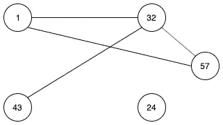
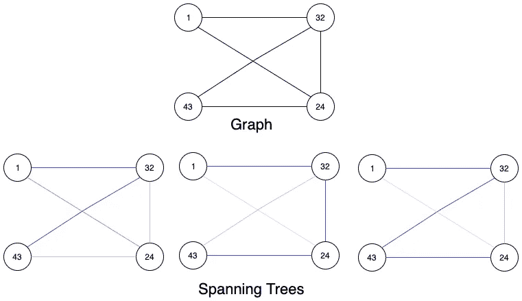
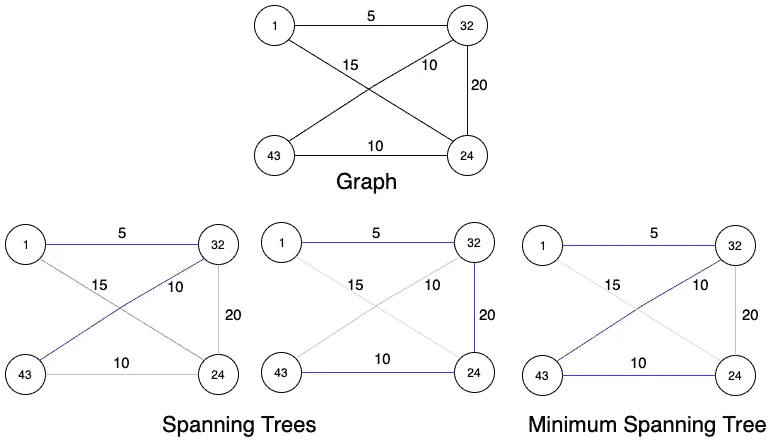
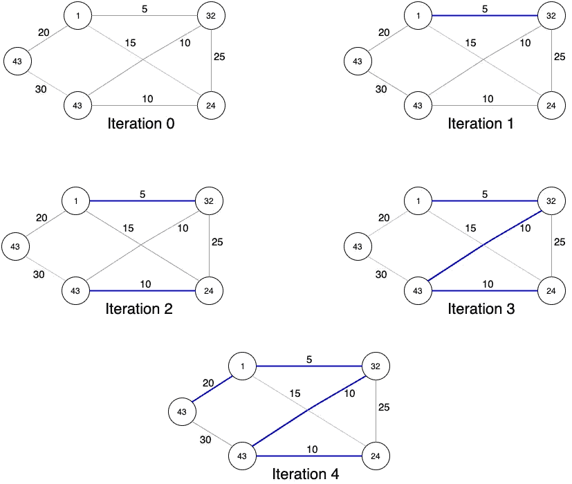
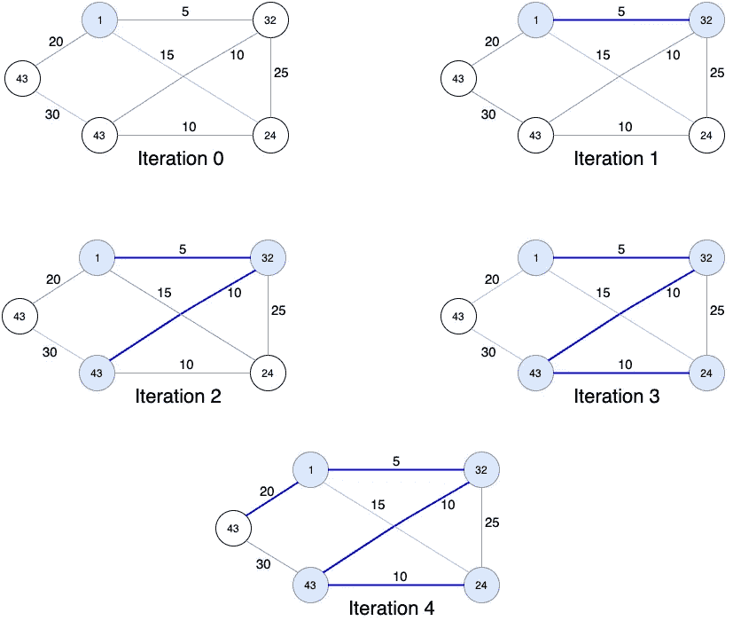

# 算法:最小生成树

> 原文：<https://medium.datadriveninvestor.com/algorithms-minimum-spanning-tree-6a55f271b687?source=collection_archive---------2----------------------->


Fig 1: Minimum Spanning Tree

这篇博客是关于一种应用在连通无向图上的通用算法，即最小生成树。即使你是 MST 新手，你也来对地方了。作为，我们将讨论它是什么和它的应用，如何找到它，以及哪种算法更好。在深入细节之前，让我们先熟悉一下背景。

让我们从图的定义开始。图是由边连接的节点组成的。



Fig 2: A drawing of a graph

如果一个图的每条边都是双向的，即一个人可以从两边穿过这条边，那么这个图就称为无向图。一个图是连通的，如果从任何一个节点，可以通过一系列称为*路径*的边到达所有其他节点。所以，一个无向连通图是一个既连通又无向的图。

# 什么是生成树和最小生成树？

生成树是一个包含所有节点的子图，它用最少的边数连接。一个图可以有多个生成树。



Fig 3: Spanning Trees

赋权图(图中每条边都有一个权重)的最小生成树是所有边的权重之和最小的生成树。



Fig 4: Spanning and Minimum Spanning Tree

# 为什么我们需要找到 MST？

在学习如何在图中查找 MST 之前，让我们看一个例子，为什么查找 MST 很重要。

假设，你拥有一家电信公司，你有遍布全州的发射塔。你想把它们连接起来，这样数据就可以从一个塔传到另一个塔。连接不同的塔涉及不同的成本，所以问题是你将如何最小化成本。

[](https://www.datadriveninvestor.com/2019/03/22/the-seductive-business-logic-of-algorithms/) [## 算法诱人的商业逻辑|数据驱动的投资者

### 某些机器行为总是让我感到惊讶。我对他们从自己的成就中学习的能力感到惊讶…

www.datadriveninvestor.com](https://www.datadriveninvestor.com/2019/03/22/the-seductive-business-logic-of-algorithms/) 

解决方案将是找到一个最小生成树，因为如果它不是一个生成树，你可以删除一个连接，它仍然会被连接。因此，为了最小化成本，它必须是生成树，并且总成本应该最小。

MST 的其他应用有:

1.  聚类分析
2.  图象分割法
3.  手写识别

# 如何在图中找到 MST

要找到图中的最小生成树，有两种流行的算法:

1.  克鲁斯卡尔算法
2.  普里姆算法

下面就一个一个详细说说吧。

*   **克鲁斯卡尔算法:**该算法遵循边缘的贪婪方法。它在每次迭代中以最小的权重一条一条地添加边，直到形成一棵生成树。算法步骤如下:

```
1\. Sort the edges in ascending order.
2\. Start by adding the edges from least weight to maximum weight.
3\. If a cycle is formed by adding a edge, skip that edge, move to next edge. (A cycle is formed, if both nodes on both sides of the edge are already visited.)
```



**Fig 5: Kruskal’s Algorithm**

**时间复杂度:**由于，主要花在边排序上的时间所以时间复杂度为 O(E log(V))或 O(E log(E))，其中 E 为边数，V 为顶点数。

这两者等价于 E ≤ V*V，因此 log(E) ≤ 2*log(V)。

*   **Prim 的算法:**就像 Kruskal 的算法一样，这个算法也遵循贪婪的方法。它从一棵空的最小生成树开始。它维护两组顶点。一组包括在最小生成树中，另一组由还没有包括在最小生成树中的顶点组成。当所有顶点都包含在包含 MST 的集合中时，它结束。算法步骤如下:

```
1\. Create a set which will contain vertices which are included in MST.
2\. Create a list which will contain edges, that connects vertices in the set to vertices not included in the set.
3\. Pick up a vertex and add it to the set.
4\. Add all the edges containing vertex, to the list created in the step-2.
5\. Now, pick minimum weighted edge and check if one of the vertex is not included in the set. If both of them are included in the set, remove edge from list and repeat the process.
6\. Now, add the vertices to the set and update the list of edges.
7\. Repeat the process till, all the vertices are not included in the
set.
```



**Fig 6: Prim’s Algorithm**

**时间复杂度:**Prim 算法的时间复杂度为 O((V+E)(log(V))。因为最低优先级队列中的插入需要 log(V)。需要优先级队列，因为我们需要得到最小加权边。

# 哪个更好？

在时间复杂度方面，Prim 的和 Kruskal 的时间复杂度相同。两种算法都需要 O(E log(V))的时间。但是，与 Prim 的相比，Kruskal 更容易实现。

所以，问题是什么时候应该使用 Prim 的？答案是稠密图。在稠密图的情况下，边的数量非常多。因此，与在边上创建 MST 相比，在顶点上创建 MST 会提供更好的性能。