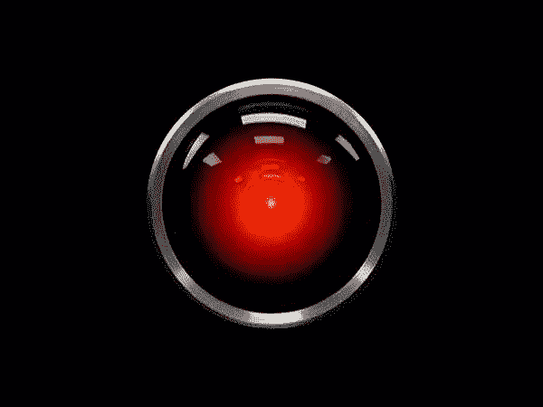
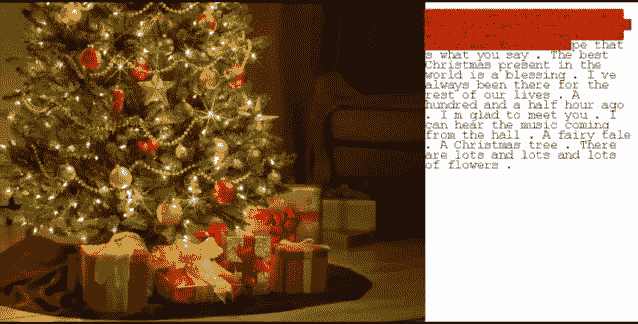

# 算法蓝调，角。罗马数字 3

> 原文：<https://medium.datadriveninvestor.com/algorithms-n-blues-pt-iii-98e32abd69ab?source=collection_archive---------20----------------------->

过去一周，我和妻子一直在亚马逊网站上欣赏《了不起的麦瑟尔夫人》的新一季；这仍然是一部恶意搞笑的电视剧，在 20 世纪 50 年代的一致性中寻找漏洞。它的次要情节总是执行得非常出色，但有一个特别的情节让我印象深刻，并引发了进一步的探究。艾贝·韦斯曼，名义上是梅塞尔夫人的父亲(由风趣的托尼·夏尔赫布扮演)，参与了贝尔实验室的一个项目，该项目涉及教一台计算机唱歌。当然，它是为了喜剧效果而播放的，魏斯曼试图找到计算机能够理解的简单音乐，最终导致他听他孙子的如厕训练记录。然而，这让我想知道:这样的事情在 1959 年可行吗？今天的*可行吗？如果是这样的话，该如何着手呢？*

**

*I’m telling you, we should call that Turing fella in England. He’ll sort this out.*

*至少自 20 世纪 30 年代贝尔实验室发明声码器(一种记录和分析人类语音的设备)以来，语音合成就已经成为可能。虽然它最初是用于音频数据压缩，以便 Bell 可以节省带宽，但声码器最终被修改，以便可以通过对来自振荡器的噪声应用滤波器来再现人类语音。它还被用作乐器，并且一直延续到今天(如果你听过蠢朋克，你就会听到一个)。然而，这样的应用程序需要人类的输入，因此不是人工智能生成的音乐，如沙霍布的角色所追求的那样。*

*第一个可行的基于计算机的语音合成器软件出现在 20 世纪 60 年代后期，以文本到语音合成的形式出现。也许最早的例子之一是由贝尔实验室的约翰·凯利制作的，在那里他和他的同事们用一台 IBM 704 重现了歌曲“黛西·贝尔”(如果这听起来很熟悉，那是因为亚瑟·C·克拉克也出席了，并在《2001 年 T4:太空漫游》中用这个演示作为 HAL 9000 关闭场景的基础。)进一步的创新接踵而至，70 年代见证了文本到语音合成在从盲人用具到儿童玩具的各个领域的出现，比如德州仪器 1978 年的*说和拼写*。*

**

*Daisy, Daisy, give me your answer, do…*

*这就解决了一半的难题:真正的文本到语音合成自 20 世纪 60 年代以来就以这样或那样的形式出现了，我们让计算机“唱歌”的时间也差不多一样长。*

*然而，这不是沙霍布的角色的目标。他想要一个会唱歌的人工智能，就像前面提到的 HAL 9000 一样。这是一个更加棘手的技术问题，尽管人工智能取得了巨大的进步，但我们可能还没有解决这个问题。其背后的想法足够合理:通过机器学习算法喂给一个 AI 歌曲，一旦它积累了足够大的数据集，它应该能够创作自己的歌曲。然而，在实践中，它有点颠簸。*

*在让人工智能创作音乐方面已经取得了一些成功:多伦多大学的研究人员教人工智能创作圣诞颂歌，而 T2 的微软“小冰”开始掌握歌曲创作。然而，这两个人工智能机器人都有同样的问题——尽管它们擅长分析节奏、旋律和音调等事物，但它们不太擅长自然语言处理，导致带有胡言乱语歌词的可行音乐。中国研究人员估计，Little Ice 写了并丢弃了超过 1000 万行，而 UT 的圣诞颂歌没有韵律，没有扫描，也没有逻辑。*

**

*Somebody please tell the AI that pine isn’t a flowering tree.*

*因此，虽然有人工智能可以制作声乐，但考虑到唱歌需要音乐和歌词的自然结合，说它们会唱*本身*还是有点牵强。虽然，当然，有很多人类音乐家的歌词没有任何意义(15 年来，我一直试图弄清楚莱昂纳德·科恩在[“首先我们占领曼哈顿”](https://genius.com/Leonard-cohen-first-we-take-manhattan-lyrics)中到底在说什么，我的妻子是 [Jandek](https://genius.com/Jandek-pending-doom-lyrics) 的粉丝)，但他们写的歌通常遵循他们自己的内在逻辑，在上下文中有意义，而人工智能生成的歌词却没有。也许一个爵士乐爱好者可以教人工智能去模仿？或者，也许，作为非人类，AIs 的音乐是局外人艺术的极致？*

*所以这满足了我最初的好奇心——在节目设定后不久，语音合成就已经成为可能，而教人工智能“唱歌”在今天理论上也是可能的，尽管还有一些主要的问题有待解决。鉴于《了不起的麦瑟尔夫人》的背景设定在 1959 年，它提出的关于教人工智能唱歌的想法是令人难以置信的雄心勃勃，因为近 60 年后我们还没有掌握它。*