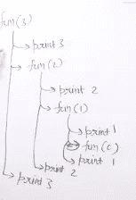
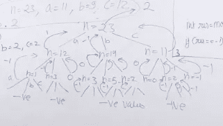

# 算法-递归编程

> 原文：<https://medium.datadriveninvestor.com/algorithms-recursive-programming-8e9f1ea41d92?source=collection_archive---------8----------------------->

计算机科学中的一个热门话题。


Compute, return repeat until you reach the destination.

递归是计算机科学中的一个热门话题。它用在很多问题的解决中，比如在动态编程中，第一步我们寻找一个递归解，然后我们写动态编程代码。在回溯中，你首先写出递归解，然后减少一些情况。分而治之，如合并排序，快速排序，树遍历，图形问题，如寻找所有最短距离的给定来源。

[](https://www.datadriveninvestor.com/2019/03/22/the-seductive-business-logic-of-algorithms/) [## 算法诱人的商业逻辑|数据驱动的投资者

### 某些机器行为总是让我感到惊讶。我对他们从自己的成就中学习的能力感到惊讶…

www.datadriveninvestor.com](https://www.datadriveninvestor.com/2019/03/22/the-seductive-business-logic-of-algorithms/) 

想法是把一个问题分解成子问题，直到你不能再分解它，这叫做**基础案例**。如果你有一个小问题的解决方案，你就能得到整个问题的解决方案。

从递归开始的一个很好的例子是

```
void fun(int n){
  if(n<1){
    reurn;
  }else{
    System.out.print(n);
    fun(n-1);
    System.out.print(n);
  }
}
```

当我们调用 fun(3)时，输出会是什么？。下图显示了它是如何工作的。



Steps how its works

所以上面代码的输出是 321123。

**尾递归**

假设我们有两个函数

```
void func1(int n){
  if(n<1)
    return;
  System.out.print(n);

  func1(n-1);}
**N to 1**void func2(int n){
  if(n<1)
   return;

  func2(n-1);
  System.out.print(n);}
**1 to N**
```

你能猜出哪个跑得更快吗？？

**func1()会运行得更快的原因是它的一个尾递归。当函数调用是最后发生的事情时，该函数是调用尾递归的。您不必存储父函数调用的状态。**

你能把 func2 重写为尾递归吗，这样它就能做和尾递归一样的事情了？

```
void func2(int n, int k=1){
   if(n<1)
     return;
   System.out.print(k);
   func2(n-1, k+1);} 
```

**递归的更多问题**

> **查找字符串的所有子集**

你已经给定了一个字符串，你必须找到这个字符串的所有子集。外汇— abc

设置了{ " "、" a "、" b "、" c "、" ab "、" bc "、" ac "、" abc"}

一个简单的递归解决方案是

```
void subset(String str, int index, String curr, int len) { if(index == len) {
      System.out.println(curr);
       return; }
    # consider the character
    subset(str, index+1, curr+str.charAt(index), len);
    # Not consider the character
    subset(str, index+1, curr, len);
}subset("abc", 0, "", abc.length());
```

想法是考虑字符而不是在递归调用时考虑。

> **寻找字符串排列**

```
void permute(String str, int l, int r) { if(l ==r) {
     System.out.println(str);
     return;
   } for(int i=l;i<r;i++) {
    str = swap(str, l, i);
    permute(str, l+1, r);
    str= swap(str, l, i);
  }
}String  swap(String str, int i, int j) {

    char[] arr = str.toCharArray();
    char temp = arr[i];
    arr[i] = arr[j];
    arr[j] = temp;
    return String.valueOf(arr);
}permute("ABC", 0, str.length());
```

> **计算杆的切割数**

给定一根长度为 n 的绳子，你需要找出你能制造的最大数量的绳子，使得集合{a，b，c}中的每一根绳子的长度为给定的绳子的长度 a，b，c。

对于前-

I/p- n = 5，a=2，b= 5，c= 1

o/p- 5(我们可以将杆切割成 5 段 c 长度)

```
int getMaximumCut(int n, int a, int b, int c) {
    if(n <0) {
      return -1;
    }
    if(n == 0) {
      return 0;
    }int res = Integer.max(Integer.max(getMaximumCut(n-a, a, b, c), getMaximumCut(n-b, a, b, c)), getMaximumCut(n-c, a, b, c)); if(res == -1) {
     return -1;
   }else {
     return res+1;
   }
}
```

想法是在每次递归时选择每个长度。我们或者做一个长度为 a 或 b 或 c 的切割，然后我们有 n-a，n-b，n-c 个子问题，然后我们来计算最大值。

比如- n= 23 a= 11，b = 9，c= 13。



如果你喜欢这个，请点击几下这些按钮。