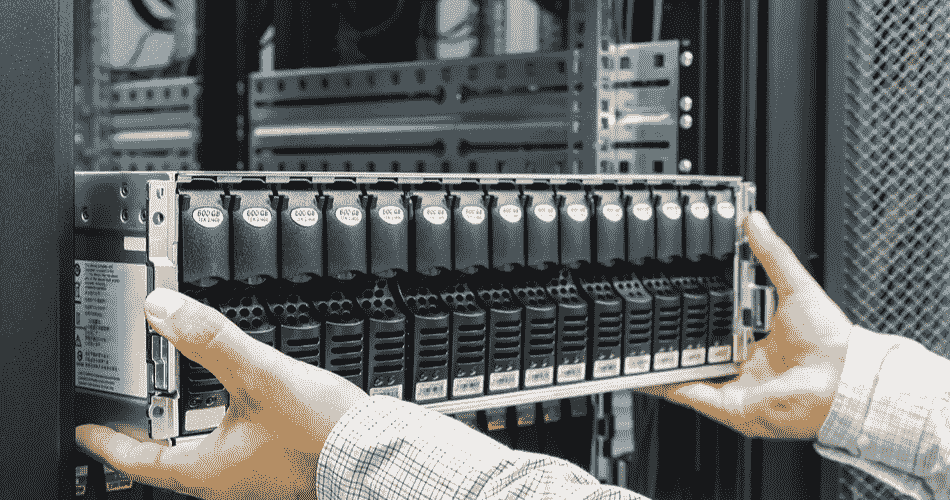
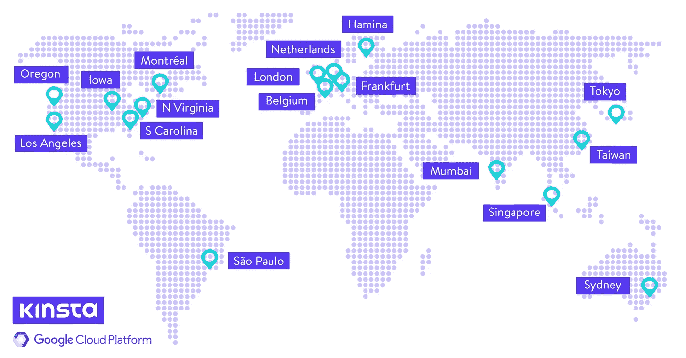

# 关于云和云计算的一切

> 原文：<https://medium.datadriveninvestor.com/all-about-cloud-41c9ef98e2a2?source=collection_archive---------19----------------------->

最近几天在*计算机科学*中被谈论最多的术语。一个经常让包括我在内的许多人着迷的话题。

我们知道，**云**被称为储存。无法测量的储存量，就像我们无法测量真正的云中水蒸气的数量一样。云也可以指隐藏的、安全的或未知的东西。无论你采取哪种含义，在计算机科学中，它都与虚拟数据存储或互联网有关，正如我们所知的那样。管理云中的数据被称为术语**“云计算”**。

云计算是一种基于互联网的服务。信息是按需共享的，有点类似于*来自电网*的电力。我们可以从其他地方按需购买。它也像银行系统，银行是一朵云，我们把钱(作为数据)交给它暂时存储在别的地方。

常见的云例子有*谷歌、甲骨文、微软 Azure、亚马逊网络服务(AWS)、IBM SmartCloud、阿里云等。*

云托管在服务器中，这取决于需求的大小和需要。像谷歌和脸书这样的大公司是在大数据中心进行的。数据中心将会非常大，像一个大厅那么大。

## 特征

*1。按需自助服务*

*2。广泛的网络接入*

*3。快速弹性*

*4。资源池*

*5。测量服务*

6。设备和位置独立性

## 云的类型

*1。私人*

*2。公共*

*3。社区*

*4。混合动力*

## 了解数据中心

同样，当我们讨论云计算时，你有没有想过大量的数据是如何存储在某个地方的？储存安全吗？

**数据中心**是存放复杂硬件的地方，用于存储大量数据。根据 *Spectrum 八月版*，其中一个主要生产商是思科，该公司估计 2016 年将产生 *220 zettabytes 的数据。这个数字将导致 2021 年超过 850 辆 ZB。*

> 这个大规模存储所需的总面积将是曼哈顿的 8 倍。

存储的数据以两种存储形式完成- *磁存储和*固态存储。对于那些不知道什么是固态存储的人来说，它是使用*电子设备*存储的，它看起来像一个*硬盘*，但内部是由一个*印刷电路板*和*闪存存储*。

SSD

由于数据存储的易失性，数据中心配备了极大的*数据备份、备份电源和气候控制*。它需要非常低的温度来实现其理想的功能，这主要是由于热量的产生。所以，瑞典、芬兰和瑞士有很多数据中心。这些数据中心还有空调和消防系统。

> 脸书现在正准备在新加坡建立其最大的数据中心。

Data Center

私营公司通常有自己的数据中心，以减少依赖性和隐私原因。*(一家大银行，将有自己的数据中心，以充当其云，可能不依赖于任何其他。)*

## 那么，公司如何能够提供免费的云空间呢？

众所周知，我们可以从世界上的任何地方访问我们的邮件，这意味着它不依赖于设备。所以你的邮件数据是存储在云端的。此外，我们知道我们的邮件是免费的。甚至，谷歌给每个 **Gmail** 账户一个**谷歌硬盘**，我们可以在里面免费存储 15 GB 的空间。为什么？

这是因为硬件被认为是非常便宜的，当然就存储而言，15 GB 意味着什么。如今，即使是智能手机也有 2 TB 的内部空间。

> 如今，使用**光子模块**，以便将光转换成信息，反之亦然。它每平方微米可以容纳 100 个晶体管。

Location of Google DC across the globe

## 受欢迎的云用户

像 [Dropbox 这样的大型云存储提供商使用 AWS](https://www.bmc.com/blogs/dropbox-aws/#:~:text=Dropbox%20still%20uses%20AWS,maintains%20a%20relationship%20with%20Amazon.) ，而 [Spotify 使用谷歌云。](https://www.zdnet.com/article/with-spotify-google-cloud-platform-gets-its-anchor-all-in-customer/#:~:text=Spotify%2C%20which%20is%20selling%20its,Amazon%20Web%20Services%2DNetflix%20relationship.)美国 Tiktok 可能很快会转向甲骨文来存储美国公民的数据。Whatsapp 使用的是 IBM cloud 的安全版本。所以几乎所有的应用我们都用云技术来为我们服务。

## 结论

云计算是关于在互联网上存储数据(云)，它是安全的，易于访问，比正常的存储技术更快。

未来几年，对云的需求将会增加，这迫使科技巨头们也进行同样的投资。

随着固态硬盘和光子模块的使用，硬件变得越来越便宜和高效。

数据中心是托管云的地方，它提供了最新的技术、备份和负责维护的现场工程师。

如果你喜欢我的博客，并且在寻找有用的内容，请继续关注我。您可以在评论区留言或在社交媒体上联系我-[***Messenger***](https://www.messenger.com/t/jairam.rprabhu.9)***|***[***insta gram***](https://www.instagram.com/jairam_r_prabhu/)***|***[***电报***](https://t.me/jokjrp)**|**[***我还在***](https://www.quora.com/profile/Jairam-R-Prabhu) [***主播&Spotify***](https://anchor.fm/jairam-r-prabhu)***上开了一个播客系列。***