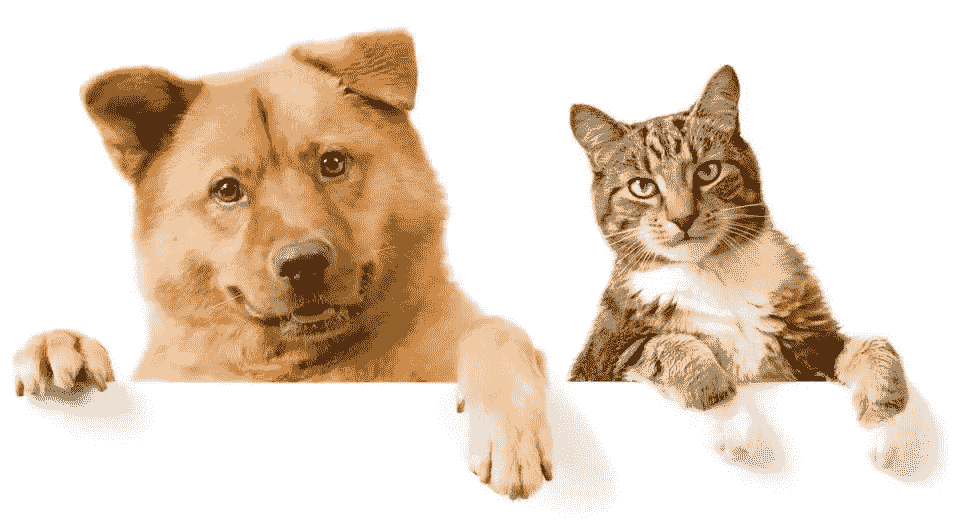
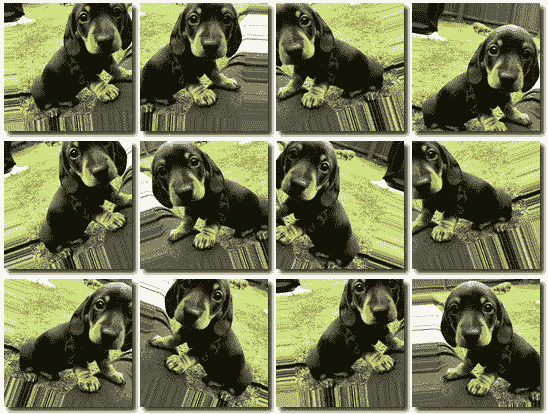
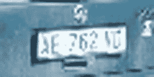
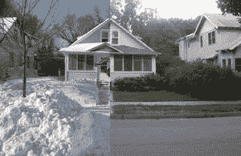

# 数据增强？那是什么？

> 原文：<https://medium.datadriveninvestor.com/all-about-data-augmentation-9958f09368c6?source=collection_archive---------2----------------------->

*“狗在左边，猫在右边*”。
这很明显，对吗？我的意思是，你只是看着照片，你就知道*是*。
为什么？嗯，这些年来，你在电影、电视、IRL 等中看到的所有狗、猫和迷因——“狗”和“猫”的概念已经深入你的大脑，以至于你几乎不会去想它。也许，曾几何时，你听到“*狗*”，你会想到“*罗孚，我的狗，带着目中无人的左耳*”。但如今你听到“*狗*”，脑子里只有一个模糊的**概念**就是“狗”的化身——ness。
不管怎样，你看到一只狗，你的大脑会想——“*那是一只狗*”。

***分类*** 这个过程叫做**分类**，差不多就是神经网络在*它们*看着一张图片说“狗”的时候也会做的事情。更准确地说，当你**训练**你的深度学习**模型**时，你实际上最终做的是让它到达这样一个点，给定一个图像作为输入，它输出一个标签(*狗！*》。

你是怎么训练它的？嗯，基本上，做*你*为了学习“狗”的特性所做的事情，给它一大堆狗的图像，这样它就能学会识别它们。

好吧，当你仔细想想，狗和猫看起来有点像，对吗？耳朵，鼻子，四条腿，毛茸茸的，区分这两者会很棘手(想象你是一个孩子，第一次看到一只猫——“*看这只小狗！*”)。

所以你*和*所做的是在 ***上训练模型，而不是狗*** (猫、犀牛等)。)，而且嘿，现在你的神经网络知道*这个*是狗，那个*不是。很酷，对吧？*

***增强*** 注意，当一切都恰到好处时，很容易识别事物——明亮的日子，饱满的前额，近距离，“对，那不是狗，那是树懒”。但是如果你只是匆匆一瞥呢？还是天很黑，你透过模糊的窗户看？

你需要做的是根据各种条件下拍摄的图像训练神经网络。想想*偏角*、*大小*、*比例*、*方位*、*亮度*、*灯光*、*姿势*、*位置*，还有一大堆更多。

/via [https://rock-it.pl/images-augmentation-for-deep-learning-with-keras/](https://rock-it.pl/images-augmentation-for-deep-learning-with-keras/)

那么，在这种情况下你从哪里得到的图像？嗯，你基本上伪造它，通过拍摄一张普通的图像，并使用**数据增强**。基本上，你拿着原件，然后开始购买照片——翻转、旋转、裁剪等等。事实上，[你甚至可以*翻译*图像](https://junyanz.github.io/CycleGAN/)(把照片变成艺术，诸如此类)。

问题是，就神经网络而言，*这些图像中的每一个都是完全不同的东西！*(记住，神经网络一开始是*哑*)。你要做的是教你的神经网络一些叫做**不变性**的东西，这基本上是识别(*分类*)物体的能力，不管它出现在什么条件下——比如 [***大小*** *、* **、*视点*** *、* ***光照*** *和*](https://medium.com/nanonets/how-to-use-deep-learning-when-you-have-limited-data-part-2-data-augmentation-c26971dc8ced)

****相关性*** 然而，这里棘手的部分是，你*做*需要注意你使用的数据类型——你需要确保数据与手头的问题 ***相关*** 。*

**

*例如，如果你正在开发一个应用程序来查看当你不在的时候你的狗是否在床上睡觉，那么你想用床上的狗和空床的图片来训练它。在草坪上嬉戏的狗很酷，但与手头的问题并不完全相关！*

**

*这同样适用于您对数据使用的所有*数据扩充*技术。如果你正在构建一个车牌阅读器(为老大哥？)，那么您需要假设您拍摄的许多照片将会模糊、失焦、角度不正确并被裁剪——您的数据增强应该将这些变换应用到您的样本图像。*

**

*OTOH，如果你的应用程序应该识别房屋的建筑风格，那么你可能想要不同季节的房屋照片，对吗？事实证明，[你其实也可以这么做](http://dieswaytoofast.blogspot.com/2018/02/transferring-image-style-via-deep.html)(深度学习是*神奇的*)。*

****Choices Choices***
那么，如何确保你的*数据增强*实际上是*相关的*？嗯，你通常会手动操作——你会找出问题所在(*床上的狗*)、可能的场景(仅限白天、梳妆台上的摄像机……)并着手去做。*

*这种方法的问题是我们都有偏见，不管是有意识的还是无意识的。这些不一定是邪恶的偏见，它们可能只是简单的不正确的假设(*我以为只有白天，但是赫尔辛基下午 4 点就黑了！*”)。这些偏见，加上这仍然是一个不断发展的领域，而且我们不知道最佳的增强是什么和增强多少，这导致了大量的猜测。*

*请注意，这并不是世界末日。猜测是一个好的开始，当你发现自己的局限时(赫尔辛基*下午 4 点*)，你可以调整事情。这是手动的，它可以变得更好，但它肯定是一个好的开始。*

*除此之外，在为给定的问题找出最佳的数据扩充策略方面，已经做了一些出色的工作。例如，谷歌刚刚发布了 [*自动增强*](https://arxiv.org/abs/1805.09501) ()，其中他们使用了一种叫做 [*增强学习*](https://medium.com/machine-learning-for-humans/reinforcement-learning-6eacf258b265) 的机器学习技术，来计算出哪种数据增强技术组合最适合你的特定问题空间和数据集。*

*以上应该作为一个引子。如果你需要深入了解杂草，看看巴拉特·拉吉的这篇优秀文章。*

*()" [*自动增强:从数据中学习增强策略*](https://arxiv.org/abs/1805.09501)"—Cubuk 等人。*

**(* [*这篇文章也出现在我的博客上*](http://dieswaytoofast.blogspot.com/2018/06/data-augmentation-whatsthat.html) *)**

**