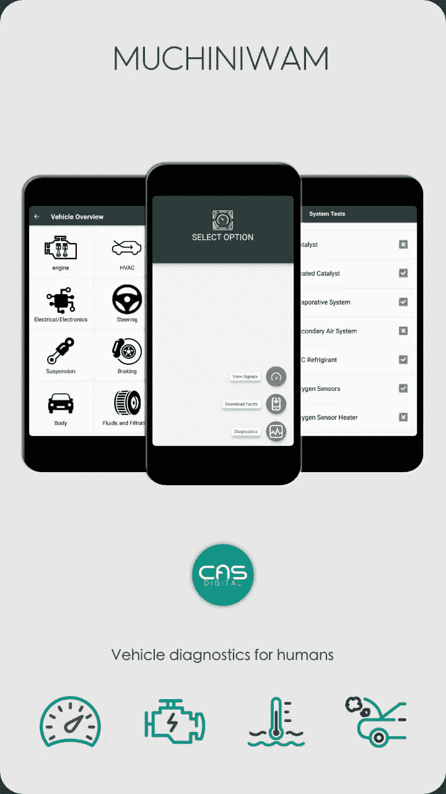

# 所有在衰退中幸存的企业都是庞氏骗局

> 原文：<https://medium.datadriveninvestor.com/all-businesses-that-do-not-survive-recessions-are-ponzi-schemes-7d7ce30996ae?source=collection_archive---------15----------------------->

Photo by [JESHOOTS.COM](https://unsplash.com/@jeshoots?utm_source=medium&utm_medium=referral) on [Unsplash](https://unsplash.com?utm_source=medium&utm_medium=referral)

*事情是这样的:商家应该是基于***的产品或者服务来做* [*解决问题*](https://medium.com/@lesdikgole/risk-taking-is-about-information-not-success-5d74ffe1dc35) *。在经济衰退期间，这些问题通常不会“神奇地”消失。事实上，在这种情况下，他们“必要性”的真正本质变得显而易见。**

*忘掉“社会企业家”和非营利组织吧，企业是为了解决社区面临的问题或不便。*

*我们发明了那些其他*蹩脚的*类别的‘组织’(传统的*盈利*业务之外)，因为大多数业务，尤其是那些与银行和保险相关的业务，过去没有，将来也不会做得很好！*

# *庞氏骗局层出不穷*

*庞氏骗局是这样的:1)获得最多回报的“赢家”/受益人/客户是最先出现的**(达到数学极限，这将意味着创始人)，2)最后出现的客户或受益人不仅是庞氏骗局成功的最“关键”,而且是损失最大的*！3)*《谎言》作品* **直到一个问题被****(通常在商业模式内)。******

*****企业往往建立在一套和/或一系列假设的基础上，这些假设与“市场条件”和普遍的消费者利益(或时尚)有关！).一个“好企业”是指*假定*做出了“正确的”假设，并设法*根据特定的计划或战略努力执行*的企业。到目前为止，在这个定义中,*整个*的“商业”范例正在失去它的*存在理由。******

****企业的传统*定义*，缺乏与庞氏骗局的明确区分**因素**。所有的庞氏骗局都始于一系列关于消费者行为和“市场条件”的假设。传统商人的“意图”很可能与经营庞氏骗局的骗子大相径庭。但是 ***整个*** 系统或商业模式完全*相同，直到遇到*商业*环境*/市场条件或对消费者的“假设”的问题。****

****商业计划只是骗局的另一种形式:通常是 T2 的投资者被商业计划骗了。“广告”也是一种骗局:顾客被骗了！****

# ****反欺诈的商业模式****

****避免把一个诚实的生意变成一个骗局的镜像的最可靠的方法**就是再次集中精力 [*解决独特的问题*](https://medium.com/@lesdikgole/risk-taking-is-about-information-not-success-5d74ffe1dc35) *。*这是我的**版本的*彼得·泰尔的*【建立垄断】或者对创业公司的‘零比一’建议。这也是理查德·坎蒂伦的商业资产“需求/供给”经济模型的一个版本。********

********当一套假设**失败**或市场条件**改变**时，一个建立在解决问题*基础上的企业不可能*失败。一个建立在“垄断”模式基础上的企业创造了一个强健的稀缺模式，既能在经济衰退中生存，又能在经济繁荣中繁荣。********

# ******规避损失=骗局******

******对于消费者来说，永远不要上当受骗！即使'广告'或'[预计奖励](https://medium.com/@lesdikgole/risk-taking-is-about-information-not-success-5d74ffe1dc35)'是**无法抗拒的！**不要做 FOMO！******

******对于商家来说，永远不要‘策划’*赚钱*！如果你这样做了，当企业在衰退/不可预测的事件中崩溃，你意识到你失去了很多你自己的钱，也许还有投资者/银行的钱，不要哭。******

******不要诈骗！别被骗了！只有‘必要’的商家才是 ***反*** 。******

******剩下的就得像瘟疫一样*避开*！******

*********鼓掌，关注或*** [***联系我推特***](https://twitter.com/muchiniwam) ***支持此内容。*********

************

******MUCHINIWAM OBD 2 Diagnostic App******