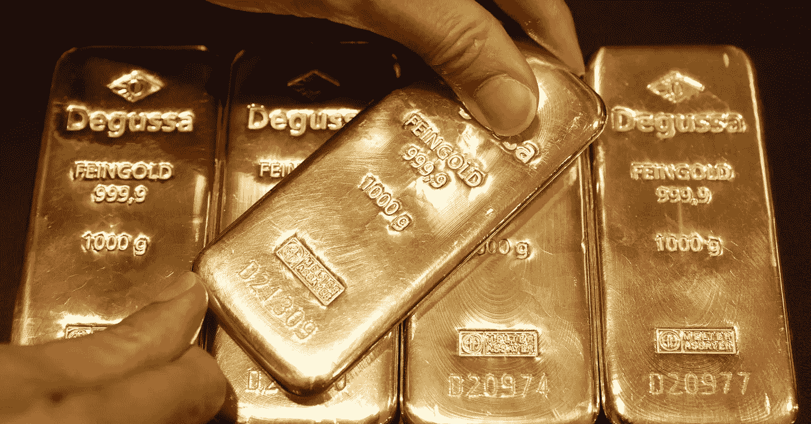

# 并非所有闪光的东西都是黄金——但也不是比特币

> 原文：<https://medium.datadriveninvestor.com/all-that-glitters-is-not-gold-but-its-not-bitcoin-either-d7320cfd949c?source=collection_archive---------7----------------------->

As good as gold?

研究公司 Fundstrat 的托马斯·李(Thomas Lee)将比特币比作黄金，作为一种潜在的价值储存手段和(或许)抵御通胀的手段。然而到目前为止，还没有明显的证据表明这一点。在撰写本文时，比特币再次推高至 4000 美元的水平，徘徊在这一阻力之下，在 3900 美元的区间内交易，因为世界正在进入 2019 年。然而，对冲基金正在涌入黄金，预计 2019 年全球市场将出现更大的波动和动荡。现在科技股已经不再流行，对冲基金整体在 2018 年跑输指数，比特币会被视为避险资产吗？

就目前情况来看，基金经理在过去 6 个月里比以往任何时候都更看好黄金。平心而论，威胁无处不在，从世界第二大经济体中国的经济增长放缓到潜在的贸易战(这两者是相关的，但又是独立的)。虽然股票可能在 2018 年的最后几天出现了几次飙升，但金融焦虑总体上有所加剧。在可能出现经济萎靡和不确定性的背景下，投资者及其经理在 2018 年最后一个月向支持贵金属的 ETF 注入了约 12.5 亿美元，黄金期货的未平仓头寸正在增加。作为溢出效应，比特币创下了两个多月来的最佳表现，但仍顽固地保持在 4000 美元以下。

随着华盛顿的动荡和特朗普政府继续要求政府为南部边境墙提供资金，黄金仅在 12 月份就上涨了 2%，而比特币自 12 月初以来上涨了 5.5%，但此后又回吐了这些涨幅。

Federal Reserve Chairman and the man who‘s unimpressed by your attempt at humor, Jerome Powell.

随着美联储杰罗姆·鲍威尔(Jerome Powell)上周三上调关键利率，美元下跌，交易员退出美元头寸，推高了黄金，但没有推高股市。比特币同样经历了小幅上涨。

## 聪明的钱去哪里了？

在截至 12 月 18 日的一周，基金经理的黄金净多头头寸增加了一倍以上。根据商品期货交易委员会(Commodity Futures Trading Commission)发布的数据，净多头头寸是押注价格上涨和下跌的差额，为 24569 个期货和期权，这是自 6 月中旬以来对黄金的最乐观看法。

与此同时，仅做多押注上涨 15%，至 112，974 份合约，这是三周内的第二次上涨，表明了一种长期趋势。

Candy bars were unnecessarily flashy.

虽然一些人可能认为白宫的武力威胁会让美联储束手无策，但当美联储政策制定者今年第四次加息时，整个市场都感受到了美联储保持独立的证据。此举令股市陷入混乱，因为人们担心借贷成本的增加会损害经济增长——确实会。世界和企业债务已经达到前所未有的水平。与此同时，外汇交易员将美联储的举动解读为温和的，并导致美元下跌，由于美元与黄金的反比关系，这使得贵金属的价格高于其 200 天移动平均线。

## 美联储何去何从？

美联储加息的意图，不仅是现在，而是到 2019 年，最终将削弱黄金的吸引力。作为一种资产，黄金不像债券、股票甚至现金等资产那样支付利息或股息。如果这听起来很熟悉，那是因为它与比特币具有完全相同的性质，不提供股息或支付利息。如果不出意外的话，利率上升意味着现金将在十年内首次开始产生回报。这有可能给比特币带来新的下行压力——这就是为什么我们认为它顽固地抵制 4000 美元的水平。

从中期来看，现金可能是一个更好的选择——因为即使市场下跌，或者更糟糕的是股票回报出现熊市，至少现金的回报率将为 2%，可以说比黄金和比特币都好。

## 持续的政治不确定性会持续下去

在一个美好的日子里，白宫是一幅混乱的画像，随着国防部长詹姆斯·马蒂斯(James Mattis)令人震惊的离职，以及特别顾问罗伯特·穆勒对俄罗斯干预 2016 年总统选举的调查即将公布，华盛顿的政治不确定性应该是必然的。

Special Counsel and the man who just swallowed a gumball, Robert Mueller.

政治不稳定时期往往是投资者逃入被认为“安全”的资产的时候。随着黄金在今年大部分时间里下跌，股票持续飙升，在不确定性增加和交易员现在进入头寸以对冲 2019 年不确定性的背景下，人们对黄金的兴趣应该会上升。

## 但是比特币呢？

最适合黄金的说法是作为对不确定性的对冲——不太清楚这是否也适用于比特币。随着利率的上升，现金作为一种资产类别突然看起来又有吸引力了，但这也伴随着风险——因为如果出现另一场金融危机或黑天鹅式的经济灾难，而这种灾难没有反映在经理的模型中，那么又一轮印钞可能会再次出现——也就是所谓的量化宽松。

事实上，美联储可能正在为这种情况做准备，在这种情况下，这种货币政策工具可能是必要的，方法是首先允许利率上升——这样，在金融危机爆发的情况下，至少政策制定者可以选择再次印刷钞票——但近零利率严重限制了这种选择。

根据人们对比特币的描述，如果它被视为价值储存手段和通胀对冲工具，那么比特币在许多方面与黄金没有太大区别——除了你不能制作比特币珠宝。此外，在发展中国家，在经济和政治动荡时期，黄金仍被视为更容易获得的“硬”资产。

除了关于比特币作为一种资产的本质的辩论，更值得注意的是以太坊的崛起——按市值计算，这种世界第三大加密货币在短短几天内上涨了近 20%，远远超过了比特币的涨幅。另一方面，以太坊不被视为“价值储存”——相反，它被视为世界计算能力的燃料——未来的一种信贷形式。以太坊在这方面的叙述完全不同于比特币——在这方面，它的竞争对手可能只有其他加密货币协议，比如 EOS 和 NEO。比特币在与更成熟的资产类别竞争，以太坊在与其自身竞争。

## 底线

勇敢的交易者可能会考虑同时跟踪黄金价格和比特币，并考虑根据相关矩阵绘制它们，以确定是否有任何值得利用的套利机会。因为这两种资产(我不严格地使用这个术语)都遵循心理叙事(而不是任何固有的内在价值主张)，并且可能比其他加密货币受到更广泛的政治、社会经济影响。