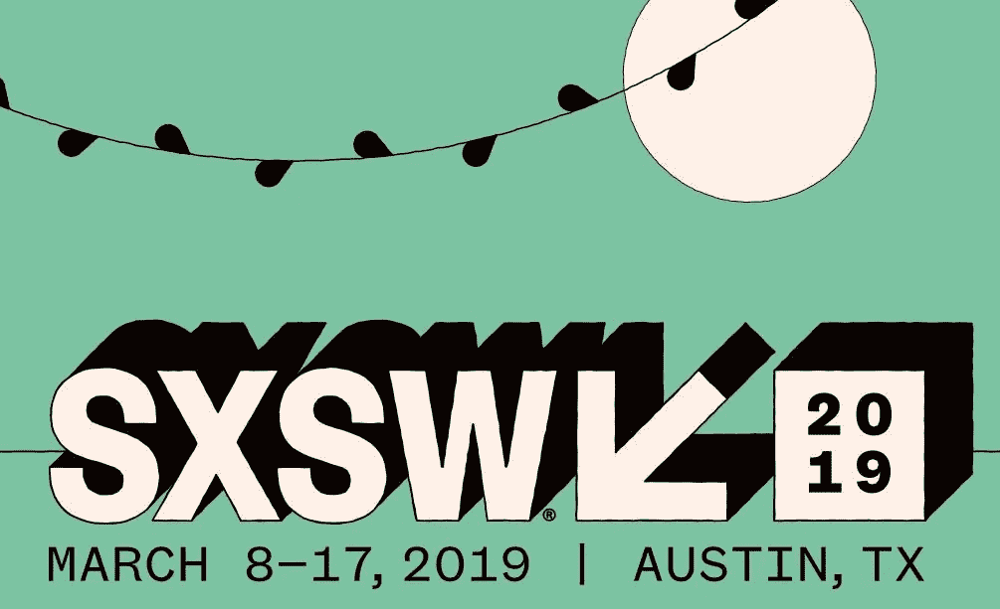

# SXSW 所有最好的人工智能会议

> 原文：<https://medium.datadriveninvestor.com/all-the-best-ai-conference-sessions-at-sxsw-4476c1f1cbaa?source=collection_archive---------14----------------------->

## 如果你对人工智能感兴趣，你不应该错过的 SXSW 活动！

如果你本周参加 SXSW，你就会知道这是美国最大的科技、音乐、电影和创意节日和会议，将于 2019 年 3 月 8 日至 17 日举行。

去年，《西部世界》的场景被重新制作，复制了《网飞》系列中由栩栩如生的机器人管理的主题公园，这些机器人最终获得了知觉。埃隆·马斯克做了一次即兴演讲，虚拟现实电影《玩家一号》也在电影节期间发布。

 [## 挑战你对人工智能和社会的看法的 4 本书——数据驱动的投资者

### 深度学习、像人类一样思考的机器人、人工智能、神经网络——这些技术引发了…

www.datadriveninvestor.com](https://www.datadriveninvestor.com/2019/02/28/4-books-on-ai/) 

想知道今年会带来什么惊喜吗？去年将很难被击败，但似乎他们有一些阵容，这甚至会让我们中的 SXSW 老兵感到兴奋。

如果你对人工智能和新兴技术感兴趣，这些都是不容错过的会议。

# *人工智能与其他技术的融合将是一个大话题*

**超越现实:人工智能和沉浸式技术的融合**

在 Unity Labs 的首席软件工程师阿米尔·易卜拉希米和 Open AI 的战略负责人埃尔米拉·穆拉蒂的演讲中，将讨论交叉现实(XR)的话题，人工智能和沉浸式技术将在这里交汇。Unity 的游戏开发平台正在用于训练 AI，而 AI 则改进训练和模拟。

虚拟人类时代的伦理道德

汉森机器人公司的大卫·汉森将与南加州大学、防碎电影公司和竞争对手理论公司的其他小组成员一起讨论虚拟人捕捉和人工智能的状态，以及这项技术和讲故事的新创新的核心伦理问题。从深度伪造到利用个人数据进行机器学习，小组讨论了围绕角色捕捉的伦理问题，以及这些虚拟角色的公共大众消费。汉森机器人公司创造了人形机器人索菲亚。

**智能信息时代**

微软车库的 Envisioneer M. Pell 将谈论 AI 和空间计算将如何从根本上改变我们永远的交流方式和智能信息时代。

# 还有关于人工智能将如何影响我们的生活方式以及如何影响工作的演讲

**最后的工业革命:劳动结束后的生活**

Monk's Hill Ventures 管理合伙人 Peng T Ong 谈论人工智能如何重新定义世界经济和劳动力，将劳动力价值降至零，创造经济奇点。劳动力是我们用来分配财富的机制。如果它的价值趋向于零，那么我们如何重新分配财富，劳动结束后我们做什么？

**人工智能将如何设计人类未来**

SparkCognition 的创始人 Amir Husain 将与神经科学家、科技记者和教授一起讨论人工智能和机器人技术的进步如何使我们能够替换肢体，将梦转化为图片，解释神经信号，并深入了解我们的基因构成。中国已经在投资一些项目，让每一代人的智商提高 15 分。这个小组将探索使用人工智能和机器人技术来改善未来人类的经济、伦理和存在意义。

**如何打造更光明的 AI 未来**

谷歌首席决策科学家凯西·科济尔科夫(Cassie Kozyrkov)谈到了剥离机器学习中的行话，看看如何发现机会和你需要知道什么才能避免人工智能中的两个最大威胁，以及决策智能工程的新兴学科，以改善商业决策。

# *但是人工智能也有它的缺点，有几个会议涵盖了人工智能潜在的反面*

**打击人脸扫描监控**，

在美国公民自由联盟的爆炸性报告详细介绍了亚马逊如何帮助美国警方部署这项强大的技术之后，这场讨论的焦点是我们的公民自由如何受到侵犯，例如通过街头和官员佩戴的人体相机来识别抗议者，锁定移民并跟踪人们的日常生活。有一个类似的演讲叫做**驯服奥威尔式的监控状态**。

**移情技术和扑克脸的终结**

来自 Colby Laboratories 的 Poppy Crum 将谈论当我们的技术比我们更了解我们时，世界将会是什么样子，揭示出私人的内部状态。我们将如何面对我们的扑克脸？我们能以人类的最大利益来设计吗？

**谁将在防守 AI 的竞赛中领先**

弗拉基米尔·普京在 2017 年的“谁统治人工智能，谁就统治世界”中说道。在全球范围内，中国、美国和阿联酋等国家正在竞相成为民用和军用人工智能研究和技术的领导者。小组将讨论这场人工智能太空竞赛目前的状况，以及它将如何改变战争和地球的未来。

# 然而，人工智能已经有了造福人类的伟大用例

**(虚拟)人性的神奇飞跃:人工智能与自闭症**

Magic Leap 的医疗保健产品经理 Nicole Samec 将与南加州大学研究所的其他人一起演示人工智能驱动的虚拟人如何识别心理压力，培训临床医生，指导病人等等。你将体验一个新的应用程序，它训练自闭症患者如何面试工作，并了解虚拟人如何很快进行可信的具体互动并为日常生活做出贡献。

**语音用户界面的民主化**

在 2017 年《华尔街日报》的一篇文章中，“打字的终结:下一个十亿移动用户将依赖视频和语音”显示了一名来自新德里的男子，尽管他对阅读和打字不太适应，但现在可以通过他的功能手机使用语音来查看火车时刻表，给家人发送消息，以及下载电影。对于有视觉或肌肉障碍的人来说，声音可以让他们做各种各样的任务，并重新获得一些独立性。将语音与虚拟助理结合起来，我们就有了新的方法，让数百万人能够获得个性化的关键互联网接入。这次演讲由谷歌的客户经理凯西·珀尔主持。

**人工智能在减少流行病影响中的作用**

2017 年，世卫组织将“X 疾病”添加到其优先疾病蓝图清单中。X 疾病代表着下一个对公共健康的巨大威胁可能来自一个完全未知的不可预见的源头。这意味着解决全球卫生系统和基础设施结构中的差距对于为 x 型疾病做好准备至关重要。来自 Magic Leap、GE Healthcare Life Science、Vulcan 和 Qlik 的小组成员讨论了传统的公共卫生监测现在如何得到人工智能、地理空间预测和实时预测模型的支持，以识别新的风险，以及区块链如何帮助保护、跟踪和追踪药物和疫苗供应链。

# *人工智能也正在彻底改变运输和物流行业*

*这些会议的重点是道路:*

**与无人驾驶卡车共享道路:真的吗？**

Waymo 的产品负责人 Vijaysai Patnaik 将与其他小组成员一起讨论与这些机器人巨头共享道路是否更安全，以及它们是否会降低运输成本。像 Waymo 这样资金雄厚的初创公司正在应用人工智能、新的功能安全概念和创新的商业模式来启动公路货运的这一转型。

**死亡人数，零:自动驾驶汽车安全和采用**

Aptiv Autonomous Mobility 总裁 Karl Iagnemma 将讲述无人驾驶汽车如何拯救生命。Iagnemma 谈到了 Aptiv 开发 AV 技术的方法，该技术将人工智能融入到安全的类人驾驶行为的层次结构中，以教会自动驾驶汽车在多种环境中操作，包括不可预测的现实世界场景。

**底特律:采用首辆自动驾驶班车**

底特律拥有世界上最快的高速光纤网络和世界上第一辆全功能自主穿梭巴士，并成为领先创业公司的孵化器。本次小组讨论将重点关注 AV 开发商、房地产公司和政府如何合作实施自动驾驶车辆和所需的基础设施，从而使其被底特律的日常生活所接受。

*当这些会议聚焦于天空时:*

**空中更安全:人工智能如何改变未来**

这个由来自贝尔、英特尔和其他组织的演讲者组成的小组将讨论空中出租车将如何很快比标准化的自动驾驶汽车在我们的道路上更加可行。虽然自动驾驶汽车必须满足于人类操作的车辆、行人和野生动物的不可预测的变量，但天空没有这些危险，可以减轻当前城市移动性的负担。

**去参加无人机比赛:无人驾驶飞行的未来**

洛克希德·马丁工程师兼无人机竞赛联盟首席执行官/创始人 Nicholas Horbaczewski 将讲述他们如何通过人工智能机器人竞赛电路中的未来体育竞赛来塑造自主运输、送货、救灾甚至太空探索的未来。

**道路死亡:飞行汽车终结交通**

没有一种基于道路的解决方案具有足够的可扩展性、清洁性、安静性或速度，足以解决当今的移动性问题。但是由于美国宇航局、贝尔和其他创新者正在开发的解决方案，我们将很快从空中解决这些问题。来自麦肯锡、美国宇航局、贝尔和 NPR 的演讲者将展示一个日常的空中交通系统，用于管理交通。

**接下来的交通工具:飞行汽车和无人机？**

最大的希望可能在于城市空中交通的发展，无论是传统的有人驾驶飞机，遥控飞机，还是自主飞机。世界领先的专家，包括优步和贝尔的专家，都致力于使城市航空运输成为最快捷、最安全的交通方式。

# *人工智能中的伦理和偏见是这里的一个主题*

**解开 AI 的黑盒算法及其含义**

谷歌大脑的大脑居民萨拉·胡克(Sara Hooker)将与来自 Capital One 和 AI4All 的其他人工智能专家一起参加一场小组讨论，讨论随着社会和行业努力应对算法的不透明性质以及如何解释它们的输出，一度新兴的可解释人工智能领域如何获得牵引力。虽然人工智能/人工智能应用程序有无数的好处，但也有对它们打算服务的社区产生偏见的风险。

**偏进，偏出:构建更好的人工智能**

谷歌公共政策小组的莎拉·霍兰德和麻省理工学院的研究科学家 Vikash Mansinghka 加入了加拿大政府和数据营养项目的其他小组成员。人工智能所基于的数据集是不一致的、不具有代表性的，并且不总是被适当地审查或使用。问题通常是数据本身的健康状况，为了解决这一问题，目前正在测试几种计划和方法来解决数据集的健康状况，专家组将对此进行讨论。

# 最后，对于超人类主义者的粉丝来说，有几个关于这个的会议

**超人类主义的道路和危险**

Alcor Life Extension Foundation 的总裁兼首席执行官 Max More、Cyborg Arts 的 Cyborg 艺术家 Moon Ribas、首席幻想家 Nikos Acuna 和 Carboncopies 的 Randal Koene 将讨论超人类运动如何推动我们生物学的极限，包括我们体验世界的方式、我们的智力、开辟一条通往永生的预定道路。随着它获得硅谷最聪明和最富有的人的广泛支持，一个转折点即将到来。但是当我们继续扮演上帝的角色时，人性最终会发生什么呢？

**用 CRISPR-Cas 逆转衰老**

老龄化是当今世界许多疾病的主要风险因素，从心血管疾病到癌症。来自知识社会的 Hannah Le 讲述了她如何使用一种名为 CRISPR-Cas 的新型基因工程工具，通过只编辑两个基因，将果蝇的寿命延长一倍，以及她如何致力于逆转衰老。

**外骨骼:可穿戴人工智能更进一步**

洛克希德·马丁公司展示了他们的 ONYX 外骨骼——一种人工智能驱动的下体外骨骼。宇航员托尼·安东内里将与首席 ONYX 工程师加文·巴恩斯一起讨论 ONYX 如何提高人类的耐力，以及外骨骼如何有朝一日甚至可以帮助宇航员在火星上生活和工作。

SXSW 见！通过 medium 或 [twitter](https://twitter.com/misstechspec?lang=en) 关注我的 SXSW 更新。

**我写的是艾和** [**超人类**](https://www.transhumanism.com.au/) **。如果你也想了解一个受新兴技术影响的世界，请跟随我。**

最初发表于[数据驱动投资者。](https://www.datadriveninvestor.com/2019/03/07/all-the-best-ai-conference-sessions-at-sxsw/)