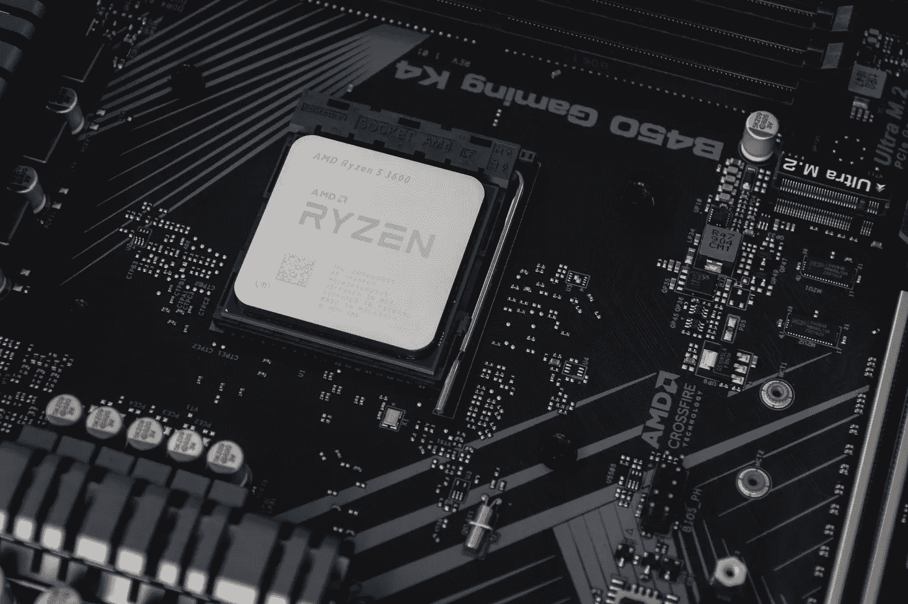
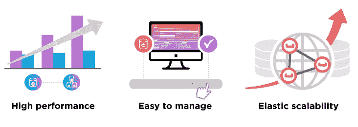

# 缓存的所有内容——用例、好处、策略、选择缓存技术、探索一些流行产品

> 原文：<https://medium.datadriveninvestor.com/all-things-caching-use-cases-benefits-strategies-choosing-a-caching-technology-exploring-fa6c1f2e93aa?source=collection_archive---------0----------------------->

Image by [Christian Wiediger](https://unsplash.com/@christianw) on [unsplash.com](https://unsplash.com/photos/c3ZWXOv1Ndc)

几乎每个人都熟悉缓存，毕竟这种技术如今无处不在，从 CPU 到浏览器到任何 web 应用程序，所有软件都在一定程度上依赖缓存来提供极快的响应。几毫秒的延迟可能导致数十亿美元的损失，因此亚毫秒级响应成为日常需求。市场上有大量的缓存解决方案。但这并不意味着使用任何技术就能解决你的问题。因此，在这篇文章中，我试图解释帮助您决定技术的不同参数，我们还讨论了功能&市场上已经可用的解决方案的一些真实用例，以便在使用它们之前，您知道它们的常见用例。

# 缓存先决条件

在决定缓存层之前，您需要问自己以下问题:

*   您系统中的哪些业务用例需要高吞吐量、快速响应或低延迟？
*   如果您使用缓存，您会介意数据不一致吗？
*   您想存储哪种数据？对象、静态数据、简单的键值对还是内存中的数据结构？
*   您需要维护事务/主数据的缓存吗？
*   您需要单个节点中的进程内缓存或共享缓存，还是 n 个节点的分布式缓存？
*   您需要开源、商业或框架提供的缓存解决方案吗？
*   如果使用分布式缓存，性能、可靠性、可伸缩性和可用性如何？

# 缓存优势

> 有效的缓存对内容消费者和内容提供者都有帮助。缓存给内容交付带来的一些好处是:
> 
> **降低网络成本:**内容可以在内容消费者和内容来源之间的网络路径上的不同点进行缓存。当内容被缓存在离消费者更近的地方时，请求不会在缓存之外引起太多额外的网络活动。
> 
> **提高响应能力:**缓存使内容检索更快，因为不需要整个网络的往返。靠近用户维护的缓存，如浏览器缓存，可以使检索几乎是即时的。
> 
> **在相同的硬件上提高性能:**对于产生内容的服务器，通过允许主动缓存，可以从相同的硬件上获得更高的性能。内容所有者可以利用交付路径上的强大服务器来承受某些内容负载的冲击。
> 
> **网络中断期间内容的可用性:**通过某些策略，缓存可用于向最终用户提供内容，即使在源服务器短时间不可用的情况下。

# 一般缓存使用案例

让我们看看一些流行的缓存用例，您的用例可能会与其中一个重叠:

**内存中数据查找:**如果您有一个移动/ web 应用程序前端，您可能希望缓存一些信息，如用户配置文件、一些历史/静态数据，或者根据您的用例缓存一些 api 响应。缓存将有助于存储此类数据。此外，当您为某个问题创建动态编程解决方案时，二维数组或哈希映射可以作为缓存使用。

**RDBMS 加速:**关系数据库在处理数百万行时速度很慢。不必要的数据或旧数据、高容量数据会使其索引变慢，无论您是否进行分片或分区，当数据库容量已满时，单个节点在查询响应中总是会遇到延迟&延迟。在这种情况下，可能许多“选择”查询或读取查询可以在外部缓存，至少在某个小时间窗口内。关系数据库也使用自己的缓存，但是为了获得更好的性能，外部缓存可以比内部缓存有更大的容量。这是最流行的缓存用例之一。

**管理网络/移动应用中的峰值:**通常流行的网络/移动应用在吸引大量用户时会经历大幅峰值。许多这样的调用可能最终是数据库中的读取查询、外部 web 服务调用，一些可以是计算数据，如先前支付的即时计算，一些可以是非关键的动态数据，如用户的关注者数量、转发次数、观看者数量等。缓存可以用来提供这样的数据。

**会话存储:**活跃的 web 会话是非常频繁访问的数据——无论您想要进行 api 认证还是想要在电子商务应用程序中存储最近的购物车信息，缓存都可以很好地服务于会话。

**令牌缓存:** API 令牌可以缓存在内存中，以提供高性能的用户认证和验证。

**游戏:**玩家简介&排行榜是玩家经常查看的两个屏幕，特别是在在线多人游戏中。因此，对于数百万的游戏玩家来说，快速获取这些数据变得极其重要。缓存也适合这个用例。

**网页缓存:**为了使移动/web 应用程序具有轻量级&灵活的 UI，您可以在服务器&中创建动态网页，并通过 api 提供相应的数据。因此，如果您有数百万用户，您可以在某个时间段内从缓存中提供这种动态创建的完整/碎片化网页。

**全局 id 或计数器生成:**当您在节点&上拥有可变数量的关系数据库实例时，您想要为它们生成自动递增的主键，或者当您想要为您的用户分配唯一的 Id 时，您可以使用缓存来获取&大规模更新此类数据。

**快速访问任何合适的数据:**很多时候我们认为缓存只是用来存储频繁访问的数据，以达到读取的目的。尽管这在很大程度上是正确的，但这种行为会因用例而异。如果您确实需要快速访问数据，也可以使用缓存来存储不太频繁的数据。我们使用缓存来快速访问数据，因此存储最频繁/最不频繁的数据只是一个用例问题。

# **缓存数据访问策略**

应用程序/系统设计在很大程度上取决于所使用的数据访问策略。它们规定了数据源和缓存系统之间的关系。因此，选择合适的数据访问策略非常重要。在选择任何策略之前，分析数据的访问模式&尝试使您的应用程序适合以下任何一种情况。

***通读/延迟加载:*** 仅在必要时将数据加载到缓存中。如果应用程序需要某个键 **x** 的数据，首先在缓存中搜索。如果有数据，则返回数据，否则从数据源中检索数据，放入缓存&后返回。

**优点:**

1.  它不会加载或保存所有数据，而是按需加载。适用于当您知道您的应用程序可能不需要缓存特定类别数据源中的所有数据的情况。
2.  如果有多个这样的缓存节点&一个节点出现故障，不会对应用程序造成损害，尽管在这种情况下，应用程序面临的延迟会增加。随着新的缓存节点上线，越来越多的请求流过它&每次缓存未命中时，它都会不断填充所需的数据。

**缺点:**

1.  对于缓存未命中，有 3 次网络往返。检查缓存，从数据库中检索，将数据注入缓存。因此缓存会导致明显的响应延迟。
2.  陈旧的数据可能会成为一个问题。如果数据库中的数据发生变化&缓存键还没有过期，它会将陈旧的数据扔给应用程序。

***直写:*** 在数据库中插入或更新数据的同时，也上插缓存中的数据。所以这两个操作应该发生在一个事务中，否则数据就会过时。

**优点:**

1.  没有过时的数据。它解决了通过缓存读取的过时问题。
2.  适用于不能忍受陈旧性繁重的系统。

**缺点:**

1.  这是一个书面惩罚系统。每个写操作执行 2 次网络操作—将数据写入数据源，然后写入缓存。
2.  *缓存流失:*如果大部分数据从未被读取，缓存将不必要地托管无用数据。这可以通过使用 TTL 或 expiry 来控制。
3.  为了保持缓存和数据源之间的一致性，在写入数据时，如果您的任何缓存节点丢失，写入操作将完全失败。

***写在缓存后面:*** 在这种策略中，应用程序将数据直接写入缓存系统。然后，在某个配置的时间间隔之后，写入的数据被异步同步到底层数据源。因此，这里的缓存服务必须维护一个“写”操作队列，以便它们可以按照插入的顺序进行同步。

**优点:**

1.  因为应用程序只写入缓存服务，所以它不需要等到数据写入底层数据源。读取和写入都发生在缓存端。因此它提高了性能。
2.  应用程序不受数据库故障的影响。如果数据库失败，排队的项目可以重试或重新排队。
3.  适用于高读写吞吐量系统。

**缺点:**

1.  数据库和缓存系统之间的最终一致性。因此，任何对数据库的直接操作或连接操作都可能使用陈旧数据。

**采用后写策略的应用设计约束:**

1.  因为在这种策略中，先写缓存，然后写数据库，它们不是在事务中写的，如果缓存的项不能被写到数据库中，必须有一些回滚过程来保持时间窗口内的一致性。
2.  写后缓存可能允许无序的数据库更新，所以数据库必须能够放松外键约束。此外，如果数据库是共享数据库，其他应用程序也可能使用它，因此无法知道写后缓存更新是否会与其他外部更新冲突。这必须手动或启发式处理。

***提前刷新缓存:*** 这是一种缓存数据在过期前被刷新的技术。Oracle coherence 使用这种技术。

> 提前刷新时间表示为条目到期时间的百分比。例如，假设缓存中条目的到期时间设置为 60 秒，提前刷新因子设置为 0.5。如果缓存的对象在 60 秒后被访问，Coherence 将从缓存存储中执行一个*同步*读取来刷新它的值。然而，如果对超过 30 秒但小于 60 秒的条目执行请求，则返回缓存中的当前值，Coherence 安排从缓存存储中进行*异步*重新加载。

因此，提前刷新缓存的作用是，在下一次可能的缓存访问之前，以配置的时间间隔刷新缓存，尽管由于网络延迟，刷新数据可能需要一些时间&与此同时，在读取量非常大的系统中，几千个读取操作可能已经在几毫秒的持续时间内发生了。

**优点:**

1.  当大量用户使用相同的缓存键时，这很有用。由于数据会定期且频繁地刷新，因此数据陈旧不是一个永久的问题。
2.  与通过缓存读取等其他技术相比，延迟更短。

**缺点:**

1.  实现起来可能有点困难，因为缓存服务需要额外的压力来刷新所有被访问的键。但是在一个阅读量很大的环境下，这是值得的。

讨论这些策略的要点是——在设计系统时，您知道您正在设计什么样的系统——是读密集型、写密集型，还是两者在很大程度上的混合。不同的系统会有不同的需求，所以很难提出一些可靠的用例&完全可靠的策略。根据您的使用情况，您可以选择上述一种或多种策略的组合。

# 驱逐政策

> 回收策略使缓存能够确保缓存的大小不超过最大限制。为了实现这一点，根据驱逐策略从缓存中删除现有元素，但可以根据应用程序的要求进行定制。

缓存解决方案可能提供不同的回收策略，但是在选择缓存技术之前，最好知道您的应用程序可能需要哪种回收策略。对于不同的用例，您的应用程序可能需要不同的回收策略，这很好，但是了解这一点将有助于您更好地决定缓存技术。

*   **最近最少使用(LRU):** 最常用的策略之一是 LRU。在大多数缓存用例中，应用程序会再次访问相同的数据&。比方说在任何一个谷歌搜索引擎中，当你搜索某样东西时，至少在一段时间内，你会再次得到相同的结果。当你搜索航班或巴士或火车时，你会得到相同的路线，除非&直到一些路线被停用或完全保留。在这种用例中，可以安全地清除最近不怎么使用的缓存数据或冷数据。

> **优点:**
> 1。最接近最优算法
> 2。选择并删除最近没有使用的元素
> **缺点:**
> 1。成功率不高，因为访问元素的频率通常比上次访问元素的时间更重要

*   **最不常用(LFU):**

> 您的手机键盘使用`LFU`。当您键入一些字母时，您可以在键盘顶部看到一些与您键入的字母匹配的建议单词。开始时，当键盘应用程序的`cache`为空时，它可能会显示这 4 个单词(假设你输入了字母“STA”)。建议的单词可能会弹出，如 ex。起跑、站姿、雕像、五线谱)。这里的想法是，根据你使用的单词，它会在一段时间后忽略建议中的`LRU`单词。如果你没有用过“staff”这个词，你可能不会在以后的建议中看到它。
> 
> 如果你有一个案例，你知道数据是非常重复的，当然要选择`LFU`来避免`cache`失误。看起来这两者是相当明显独立的，并且具有孤立的意义。这取决于您希望在什么情况下使用这些工具。
> 
> **优点:**
> 1。考虑元素的年龄
> 2。考虑元件的参考频率
> 3。当快速请求大量元素时，在高负载下工作得更好(较少错误驱逐)
> **缺点:**
> 1 .频繁访问的元素只有在多次未命中后才会被逐出
> 2。更重要的是让可以改变的元素失效

*   **最近使用的(MRU):** 让我们考虑一下 Tinder。Tinder 为你个性化匹配的个人资料，并说它会在缓存或高性能缓存中缓冲这些结果。因此，您可以假设为每个用户分配了一些空间来排队相应的个性化结果。当你看到 Tinder 的推荐页面，你左右滑动的那一刻，你就不再需要那个推荐视图了。所以在这个用例中，Tinder 可以从用户的队列中删除推荐&来释放内存空间。该策略删除最近使用的项目，因为它们至少在不久的将来是不需要的。
*   **先进先出(FIFO):** 它更像 MRU，但它遵循插入数据项的严格排序。MRU 不遵守插入命令。

在某些用例中，您可能需要应用 LRU + LFU 等驱逐策略的组合来决定驱逐哪些数据。这取决于您的用例，因此请尝试选择与您想到的驱逐策略一致的技术。

# 数据类型式缓存

不同的缓存技术因其内部设计而适用于不同的数据类型。因此，选择正确的技术还取决于他们可以有效存储什么类型的数据。

***对象存储:*** 适合存储 HTTP 响应对象、数据库结果集、渲染 html 页面等不可修改的对象。例如:Memcached。

***简单键值存储:*** 将简单字符串键存储到字符串值几乎是任何缓存都支持的。例如:Redis、Memcached、Hazelcast、Couchbase 等。

***原生数据结构缓存:*** 如果您的用例支持在&中存储从原生支持的数据结构中检索数据，那么 Redis & Aerospike 是不错的选择。

***内存缓存:*** 适用于在同一个节点中存储任何可通过运行时内存直接访问的键值或对象。例如:HashMap，Guava Cache 等，Hibernate & MySQL 查询缓存。

***静态文件缓存:*** 适用于缓存图片、文件、静态文件，如 css 或 javascript 文件。例子:Akamai CDN，Memcached 到一定程度。

# 缓存策略

**单节点(进程内)缓存:**

这是非分布式系统的缓存策略。应用实例化和管理自己或第三方缓存对象。应用程序和缓存都在同一个内存空间中。

> 这种类型的缓存用于缓存数据库实体，但也可以用作某种对象池，例如将最近使用的网络连接汇集在一起，供以后重用。

***优点:*** 本地可用数据，所以速度最高，易于维护。

***缺点:*** 单个节点内存消耗高，缓存与应用共享内存。如果多个应用程序依赖同一组数据，那么可能会有数据重复问题。

***使用案例:*** 当您制作独立应用程序(如移动应用程序)或 web 前端应用程序时，如果您希望临时缓存从后端 api 获得的网站数据或其他内容(如图像、css、java 脚本内容)，请选择此策略。当您希望在后端应用程序的不同类中跨不同方法共享可能由 api 响应创建的对象时，这种策略也很有用。

**分布式缓存:**

当我们谈论互联网规模的 web 应用程序时，我们实际上是在谈论每分钟数百万个请求、数 Pb 或数 TB 的数据。因此，一台或两台专用的强大机器无法处理如此庞大的规模。我们需要几台机器来处理这种情况。几十到几百台机器组成一个集群&在非常高的规模下，我们需要多个这样的集群。

***有效的分布式缓存解决方案的关键要求:***
以下是分布式缓存最重要的要求。

Courtesy: Couchbase

1.  **性能:**缓存应该能够持续满足应用程序读写查询的吞吐量要求。因此，它越能利用 RAM、SSD 或闪存、CPU 等资源，就越能更好地产生输出。
2.  **可伸缩性:**缓存系统必须能够保持稳定的性能，即使操作、请求、用户数量和数据流数量增加。它必须能够在没有任何负面影响的情况下线性扩展。因此，弹性增长或下降是一个重要的特征。
3.  **可用性:**高可用性是当今系统的最高要求。获得陈旧的数据很好(取决于用例)，但是不可用的系统是不需要的。无论是计划内还是计划外停机，或者部分系统崩溃，或者由于自然灾害，一些数据中心无法运行，缓存都必须始终可用。
4.  **可管理性:**简单的部署、监控、有用的仪表板、实时矩阵让每个开发人员& SRE 的生活变得简单。
5.  简单:在其他条件相同的情况下，简单总是更好。向部署中添加缓存不应该引入不必要的复杂性，也不应该给开发人员带来更多工作。
6.  **可承受性:**成本始终是任何 IT 决策的考虑因素，包括前期实施成本和持续成本。您的评估应该考虑总拥有成本，包括许可证费用以及硬件、服务、维护和支持。

因此，根据您的用例，您可以决定使用哪种缓存。在大多数情况下，迎合数百万客户的企业系统或高度成熟的初创公司会使用多个集群来进行分布式缓存。中小型公司也使用多个节点进行缓存，但他们并不总是需要企业级解决方案。如上所述，进程内缓存仅在独立应用程序或用户设备的本地缓存中可用。

让我们探索一些流行的现实生活中的缓存技术，它们可能会解决我们的日常缓存需求。

# 真实的缓存解决方案

**Memcached**

> *免费&开源、高性能、分布式内存对象缓存系统*，本质上是通用的，但旨在通过减轻数据库负载来加速动态 web 应用程序。Memcached 是一个用于存储小型任意数据(字符串、对象)的内存键值存储。

***功能:***

1.  Memcached 是一个高性能的缓存解决方案，可以满足非常大的互联网规模的应用程序的吞吐量。
2.  按照设计，Memcached 非常容易安装和部署，是一个基本的缓存。
3.  成本非常低的解决方案，根据修订后的 BSD 许可证获得许可。
4.  简单键值存储。Memcached 不理解应用程序正在保存什么——它可以存储字符串和对象值，键总是字符串类型。它允许以序列化形式将对象存储为值。所以在保存任何对象之前，你必须序列化它，在检索之后，你必须相应地反序列化它。
5.  在分布式设置中，Memcached 节点不互相通信，没有同步，没有复制。本质上，它包含简单的设计，客户端必须选择读取/写入特定数据的节点。
6.  它是多线程的。因此它可以利用多个 CPU 内核。
7.  所有的 memcahed 命令都是尽可能快速和无锁的。因此，对于所有情况，查询速度几乎都是确定的。
8.  客户端保留将缓存键映射到节点的逻辑，以防多个节点可用。
9.  除了获取、设置和删除操作之外，memcached 还提供了其他功能，如密钥过期(TTL)、完全刷新数据库、支持递增和递减操作的轻量级计数器、支持项目追加和前置操作的原生列表数据结构、线程安全 CAS(比较和交换)支持的设置操作。
10.  缓存失效是很容易的，因为客户端跟踪哪个键进入哪个节点，它可以从那个节点删除那个键。

以下是所有操作的总结:

Courtesy: Heroku

***内存管理技术:*** Memcached 只支持 LRU 内存管理。因此，在选择这个解决方案之前，请仔细分析您的用例。

***合适的用例:*** 存储简单的字符串键/值对。将数据库结果集对象、HTTP api 响应或可序列化的内存中对象、JSON / XML 文档存储为带有字符串关键字的值、页面呈现的结果等。

***局限性:***

1.  由于没有持久性，每次崩溃或重启时，每次都需要预热或重新填充数据。
2.  如果您想要存储大型对象或数据集，数据的序列化表示可能会占用更多空间&可能会使内存碎片化。
3.  Memcached 将每个键的数据大小限制为 1 MB。
4.  避免读-修改-写操作用例。由于在插入/检索数据时需要序列化/反序列化对象，所以更新操作似乎成本很高。尽量存储有到期时间的不可变对象。
5.  Memcached 不适合企业用例。它没有提供许多功能，如自动弹性集群管理、复杂的高可用性、自动故障转移、负载重新平衡、跨数据中心复制等。
6.  它缺乏用于管理用例的高级监控和工具生态系统。如果您面临任何问题，要么您必须依赖您的资源，要么依赖 Memcached 社区，因为没有商业实体支持它。

LinkedIn 在 2010 年开始使用 Memcached，但到 2012 年，他们面临许多问题&被迫放弃它。以下片段摘自 LinkedIn 的工程博客，它将很好地解释为什么 Memcached 不适合企业:

> **Memcached 天数**
> 
> [Memcached](https://memcached.org/) 于 2010 年代初首次引入 LinkedIn，作为一种快速、内存中的分布式缓存解决方案，当时我们需要扩展我们的真实来源数据存储来处理增加的流量。它很好地实现了它所提供的功能:
> 
> 一位数毫秒获取和设置需要在其真实数据存储源前进行缓存的应用程序。
> 
> 配置集群很简单，而且开始的过程非常快。
> 
> 然而，随着 Memcached 集群的数量随着开始使用它的应用程序数量的增加而增加，我们很快就遇到了可操作性问题，一些主要的问题是:
> 
> **缺乏毅力。** Memcached 是一个内存存储。尽管快速响应时间是 Memcached 的最大优势，但当我们出于维护原因需要重启 Memcached 进程时，这也很残酷，因为我们还会丢失缓存的全部内容。
> 
> **打破哈希环。**在不破坏哈希环和使部分缓存无效的情况下，调整集群的大小(即使用更多节点扩展集群)是不可能的。一致的哈希算法有所帮助，但没有完全解决问题。
> 
> **更换主机。**我们的哈希算法基于集群中节点的主机名，因此任何时候我们用不同的主机名替换主机，不仅会使被替换节点上的缓存无效，还会破坏哈希环。
> 
> **缺少缓存复制功能。**假设我们想要建立一个新的数据中心，并且想要复制缓存的内容。这并不简单。我们最终围绕强制键构建了一些工具来填充新的缓存，但这既不理想也不优雅。
> 
> 你可以看到为什么 Memcached 在 LinkedIn 如此容易地被采用(提供了快速和容易的胜利)，但同时也可以看到为什么在大规模工作时它如此令人讨厌。

***值得注意的 Memcached 用户:*** YouTube、Reddit、Craigslist、Zynga、脸书、Twitter、Tumblr、维基百科。

**Redis**

市场上最受欢迎的缓存之一，内存键值存储。

> Redis 通常被称为数据结构服务器。这意味着 Redis 通过一组命令提供对可变数据结构的访问，这些命令是使用带有 TCP 套接字和简单协议的*服务器-客户端*模型发送的。因此不同的进程可以以共享的方式查询和修改相同的数据结构。

***特性:***

1.  Redis 支持本地可变数据结构，即列表、集合、有序集合、字符串、散列。它还支持范围查询、位图、超对数、带有半径查询的地理空间索引。
2.  Redis 将所有数据存储在内存中，本质上 redis 是一个大的内存字典。所以非常快。它可以在管道中运行命令。
3.  经过配置的时间间隔或特定次数的操作后，数据可以异步保存在磁盘上。
4.  Redis 通常被称为单线程。这意味着直接服务于客户端的应用程序逻辑只是一个单独的线程。在同步磁盘上的数据时，redis 产生了后台线程，它不直接处理客户端。
5.  Redis 支持开箱即用的主从复制。这只是一个配置设置&复制已启动并正在运行。
6.  Redis 支持[交易](https://redis.io/topics/transactions)。事务中的所有命令都被序列化&它们按顺序运行。和往常一样，redis 事务也保证要么所有命令都通过，要么不处理任何命令。
7.  Redis 密钥支持 TTL 或到期时间。
8.  Redis 对发布-订阅机制有现成的支持。它有启用发布-订阅的命令。
9.  自动故障转移由 [Redis Sentinel](https://redis.io/topics/sentinel) 支持。
10.  Redis 支持服务器端 [Lua 脚本。](https://redis.io/commands/eval)这样一批命令就可以运行，而不需要在服务器&客户端之间进行过多的通信。
11.  Redis 是可移植的，可以在几乎所有的 Linux，Windows，Mac 等平台上运行。
12.  支持每个键高达 512 MB 的值的大小。
13.  Redis 企业版还支持更多的特性。

***内存管理技术:*** Redis 支持以下技术:

*   **allkeys-lru** :从所有密钥中清除最近最少使用的密钥。
*   **allkeys-random** :随机驱逐所有钥匙中的钥匙。
*   **volatile-lru** :从设置了“expire”字段的所有密钥中清除最近最少使用的密钥。
*   **volatile-ttl** :驱逐生存时间最短的密钥(在所有设置了“过期”字段的密钥中)。
*   **volatile-random** :驱逐设置了“过期”字段的密钥。
*   **no-eviction** : Redis 不会驱逐任何键，并且在更多内存被释放之前不会有写操作。

***合适的用例:*** Redis 有很多很多有利可图的用例:

1.  如果可以相应地对数据建模，Redis 散列可以用来代替关系表&您的用例不需要任何事务保证。
2.  Redis 发布-订阅可用于向多个订户广播消息。
3.  Redis 列表可以用作消息队列。分布式任务处理系统利用 redis 数据结构来管理任务。
4.  会话存储是 redis 的一个非常流行的用例。redis 的持久能力使它适合于这种情况。
5.  Redis 排序集可用于管理在线游戏中的排行榜。
6.  Redis 可以存储、递增、递减整数。它可以用于为任何用例生成全局 id。

更多用例可以在[这里](http://highscalability.com/blog/2011/7/6/11-common-web-use-cases-solved-in-redis.html) &这里[这里](https://redislabs.com/solutions/use-cases/)找到。

***局限性:***

1.  Redis 不支持二级索引。
2.  Redis 提供基于关键字名称的正则表达式搜索的数据查询/扫描。因此，在选择使用 Redis 数据结构(如散列、排序集等)之前，请尝试考虑您的应用程序如何适应 Redis &如果使用这些数据结构，您的数据访问模式是什么。对于简单的键值用例来说，这很轻松，你不需要想太多。

***值得注意的 Redis 用户:*** Twitter、GitHub、微博、Pinterest、Snapchat、Craigslist、Digg、StackOverflow、Flickr

**气塞式**

一个速度极快的开源 NoSQL 键值存储。Aerospike 的一个重要卖点是它有一个混合内存模型，这意味着如果您的服务器在 RAM 上达到极限，SSD(如果服务器使用)可以作为替代。内置的集群能力、更少的操作和维护开销、高可用性使 Aerospike 成为高度可扩展系统的绝佳选择。

**功能:**

1.  Aerospike 针对闪存驱动器进行了优化，如固态硬盘、 [PCIs](https://en.wikipedia.org/wiki/PCI_Express) 、 [NVMe](https://en.wikipedia.org/wiki/NVM_Express) 。Aerospike 使用闪存驱动器进行垂直扩展。固态硬盘支持巨大的纵向扩展，总拥有成本比纯 RAM 低 5 倍。一般来说，设备的 IOPS(每秒输入输出)会持续增加。固态硬盘每节点可存储的数据比 DRAM 多一个数量级。 [NVMe 硬盘现在可以每硬盘执行 100K IOPS](https://www.intel.com/content/www/us/en/solid-state-drives/intel-ssd-dc-family-for-pcie.html)。Aerospike 利用了这些能力，因此它可以每秒钟运行数百万次操作，并且总是有亚毫秒级的延迟。
2.  它支持键值存储、批量查询、扫描、二级索引查询和聚合等。
3.  它支持在集群环境中运行。它能够自动管理集群，自动识别节点添加和脱离，并相应地进行数据分发。
4.  这是无模式的。
5.  它支持所有记录的 TTL 到期。
6.  它支持字符串、整数、blobs、列表、映射和序列化对象。
7.  Aerospike 实现了数据的跨数据中心复制(XDCR ),它在集群节点之间持续复制数据，因此有助于创建高度可用的防崩溃系统。
8.  Aerospike 执行大块写入和小块读取以获得更高的性能。
9.  它是多线程的。
10.  支持服务器端 Lua 脚本。它使服务器端批处理操作更快。
11.  AQL —支持 Aerospike 查询语言，以帮助开发人员查询数据存储中的键值。

**合适的用例:**

1.  *广告技术行业:*由于 Aerospike 的关键价值存储功能，它非常适合存储用户资料、用户历史记录、会话数据、广告展示计数器等各种用例。

> 在构建任何形式的广告或营销应用程序时，您都需要存储用户资料。这些档案通常包含最近的用户行为、从分析系统加载的细分市场、合作伙伴 cookies 以及各种其他数据。每个配置文件的大小通常较小，如 1 KB 到 10 KB。除了纯粹的个人资料，您还需要 cookie 匹配、活动预算和状态以及其他前端数据。

2.Aerospike 提供了一种叫做 LDT 的数据结构——大数据类型。它可以用来存储每个键数百万个项目(比如整数或字符串)。因此，如果你想存储一个名人的追随者名单映射到名人 id，你可以用 LDT。这只是一个非常简单的粒度用例。

3.Aerospike 可用于存储嵌套数据，即:另一个数据结构下的一个数据结构。所以本地列表可以包含在映射中，等等。

4.如果想缓存快速变化的动态数据，Aerospike 是个不错的选择。

5.*数据分析:*存储消费者行为，例如在金融行业，消费者正在执行哪些交易&识别是否是欺诈性交易，系统需要编写&快速检索消费者数据，以便通过分析规则或相关服务快速进行分析。Aerospike 非常适合容纳如此大量的高读&写操作。

6.*推荐引擎:*

> 推荐引擎使用创新的数学，结合特定领域的知识，来增加在线参与度。如果您正在设计一个，您将需要一个快速的数据层(以支持每个建议的多个请求)和灵活的数据层，因为随着系统的发展，您将需要更多的吞吐量或更多的数据。当从您的数据科学家那里提取数据时，或者如果您正在记录您的算法将使用的最近行为，您将需要一个支持高写入吞吐量的。
> 
> Aerospike 是一个优秀的推荐引擎数据库。主要特性包括大型列表(用于高效记录行为)、优化的闪存支持(用于处理从 TB 到 Pb 的数据集)、用于实时报告的查询和聚合，以及对 Python 和 Go 等语言的强大支持。

7.可用于非常大的数据集，如地理位置散列。如果你想存储两个位置之间的距离和持续时间数据，你想缓存数百万个这样的数据点，Aerospike 可以帮助你。

***内存管理技术:*** 这里可以找到。

***值得注意的 Aerospike 用户:*** InMobi、Flipkart、Adobe、Snapdeal、AppsFlyer、PubMatric、Swiggy。

**黑兹尔卡斯特**

Hazlecast 是一个内存数据网格，它是一个集群系统，具有高可用性和可伸缩性。它非常快，因为它自动跨节点分发和复制数据。这是一个基于 Java 的缓存系统&非常适合 Java 生态系统，尽管 Hazlecast 客户端也可以在其他主要语言中使用。

> Hazelcast 是一种无模式的内存数据存储，比 RDBMS 快约 1000 倍，对于大容量数据，查询和更新时间以微秒计。

***功能:***

1.  Hazlecast 没有主节点。所有节点都像主人。它们维护一个叫做“分区表”的元数据信息。分区表保存了成员详细信息、集群健康状况、备份信息、重新分区等信息。Hazlecast 客户端也可以访问这个“分区表”，因此它们可以直接查询数据所在的相关节点。
2.  Hazlecast 在集群中的所有节点上分发数据副本。因此，如果一个节点发生故障，数据不会丢失。
3.  随着越来越多的数据出现，Hazlecast 可以横向增长和扩展。
4.  它是多线程的。因此，所有的 CPU 内核都有可能被使用。

更多功能[这里](https://hazelcast.org/features/)。

***适用用例:***

1.  Hazlecast 重新实现了 List、Map、Set、AtomicLong、AtomicReference、Count down lacth，以便在从跨多个节点运行的应用程序访问时，可以在集群/分布式环境中安全地使用它们。
2.  Hazlecast 可用于为分区数据库或其他用例生成惟一的 id。
3.  它还实现了几个分布式计算，如在分布式环境中使用的预定执行器、执行器服务等。

4.

> 黑兹卡斯特 IMDG 公司提供 web 会话集群。用户会话在 Hazelcast 集群中维护，使用多个副本实现冗余。如果某个应用服务器出现故障，负载平衡器会重定向到一个新的应用服务器，该服务器可以访问用户会话。对于用户来说，切换到新的应用服务器是无缝的。这提供了最高水平的客户体验。 [Web 会话集群](https://hazelcast.com/use-cases/web-session-clustering/)用例适用于使用本机集成的 [Tomcat](http://hazelcast.com/use-cases/web-session-clustering/tomcat-web-session-replication/) 和 [Jetty](http://hazelcast.com/use-cases/web-session-clustering/jetty-web-session-replication/) ，以及使用过滤器的[任何应用服务器](https://hazelcast.com/use-cases/web-session-clustering/gen-rep/)。

5.Hazlecast 也是金融行业的首选。更多[此处](https://hazelcast.com/use-cases/financial-market-data/)。

更多[用例](https://hazelcast.com/use-cases/caching/)也在这里。

***内存管理技术:*** Hazlecast 支持 LRU、LFU 或者这些都不支持。

**著名的 Hazelcast 用户:** Ola cabs(印度)、美国运通、瑞士瑞信银行、超级钱包系统、PayPal、Atlassian、Apache Camel、Twilio、Vert.x 等。

**床座**

Couchbase 是一个开源的企业级 NoSQL 文档存储库(既可以用作键值也可以用作文档存储库)，它不仅仅是一个缓存解决方案，它还提供了一些功能，使它变得不那么复杂，并且可以适应大量的企业玩家。

> Couchbase 旨在解决经常与缓存相关的核心问题，但实际上只是标准的性能和可伸缩性问题。此外，Couchbase 通过故障转移选项解决了与应用程序的高可用性以及数据的全面持久性相关的挑战。

***特性:***

1.  Couchbase 有一个内存优先的架构，整个数据库可以在内存中运行，这使得它适合缓存场景。Couchbase 是为高性能而构建的，它提供了亚毫秒级的延迟。

> 它还可以为超出内存大小的数据提供服务，使用高效的数据访问方法来保持内存加载最新的更新。

2.Couchbase 也提供了持久性。因此，如果一个节点崩溃，数据不会丢失。

3.弹性可伸缩性是指，如果你有大量数据&你想把它分布在节点或集群上，couchbase 可以做到这一点，而不会让你承担太多的负载。

4.Couchbase 提供跨集群和跨数据中心复制(XCDR)来提供高可用性。

5.Couchbase 支持用自己的查询语言 N1QL 查询 JSON 数据。

6.它还提供实时分析查询、全文搜索和服务器端事件处理。

7.它支持集群之间的自动应用程序故障转移。

8.Couchbase 提供自动分片&它使用支持集群的客户端。所以当一个新的节点被引入或者一个节点离开时，你不需要做分片，一切都会在幕后发生。

9.企业支持可用。

***适用用例*** :大型企业，需要缓存+ NoSQL 用例，具有易维护性、高可用性&弹性、高吞吐量、自动故障转移、自动分片、易监控&管理支持等。

***局限性:*** 这里可以找到。

***一些著名的用户:*** PayPal，Intuit，Viber，Tesco，AT & T，威瑞森，Ebay 等。

## 最后一件事:缓存即服务

在大型企业中，使用分布式共享缓存。因此，您可以在应用程序中直接添加特定缓存的依赖项，以便开始使用它。但是这不是一个非常合适的方法，因为在不久的将来，可能会出现另一种奇妙的缓存解决方案&您的组织决定使用它。因此，为了将缓存层从未来的麻烦中抽象出来，可以将缓存隐藏在服务之后。所有不同的应用程序都可以通过 api 调用与缓存通信。它封装了缓存的内部细节，缓存团队将能够快速做出任何必要的更改，而无需更改公开的接口。但是，一旦您决定走这条路，您必须确保缓存服务全天候运行。因此，与微服务架构相关的所有挑战在这种情况下都是有效的，但尽管如此，服务应该提供的抽象性和灵活性对于大型组织来说是无价的。

在这篇文章中，我们看到了在选择和设计我们自己的缓存服务时不同的参数。决定您选择何种技术的不仅仅是一个大的/流行的技术名称或您对某项技术的熟悉程度，更多的是我们的应用程序使用案例、数据访问模式、我们想要缓存的对象类型、所需的数据持续时间、回收策略、基础架构要求、所需的数据持久性、可扩展性和集群要求、可用性、数据量等，这些因素决定了最佳技术的选择。工程师在选择某项技术之前需要考虑多少，这取决于他们。人们选择他们已经习惯的技术是非常正常的行为，但了解所有这些参数肯定有助于你做出更好的设计决策。

请让我知道你是否能给这个帖子增加任何价值，或者我可以通过在下面添加评论来改进任何东西。

*参考:*

[1][https://dzone . com/articles/introducing-amp-同化-缓存-快速阅读-fo](https://dzone.com/articles/introducing-amp-assimilating-caching-quick-read-fo)

[2][https://www . it pro . co . uk/virtualization/30271/our-5-minute-guide-to-distributed-caching](https://www.itpro.co.uk/virtualisation/30271/our-5-minute-guide-to-distributed-caching)

[3][https://docs . Oracle . com/CD/e 15357 _ 01/coh . 360/e 15723/cache _ rtwtwbra . htm # cohdg 5181](https://docs.oracle.com/cd/E15357_01/coh.360/e15723/cache_rtwtwbra.htm#COHDG5181)

[4][https://blogs . Dropbox . com/tech/2012/10/caching-in-theory-and-practice/](https://blogs.dropbox.com/tech/2012/10/caching-in-theory-and-practice/)

[5][https://stack overflow . com/questions/17759560/LRU-and-lfu 之间的区别是什么](https://stackoverflow.com/questions/17759560/what-is-the-difference-between-lru-and-lfu)

[6][https://stack overflow . com/questions/44343510/in-the-case-lfu-is-better-LRU](https://stackoverflow.com/questions/44343510/in-which-case-lfu-is-better-than-lru)

[7]https://devcenter.heroku.com/articles/advanced-memcache

[8][https://www . quora . com/What-use-cases-is-Redis-fitted-not-fitted-for-a-a-high-traffic-web-application-as-of-early-2016](https://www.quora.com/What-use-cases-is-Redis-suitable-not-suitable-for-in-a-high-traffic-web-application-as-of-early-2016)

[9][http://www . tothenew . com/blog/caching-what-why-and-how-with-hazel cast/](http://www.tothenew.com/blog/caching-what-why-and-how-with-hazelcast/)

[https://blog.hazelcast.com/hazelcast-use-cases/](https://blog.hazelcast.com/hazelcast-use-cases/)

[11][https://hazelcast.com/why-hazelcast/imdg/](https://hazelcast.com/why-hazelcast/imdg/)

[https://www.aerospike.com/products/features/](https://www.aerospike.com/products/features/)