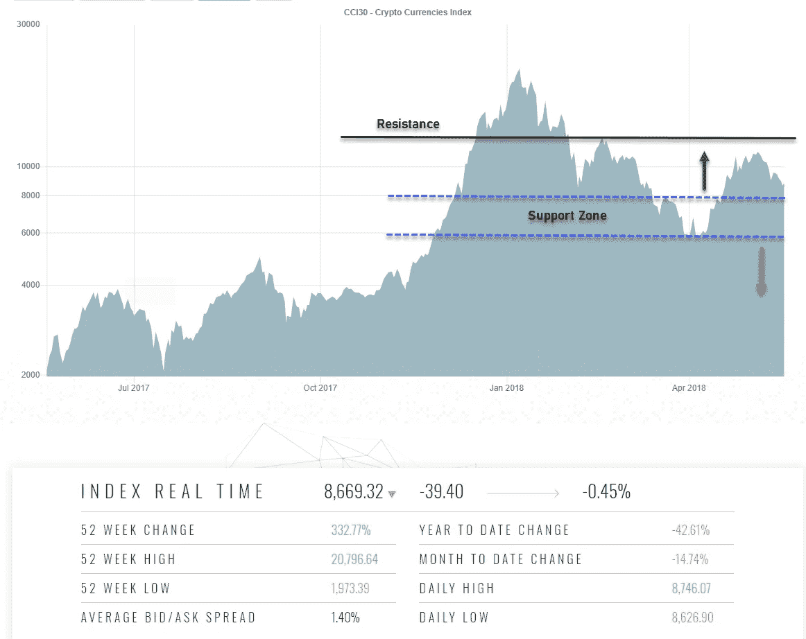
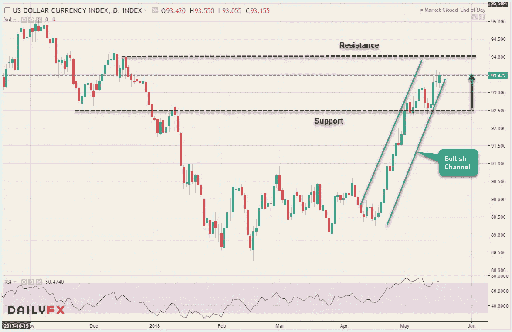
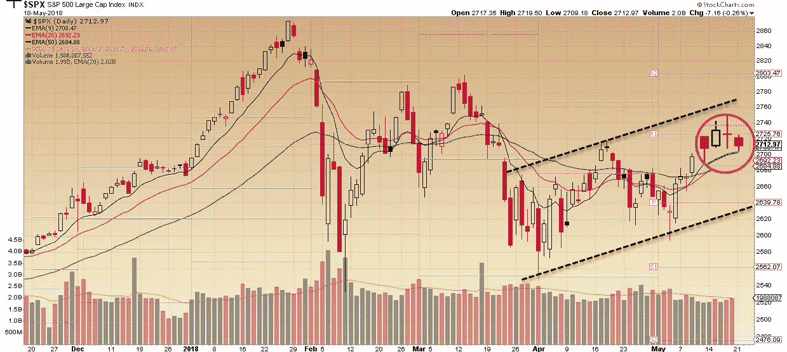
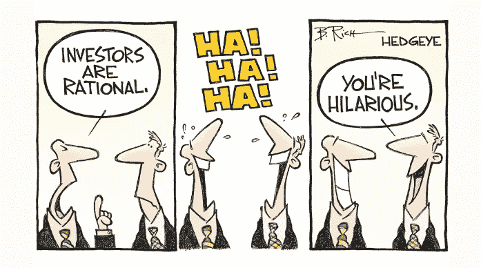

# 所有东西都是密码。外汇股票—2018 年 5 月 19 日

> 原文：<https://medium.datadriveninvestor.com/all-things-cryptos-forex-stocks-05-19-2018-weekly-roundup-a6bade0ab7f1?source=collection_archive---------2----------------------->

本周以三个金融市场的不同故事结束。由于 NYC consensus Conference&bit coin Cash fork 等催化剂未能给他们带来预期的反弹，Cryptos 仍然面临压力，美国股市本周大部分时间仍然紧张&疲软，地缘政治&经济风险受到关注&美元继续对主要货币升值，外汇市场收益率极高。现在，让我们再深入一点。

# 疯狂的密码诗

数字货币领域像往常一样是一个发生的地方。主要加密货币的价格走势仍然疲软，涨幅仍被限制在关键水平之下。所有数字硬币的总市值仍低于 4000 亿美元。查看 CCI30 加密指数 12300 水平充当阻力，低于该阻力，偏差保持在中性区，指数目前徘徊在支撑区(6000-8000)上方。只要这一水平保持不变，预计 Cryptos 将出现复苏——另一方面，突破这一支撑区将引发长期熊市反转。

随着 G-20 在即将到来的夏天实施监管的讨论，围绕 Cryptos 未来的不可预测性和不安仍然存在。与此同时，美国、瑞士和日本等国家正在认真考虑发行他们自己的国家和法定支持的数字货币。以下是一些来自隐文的其他主要标题:

*   **德国第二大交易所**宣布将交易加密货币
*   中国禁止加密货币的交易，但现在对它们进行排名
*   投资巨头 eToro 计划在美国推出 10 种加密货币
*   **Shopify** 与 **CoinPayments** 合作，支持 300 多种加密货币
*   **Ripple** 推出风险投资基金“Xpring”以促进 XRP 的采用

# 外汇市场

10 年期美国国债收益率最高触及 3.11%，这是自 2011 年以来的最高水平，这极大地推动了美元兑其他货币的汇率。欧元兑美元是本周最大的波动者，它在心理水平 1.2000 &失败，收于周低点 1.1800 之下。在令人信服地越过 110.00 水平后，美元兑日元也继续走高，超越 111.00 水平——该对货币的看涨立场主张美元继续走强。

紧随这些举措之后，美元指数的价格走势并不令人意外。上行看涨通道显示出强劲的势头，92.50 作为支撑，回调到这一水平的可能性不能排除，超买 RSI 在日线图上显示背离，但是，任何这样的移动都应该是针对 94.00 阻力的修正

Dollar Index (Daily Chart)

# 股票市场

本周大部分时间，美国股票市场保持震荡。极高的国债收益率、美中贸易谈判、北美自由贸易协定重新谈判&其他地缘政治风险继续让投资者紧张和观望，这反映在本周的主要指数走势中。本周， **DJIA** 下跌 0.5%，而 **S & P 500** 下跌 0.5%，纳斯达克**下跌 0.7%——结束了连续两周的上涨。**

技术上看，上面的标准普尔 500 图表仍处于良好状态。今天的熊市蜡烛线仍然支撑在 9 均线上方，但是之前的多奇蜡烛线看起来不吉利。只要 2685 点和 20 均线的支撑位保持不变，我们仍然在看一个建设性的图表。话虽如此，我们很快就会知道了。

是时候放松一下了——这是本周的漫画——无意冒犯任何人！

是时候用上周一些有趣的历史事实来刷新你的记忆了(#Investopedia):

> 1792 年 5 月 17 日:24 名经纪人签署了**梧桐树协议**，为纽约证券交易所(NYSE)的第一次化身奠定了基础。纽约证券交易所开始交易 5 种证券——3 种政府债券和 2 种银行股票。
> 
> 1911 年 5 月 15 日:最高法院下令解散美国最大的公司之一——标准石油信托公司(Standard Oil Trust)，理由是其垄断石油行业。约翰·d·洛克菲勒拥有的公司被拆分成 34 个相互竞争的小公司。

对加密货币、金融科技行业、突破性技术感兴趣，或者正在寻找加密货币、外汇或股票交易想法的人——在[Twitter](https://twitter.com/trade_nut)&[StockTwits](https://stocktwits.com/trade_nut)上关注我。