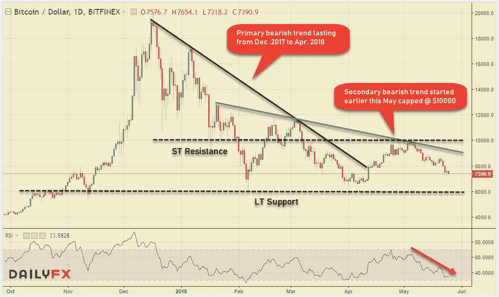
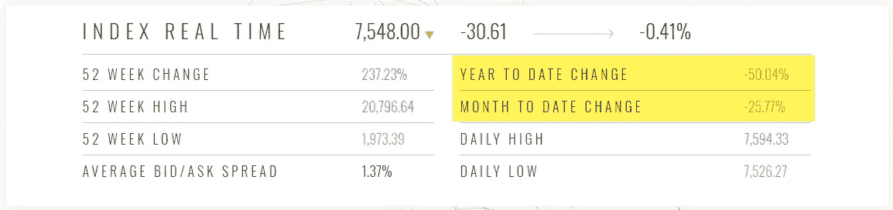
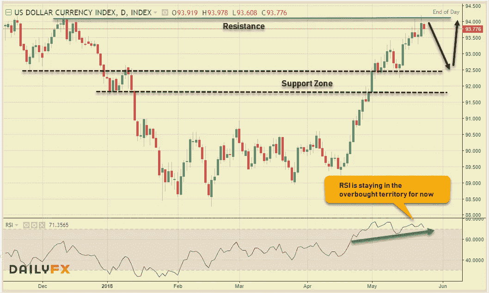
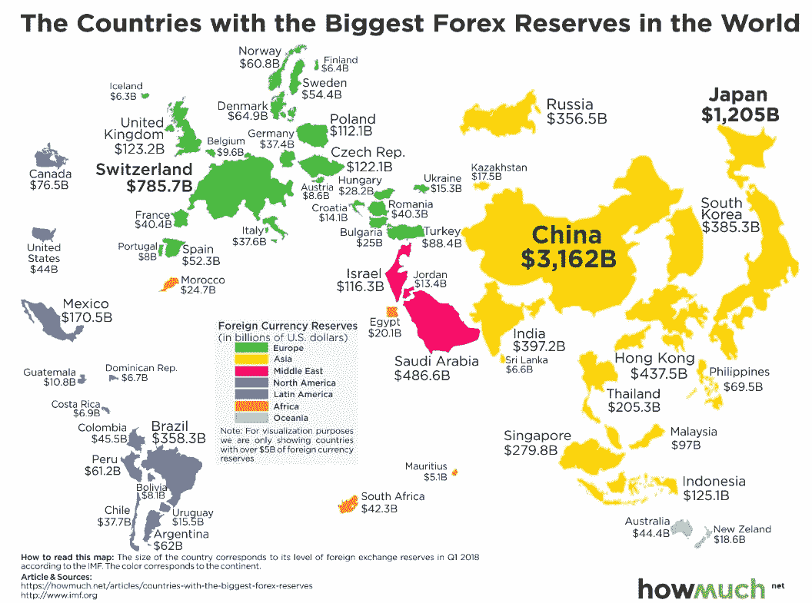
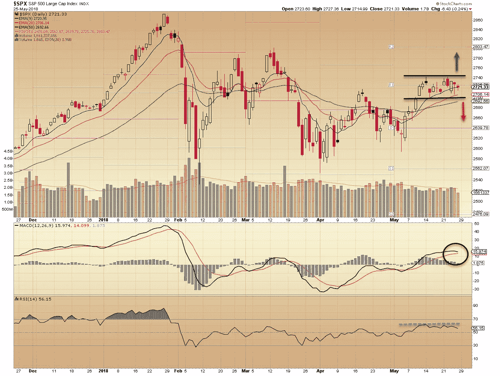
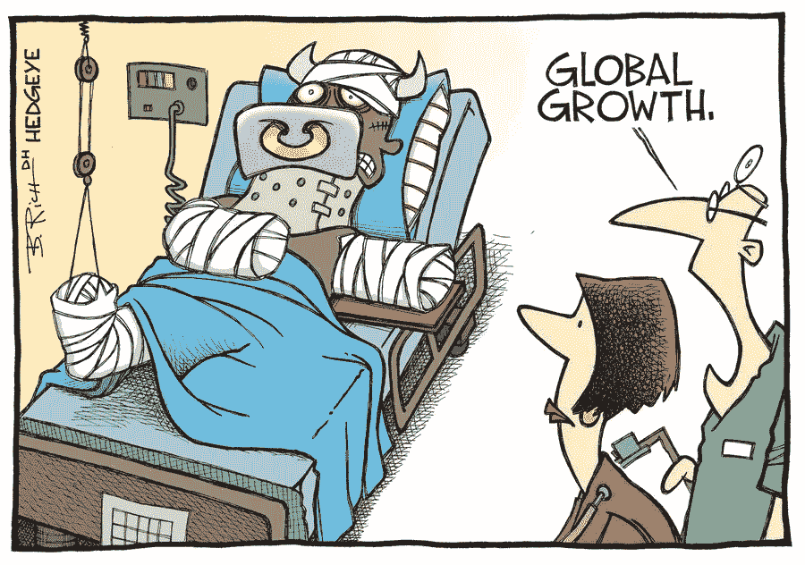

# 所有东西都是密码。外汇股票-2018 年 5 月 26 日(每周综述)

> 原文：<https://medium.datadriveninvestor.com/all-things-cryptos-forex-stocks-05-26-2018-weekly-roundup-b950743673a0?source=collection_archive---------4----------------------->

下面是我对三个金融市场的看法。随着美国司法部开始调查数字硬币的价格是否被操纵，Cryptos 仍然坚定地保持红色。股票遵循“向前一步，向后两步”的前提&美元多头继续在外汇市场上横冲直撞。

# 疯狂的密码诗

这对 Cryptos 来说是一个滑坡，因为他们最终选择了走出“优柔寡断的挤压”的方向——不幸的是，这让许多人失望！一方面，Cryto maximalists 会告诉你，这都是因为 FUD 是在&左右创建的；另一方面，有些人只是买入，因为他们的[星座是这么说的](https://www.marketwatch.com/story/people-are-buying-bitcoin-because-their-horoscope-said-so-2018-05-17)！我说让我们看看比特币图表&看看是怎么回事。

从图表中可以清楚地看到，10000 美元的阻力牢牢地限制了加密中枢的任何收益。随着 LT 看跌趋势的坚定不移&心理水平作为一堵墙，我们继续看到更低的高点。LT 的支持需要举行任何建设性的举动从这里开始。自加密货币市场达到顶峰(835.68 亿美元)以来，已经过去了大约四个月，在撰写本文时，市值降至 328.69 亿美元。从 CCI30 加密指数读数中也可以明显看出这种惊人的下降。

Credit: CCI30.com

我不想给 Cryptos 带来所有的坏消息，所以这里有一些(大部分)上周来自 **#Cryptoverse:** 的积极进展

*   Monero 推出 Tari，一个与以太坊竞争的第二层协议
*   **阿根廷银行**将比特币加入跨境支付
*   马绍尔群岛**发行自己的法定货币加密货币**
*   Ubanx 将把 crypto 带到实体商店林立的大街上
*   美国和加拿大联手进行名为**密码扫描**的行动来探测 ICOs
*   英格兰银行表示，这不是中央银行是否会发行自己的数字货币的问题，而是何时发行、发行什么以及如何发行的问题

# 外汇市场

本周初，由于市场上积极的风险情绪，美元指数从高点回落，但这只是暂时的缓解，因为美元多头卷土重来。美国 10 年期国债收益率仍保持在接近 3%的高位。即使 FOMC 会议记录中关于通货膨胀的语气有所缓和，也无助于抑制美元多头的情绪。

Dollar Index — Daily

看看**美元指数**美元无情的运行是非常明显的，随着 **DXY** 触及 94.20 &的关键阻力位，RSI 在超买区域保持强劲。尽管技术性回调至支撑区域的可能性很大，但牛市似乎不会很快结束。

结合单个货币对——欧洲货币对(欧元兑美元、GBPUSD)仍面临严重的抛售压力，数据疲软，市场上存在避险情绪；两对货币分别收于 1.1650 和 1.3300 的周低点附近。另一个重要的变动来自美元兑加元，由于油价的大幅下跌和对北美自由贸易协定的担忧，美元兑加元最终打破了最近的上涨区间，收于 1.3000 的心理水平附近。最后，最重要的走势是美元兑日元，在收盘于 109.36 之前，从 111.39 的高点跌至 108.95，这是一个典型的规避风险的走势，受到股票疲软的影响。最后，这里有一张关于世界不同国家最大外汇储备的信息图表。

# 股票市场

最近，美国股市越来越倾向于受好消息或坏消息的影响，而不是受任何良好的经济基本面或技术水平的影响。随着美中贸易紧张局势的缓解，中国降低乘用车进口关税，本周以积极的基调开始，但这种兴奋仅持续了一天。随着一系列坏消息的接踵而至，这种情绪开始恶化:美国-朝鲜峰会的取消，美国推动对进口汽车征收关税，美国总统对美中贸易谈判的不满&北美自由贸易协定谈判毫无进展。尽管如此， **DJIA (+0.15%)** 和**标准普尔 500 (+0.31%)** 设法保持了较小的周涨幅，然而科技股为主的纳斯达克 **(1.08%)** 却轻松地处于绿色之中。

S&P 500 Daily chart

看标准普尔 500 图表，不确定的区间交易非常明显。2700-2740 区间的任何一边都需要被清空，以获得市场下一步走向的清晰画面。市场正在寻找一个主要的催化剂来决定下一步的大动作，否则我们可能会在这个范围内进行一些长期的盘整。

美国公司在 4-5 月财报季宣布了总额约 1830 亿美元的新股票回购计划，此前在 1-2 月财报季宣布了 1914 亿美元的回购计划。 **#MarketWatch** 报道，援引 Trim Tabs 投资研究。

> “今年年初的回购热潮证实了我们的观点，即美国企业节税的主要用途将是收购和股票回购，而不是资本投资或招聘，”Trim Tabs 表示。

本周漫画的时间到了——欧洲和新兴市场的情况看起来并不乐观！

最后一个有趣的事实来自上周的历史( **#Investopedia** )

> 5 月 22 日:今天是比特币披萨日！2010 年，一位名叫拉斯洛·汉耶茨的佛罗里达州男子用 1 万个比特币支付了两个棒约翰披萨，价值超过今天的 8000 万美元。

对加密货币、金融科技行业、突破性技术感兴趣，或者正在寻找加密货币、外汇或股票交易想法的人——关注我的[Twitter](https://twitter.com/trade_nut)&[StockTwits](https://stocktwits.com/trade_nut)。关于外汇&股票的实时信号，请关注我的[trade like](http://www.tradealike.com)应用程序( **@ Fakd** )

*原载于 2018 年 5 月 27 日 www.datadriveninvestor.com***。**