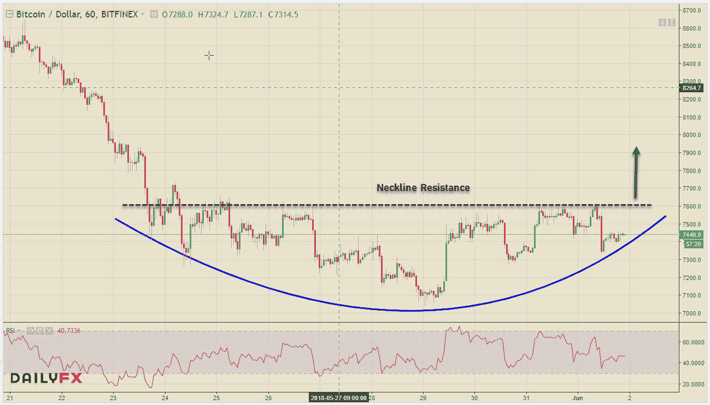
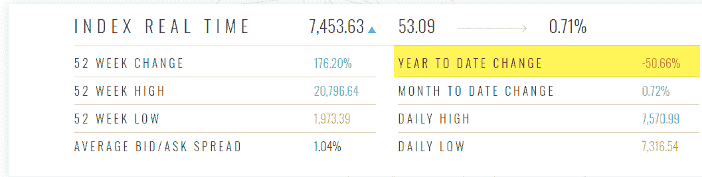
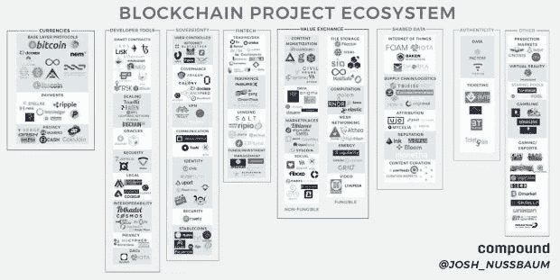
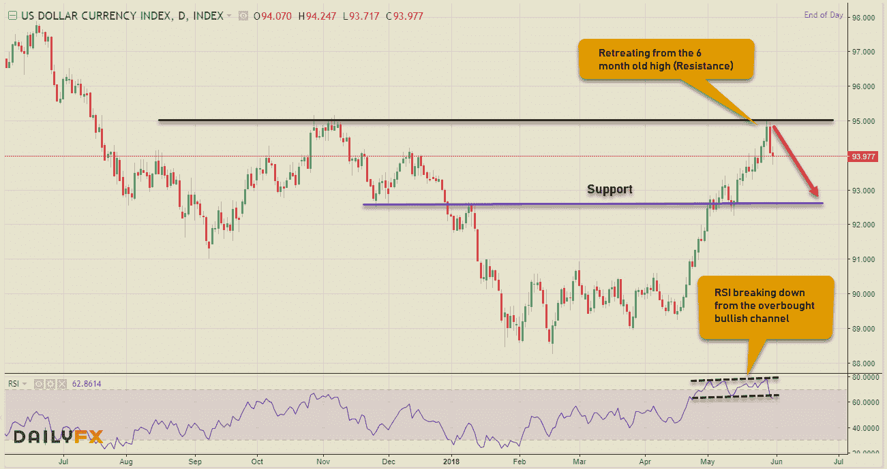
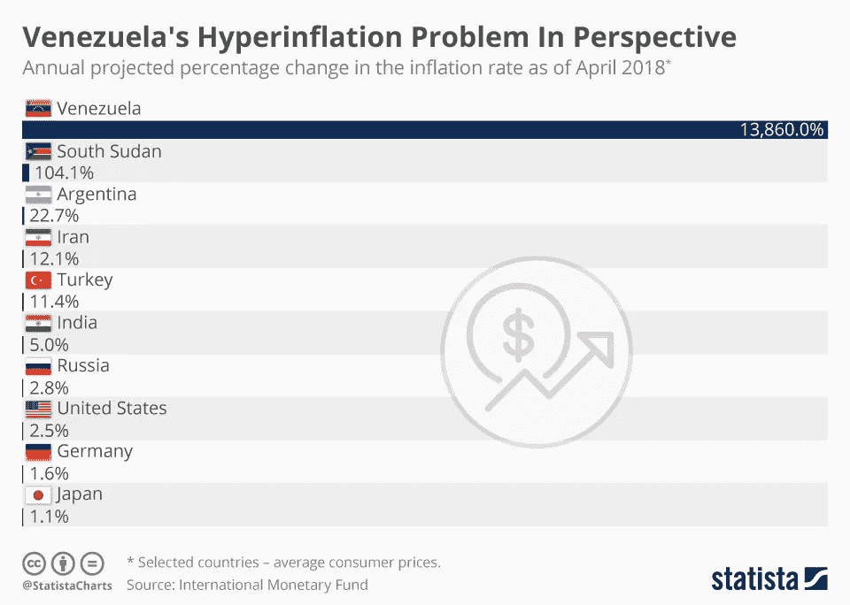
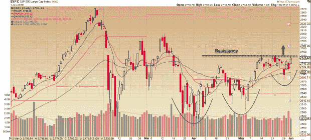
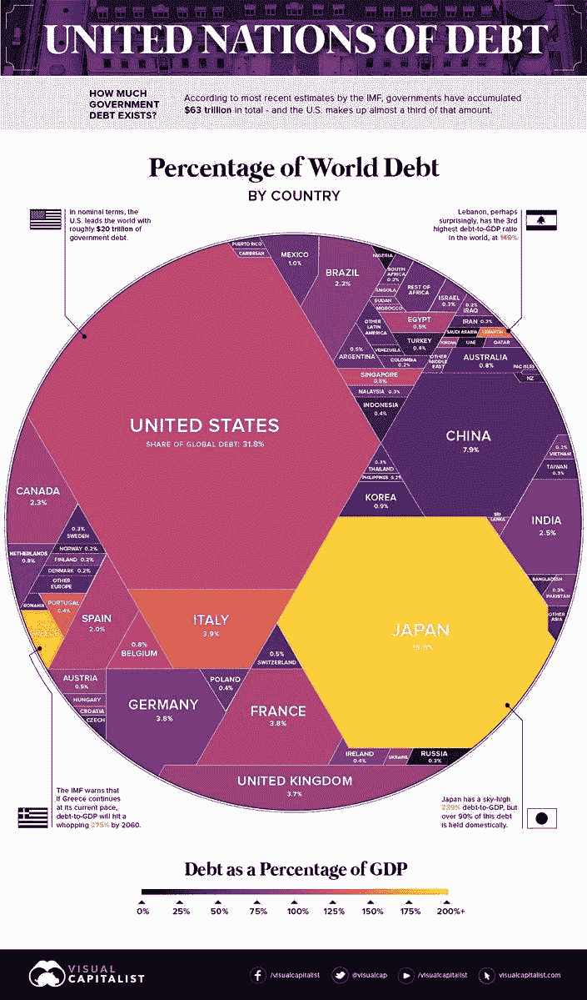
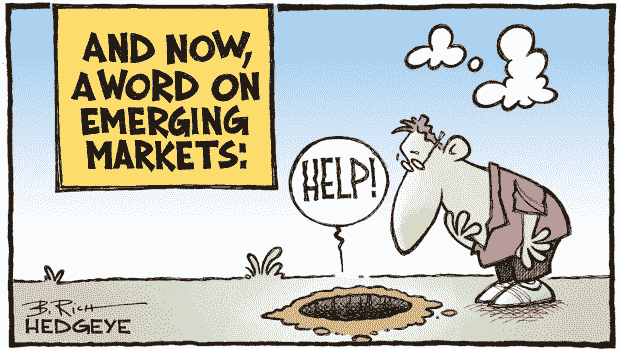

# 所有东西都是密码。外汇股票—2018 年 2 月 6 日

> 原文：<https://medium.datadriveninvestor.com/all-things-cryptos-forex-stocks-06-02-2018-weekly-roundup-830150af2fa0?source=collection_archive---------1----------------------->

当我回顾金融市场时，又到了一周的那个时候。加密货币在创下新低后仍然停滞不前，美国股市证明了其面对每一次抛售的弹性&美元本周对主要货币创下新高。让我们来分析一下金融市场的 3 个细分市场的信息&。

# 疯狂的密码诗

数字货币的困难时期似乎不会那么容易摆脱，特别是当国际货币基金组织这样的管理机构敦促各国央行与加密货币竞争时&你知道这个故事将走向何方——唯一的竞争方式是拿出自己的数字货币来取代法定货币，法定货币具有与 Alt 类似的功能。硬币。这并没有对密码的价格产生重大影响，因为它们已经在一个狭窄的价格区间内交易了一段时间，但这可能会对所有相关方产生长期影响。

随着波动性最近消退，我将在本周查看比特币的小时图。加密中枢似乎不断陷入 7600 美元以下的水平。这一颈线阻力需要被突破，BTC 才能在短期内向上突破 8000 美元。在撰写本文时，BTC 在隐写体中的主导地位是 38.6%。查看 CCI30 加密指数读数，它从上周的 7548.00 水平进一步下跌，但在撰写本文时，市值已改善至 333.23B。

让我们看看 Cryptoverse 中的一些头条新闻，主流采用和接受仍在继续:

*   **南韩**国会正式提议解除 ICO 禁令
*   **日本金融厅禁止私人加密货币**
*   加拿大银行数据失窃后，黑客要求赔偿 100 万美元
*   **Tron** 开始向自己的区块链过渡
*   IOTA 与挪威最大的金融集团合作，导致价格飙升
*   火币正在推出一种加密货币交易所交易基金

这里有一个很好的信息图，让你熟悉区块链生态系统

# 外汇市场

绿色反弹是整个星期的王者，它压制了它的对手，终于在周末开始暂停——这是否只是一个喘息或一个重大调整的开始仍有待观察。欧洲货币的持续疲软&新兴市场的问题帮助美元保持牛市。美国好于预期的非农就业数据给了它进一步的推动力。

对美元指数图的分析显示，调整可能最终会到来。DXY 已从 MT 阻力位 95.00 回落至收盘时的 93.97——超买 RSI 也已跌破 70 水平，指向 92.80 的修正弱势。短期来看，上涨看起来有点过度了。

本周美元主要货币是一个多事之秋，欧洲货币(欧元和英镑)分别跌至 1.1511 和 1.3208 的周新低，原因是欧洲疲软的经济数据和持续的地缘政治风险。最引人注目的走势是美元兑加元，在美国对铝和钢征收进口税的消息传出后，美元兑加元汇率暴跌至 1.2820，随后大幅反弹至 1.3000 的心理关口。这也将对北美自由贸易协定的重新谈判产生负面影响，目前看来，这一谈判几乎肯定会破裂。美国股市周五的反弹证明有助于美元兑日元从 108.15 的近期低点回升——更大的下跌趋势似乎仍未改变。在较大的下跌趋势中，澳元兑美元和新西兰元兑美元的大宗商品组合正在形成短期的建设性走势。

最后，这是委内瑞拉通货膨胀率超过 13000%的货币危机的信息图！考虑到土耳其里拉、巴西雷亚尔和阿根廷比索等新兴市场货币在过去一个月里大幅贬值，这是一个令人担忧的数据。

# 股票市场

从客观的角度来看，假期缩短的一周，美国股市简直就像坐过山车——跌 400，涨 300，跌 200，涨 200。本周早些时候的欧洲危机导致金融类股大规模抛售，并在第二天反弹。随着欧洲局势开始稳定，债券市场的平静也让股市恢复了一些理智。到目前为止，美国股市对每一次抛售都做出了巨大的弹性反应&税收减免等经济改革&废除 Dod-Frank 监管似乎效果不错，但随着美国对欧盟、加拿大&墨西哥征收金属关税，贸易战的担忧进一步膨胀。中美谈判已经处于不稳定的基础上&大多数受这些关税影响的国家立即采取了报复性措施。由于这些举措，北美自由贸易协定的重新谈判几乎肯定会走向失败。美国主要股指呈现了一幅相当复杂的每周画面， **DJIA(下跌 0.48%)** 下跌， **S & P 500 (+0.49%)** 设法保持了小幅的周涨幅，然而以科技股为主的纳斯达克指数 **(1.62%)** 继续表现出色。

标准普尔 500 图正在很好地形成，随着一系列更高的低点到位而向上移动。尽管 2740 的阻力仍然存在，需要克服才能确认顶部突破 2766.80。市场的波动仍然预示着未来的不稳定走势。引领美国市场的科技股继续跑赢大盘，给了投资者信心……至少目前是这样。在下面的信息图中，有些事情需要思考。

在我结束博客之前，有一条新闻:230 多只中国股票，即 a 股，终于被纳入摩根士丹利资本国际新兴市场指数(ETF: [EEM](https://email.seekingalpha.com/symbol/EEM/track?databaseid=&emailid=49058391&extra=&mailingid=20180601&messageid=wall_street_breakfast&serial=wall_street_breakfastO20180601.ed2b7d24f0d3d932ff2824337541a9ad.1527851753&type=click&userid=49058391&&&3000&&&https://seekingalpha.com/symbol/EEM?source=email_wsb&ifp=0) )，让普通美国投资者有更多机会投资 mainland China。最后，在结束之前……漫画中的新兴市场问题。

对加密货币、金融科技行业、突破性技术感兴趣，或者正在寻找加密货币、外汇或股票交易想法的人——关注我的[Twitter](https://twitter.com/trade_nut)&[StockTwits](https://stocktwits.com/trade_nut)。关于外汇&股票的实时信号，请关注我的[trade like](http://www.tradealike.com)应用程序(@ Fakd)

*原载于 2018 年 6 月 2 日*[*www.datadriveninvestor.com*](http://www.datadriveninvestor.com/2018/06/02/all-things-cryptos-forex-stocks%E2%80%8A-%E2%80%8A05-26-2018-weekly-roundup-2/)*。*