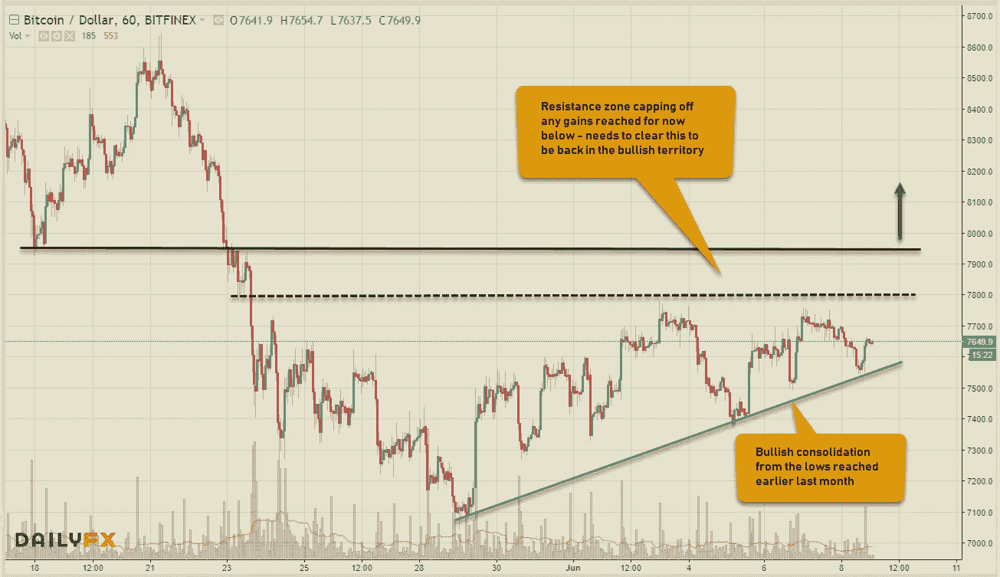
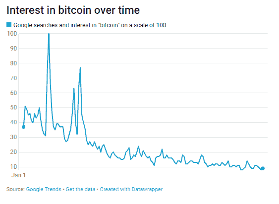
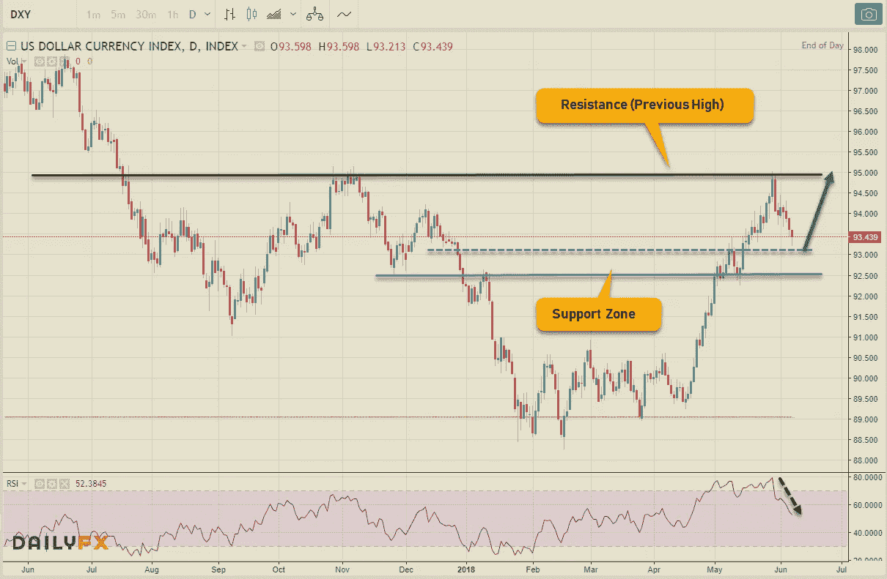
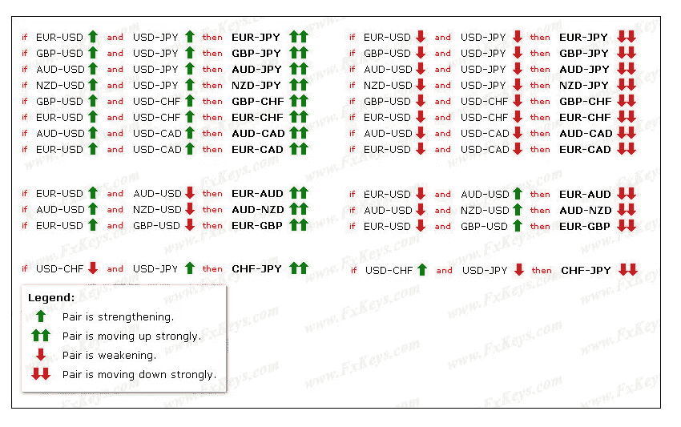
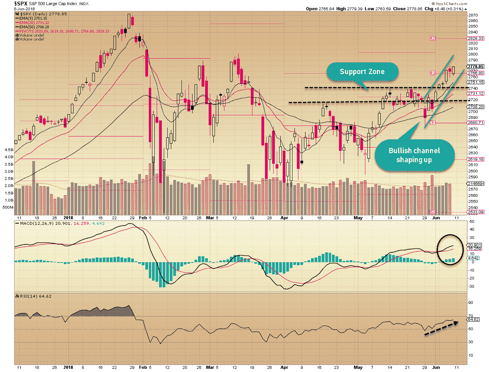
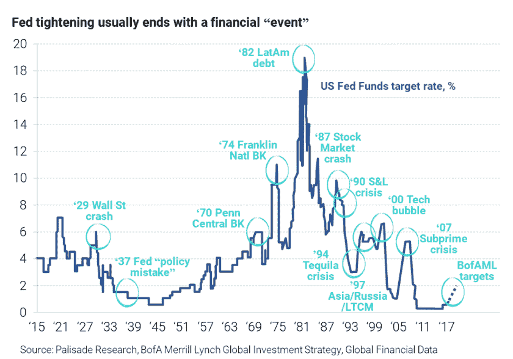
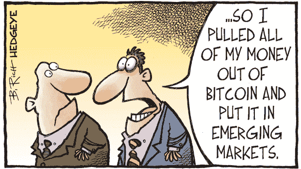

# 所有东西都是密码。外汇股票—2018 年 8 月 6 日

> 原文：<https://medium.datadriveninvestor.com/all-things-cryptos-forex-stocks-06-08-2018-weekly-roundup-ee44f1d409df?source=collection_archive---------9----------------------->

金融市场总是一个发生事情的地方，本周也不例外。但是没有什么比回顾一下这周的情况更让我开心的了。所以，在我继续享受我的周末之前，先简单回顾一下。尽管地缘政治风险，贸易战担忧&新兴市场的影响，美元处于纠正模式，股票强劲反弹&加密货币继续在当前的阻力水平上挣扎，但美国股市继续上涨。现在让我们再深入一点。

# 疯狂的密码诗

数字硬币被越来越多的人接受，但金融当局也需要解决围绕它们的灰色地带。诈骗、资产分类、监管等问题&最重要的是，它们要融入全球更广泛的金融体系，而不破坏整个体系。所有这些都需要时间&这可能是一个缓慢而痛苦的过程。与此同时，我们将继续监测隐密体的发展。我上周在 Cryptoverse 上看到的最有趣的新闻是关于一个名为 [**BlockBroker**](https://www.finder.com.au/blockbroker-5-star-rated-anti-ico-scam-ico-was-a-scam) 的项目，一个 5 星级的反 ICO 骗局平台，结果证明它本身就是一个骗局！事情会变得多么讽刺……所以在你因为追求听起来好得不真实的东西而挥霍掉你的金钱之前，保持警惕变得更加重要。事情最终会得到解决&你将能够分清好坏，并且仍然有时间投资&成为这场区块链革命的一部分。直到不再恐慌，成为 FOMO 团队的一员。

让我们来看看加密核心——比特币的小时价格图表。价格波动如此剧烈，以至于看日线图毫无意义，因为除了巨大的挤压和不断下降的成交量暗示可能从长期下跌趋势中反弹之外，你看不出任何东西。回到小时，7800 美元至 7950 美元的阻力区继续限制硬币的任何收益。这需要清理，以形成一个有意义的牛市趋势。然而，从上个月末低点开始的看涨趋势线仍然有效，这给了我们反弹的希望。让我的手指在这里交叉！在撰写本文时，加密硬币的总市值为 3425.1 亿美元，BTC 的市场份额为 38.2%。看看 [**CCI30 加密指数**](https://cci30.com/)——在撰写本文时，该指数位于 7684.65，MTD & YTD 均较上周有所改善。

以下是上周 Cryptoverse 的一些主要头条新闻:

*   引领美国密码交易所**比特币基地**拓展日本市场
*   Bitfinex 交易所在网络攻击中遭遇中断
*   **圈出**寻求美国 OCC 的联邦银行许可
*   **印度尼西亚**将加密货币作为商品进行监管
*   **泰国**试行央行数字货币进行银行间结算
*   **Ripple** 高管推出智能合约平台与以太坊竞争
*   EOS & TRON 在六月迁移到他们自己的 Mainnet 区块链平台

最后，用一个有趣的图表来说明人们对比特币的兴趣正在减弱，谷歌搜索量的下降就说明了这一点。想知道你的反应是什么呢？

# 外汇市场

最近，新兴市场货币受到美元飙升的严重打击，T2、巴西雷亚尔、阿根廷比索、土耳其里拉、南非兰特对强势美元面临巨大的抛售压力，这给这些新兴经济体带来了巨大的担忧，但让我们下次再讨论这个问题。从下面的美元指数图可以明显看出，美元对其他主要货币处于修正状态。下周是经济日历中繁忙的一周，三大央行( **FOMC、欧洲央行、日本央行**)将宣布利率决定。预计 FOMC 将加息，日本央行将保持不变，而欧洲央行开始逐步退出量化宽松。澳大利亚的就业数据也将公布。可以说，FOMC 目前的鹰派路线不仅会推动美元对主要货币的进一步升值，还会让新兴经济体的处境更加艰难。

正如预期的那样，美元指数最终掉头向下，朝着 92.50-93.20 的支撑区域调整，预计将在此保持并反弹。正如我上周末所说的，RSI 在形成一个负背离并确认了一个临时顶部之后开始下跌。大多数美元主要货币本周仍保持区间波动，新西兰元是商品货币中最强的，而欧元表现出一定的弹性，反弹收盘略低于 1.1800 水平。这里有一个不同外汇对之间的相关性的图表&它们如何相互交易。

# 股票市场

美国股市似乎没有受到所有地缘政治紧张局势、贸易战担忧的影响，新兴市场的困境稳步向前，缓解了对任何熊市开始的担忧——至少目前如此。可能只有两种情况——要么市场预计这些问题很快会得到解决，认为这是美国为了征服贸易伙伴而采取的施压策略，要么这将变成一些丑陋的事情。重要的一周即将到来，FOMC 利率决定&央行走向，美国消费者物价指数也将公布。不要忘记美国和朝鲜之间的重要会议也可能产生重大影响。对市场来说，这将是多事的一周。上周，这三个指数都取得了巨大的胜利——DJIA(2.77%)，标普 500 (1.62%)，纳斯达克(1.21%)

看看所有重要的 SPX 图表——很明显，上周的走势是从较高低点开始的看涨趋势的延续。正如我上周建议的，2766.80 美元的水平被轻松超越，前一个高点(阻力)已经成为指数向前发展的 st 支撑。只要 2720-2740 美元保持不变，我们应该期待这一趋势继续。MACD/信号线的背离和看涨的 RSI 也支持这个观点。以下是美国市场即将进行的一些 IPO:

**VRCA (06/15)、AVLR(06/15)、NEW(06/15)、ADIN(06/14)、USX(06/14)、CHRA(06/14)、FPACU(06/12)、MGTX(06/08)、YQ(06/08)**

下面这张有趣的图表显示了美联储是如何在一些重大金融事件后收紧货币政策的。你对此有什么看法？

以下是上周历史上一些有趣的事实( **#Investopedia** ):

> 1933 年 6 月 5 日:美国国会通过一项联合决议，取消债权人要求用黄金支付的权利。这项立法正式标志着美国脱离金本位制。
> 
> 1934 年 6 月 6 日:富兰克林·罗斯福总统签署《证券交易法》成为法律。1929 年股灾后，这一历史性的立法促进了更大的财务披露和透明度，也创造了证券交易委员会作为股票市场的监管机构。
> 
> 2010 年 6 月 7 日:苹果和 iPhone 4 的美好时光。史蒂夫·乔布斯发布了 iPhone 4，它的一些功能永远改变了我们的交流方式…比如 FaceTime！他的创造天才是无与伦比的，他对世界的影响将永远存在。

好了，终于到了总结的时候了，但我不会让你带着一本漫画去让你脸上露出笑容。祝大家周末愉快！

对加密货币、金融科技行业、突破性技术感兴趣或正在寻找加密货币、外汇或股票交易思路的人—关注我的[**Twitter**](https://twitter.com/trade_nut)&[**StockTwits**](https://stocktwits.com/trade_nut)。外汇&股票实时信号，关注我的[**trade alike**](http://www.tradealike.com)App(@ Fakd)

*原载于 2018 年 6 月 8 日*[*www.datadriveninvestor.com*](http://www.datadriveninvestor.com/2018/06/08/all-things-cryptos-forex-stocks%E2%80%8A-%E2%80%8A06-08-2018-weekly-roundup/)*。*