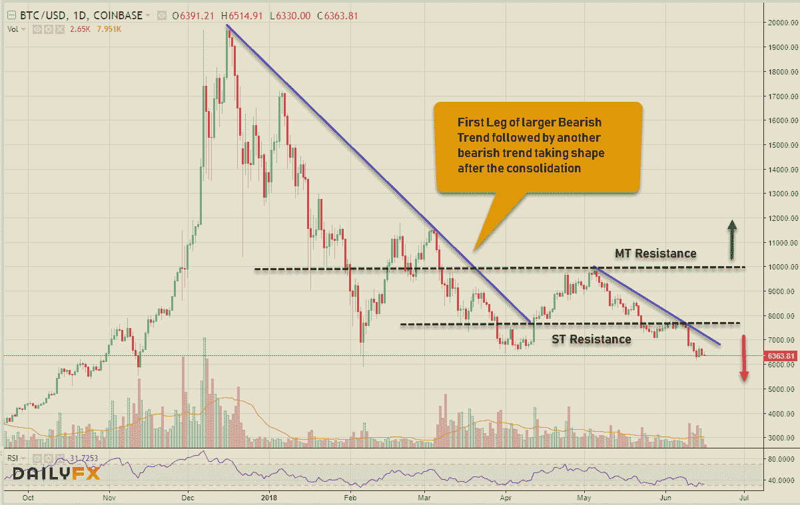
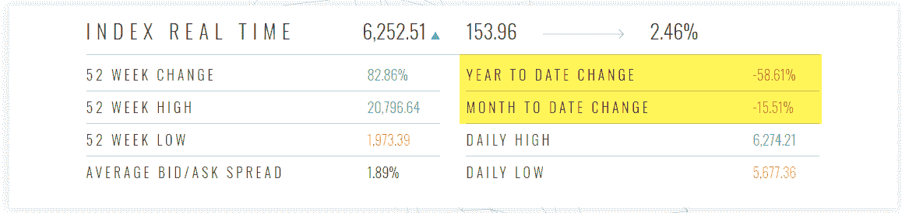
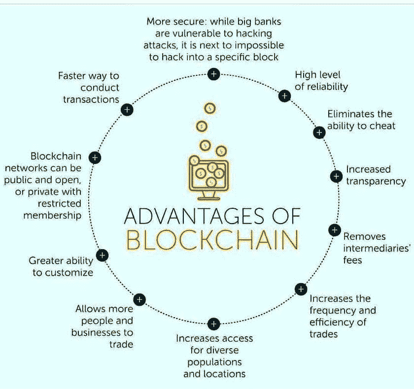
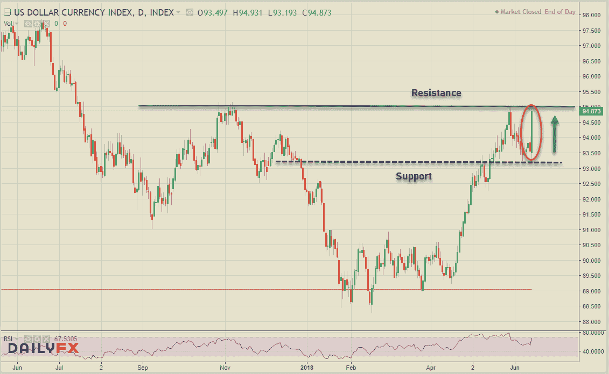
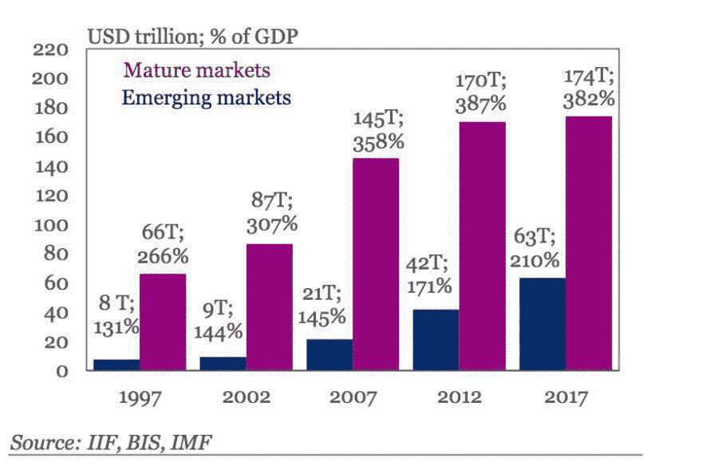
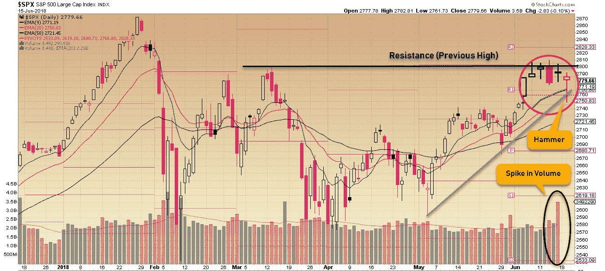
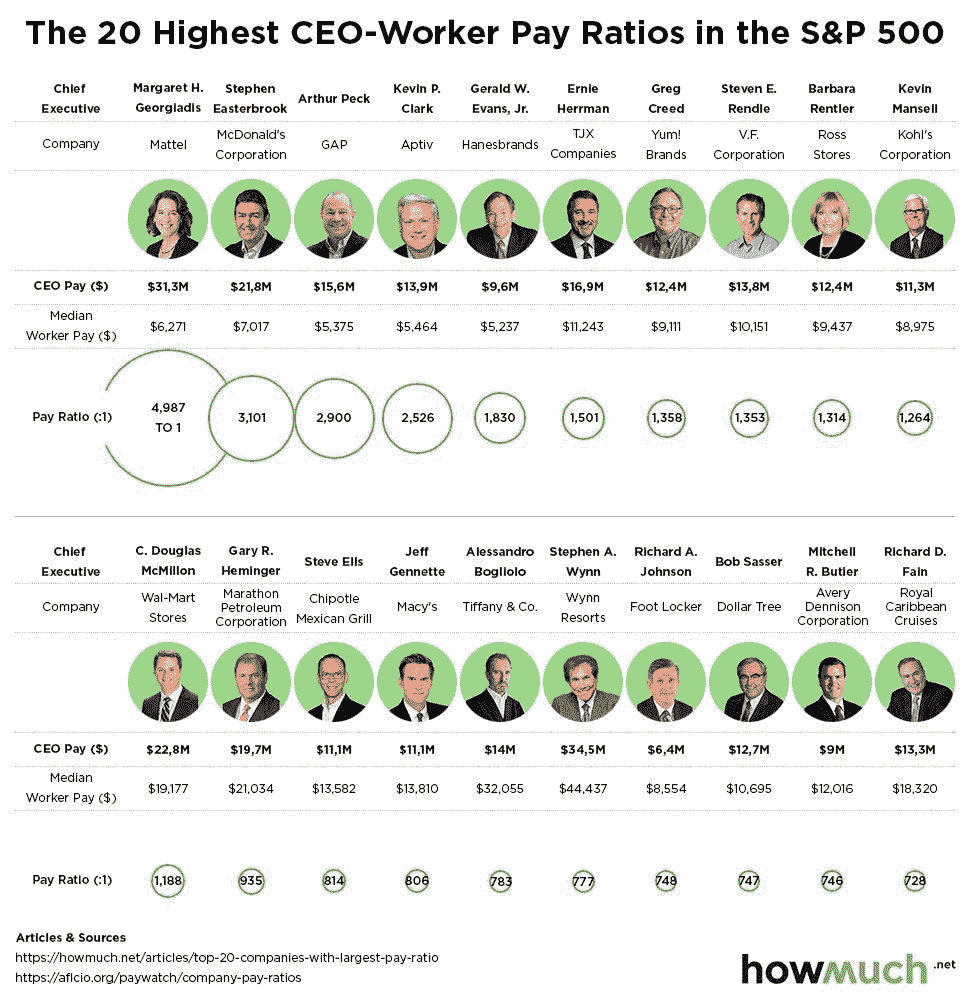
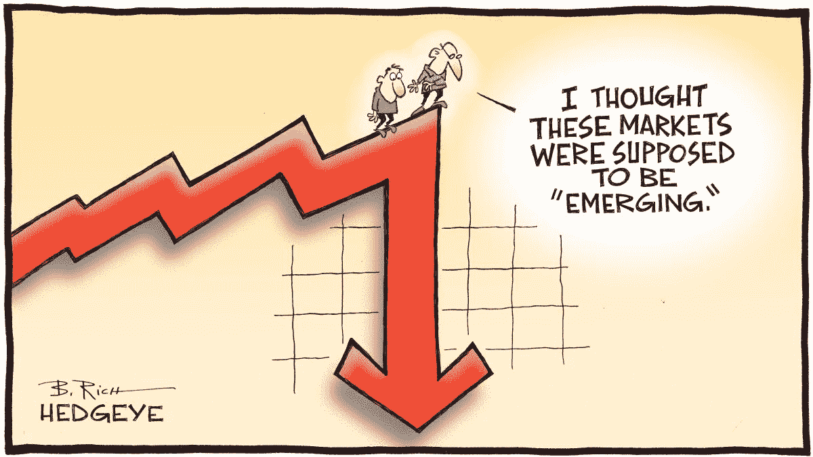

# 所有东西都是密码。外汇股票—2018 年 6 月 15 日

> 原文：<https://medium.datadriveninvestor.com/all-things-cryptos-forex-stocks-06-15-2018-435390cc80da?source=collection_archive---------1----------------------->

这是一个关于三个中央银行，进一步征收关税，紧张的七国集团会议的故事。快速回顾:美国股市在上周达到新高后仍未决定方向，美元主要在欧洲央行鸽派决定后暴跌&加密崩溃继续。现在让我们继续讨论事情的本质。

# 疯狂的密码诗

E 金融市场上非常重大的事件总是与某种外部事件的发生有关，最近始于上周日的数字硬币崩溃也不例外。规模较小的韩国交易所(Coinrail)的一次黑客攻击显然促成了这一举动，但如果你问我的话，加密硬币只是在完成最近的整合后开始了又一轮熊市。我将在接下来的比特币图表中展示如何操作，但首先，另一个令人震惊的新闻故事实际上已经流传了一段时间，那就是“价格操纵”，Bitfinex & Tether 被认为是主要的罪魁祸首。你可以在这里了解更多关于[的信息。](https://www.reuters.com/article/us-cryptocurrency-tether/cryptocurrency-tether-used-to-boost-bitcoin-prices-study-finds-idUSKBN1J92U0)

从谣言和媒体的狂热中走出来，让我们看看加密中心比特币的日线图。从图表中可以明显看出，它有明显的看跌势头。在第一次完成从第一次熊市趋势的反弹后，第二次熊市趋势看起来会随之而来。价格似乎在 7800 美元的阻力位下受到很好的限制，突破该阻力位将缓解抛售压力，但只需要令人信服地突破 10，000 美元的心理水平，就可以将偏见转向看涨。话虽如此，move 本周似乎并没有在短期内为数字硬币描绘出一幅美好的画面。查看 [**CCI30 加密指数**](https://cci30.com/) 该值从上周的 7684.65 跌至@ 6252.51，截至本文撰写之时，YTD 和 MTD 分别下跌 58.61%和 15.51%。此外，Cryptos 的市值从本周的 3421 亿美元大幅降至 2817 亿美元。

上周隐文节的一些主要头条新闻:

*   CFTC 传唤主要交易所提供交易数据
*   密码交易所**币安**将通过马尔他平台提供法定密码交易
*   **比特币基地**指数基金现已开放&同时宣布以太坊经典支持
*   推动区块链的新贸易组织在瑞士**成立**
*   美国**证券交易委员会**决定不将比特币&以太坊贴上证券标签

这是一张来自数字世界的有趣图片:

# 外汇市场

令人惊讶的是，OMC 上周没有加息，但随后欧洲央行的温和立场打破了美元指数的跌势，美元指数飙升，并在 24 小时内消除了近期高点的修正。美元这种不必要的强势给新兴市场货币带来了很大的麻烦。我们看到印度、土耳其和巴基斯坦加息，而泰铢和阿根廷比索兑美元汇率继续承压，因为新兴市场和发展中国家试图阻止本币兑美元汇率下跌。委内瑞拉酝酿重大货币危机，据该国反对派领导的国民议会称，截至 5 月 31 日的 12 个月内，物价上涨近 24，600%。

再来看美元指数，这是一次垂直上升，在一周结束时出现大幅飙升，并在一天之内达到顶峰。正如我上周在博客中所预期的那样，美元守住了支撑位的上限&从 93.20 水平反弹，本周接近前一阻力位 95.00。看到这种巨大的变化，看起来美元不会很快放弃目前的趋势，除非情绪回归有任何重大风险。

看看美元大联盟的单个走势，简直就是自由落体。欧元兑美元:300+点，美元兑加元:250+点，GBPUSD: 230+点，澳元兑美元:150+点——正如你所看到的，这只是一个美元走强的故事。由于对欧元区经济放缓的担忧日益加剧，加上疲弱的数据，欧元继续走弱。美元兑加元最近出现在美国和加拿大政府之间关于七国集团辐射和北美自由贸易协定担忧的争吵中，似乎这对货币将是一个多事之秋。看看不同市场的债务水平——尽管看起来新兴市场比发达经济体表现得更好，但我想知道货币危机会对这些数字产生什么影响。

# 股票市场

股票市场不得不消化上周的一些消息，本周初，七国集团(G7)进行了一场极其不愉快的讨论，保护主义浪潮似乎正在爆发。本周结束时，美国对中国商品再征收价值 500 亿美元的关税，并准备再征收 1000 亿美元的关税，以进一步施加压力。当然，中国几乎立即对美国商品征收 340 亿美元的关税进行报复。不知道这场猫&鼠游戏谁先认输。在我继续进行技术分析之前，这里有一个我偶然发现的有趣的统计数据:

> 世界杯热可能会导致市场低迷。欧洲央行和荷兰央行对 15 家全球股票交易所的分析发现，奥运会期间，交易量比正常水平下降了约 33%。研究还发现，当一家交易所所在国家的国家队比赛时，交易量中位数比正常水平低 55%。

对美国市场来说，这是不确定的一周，但他们摆脱了大多数坏消息，仍然保持乐观。周五关税消息有点刺激，但股市在接近尾声时反弹；用一把漂亮的锤子结束，如图所示——看起来也很有建设性，体积也很大。在 2800 点区域有一个很大的阻力，这个阻力将扫清所有历史高点的路径，正如上面的标准普尔 500 图表所显示的。科技板块继续一枝独秀，超越整体市场。上周，所有三个指数都显示出不同的数据——T2 DJIA(-0.89%)，标准普尔 500 指数(0.02%)，纳斯达克(1.32%)。

上周一些新闻人物:

*   **荷兰金融科技公司 Adyen (ADYEN)的股票在阿姆斯特丹开盘时飙升了 100%以上，这是近年来欧洲最大的科技 IPO 之一。Adyen 是一家支付处理公司，与包括网飞(纳斯达克股票代码:NFLX)、脸书(纳斯达克股票代码:FB)和 Spotify(纽约证券交易所股票代码:现货)在内的客户合作，但也销售实体店的销售点系统。**
*   这是汽车制造商在全球打车领域有史以来最大的一笔投资。丰田(NYSE:TM)正在向东南亚的 Grab 注入$1B，因为首席执行官丰田章男试图抵御自动驾驶和共享汽车的风险。
*   20 国集团能源部长聚集在阿根廷南部，形成一份关于能源和气候相关目标的公报，该公报将在 11 月举行的下一次会议前提交给 20 国集团首脑。

这里有一张关于薪酬最高的首席执行官的信息图，你可能会感兴趣:

**本周预计定价的 IPO 名单:**6 月 19 日 Eidos Therapeutics(EIDX)；6 月 20 日的 essential Properties Realty Trust(EPRT)、Aptinyx (APTX)、Avrobio (AVRO)、I3 Verticals (IIIV)、Xeris Pharmaceuticals (XERS)、ElectoCore (ECOR)、Magenta Therapeutics (MGTA)、Kezar Life Sciences(KZR)；Autolus Therapeutics (AUTL)和 DERMAdoctor (DDOC)在 6 月 21 日。

最后，上周有一个有趣的历史事实(#Investopedia):

> 2016 年 6 月 13 日:@微软宣布以每股 196 美元收购 LinkedIn 的 262 亿美元交易。这标志着微软 43 年历史上最大的收购。随着最近对 GitHub 的收购，微软现在拥有了两个最强大的网络平台。

以防你还没看过我最近关于[**fin tech**](https://medium.com/datadriveninvestor/evolution-of-fintech-a-timeline-a7d4e1d5d9cd)&[**Crypto coin EOS**](https://medium.com/datadriveninvestor/eos-new-superstar-of-the-crypto-elite-club-bf6dc2581480)**——点击&阅读即可。**

****

**对加密货币、金融科技行业、突破性技术感兴趣或正在寻找加密货币、外汇或股票交易想法的人—关注我的[**Twitter**](https://twitter.com/trade_nut)&[**StockTwits**](https://stocktwits.com/trade_nut)。外汇&股票实时信号，关注我的[**trade alike**](http://www.tradealike.com)App(@ Fakd)**

****

***原载于 2018 年 6 月 16 日*[*datadriveninvestor.com*](http://datadriveninvestor.com/dev/2018/06/16/all-things-cryptos-forex-stocks%E2%80%8A-%E2%80%8A06-15-2018/)*。***