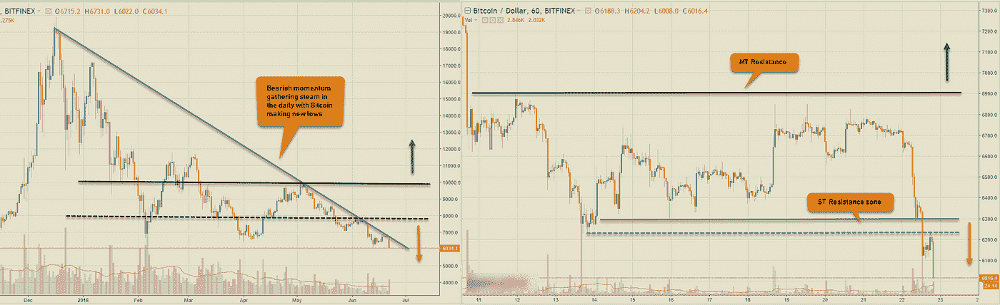
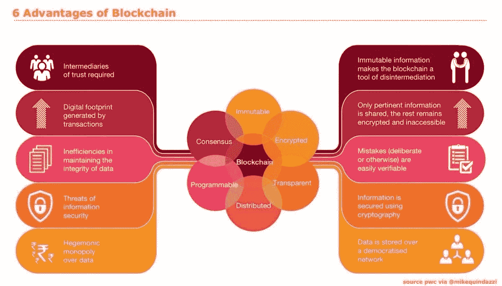
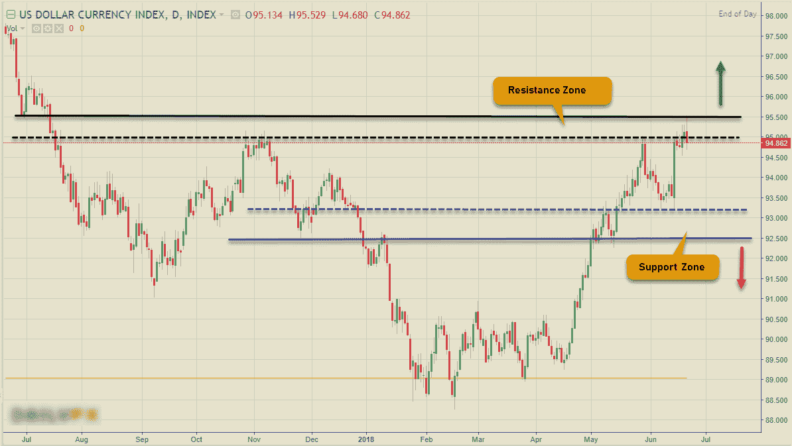
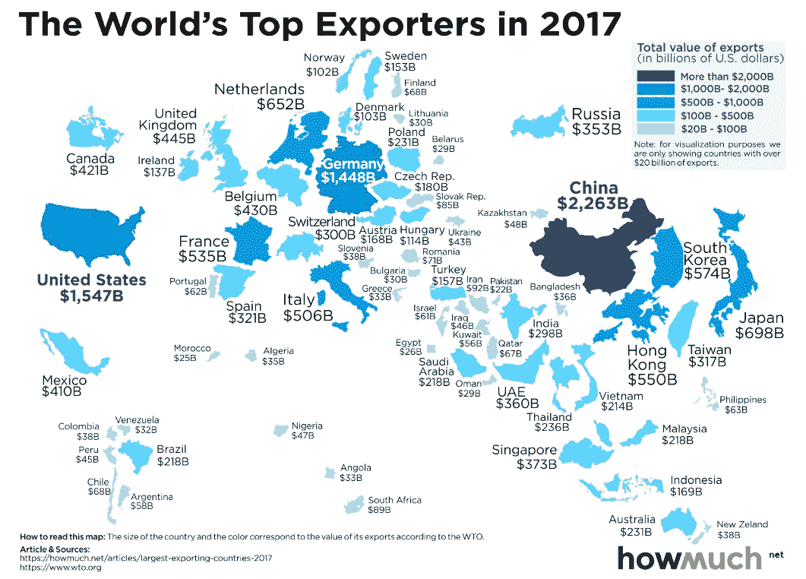
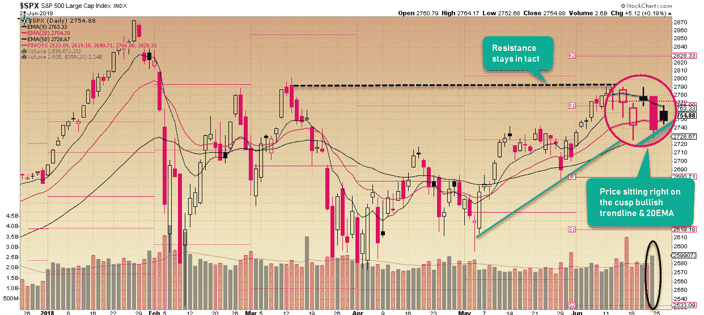
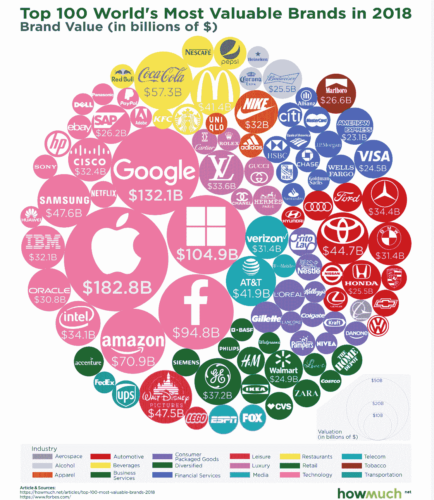
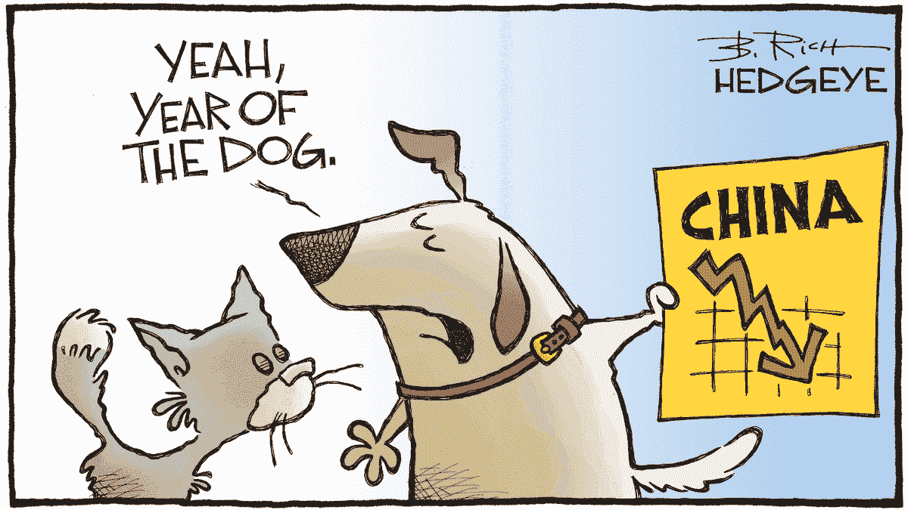

# 所有东西都是密码。外汇股票—2018 年 6 月 22 日

> 原文：<https://medium.datadriveninvestor.com/all-things-cryptos-forex-stocks-06-22-2018-947107b971bb?source=collection_archive---------3----------------------->

星期天的下午到来了，无数的事情闪过我的脑海，我需要在我的每周博客上谈论。总之，全球股市正感受到美国与其贸易伙伴之间不断升级的关税战带来的紧张情绪，Cryptos 已经恢复了下一轮下跌，任何反弹或反弹的希望目前都已破灭。而美元在外汇市场的反弹势头终于在本周结束时得到了喘息。

# 疯狂的密码诗

T 在我开始写这篇文章的时候，随着比特币创下新低，至少可以说数字货币正处于可怕的困境中。最大的新闻是另一起发生在第六大数字交易所 Bithumb(另一家韩国交易所)的密码盗窃案，黑客带走了价值 3100 万美元的赏金。我不知道这些黑客攻击是否对密码的价格有任何直接影响，但不断的攻击确实让他们周围的普遍情绪陷入困境。在我写这篇文章的时候，比特币的价格刚刚跌破 6000 美元大关，并拖累了其他所有价格。硬币就像纸牌搭的房子。

我必须把日线图和小时图放在一起，才能对我们最近看到的价格下跌有一个清晰的认识。从技术上讲，看跌势头已经加快。现在看起来这是一个相当大的滑坡，直接阻力位于 6220-6300 美元区域，需要克服这一阻力才能将偏见转向中性区域。只有升至 6900 美元上方，才是熊市暂停的信号。每天你可以看到$8000 和$10000 可以被指定为 MT & LT 游戏改变者。 [**CCI30 加密指数**](https://cci30.com/) 值从上周的 6252.51 跌至@ 5396.40，截至本文撰写之时，YTD 和 MTD 分别下跌 64.28%和 27.08%。此外，Cryptos 的市值继续下降，从上周的 2817 亿美元降至本周的 2531 亿美元，BTC 的主导地位飙升至 41%。

这是一天中需要消化的大量坏消息。让我们来看看本周的一些好消息:

*   **以太坊**准备**卡斯珀** &分片升级
*   **BitTorrent** 以 1.4 亿澳元现金出售给加密货币初创公司 **Tron** 的创始人 Justin Sun
*   **阿姆斯特丹**史基浦机场安装欧洲首个机场**比特币 ATM**
*   总部位于英国的加密期货交易所 Crypto Facilities 正在推出**莱特币(LTC)衍生品**
*   **巴西**央行为监管机构推出区块链数据交换平台
*   **Stellar** 在 XLM 商谈以 5 亿美元收购区块链初创公司 chain

# 外汇市场

本周的标志是美元的进一步走强，紧接着在接近周末时出现了一波反弹。总的来说，强势美元占主导地位的看涨趋势仍在持续，但技术性反弹似乎正在形成。新兴市场货币兑美元汇率仍面临压力。下周将公布一些关键数据，包括周三的 RBNZ 利率报告，周四的德国 CPI &美国 GDP&德国就业和加拿大 GDP 数据。

看看美元指数(DXY)——在回落至阻力区 95.50–95.53 下方之前，它已经创出新高@ 95.53。考虑到指数的最后一次反转发生在这个水平，这可能是一个很难通过的阻力。然而，目前只要支撑区域 92.50-93.20 保持不变，市场就有望上涨。随着全球股市的避险情绪，流向避险资产美元的资金将继续推动其需求。

最令人印象深刻的反弹来自英镑(GBPUSD)，在本周早些时候创下 1.3102 的新低后，英镑得以回升至略高于 1.3300。这一反弹当然是紧随英国央行的鹰派利率政策之后。这次反弹可能会有更多的空间，但更大的熊市趋势保持不变。过去几周，另一个主要因素是美元兑加元。上周五，加拿大公布的 CPI 数据偏软，一度触及 1.3379 的高点，但在收盘前迅速回吐涨幅。该货币对的超买状态将会在下周出现调整。然而，基本面和技术面都指向 MT 看涨趋势的延续。

# 股票市场

受美国征收关税引发全面贸易战的影响，中国股市在过去一个月暴跌 10%以上，导致全球股市承压。随着上证综指跌至两年低点，中国央行向金融系统注入了 370 亿美元，以确保流动性。欧盟、中国&印度已经对美国产品征收反关税进行报复，称在美国决定这样做后，他们别无选择。

美国股市整个星期都受到消息驱动的走势的压力，但周五打破了连续 8 天的跌势。唯一的一线希望是纳斯达克指数创下历史新高。分析标准普尔 500 指数，看涨趋势正好位于 20 均线&看涨趋势线的尖端，还没有敲响警钟，但任何令人信服的从这一点和 2740 支撑区域的交汇处向下移动都会引发更大的调整。看看上周全球主要指数的表现:

**美国——DJIA(-2.03%)，标普& P500 (-0.89%)，纳斯达克(-0.69%)，**

**欧洲——富时 100 指数上涨 0.63%，德国 DAX 指数下跌 3.31%，CAC 40 指数下跌 2.08%**

**亚洲——日经 225 指数(-1.47%)，BSE Sensex 指数(+0.19%)，上证综指(-4.37%)**

以下是上周的主要新闻人物:

*   **多伦多证券交易所(TSX)** 即将开始交易新的区块链 ETF。
*   阿根廷和沙特阿拉伯昨天被列入摩根士丹利资本国际公司的新兴市场。
*   **沃尔格林博姿联盟** (WBA)正在加入道琼斯工业平均指数(DJIA)，取代**通用电气** (GE)，它是 1896 年的原始会员，自 1907 年以来一直是会员——在过去 12 个月下跌 55%，年初至今超过 25%
*   近两年来世界上最大的 IPO 中国智能手机制造商小米已经开始接受即将上市的订单，其目标是筹集 61 亿美元，总估值为 543 亿美元，如果行使 15%的“绿鞋”，则高达 703 亿美元。

这里有一个有趣的事实，发生在历史的最后一周。

> 2003 年 6 月 20 日:通用汽车宣布发售 100 亿美元债券。它是为了弥补该公司资金不足的养老金负债。金融危机前的几年导致了 09 年的破产申请。后来它出现了，并策划了一次复出。

最后，给事情添加一点喜剧色彩…祝大家交易愉快！

有兴趣的话可以链接到我上两篇文章: [**银行爱区块链却讨厌加密货币**](https://medium.com/datadriveninvestor/banks-love-blockchain-but-hate-cryptocurrencies-10ad2a85c98e)**&**[**一刀切的交易策略？**](https://medium.com/datadriveninvestor/one-size-fits-all-trading-strategy-c8c2d7954740)

**保持联系:** [推特](https://twitter.com/fklivestolearn) **|** [**斯托克斯**](https://stocktwits.com/trade_nut) **|** [**领英**](https://www.linkedin.com/in/faisal-khan-2a3009b/)|**|**[**trade alike**](http://www.tradealike.com/)**|**[**脸书**](https://www.facebook.com/cryptos.forex.stocks/)

*原载于 2018 年 6 月 23 日*[*datadriveninvestor.com*](http://datadriveninvestor.com/dev/2018/06/23/all-things-cryptos-forex-stocks%E2%80%8A-%E2%80%8A06-22-2018/)*。*