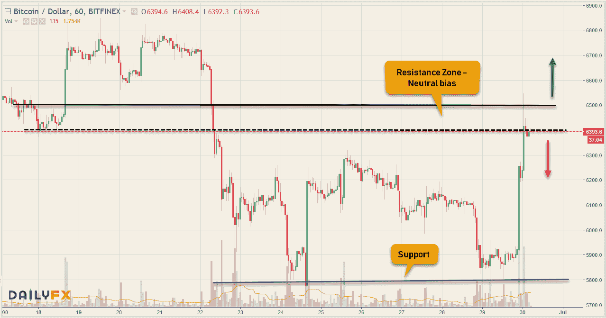
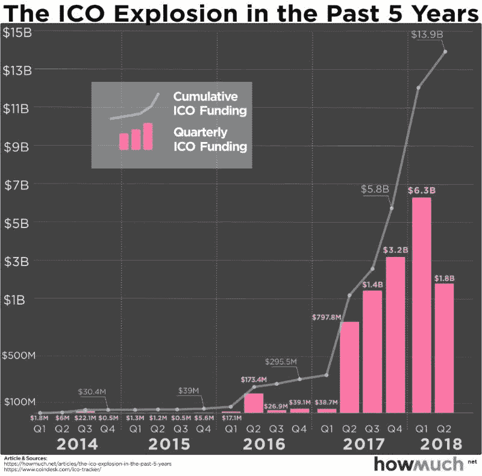
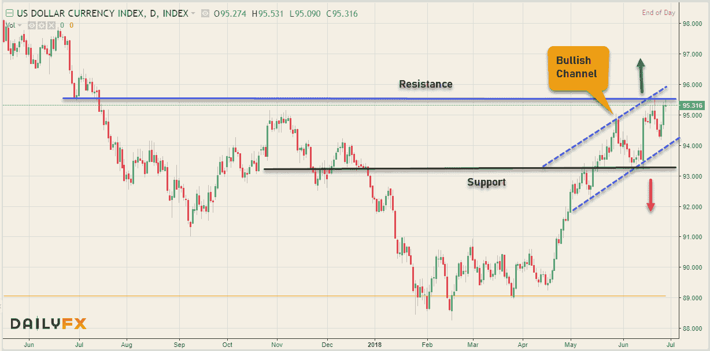
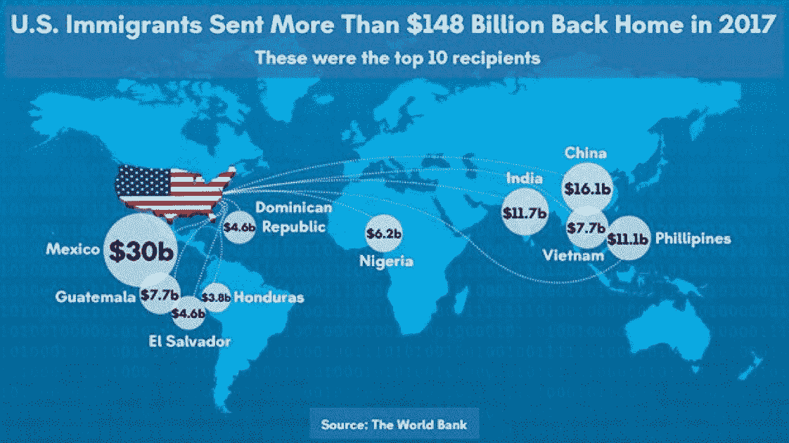
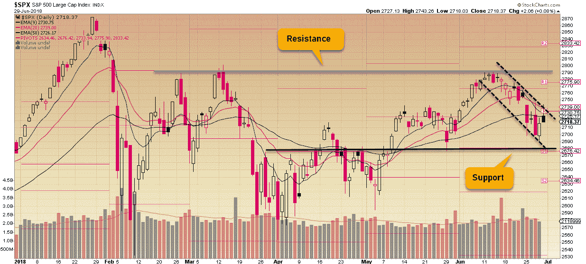
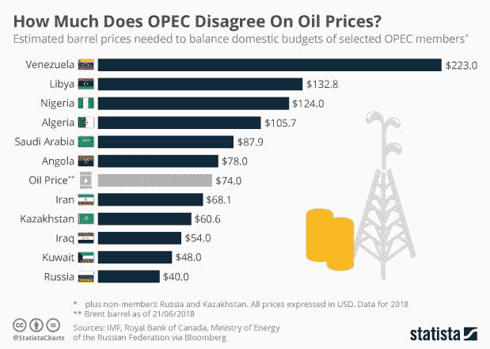
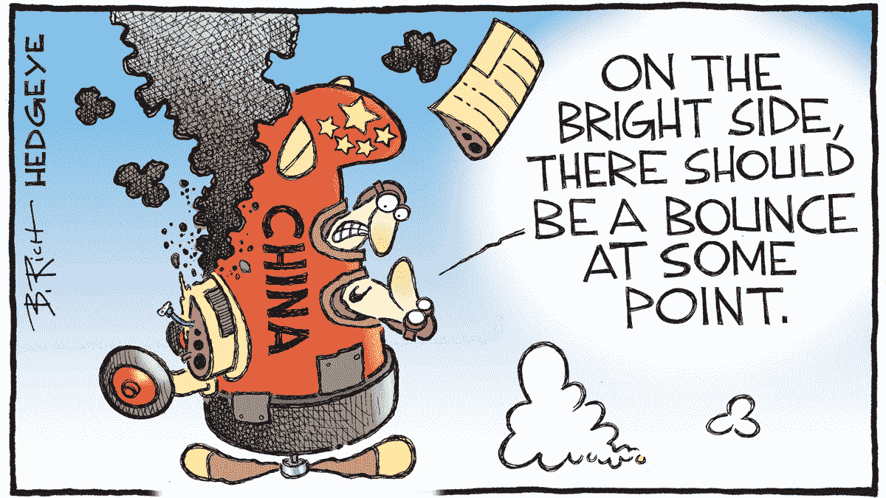

# 所有东西都是密码。外汇股票—2018 年 6 月 29 日

> 原文：<https://medium.datadriveninvestor.com/all-things-cryptos-forex-stocks-06-29-2018-aed83f573e02?source=collection_archive---------5----------------------->

每周的这个时候，我会看过去一周所有的笔记，试着去理解它们，更重要的是让你理解它们。在我继续前进之前，有一个简短的说明——刚刚成立了一个名为 [**Cryptos 的新电报组。外汇股票**](https://t.me/joinchat/IWzyHBGWCFwPQTe8Tm5H_Q) 如果你对这些话题有任何疑问，可以通过这个链接加入。继续今天的商业秩序…密码继续走软，股票显示出疲软的迹象，而美元从牛市中得到喘息。

# 疯狂的密码诗

数字硬币仍然疲软&整个星期都处于压力之下，大多数人担心在真正触底之前会进一步下跌。坏消息是技术图片仍然看跌，然而在撰写本文时，比特币和替代币出现反弹——反弹的可持续性如何可能在未来几天内知晓。BTC 从 5800 美元的重要技术支撑位反弹到 6500 美元表明 cryptos 可能正在寻找底部——时间会再次证明事实是否如此。6 月是 Cryptos 的一个重要里程碑，有相当多的 Mainnets 上线了——你可以在我最近的文章 [**中读到关于它的所有内容。**](https://medium.com/datadriveninvestor/mainnets-the-new-revolution-in-cryptos-3467238bc2e4)

查看上面的比特币小时图，你可以看到我之前提到的显著反弹，加密中心已经落在中性偏置阻力区(6300 美元至 6500 美元)。令人信服地清理这一区域将是见底的第一个迹象，然而这里的拒绝可能会延长空头盘整，但只要没有突破 5800 美元的支撑，价格将保持支撑。 [**CCI30 加密指数**](https://cci30.com/) 值从上周的 5396.40 跌至@ 5334.69，截至本文撰写之时，YTD 和 MTD 分别下跌 64.70%和 27.94%。然而，加密技术的市值从上周的 2531 亿美元小幅上升至本周的 2568 亿美元，BTC 的主导地位攀升至 42.7%

是时候告诉你一点上周在隐文世界中重要的事情了:

*   创庆祝它在 06/25 从以太坊独立出来，搬到创世街区
*   **阿里巴巴**分公司向菲国尝试首笔区块链汇款，计划全球扩张
*   脸书允许再次宣传加密货币，同时继续禁止推广 ico 和二元期权
*   **Zcash** 成功激活 ZEC 首支硬裆“越冬”
*   **塔塔图**主办世界第三大 ICO，收入超过 5 亿美元
*   **币安**在乌干达推出首个菲亚特加密交易所
*   **火币**携手京东云探索区块链技术应用

通过这张信息图，看看 ico 在过去 5 年中的指数增长

# 外汇市场

金融界流动性最强的市场见证了美元与其对手之间的拉锯战，主要市场正在形成技术性反弹。下周是经济日历上的重要一周，将有一系列经济数据出炉。最重要的将是 FOMC 会议记录，NFP 公布美国贸易平衡，加拿大就业数据，澳洲联储现金利率决定。不用说，我们将会看到美元交叉盘的波动。

查看美元指数图表，93.20 水平继续提供一个强有力的支持，并在此水平反弹。一个看涨通道正在形成，该指数站在 95.53 的前期高点下方，穿透该高点的目标是 96.30。这里的拒绝将延长盘整，但只要支撑和看涨趋势线的汇合点保持不变，价格水平将保持上行的建设性。欧元兑美元出现了明显的波动，从 1.1527 的低点反弹，以 1.1682 收盘，而 GBPUSD 从 1.3055 的低点反弹，以 1.3200 收盘。美元兑加元在本周持续波动后，似乎终于在雕刻一个临时顶部，在早些时候触及 1.3385 的高点后收于 1.3132。

下面的信息图显示了美国移民汇往祖国的最大一笔外汇汇款:

外汇市场的一些新闻人物来结束这一部分:

*   新兴市场货币的跌势仍在继续，印度卢比兑美元汇率跌至历史最低点
*   人民币暴跌引发了人们对中国经济的担忧，因为在与美国的贸易战中，政策制定者似乎不太愿意阻止人民币下跌。人民币兑美元汇率跌至六个月来的新低，因为央行允许人民币出现自 2017 年 1 月以来最大的单日跌幅。
*   伊朗正计划建立一个外汇二级市场，以帮助解决美元短缺问题。美元短缺已经损害了贸易，而且随着美国制裁的恢复，这一问题可能会恶化。根据伊朗中央银行行长 Valiollah Seif 的说法，该市场将允许非石油商品出口商将其外汇收入出售给消费品进口商。

# 股票市场

由于对贸易紧张局势的担忧日益加剧，全球股市继续暴跌，而美国股市在希望与绝望之间摇摆不定，周五以积极的基调收盘，但出现了周跌幅。虽然美国政府试图淡化贸易紧张局势，但投资者的情绪充其量只会继续紧张。欧盟、中国、加拿大都以反关税措施回应美国的冲击。当然，这对全球经济来说不是一个好兆头，全球经济已经因中国经济放缓而摇摇欲坠，中国股市从 1 月份的高点下跌了 20%以上，从而正式进入熊市。

看看标准普尔 500 指数，我们上周看到的看涨趋势线已经屈服于向下的修正运动，熊市通道正在形成。更大范围的 2680(支撑)& 2790(阻力)已经到位。如果这个支撑位坍塌，从今年 4 月开始的整个反弹看起来将受到威胁，但是反弹可能会在这个范围内延续盘整。看看全球主要指数的每周数据，全都亮起了红灯:

**美国——DJIA(-1.26%)，标准普尔& P500 (-1.33%)，纳斯达克(-2.37%)，**

**欧洲——富时 100 指数下跌 0.59%，德国 DAX 指数下跌 2.18%，CAC 40 指数下跌 1.19%**

**亚洲——日经 225 指数(-0.94%)，BSE Sensex 指数(-0.75%)，上海 50 指数(-4.02%)**

下面的信息图向你展示了为什么石油输出国组织成员从不在油价上达成一致

以下是上周股市的重要事件:

*   **中国最大的比特币(BTC)矿用硬件制造商之一的亿邦通信**，已于今日 6 月 25 日向香港交易所(港交所)提交首次公开募股(IPO)申请。
*   **Copart** 将在 7 月 2 日公开赛之前加入 S & P 500。这家在线拍卖和汽车营销服务提供商将取代 Pepper Snapple 博士，后者正在与 Keurig Green Mountain 合并，交易完成后将不再有资格被纳入标准普尔 500 指数。
*   根据标准普尔全球的数据，美国公司的债务负担已经达到创纪录的 6.3 万亿美元，因为华尔街投资者准备迎接更严格的利率环境，尽管现金囤积达到了顶峰。好消息是，美国公司有创纪录的 2.1 万亿美元现金来偿还债务，但大部分现金掌握在少数几家大公司手中。
*   BJ 的批发俱乐部将其 IPO 定价为每股 17 美元，这是此前表示的 15-17 美元区间的上限。虽然该公司表示，它出售了 3750 万股股票，净收益为 6.375 亿美元，发行在外的股票为 1.263 亿股，但这家仓储俱乐部连锁店的估值为 215 亿美元。BJ 的竞争对手是好市多(纳斯达克股票代码:COST)和沃尔玛(WMT)，该公司周四开始在纽约证券交易所交易，股票代码为“BJ”

最后，给你讲几个上周历史上的趣事( **#Investopedia** ):

> 1871 年 6 月 27 日:新货币法案确立日元为日本官方货币，效仿欧洲体系，实现经济现代化。它是由明治维新带来的，在明治维新中，德川幕府被赶走以使日本现代化。
> 
> 1934 年 6 月 26 日:美国总统富兰克林·罗斯福签署了联邦信用合作社法案，旨在通过一个全国性的合作和非营利信用合作社系统提供信贷。

是时候用这幅描绘中国灾难的漫画结束了。交易愉快！

保持联系:[Twitter](https://twitter.com/fklivestolearn)|[StockTwits](https://stocktwits.com/trade_nut)|[LinkedIn](https://www.linkedin.com/in/faisal-khan-2a3009b/)|[Telegram](https://t.me/joinchat/IWzyHBGWCFwPQTe8Tm5H_Q)|[trade alike](http://www.tradealike.com/)

*原载于 2018 年 6 月 30 日*[*www.datadriveninvestor.com*](http://www.datadriveninvestor.com/2018/06/30/all-things-cryptos-forex-stocks%e2%80%8a-%e2%80%8a06-29-2018/)*。*

