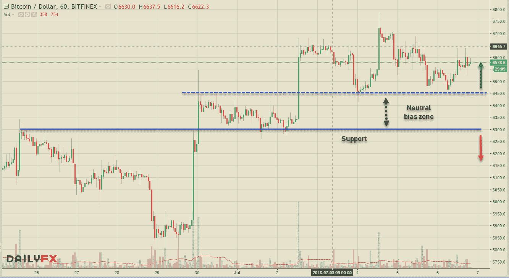
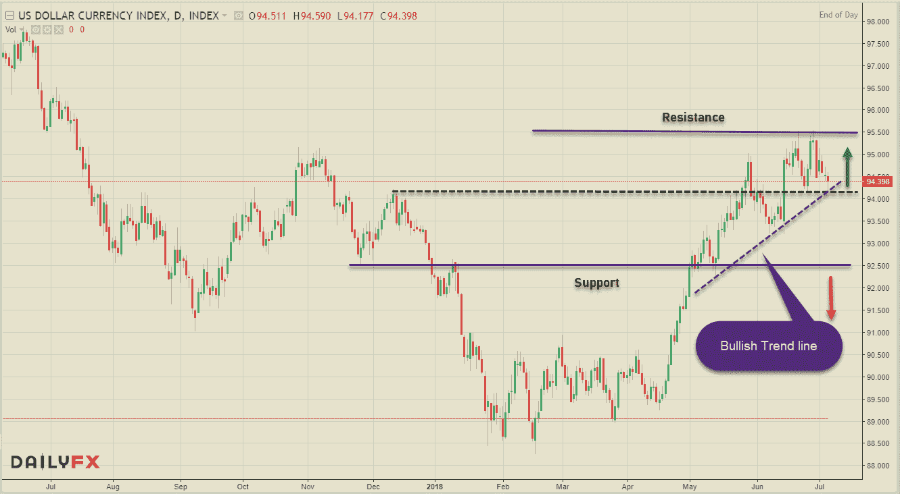
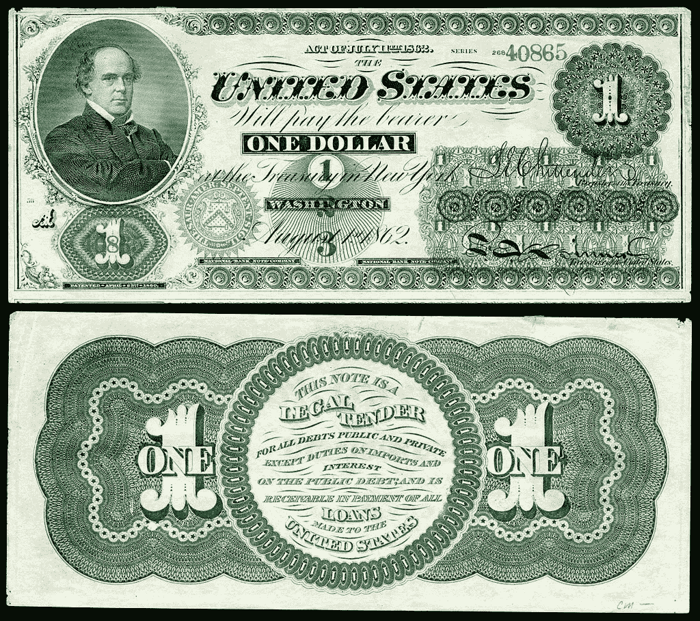
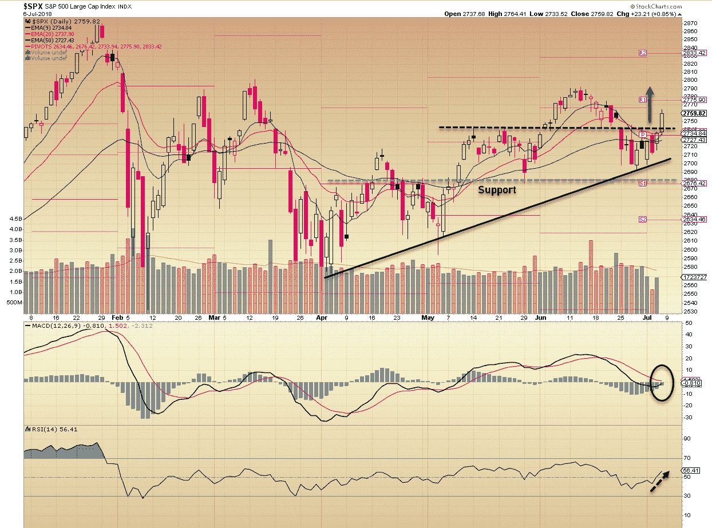
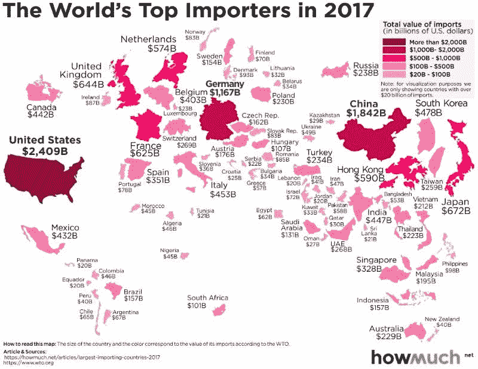
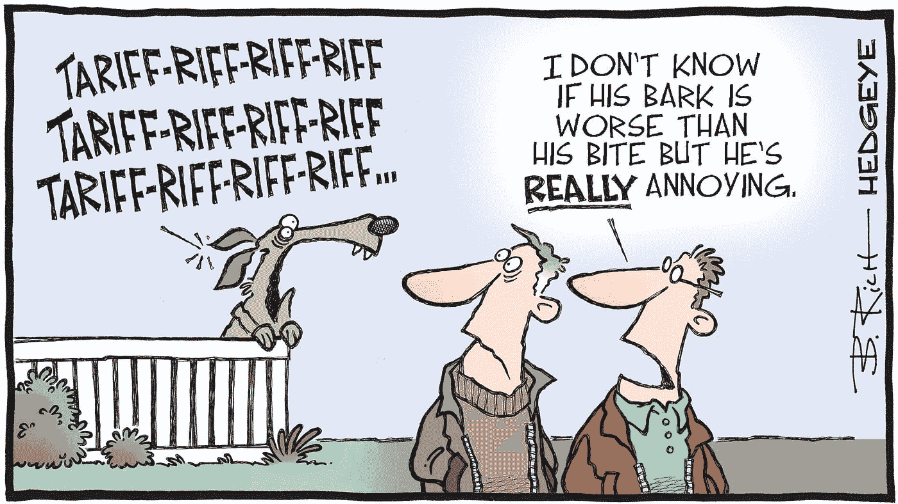

# 所有东西都是密码。外汇股票—2018 年 7 月 6 日

> 原文：<https://medium.datadriveninvestor.com/all-things-cryptos-forex-stocks-07-06-2018-809c6358aeef?source=collection_archive---------5----------------------->

时间到了，每个人都将迎来周末，夏季也将全面展开。通常这是一年中金融市场最不景气的时候，但似乎我们将迎来一个多事之秋。随着美国越来越多的保护主义政策，亚洲股市继续下跌，而美国股市继续反弹。美元的回调对新兴经济体来说是一个受欢迎的信号，而加密货币本周从近期低点大幅反弹。

# 疯狂的密码诗

对于加密硬币来说，这一周总体表现良好，从撰写本文时的低点反弹。区块链社区中的事情继续快速发展，有好消息也有坏消息——你可以说向前两步&向后一步。到目前为止，价格从低点指向一个暂时的底部，它是否会转化为一个重大的纠正措施将在未来几天内确定。

看 BTC 的小时图，你可以看到 6300-6450 美元的支撑区域到目前为止一直保持良好，在此之上多头继续偏向。我们可能会看到 6450 美元以下的长期盘整，但只要 6300 美元的水平保持不变，预计加密中枢将尝试突破 6800 美元的前期高点。仍在寻求突破 7000 美元的心理水平。 [**CCI30 加密指数**](https://cci30.com/) 值从上周的 5334.69 反弹至@ 5659.84(实时)，YTD 和 MTD 读数分别为-62.67%和+2.09%。加密技术的市场份额继续增加，从上周的 2568 亿美元增加到 2700 亿美元，比特币的主导地位略微下降到 42.5%。

以下是 Cryptoverse 本周的一些主要头条新闻:

*   印度最高法院支持印度央行的加密货币禁令
*   **欧洲银行**在 IBM 支持的区块链平台上进行跨境交易
*   俄罗斯军方正在建造一个区块链研究实验室
*   **全球税务执法(J5)联席会议**发起全球打击加密货币犯罪
*   **韩国**正式承认加密货币交易所
*   **瑞士证券交易所**用新的 DLT 平台将证券令牌化
*   **欧洲 ETF** 交易巨头开始交易比特币&ETN 以太坊

这是一张关于 Cryptos 中最常用的两种协议的精美信息图:

# 外汇市场

T 本周开始时，人民币跌至 2015 年贬值以来的最低水平，但在本周结束时反弹，中国央行宣布保持货币稳定&中国宣布在当前与美国的贸易僵局中不会恢复汇率操纵。然而，美元处于一种纠正情绪中，美元指数可能会出现双顶。NFP 的上涨对风险货币有利，同时中国央行利率决议&美国&中国 CPI 数据将于下周公布，决定美元的走向。

分析 DXY 图表，双顶似乎是一个明显的可能性，在这一点上，价格@ 95.50 被拒绝两次。说了这么多，多头趋势线的汇合点& 94.20 的 ST 支撑位会让多头趋势保持完好。任何低于这一水平的波动都会将修正延伸至 93.20 和 92.50，但只要后一个支撑保持，预计指数将保持建设性。

从一些主要货币对来看，在德国数据走强、政治形势改善以及欧洲央行比预期更早加息的暗示之后，欧元兑美元继续从跌势中恢复。尽管英国退出欧盟的担忧继续困扰着英国市场，但 GBPUSD 还是紧随欧元的脚步——小心这一对货币的任何长期定位。商品对本周也从低点反弹，然而，由于强劲的就业数据和油价回升，美元兑加元表现最好，从 1.3385 的高点下跌了近 300 点。由于美国股市走强，美元兑日元一直保持在 110.00 以上。

从过去传来一阵疾风，原来是绿色的美钞:

# 股票市场

随着美国对价值 340 亿美元的商品征收关税，贸易战正式打响，亚洲的野兔数量跌至九个月来的最低点。中国商务部发言人在新闻发布会上表示，北京的报复性关税将在美国采取行动后“立即”生效。美国股市表现与亚洲/新兴市场表现之间的分化仍在继续。虽然全球市场因关税形势而慌乱，但美国指数继续显示出对任何抛售的弹性。

从上面的标准普尔 500 图表可以明显看出，该指数再次设法从较高的低点反弹，以积极的方式结束了本周。只要 2741.62 的 ST 支撑位保持住，该指数似乎随时准备向 2775.90 和 2791.43(前期高点)延伸。牛市的延续似乎是在 2680 点的支撑下进行的。让我们来看看全球主要市场的每周数据。

**美国——DJIA(+0.76%)，标准普尔 500 指数(+1.52%)，纳斯达克(+2.37%)，**

**欧洲——富时 100 指数下跌 0.25%，德国 DAX 指数上涨 1.55%，CAC 40 指数上涨 0.98%**

**亚洲——日经 225 指数(-2.32%)，BSE Sensex 指数(+0.66%)，上海 50 指数(-3.12%)**

其他新闻:

*   浏览器制造商 **Opera (OPRA)** 已经申请在美国上市，筹资高达 1 . 15 亿美元
*   智能扬声器巨头 **Sonos (SONO)** 申请 IPO——该公司在截至 2018 年 3 月 31 日的六个月中实现收入 6.5567 亿美元，调整后的 EBITDA 为 5051 万美元

这里是顶级进口商的名单:

最后，给你讲几个上周历史上的趣闻( **#Investopedia** ):

> 2007 年 6 月 29 日:首款 iPhone 发布。它为自己赢得了“耶稣手机”的绰号，因为许多人都对它的功能感到惊讶。当苹果在 2008 年 6 月停止销售时，销售额达到 140 多万美元。今天，全球已售出超过 10 亿部 iPhones。
> 
> 1962 年 7 月 2 日:这一天，萨姆·沃尔顿在阿肯色州的罗杰斯开设了第一家沃尔玛商店。凭借有史以来最成功的商业策略之一，沃尔顿家族的三名成员跻身福布斯美国富豪榜前 15 名。
> 
> 1785 年 7 月 6 日:有没有想过你钱包里那张绿皮书的来历？在这一天，大陆会议采用美元作为美国独立战争期间脱离英国影响的货币单位。

享受周末吧，伙计们&有件事困扰着全球市场。交易愉快！

类似内容链接: [**交易美元专业外汇**](https://medium.com/datadriveninvestor/trading-usd-majors-in-forex-b616c7841bc7) ， [**万金油……一个大师！**](https://medium.com/datadriveninvestor/jack-of-all-trades-master-of-one-bb05ccafdf8a) **，** [**牛气冲天故作姿态隐晦——ST 招式**](https://medium.com/datadriveninvestor/bullish-posturing-in-cryptos-st-moves-6052db855257)

保持联系:[Twitter](https://twitter.com/fklivestolearn)|[StockTwits](https://stocktwits.com/trade_nut)|[LinkedIn](https://www.linkedin.com/in/faisal-khan-2a3009b/)|[Telegram](https://t.me/joinchat/IWzyHBGWCFwPQTe8Tm5H_Q)|[trade alike](http://www.tradealike.com/)

*原载于 2018 年 7 月 6 日 www.datadriveninvestor.com***。**