# 所有东西都是密码。外汇股票—2018 年 7 月 20 日

> 原文：<https://medium.datadriveninvestor.com/all-things-cryptos-forex-stocks-07-20-2018-835c00fe139b?source=collection_archive---------4----------------------->

让我们直接进入所有相关图表的技术分析。只是上周事情的预览:Cryptos 度过了一个美好的一周，并希望保持涨势，在美元指数虚假突破后，美元再次下跌，而美国股市收盘持平。

# 疯狂的密码诗

过去的一周可能是数字硬币在一段时间内表现最好的一周，不仅仅是因为反弹，因为它似乎证实了加密货币的触底反弹。截至发稿时，**总市值为 2850 亿英镑，远高于上周的 2500 亿英镑。Ripple 最弱&比特币上周表现最好。**

****比特币(BTCUSD — MT 中性，ST 看涨)****

**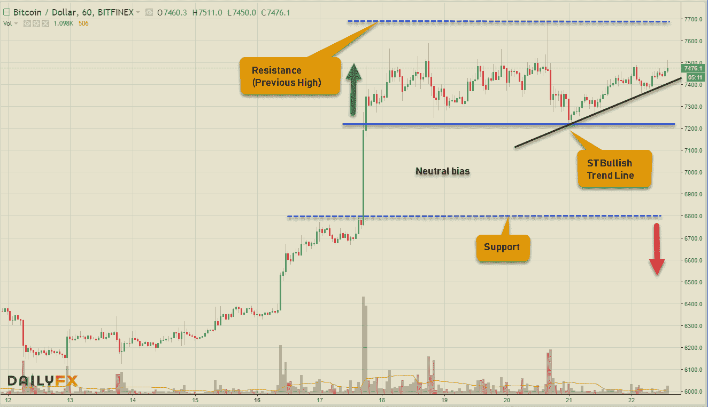**

****以太坊(ETHUSD — MT 中性，ST 中性)****

**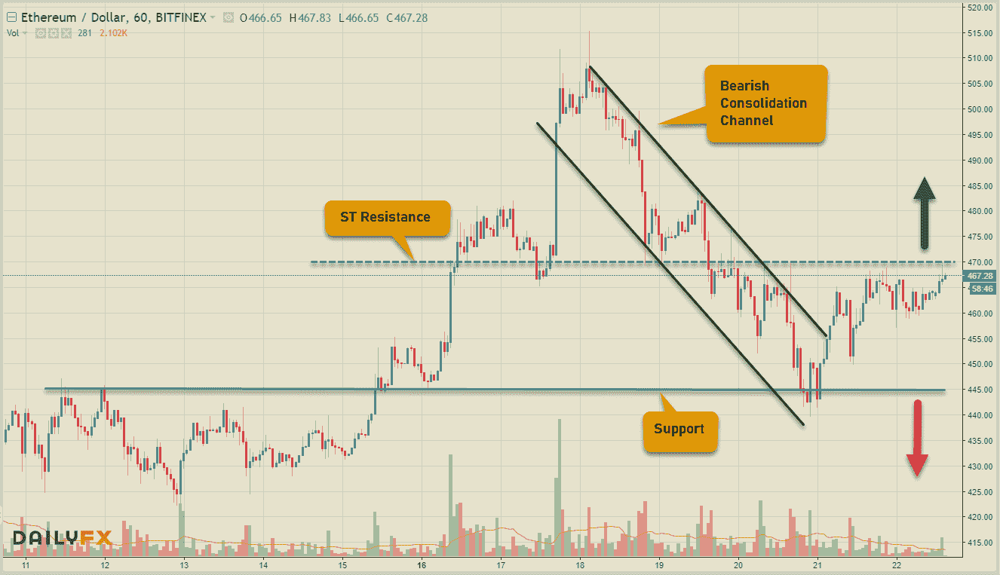**

****比特币现金(BCHUSD — MT 中性，ST 中性)****

****

****Ripple (XRPUSD — MT 看跌，ST 中性)****

**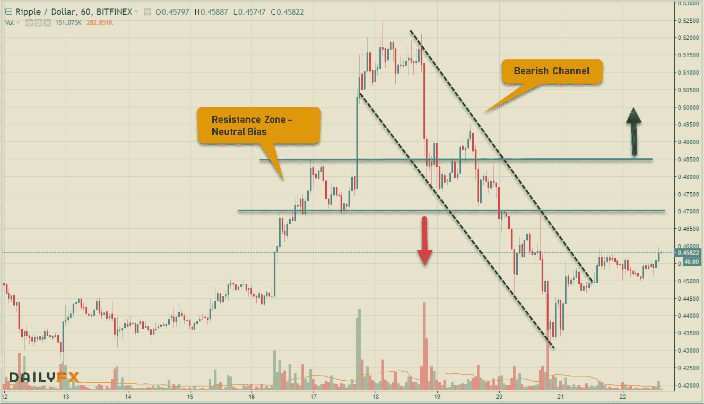**

****EOS (EOSUSD — MT 看跌，ST 中性)****

**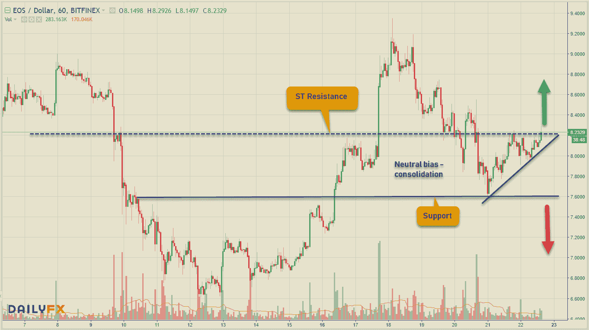**

**以下是上周 Cryptoverse 的一些主要头条新闻:**

*   **Schnorr 有望成为自 SegWit 以来比特币最大的变革**
*   **全球最大的资产管理公司贝莱德正在探索加密货币**
*   **隐私币 **Monero** 成功完成首次“防弹证据”审计**
*   **IBM 正在帮助推出一种由联邦存款保险公司担保的价格稳定的加密货币**
*   **全球四大审计师加入台湾主导的区块链财政审计系统试验**

# **外汇市场**

**本周大部分时间，美元普遍保持强势，但在美国总统就 FOMC 的利率决定和欧盟中国的货币操纵发表评论后，美元兑主要货币从高点回落，以小幅下跌收盘。最大的波动是英镑，在反弹前触及 10 个月低点，突破 1.3000 的心理关口。下周的重要数据事件包括:澳大利亚消费者物价指数、欧洲央行利率决议、美国 GDP 数据、日本消费者物价指数。继续 5 大专业的技术分析。**

****欧元(EURUSD — MT 看跌，ST 看涨)****

**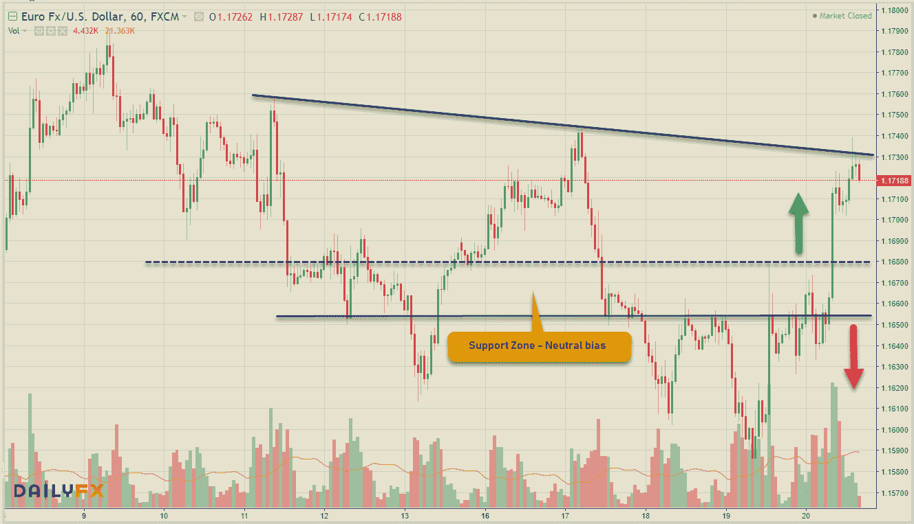**

****英镑(GBPUSD — MT 看跌，ST 看涨)****

**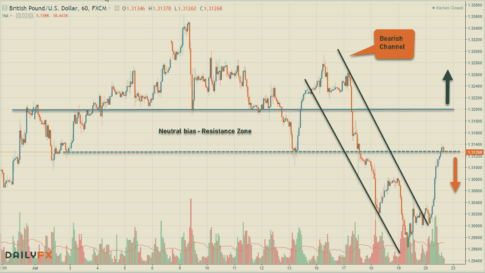**

****日元(美元兑日元——MT 看涨，ST 看跌)****

**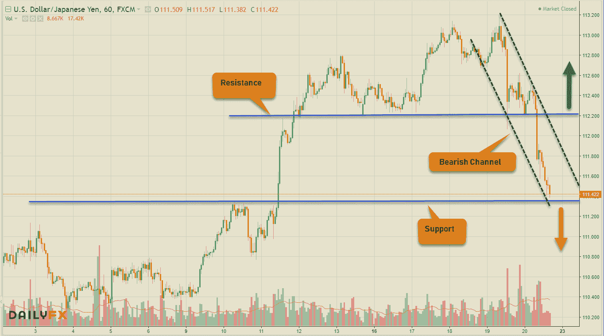**

****澳元(澳元兑美元— MT 看跌，ST 看涨)****

**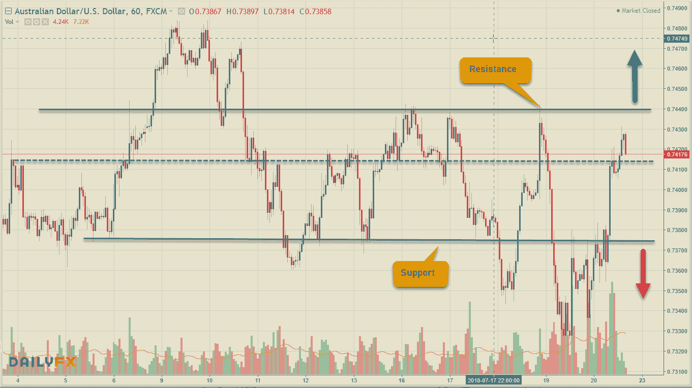**

****LOONIE (USDCAD — MT 看涨，ST 看跌)****

**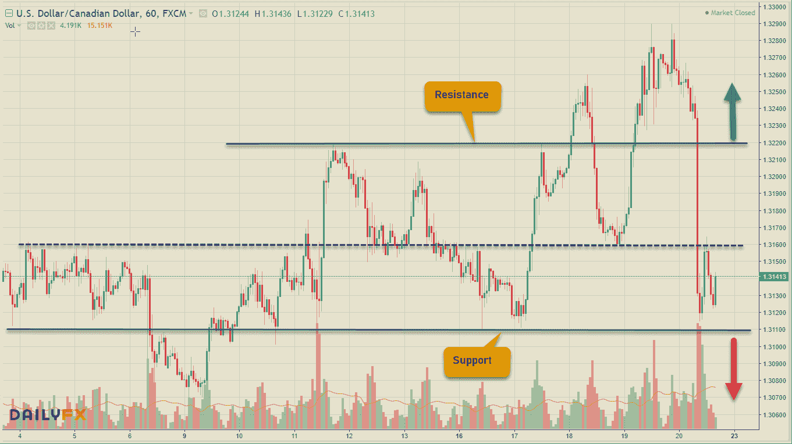**

# **股票市场**

**本周，美国股市前进了两步，后退了三步，最终持平。美国继续威胁对中国征收额外关税，抵消了乐观情绪。继续关注全球主要股票市场的每周数据，它显示出目前缺乏方向。**

****美国——DJIA(+0.15%)，标准普尔 500 指数(+0.02%)，纳斯达克(-0.07%)，****

****欧洲——富时 100 指数(+0.22%)，德国 DAX 指数(+0.16%)，CAC 40 指数(-0.57%)****

****亚洲——日经 225 指数(+0.44%)，BSE Sensex 指数(-0.12%)，上海 50 指数(+0.68%)****

**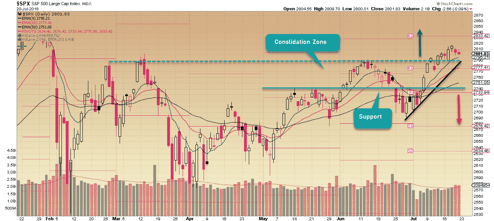**

**从标准普尔 500 指数来看，它仍然位于看涨趋势线上方，但已经从最近的高点回落，进一步的盘整可能会出现在前期高点的汇合点&这一趋势线，以继续上涨。持续的盘整将会把它带到支撑区域，但是只要支撑住这个区域，图表看起来就是建设性的。**

**总结一下，这是本周的每周交易想法——**MTW****

**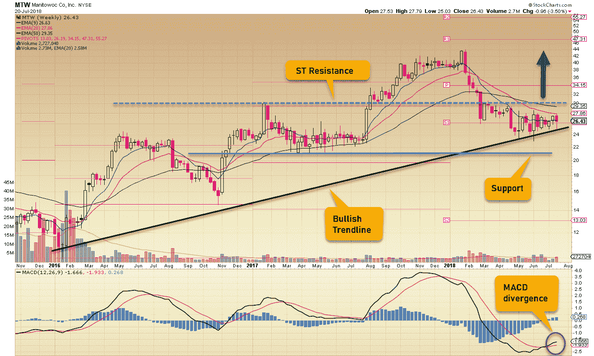**

**中国一直被指责篡改经济数据。我也这么认为。**

**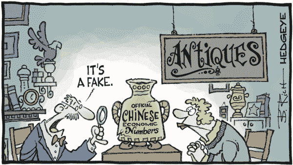**

**相关文章: [**交易美元专业外汇**](https://medium.com/datadriveninvestor/trading-usd-majors-in-forex-b616c7841bc7) ， [**交易心理&经验教训**](http://www.datadriveninvestor.com/2018/07/12/trading-psychology-lessons-learnt/) ， [**万金油……一个高手！**](http://www.datadriveninvestor.com/2018/07/03/jack-of-all-trades-master-of-one/) 、 [**一刀切的交易策略？**](http://www.datadriveninvestor.com/2018/06/20/one-size-fits-all-trading-strategy/)**

**保持联系:[Twitter](https://twitter.com/fklivestolearn)|[StockTwits](https://stocktwits.com/trade_nut)|[LinkedIn](https://www.linkedin.com/in/faisal-khan-2a3009b/)|[Telegram](https://t.me/joinchat/IWzyHBGWCFwPQTe8Tm5H_Q)|[trade alike](http://www.tradealike.com/)**

***原载于 2018 年 7 月 22 日*[*www.datadriveninvestor.com*](http://www.datadriveninvestor.com/2018/07/22/all-things-cryptos-forex-stocks%e2%80%8a-%e2%80%8a07-20-2018/)*。***