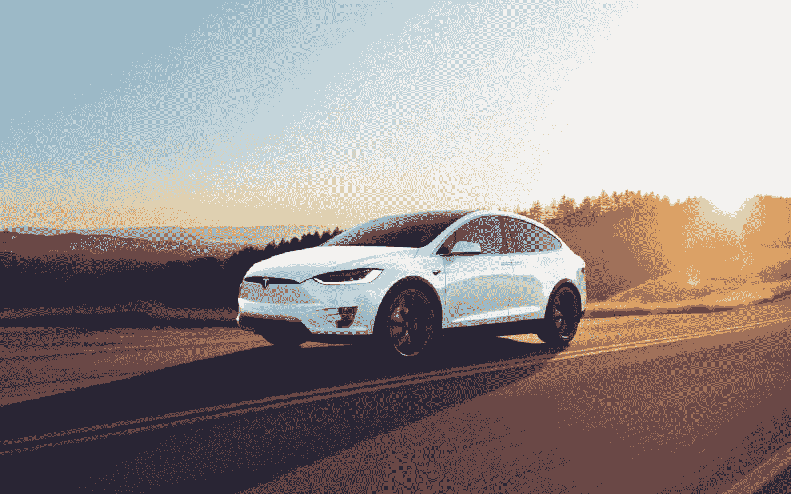
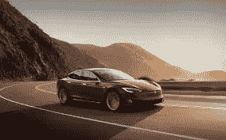

# 特斯拉的所有东西

> 原文：<https://medium.datadriveninvestor.com/all-things-tesla-372dac5113c7?source=collection_archive---------56----------------------->

根据最近对埃隆·马斯克的两项调查，似乎很多人都不希望特斯拉成功。通用汽车、福特和雪佛兰等美国竞争对手越来越多地试图阻碍马斯克取得的巨大进步。从不允许在某些州出售汽车到散布关于该公司的虚假信息，很难否认有外部参与者希望特斯拉消失的事实。

我先迭代一下。特斯拉不是汽车公司。他们是一家科技公司。事实上，他们把他们的先进技术应用到汽车上并不能使他们成为汽车制造商。想象一下，如果福特公司拥有美国所有的加油站。这将使福特可能成为世界上最大和最富有的公司，从汽油销售和汽车销售中获得收入。特斯拉在充电站方面拥有显著优势。虽然有几个站不是特斯拉品牌的，但很容易说他们肯定垄断了这一基础设施。关键是，埃隆·马斯克已经在美国各地建立了一个庞大的网络，这个网络还在不断增长，包括国内和国外。

是的，最近几个月，他们一直在努力生产可持续数量的汽车，特别是 Model 3，但这种麻烦是 rel

全新的公司。如果你要开始一项销售灯具的业务，很可能需要几年时间才能在全国范围内扩大规模。特斯拉的，以及其中的复杂技术，伴随着许多困难，因为它们可能比灯，甚至普通的汽油动力汽车制造起来更复杂一点。让我们记住，他们在过去的这个季度是盈利的，所以他们肯定在制造业采取了强有力的措施。

Tesla Model S

这篇文章的重点是特斯拉不会去任何地方。他们已经在自己的行业中站稳了脚跟，并且每天都在成长。埃隆·马斯克(Elon Musk)是一位顽强的创新者和梦想家，他不会让特斯拉失败。我预计在未来几年内，这家公司将凭借全自动汽车制造系统以及他们目前正在开发的其他技术(如嵌入太阳能电池的屋顶瓦片)蓬勃发展。也许大部分反对者希望看到特斯拉失败的原因是因为他们知道它的潜力。

**继续前进**埃隆。