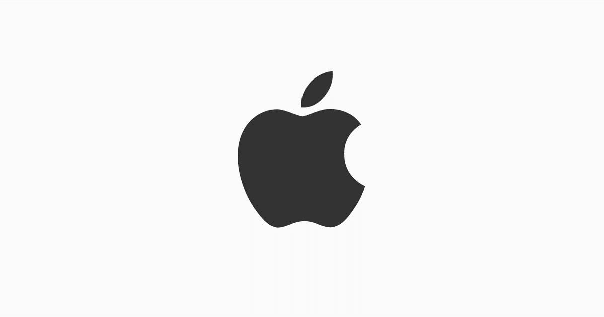
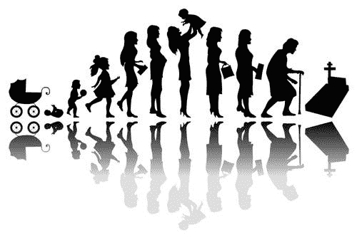
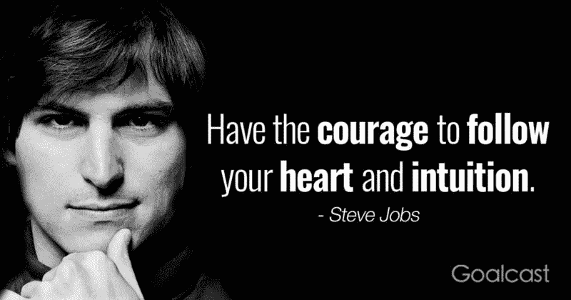

# 我们所做的就是等待

> 原文：<https://medium.datadriveninvestor.com/all-we-do-is-wait-a008580ac99?source=collection_archive---------8----------------------->

## 有两种人:让我告诉你下一个史蒂夫·乔布斯。

# 下一个史蒂夫·乔布斯

> 我受够了想象。我已经等够了。我受够了不得不去想“如果会怎样？”我受够了让过去折磨我。我受够了。你再也不用多看我一眼了。因为我已经等够了。

> 我已经等够了，我准备为此做点什么。

下一个史蒂夫·乔布斯。下一个埃隆·马斯克。未来———

下一个创新者将会是那些已经完成了等待不可能完成的事情的人。下一个改变世界游戏规则的人将推动人们、推动思维模式，并将他们曾经知道的一切推向一个新的层面。

 [## 想知道领导是谁？请他决定。-数据驱动型投资者

### 一个有效的领导者能为组织提供的最有价值的东西之一是决策能力…

www.datadriveninvestor.com](https://www.datadriveninvestor.com/2019/01/25/want-to-know-who-the-leader-is-ask-him-to-decide/) 

硬盘。痴迷。对超越一个人能力的推动；这是下一个亿万富翁。

> 这种生活是一场无休止的马拉松——但似乎我们所做的一切就是等待引擎启动。

## 在我们今天生活的这个世界里，上学、找工作、退休、死亡——最终——是如此的简单。

没有什么比这更重要的了。这个过程。我们穿过它，然后死去。

我不知道你是怎么想的，但是上面的这张图片并不那么有趣。

现在的你和未来的你之间的差异完全由一个因素决定。你。

你将成为人们钦佩你的原因。你将成为你成长的主要原因，你成功的主要原因，你将被取代，但前提是你付出了努力。

> 下一个创新者将是那些已经完成了等待不可能完成的事情的人。

如果你不再等待——如果你不再坐以待毙——干得好。

> “生活中没有人是失败者”

现在做点什么。

# 有两种人

中的当然，世界上有许多不同的人，但归纳成一个通用的范畴。有些人很满足，有些人不合理地需要更多——永远不会满足。

> 似乎我们是我们最大的敌人。

(当然，还是有更多的人，但总的来说，有计划的人或乐于像他们那样生活的人和因为需要更多而无法继续的人)。

只有一个人会改变这个世界，这个人会有所作为。

> [**在宇宙中留下凹痕。**](https://www.forbes.com/sites/carminegallo/2011/01/04/the-7-success-principles-of-steve-jobs/#7a27db6d1b59)

> [激情推动火箭](https://www.forbes.com/sites/carminegallo/2011/01/04/the-7-success-principles-of-steve-jobs/#7a27db6d1b59)，
> 
> 但是视觉引导火箭到达最终目的地。1976 年，当乔布斯和史蒂夫·沃兹尼亚克共同创立苹果公司时，乔布斯的愿景是将电脑放在普通人的手中。
> 
> 1979 年，乔布斯在加州帕洛阿尔托的施乐公司(Xerox)[【XRX】研发中心看到了一个早期的、粗糙的图形用户界面。](https://www.forbes.com/companies/xerox/)

> 他立即意识到，这项技术将使计算机对“普通人”有吸引力。这项技术最终成为了麦金塔电脑，它改变了我们与电脑互动的所有方式。
> 
> 施乐的科学家们没有意识到它的潜力，因为他们的“视野”仅限于制造新的复印机。

> [两个人可以看到完全相同的东西，但基于他们的视觉感知是不同的。](https://www.forbes.com/sites/carminegallo/2011/01/04/the-7-success-principles-of-steve-jobs/#7a27db6d1b59)

# 我们今天的世界

我们所做的只是伤害自己。在一个不断变化的世界中，消除典型的朝九晚五的工作，这是变革的首要理念，是革命性的。

> "[生活中没有人是‘失败者’](https://www.quora.com/search?q=how+to+do+something+with+you+life)。那些还没有实现自己梦想的人，或者缺乏实现梦想的动力的人，尤其是在竞争激烈的社会中，正遭受着慢性自尊问题的困扰。他们不停地与他人进行徒劳的比较，这让他们看起来一文不值，毫无才华。”

看到我们生活在这样一个多才多艺的世界里，有那么多人看不到未来，真令人难过。许多人似乎在毁灭自己——似乎我们是自己最大的敌人。

尽管大家都相信。每个人的*潜力*都是**无价的**——想象一个每个人都有潜力的世界——如果一个人能做某事——任何人都可以。

# 下一个史蒂夫·乔布斯

> 不管是下一个史蒂夫·乔布斯，还是下一个埃隆·马斯克，还是下一个大杰夫·贝索斯或比尔·盖茨，你的肚子里一定会有“火花”

你可能从你的车库或地下室开始。你可能从街道或沟渠开始。

我遇到过成功人士，他们来自毒品肆虐的贫困街道。我认识一些 12 岁就酗酒的人，他们面临毒品，枪支。我见过在觅食中长大的人——他们逃离当局继续生活。

除了每一个人。

*如果一个人做了某事。你也可以。*

如果有人不做些什么

> 自己做

动手吧。

做梦吧。活得精彩。

希望你有所启发。

祝你愉快。

一如既往

*坚持学习。*

***欧文·r·桑顿***