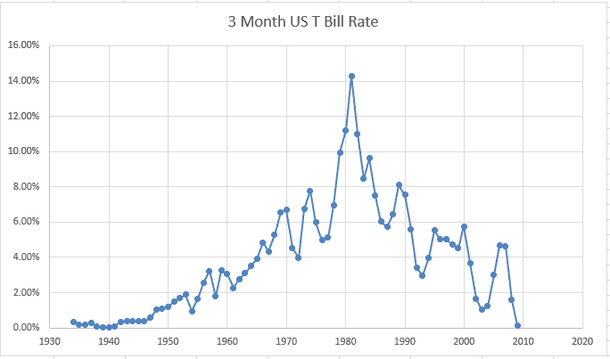
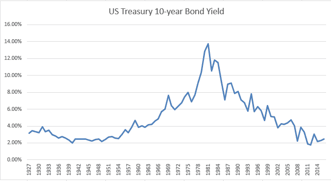
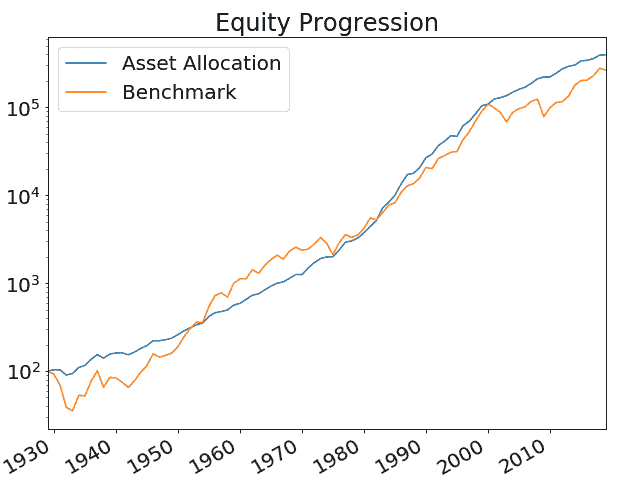
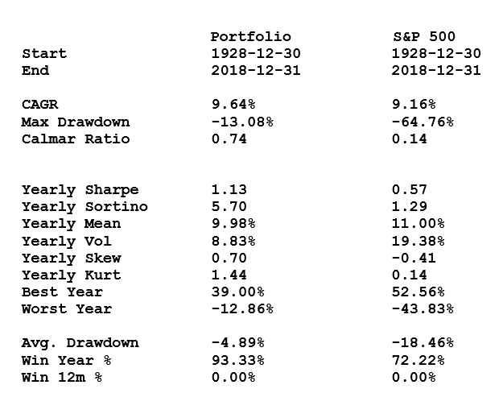

# 全天候产品组合 1928 -2018

> 原文：<https://medium.datadriveninvestor.com/all-weather-portfolio-1928-2018-e6c04c0c28b4?source=collection_archive---------16----------------------->

一个“全天候投资组合”本可以在整个 20 世纪维持下去，利用股票和杠杆程度较低的债券，产生与纯粹的股市投资相当的回报，但损失和波动性却很小。

让我首先提出几点警告。我没有考虑交易成本，而是使用了年度数据，这极大地平滑了结果。所用的数据是由 NYU·斯特恩商学院的阿斯瓦特·达马多兰提供的。

我使用了他的标准普尔 500、3 个月期美国国债和 10 年期美国国债的总回报指数。我做了一个(不正确的)假设，即所有三种工具在此期间都有期货合约，并且这些工具可以用来提供与现金指数相匹配的风险敞口。此外，如果在谨慎使用期货合约的过程中，稍微运用一些潜在的杠杆，这些回报本来可以更高。我的任何假设都可能有争议，或者被证明是不正确的，或者至少在某种程度上是不准确的。

这里使用的等期限债券指数可能夸大了利润，低估了波动性，并导致亏损:然而，这些结论在一般情况下仍然有效。

我的回溯测试假设定期进行再平衡，以保持三项基础投资的固定比例。交易成本会很低。

我认为，原则上可以提出一些观点，其中所列的任何可能的错误或误解都不会完全无效:

1.  或多或少，任何对冲基金投资组合都可以用一些简单的工具来模拟:股票和债券。
2.  利率上升不会破坏债券回报，因为 90%以上的固定利息回报来自息票，随着时间的推移，这将弥补任何短期价格损失。从国债和 10 年期债券各自收益率的图表中可以看出，这一时期的利率先大幅上升，然后下降。全天候投资组合平静地度过了这两个时期。
3.  聪明的投资者使用全天候投资组合会更好——他可以以很小的波动性获得与纯股票投资相同的回报，并提取资金。

*原载于 2019 年 4 月 9 日*[*【http://anthonygarnerinvestments.com】*](https://anthonygarnerinvestments.com/2019/04/09/all-weather-portfolio-1928-2018/)*。*