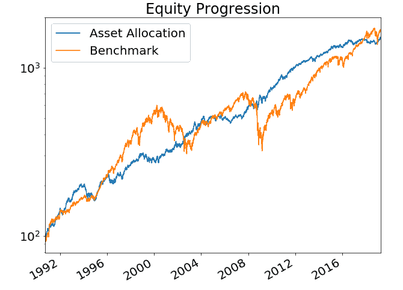
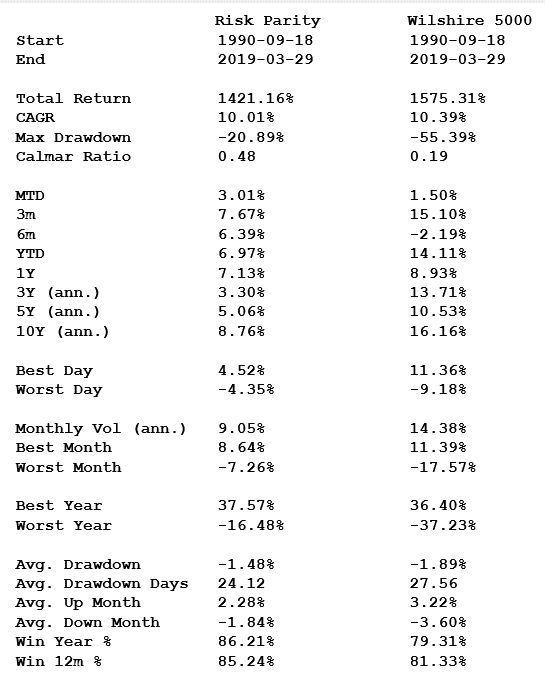
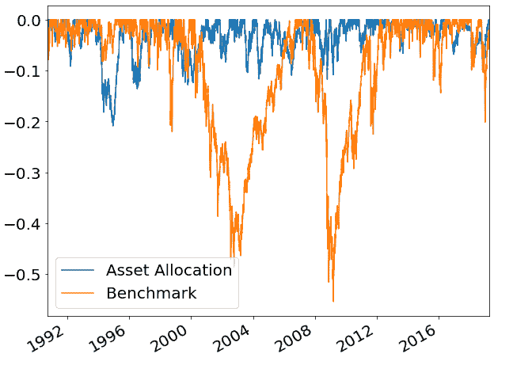

# 全天候投资组合

> 原文：<https://medium.datadriveninvestor.com/all-weather-portfolio-321c5272bcd6?source=collection_archive---------12----------------------->

全天候投资组合是正确的选择，即使是在利率上升的环境下。一个持久的、久经考验的和令人满意的策略。

由救世主雷伊·达里奥领导的 Bridgewater Associates 是全球最大的对冲基金集团，管理着 1500 亿美元资产。

Bridgewater 的全天候投资组合采用风险平价方法，成立于 1996 年(尽管该公司本身的历史可以追溯到 1975 年)。

尽管有人声称 Dalio 开创了风险平价，但 CTA 多年来一直在使用类似的方法。大宗商品交易顾问根据风险均衡他们的头寸规模，因此通常短期债券的头寸按$ terms 计算要比波动性更大的资产(如黄金)的头寸大得多。公众开始知道固定分数仓位的方法，很多年来，它主要和趋势跟踪者有关，比如比尔·邓恩，JW·亨利和海龟们。

据[维基百科](https://en.wikipedia.org/wiki/Risk_parity):

> *风险平价法断言，当资产配置调整(杠杆化或去杠杆化)到相同的风险水平时，风险平价投资组合可以实现更高的夏普比率，比传统投资组合更能抵御市场下行。*
> 
> *粗略地说……每项资产(或资产类别，如债券、股票、房地产等。)对投资组合的整体波动性有同等影响。*

例如，自 1989 年以来，威尔希尔 5000 总回报指数的复合年增长率为 10.36%，最大峰谷跌幅为 55%，月度年化波动率为 14.46%。

在同一时期，通过期货市场获得的美国五年期国债的 CAGR 达到 2.72%，最大下降幅度为 9.78%，月波动率(年化)仅为 3.95%。确切的回报取决于展期日期和不同期货的平均策略。

风险平价投资组合的一个简单版本是利用期货市场杠杆化风险较低的债券，以获得比传统的 60/40 股票/债券分配更好的风险调整回报。

下面的图表和数据显示了这种方案的一个变种。在回溯测试中，这种方案以低得多的风险产生了与股票市场相当的回报。最大提取金额不到股票市场的一半，波动性仅为纯股票投资的 2/3。

过去几年，许多“会说话的人”一直在想，随着利率上升，全天候投资组合的魔咒是否会被打破。债券的杠杆头寸会成为危险的火药桶吗？

这取决于你的杠杆比率和期限。在 20 世纪 80 年代早期，美国长期债券期货的无杠杆头寸记录了高达 39%的峰谷跌幅。因此，如果我们遇到另一个保罗沃尔克(Paul Volcker)，利率在 6 个月多一点的时间里大幅快速上升，那么拥有 3 倍杠杆的投资者将会倒霉。

在 80 年代初，美国五年期国债的无杠杆头寸会表现得更好:15%的最大提款和可管理的波动性即使有一些适度的杠杆，投资仍然具有吸引力，特别是与股票相结合(假设相关性或更确切地说非相关性保持在合理的水平)。

人们也容易忘记，利率上升实际上有利于债券回报——只要利率上升不太突然，并且发生在一个较长的时期内，任何资本损失都将被更高的票息抵消。至少按名义价值计算(未经通胀调整)。

人们倾向于忘记(或者他们可能从未意识到)超过 90%的债券回报来自于息票，而不是价格。

我的结论是，全天候投资组合确实是全天候的，应该会在未来几年不受利率上升甚至股市暂时下跌的影响。

这个简单的练习展示了这种方法的持久性，事实上，它有能力在较长的时间内，通过不同的(和困难的！)股市和利率周期。

不要太匆忙地把它一笔勾销。

*原载于 2019 年 4 月 4 日*[*【http://anthonygarnerinvestments.com】*](https://anthonygarnerinvestments.com/2019/04/04/all-weather-portfolio/)*。*