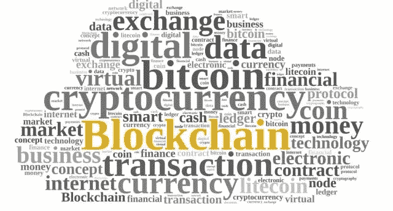
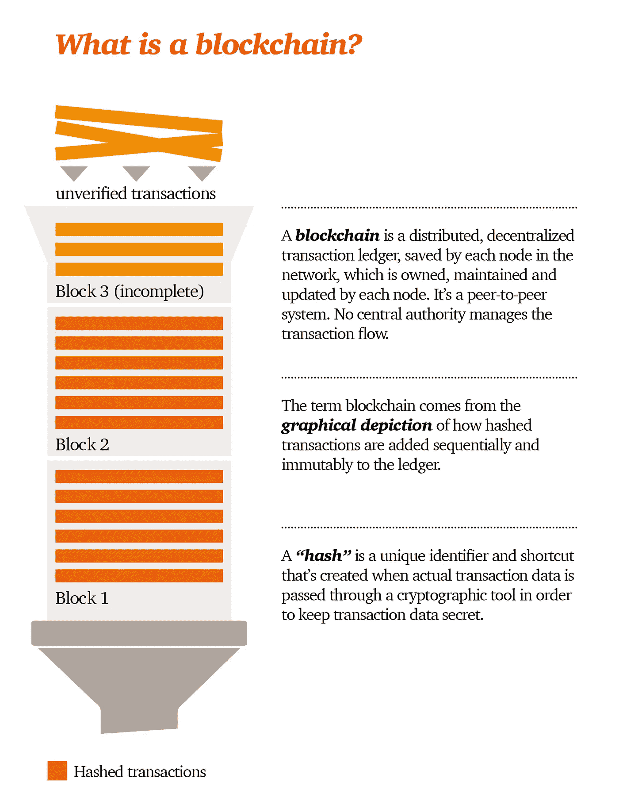
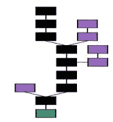
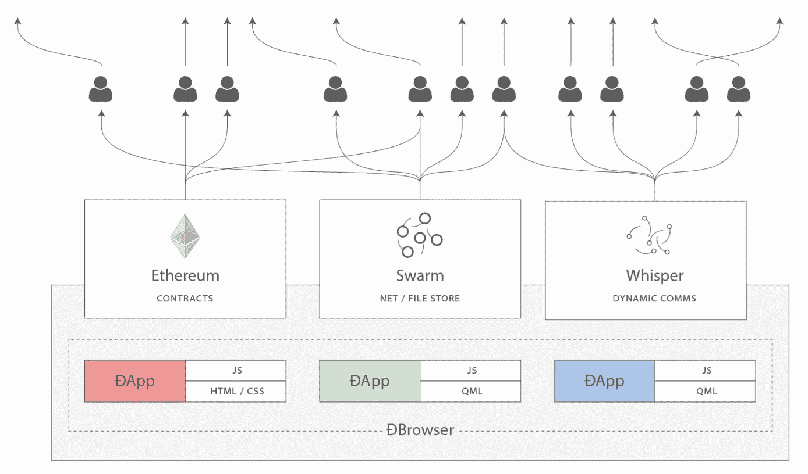
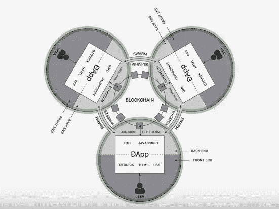
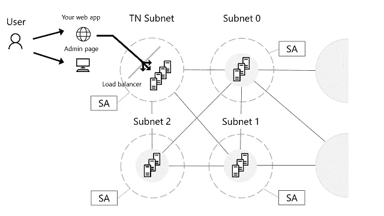
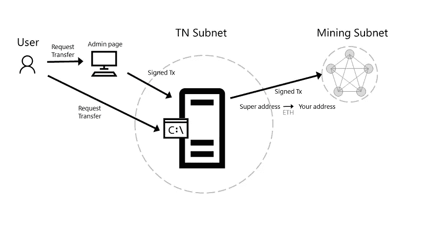
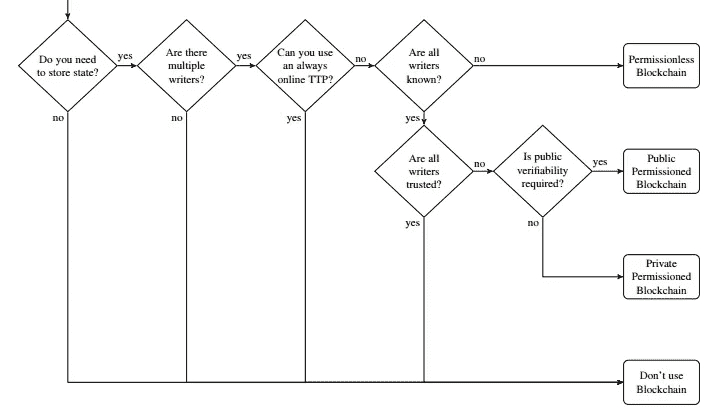
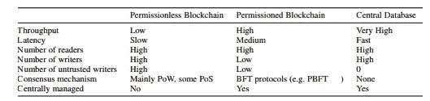

# 区块链 101:关于区块链你需要知道的一切

> 原文：<https://medium.datadriveninvestor.com/all-you-need-to-know-about-blockchain-101-2a3219babc24?source=collection_archive---------1----------------------->

# 什么是区块链

区块链是一个分布式共享数据库/分类帐，多个不信任的写入者可以直接修改，交易可以由维护数据库/分类帐副本的每个节点独立验证和处理。其中由多个作者协作创建事务之间的交互，而没有任何一方将自己暴露在风险中。区块链的工作是成为**权威的最终交易日志**，其内容所有节点都可以证明是一致的。

区块链是一个分布式数据库/分类帐，它在数据库/分类帐和分布式网络中以块的形式维护按时间顺序连续增长的记录/交易列表。每个块和记录/事务都有时间戳和散列。每个块链接到前一个块。一旦数据被记录在一个块中，它就不能被改变。区块链数据库由事务和块组成。

图 1 普华永道—区块链定义

每个块包含成批的有效事务，这些事务被散列并编码到 Merkle 树中。每个块都有前一个块的散列，并相互链接。这些环节形成了一个链条。该过程从原始成因区块开始确认完整性。

区块链形成。主链(黑色)由从起源块(绿色)到当前块的最长的一系列块组成。孤立块(紫色)存在于主链之外。

图 2 区块链维基百科 Merkle 树

# 区块链生态系统组件

共享分类帐

共识；一致

伏特计

**节点/应用:**任何连接到分布式网络的计算机称为节点。完整节点下载每个块和事务，并根据共识规则进行检查。类似于应用程序与数据库的交互，分散的应用程序将与区块链交互并执行逻辑。节点分为两类:

**交易节点:**维护一份分布式账本，用于从网络提交或查询交易。应用程序与这些节点(如 web3 Javascript)进行交互，以在应用程序中执行和存储事务。钱包由交易节点支持。

**挖掘节点:**通过共识处理和提交交易到底层分布式分类帐。挖掘节点与其他挖掘节点通信，以对分布式分类帐的状态达成一致。客户端应用程序不需要与这些节点通信。采矿节点收取采矿费用。

**DApp:** 分散式应用的后端代码运行在分散式 p2p 网络上。Dapp 通常有它的前端和用户界面来调用后端。

**契约:**分散逻辑

**蜂群:**分散存储

**耳语:**分散式消息传递

图 3 以太坊联盟网络架构

图 3 以太坊联盟网络架构
用户正在使用 Dapp 与交易节点交互。

图 4 来自以太坊企业联盟的交易描述

**共识算法:**共识算法作为节点应用程序的一部分实现，为生态系统如何实现分类账的单一视图提供“游戏规则”。比如像以太坊的 Casper 的股份证明，比特币的工作证明。

**工作证明:**是一个需要强大处理能力的数学问题，一个挖掘节点很难解决，但其他挖掘节点很容易验证。

**利益证明:**一般来说，利益证明算法如下。存在一些硬币持有者将他们的硬币放入赌注机制的证明中，从而成为验证者。给出一个特定的区块链“头”(即。区块链中的最新块)，算法随机选择这些验证器中的一个(随机性由存款大小加权，因此具有 10000 个硬币的验证器的机会是具有 1000 个硬币的验证器的 10 倍)，并向它们分配创建下一个块的权利。如果该验证器在一段时间内没有创建块，则选择能够替代创建块的第二验证器。就像在工作证明中，“最长链”被认为是规范的。[【1】](http://file:///C:/Users/Eray.Altili/Desktop/All%20You%20Need%20To%20Know%20About%20Blockchain.docx#_ftn1)

**虚拟机:**是作为软件的一部分实现的计算机的表示，该软件由生态系统中每个参与者运行的指令操作。

**令牌:**令牌有时被称为数字无记名债券，简单地说就是为可以拥有或可以拥有其他东西的东西建立一个数字唯一身份。加密单向散列的使用允许任何资产，无论是数字资产还是物理资产，被表示为令牌、安全身份。然而，身份令牌并不是全部，你需要第二个部分来制作一个完整的安全身份，即身份证明。身份证明是用公钥/私钥确定的。与证明配对的身份令牌共同提供了一种用于所有事物的安全身份的解决方案。这种数字令牌允许我们跟踪资产的出处、所有权、关系和血统。今天，我们可以而且经常做标记化的事情，准确地说是独特的和非独特的事情。事实上，数字令牌的这种使用是为现有电子商务系统建立的信任的基础。[【2】](http://file:///C:/Users/Eray.Altili/Desktop/All%20You%20Need%20To%20Know%20About%20Blockchain.docx#_ftn2)

**智能合同:**是自动执行的合同条款，以存储在区块链上的代码的形式在双方之间实现了自动化的可信工作流。(在特定条件下自动执行各方之间的数字令牌或资产的转移)

**链外:**链外交易是价值在区块链之外的移动。有两种类型的外链交易。信任方和支付渠道。在信任方交易中，首先在信任方的内部分类账中完成，并在内部进行核实，然后向公众或在区块链链上广播。(或者只是在内部改变余额，然后向公众广播)。在支付渠道中，交易是在双方之间通过相互信任对等完成的。在关闭时，它在链上广播。

**Hard Fork:**Hard Fork 是对协议的更改，使以前无效的块/事务有效，因此要求所有用户升级。任何改变块结构(包括块散列)、难度规则或增加有效交易集的区块链变更都是硬分叉。[【3】](http://file:///C:/Users/Eray.Altili/Desktop/All%20You%20Need%20To%20Know%20About%20Blockchain.docx#_ftn3)

**软分支:**软分支是对协议的改变，其中只有先前有效的块/事务变得无效。因为旧节点会将新块识别为有效的，所以软分叉是向后兼容的。这种分叉只需要大多数矿工升级来执行新的规则。新的交易类型通常可以作为软分叉添加，只要求参与者(发送者和接收者)和挖掘者理解新的交易类型。这是通过使新交易对老客户表现为“向任何人支付”的交易(特殊形式)，并使矿工同意拒绝包括这些交易的区块，除非交易在新规则下有效。[【4】](http://file:///C:/Users/Eray.Altili/Desktop/All%20You%20Need%20To%20Know%20About%20Blockchain.docx#_ftn4)

**私有区块链:**写权限集中在一个组织，读权限可以是公开的，也可以限制为扩展到相关方。

**财团区块链:**当共识过程由一组选定的节点控制时。

**公共区块链:**任何人都可以阅读、发送交易和参与共识过程。

**区块链用例决策算法(区块链有意义的地方)**

规则 1 共享数据库

规则二:多个作者

规则 3 缺乏信任

规则 4:可信第三方(非中介化)

规则 5 交易互动

在没有这些规则的情况下，根据您的需求，您可以检查文件存储、中央数据库、数据库复制(主-从)、带有发布-订阅的多个数据库

规则 6 你的 TPS 要求是什么？

如果您有很高的 TPS 要求，请考虑使用基于 SGX 的解决方案。

规则 7 你的治理和隐私规则是什么？

想想零知识证明和关于事务的 ACL，以及关于你的节点、你的共识、你的验证器、冲突解决等的治理规则。

规则 8 什么是资产，谁在背后？

**用于贸易融资的区块链概念验证**

第一步:进口商创建 LC 申请，供进口商银行审核，并存储在区块链上。

第二步:进口商银行收到审查信用证的通知，然后可以根据提供的数据批准或拒绝信用证。一旦检查和批准，然后自动向出口商银行提供访问以供批准。

第三步:出口银行批准或拒绝信用证。一旦获得批准，出口商就可以查看信用证要求，并被提示查看整个申请。

第 4 步:出口商完成装运，在装运时添加 gps 传感器。添加发票和出口申请数据，并附上任何其他所需文件的照片图像。一旦通过验证，这些文档就会存储在区块链上。

第五步:出口银行批准或拒绝申请和文件。

第六步:进口商银行根据信用证要求审查数据和图像，标记任何不符之处供进口商审查。批准后，信用证直接进入完成状态或发送给进口商进行结算。

第七步:如果由于不符点而需要，进口商可以审查出口文件并批准或拒绝它们。

# [避免私人区块链无意义的区块链项目](https://www.multichain.com/blog/2015/11/avoiding-pointless-blockchain-project/)

**用例**

出处(追查一件物品或实体出处的主要目的通常是通过尽可能确定其后来的历史，特别是其正式所有权、保管和储存地点的顺序，为其最初的生产或发现提供背景和环境证据。)

金融技术(尤其是汇款、资本市场、贸易融资、合规和审计、反洗钱和了解客户、保险、点对点交易、智能合同、智能资产、清算和结算、支付、数字身份等。)

企业(供应链管理、医疗保健、房地产、媒体、能源等。)

政府(记录管理、身份、投票、税收、政府和非营利组织透明度、立法)

跨行业(会计、IOT、数据存储、数字化资产、内容管理等。)

【https://github.com/ethereum/wiki/wiki/Proof-of-Stake-FAQ】

[【2】](http://file:///C:/Users/Eray.Altili/Desktop/All%20You%20Need%20To%20Know%20About%20Blockchain.docx#_ftnref2)[https://github . com/Azure/Azure-区块链-projects/blob/master/bletch ley/bletch ley-white paper . MD](https://github.com/Azure/azure-blockchain-projects/blob/master/bletchley/bletchley-whitepaper.md)

[【3】](http://file:///C:/Users/Eray.Altili/Desktop/All%20You%20Need%20To%20Know%20About%20Blockchain.docx#_ftnref3)[https://en.bitcoin.it/wiki/Hardfork](https://en.bitcoin.it/wiki/Hardfork)

[【4】](http://file:///C:/Users/Eray.Altili/Desktop/All%20You%20Need%20To%20Know%20About%20Blockchain.docx#_ftnref4)【https://en.bitcoin.it/wiki/Softfork】T2

[5][https://www . multi chain . com/blog/2015/11/避免-无意义-区块链-项目/](https://www.multichain.com/blog/2015/11/avoiding-pointless-blockchain-project/)

*原载于 2017 年 4 月 26 日*[*https://www.linkedin.com*](https://www.linkedin.com/pulse/all-you-need-know-blockchain-eray-altili?lipi=urn%3Ali%3Apage%3Ad_flagship3_profile_view_base_post_details%3Bvok2hOPyRBSU9wSYPzzE1Q%3D%3D)*。*