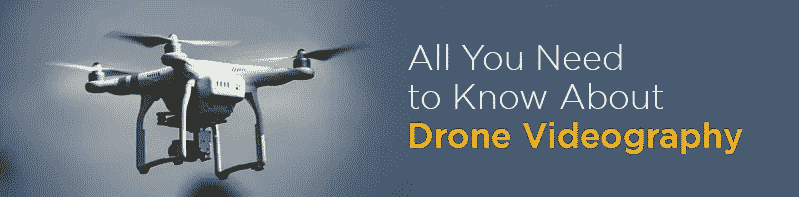

# 关于无人机摄像，你需要知道的

> 原文：<https://medium.datadriveninvestor.com/all-you-need-to-know-about-drone-videography-af8aefb62b11?source=collection_archive---------1----------------------->

航拍是当前数字时代的新流行语。你会发现很多业余或半专业的静态摄影师投身于空中摄影。在这里，不仅是顶尖的活动管理公司，普通的婚礼摄影师和精通小工具的极客也会争相购买。然而，仅仅从众多可用品牌中购买负担得起的无人机，你无法了解这些被称为四轴飞行器或无人机(UAV)的棘手小工具的所有信息。所以为了让你知道，我们提供了一些指导方针，[无人机摄像解决方案](http://24framesdigital.com/What-we-do/Arial-Live.php)以及你需要知道的关于拥有和驾驶无人机的一切。

Photo by [Jaromír Kavan](https://unsplash.com/@jerrykavan?utm_source=medium&utm_medium=referral) on [Unsplash](https://unsplash.com?utm_source=medium&utm_medium=referral)

**合法权限**

在进行无人机摄像之前，要记住的最重要的事情之一是，你需要让自己了解所有相关的法律和规则。在印度，无人机行动被限制在白天和可视视线内。此外，外国人不允许在印度驾驶无人机，但他们可以将无人机租赁给印度实体，后者必须从 DGCA 获得 UIN 和 UAOP。驾驶无人机需要执照。

 [## 我们为军事人工智能做好准备了吗？-数据驱动型投资者

### 今天，算法可能会以迷人的形状出现，例如索菲亚，一个态度可爱、开明的机器人…

www.datadriveninvestor.com](https://www.datadriveninvestor.com/2019/02/21/are-we-ready-for-military-ai/) 

**悠着点**

如果你是无人机领域的新手，购买一个简单、易于飞行的模型是正确的选择。不要为了好玩而花钱:如果你打算购买你的第一架无人机，这是一个必须考虑的要点。最好从便宜的东西开始，因为在你练习期间的任何事故都不会花费你一大笔钱。因此，对于低价机型，你可以掌握悬停工具，然后选择空中摄影无人机。最初练习时，你可能需要投入大量的飞行时间，所以购买大量的备用电池是一个明智的决定。

**电池寿命**

可以说，在寒冷和中等温度下飞行无人机的最大区别是它对飞行电池的消耗。大多数消费无人机依靠锂离子聚合物(LiPo)电池供电。随着这些电池变冷，它们的化学活性受到影响，这减少了飞行时间，增加了电源、系统和传感器故障的可能性。

**前途无量**

尽管出于安全原因和其他预防措施，空中拍摄已经消除了所有障碍，但这一领域仍有一些局限性。这里说的是无人机拍摄附带的无人机注册等规定。那些对这个概念不熟悉的人，让我们提醒你，世界各地已经为飞行悬停小工具制定了具体的规则和条例。

此外，在印度，你需要遵守这些规则。在 400 英尺或 400 英尺以下飞行无人机，保持在视线范围内，不要在机场附近飞行，不要在人群、体育场或体育赛事上空飞行，不要在火灾等紧急响应活动附近飞行，不要在受影响的情况下飞行，并完全了解空域要求。如果你记住这些规则，在印度驾驶无人机就不是问题。

**计划您的拍摄**

不管是什么视频(除了[的现场直播](http://24framesdigital.com/))你总是会提前计划好你的镜头。无人机摄像也不例外。最好是对你的位置进行侦察，并从无人机的角度思考你可能想要捕捉的镜头。无人机拍摄时，角度、太阳位置、风向等因素都很重要。思考最终编辑的视频将帮助您捕捉更好的镜头。

**无人机的校准**

这就像你的无人机起飞前要遵循的经验法则。你要确保你的设备的万向节是正确校准的。否则，很多时候地平线稍微偏离就会破坏电影的整体气氛。还有，开始拍摄前需要检查无人机的电池和卡容量。

**在 4K 拍摄**

是的，编辑 4K 的视频是一项非常慢的任务，尤其是如果你的编辑设备很慢的话。然而，如果你在 4K 拍摄视频，然后编辑成 1080p，效果会大不一样。4K 会给你更多的空间来调整视频。你可以在不损失质量的情况下放大，或者如果有什么东西破坏了照片，可以把边缘剪掉。4k 拍摄值得努力。

**飞得慢**

无人机可以飞得相当快。而且拍的时候飞的快也是常见的错误。然而，你知道吗，你在一部伟大的电影中看到的所有电影镜头都是在慢速飞行时拍摄的？慢速飞行的另一个好处是，你可以在不剪辑影片的情况下获得慢动作效果。更不用说你的无人机坠毁和损坏的较小风险。你唯一想快速飞行的时候是当你有一个很大的开口，一切都远离你的网站。如果你在这种情况下飞得很慢，会感觉你站着不动或者根本不动。

**获取额外镜头**

这是你需要一直做的事情，不管你拍摄的是什么类型的视频。然而，当用无人机拍摄时，手里有额外的镜头可以播放就很重要了。如果你是新手，在编辑的时候会帮到你。粗略地说，对于一个 5-10 分钟的最终产品，你需要一个小时的镜头。随着你对工具掌握得越来越好，你会拍出更好的照片，并且需要更少的工具。然而，首先，最好多拍几张照片。另外，如果你愿意，你也可以在其他地方使用它们。

还有几个小技巧可以帮助你拍得更好。有的需要经验，有的需要专业指导。但我们希望这些技巧能帮助你更好地通过无人机拍摄，并充分利用它。