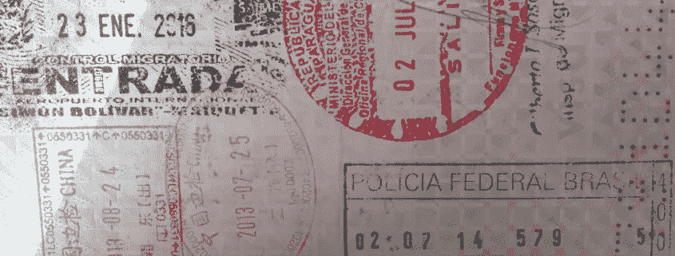
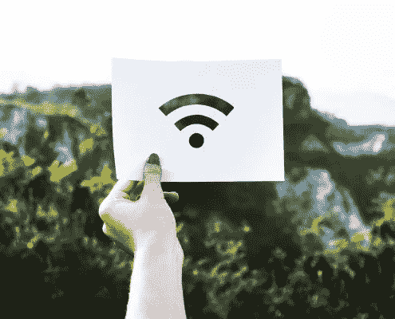
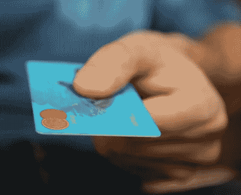
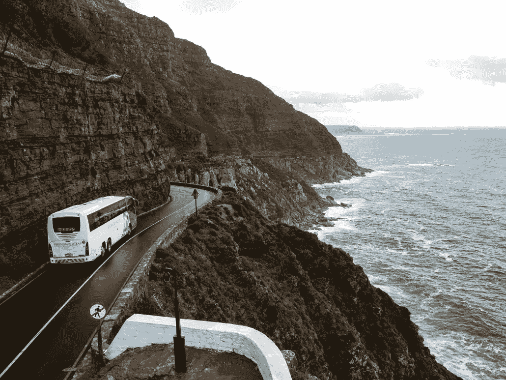
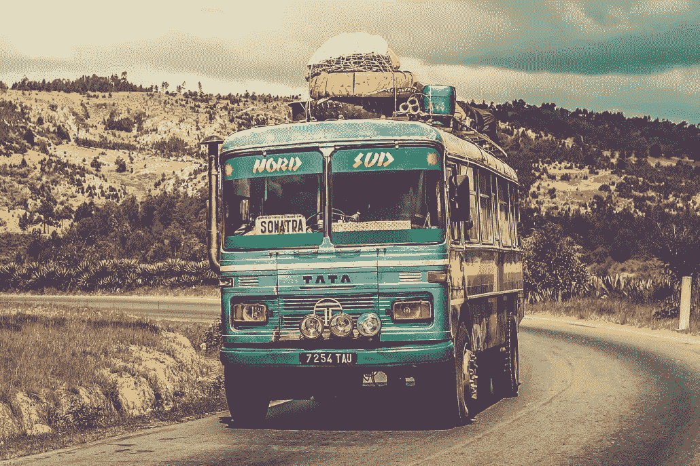
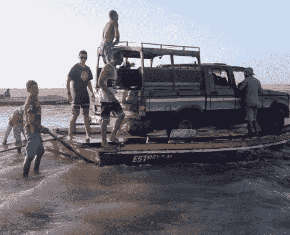

# 在你以数字流浪者的身份去巴西之前，你需要知道的是

> 原文：<https://medium.datadriveninvestor.com/all-you-need-to-know-before-you-go-to-brazil-as-a-digital-nomad-d58762b53e38?source=collection_archive---------4----------------------->

对于那些从未到过南美的人来说，第一次来到巴西可能会很有挑战性。巴西很棒，我爱它。我不断回来并且永远不想离开是有原因的，但是这并不容易。如果你知道会发生什么，考虑到某些事情，并事先做好适当的准备，这将使你在巴西的数字游牧生活变得容易得多。让我来帮你，让你的生活更轻松。

# 天气

巴西是躲避欧洲或美国冬天的绝佳去处。除了遥远的南方，那里从来没有真正冷过(美国和欧洲的寒冷标准)，甚至在冬天也没有。由于国家的大小，气候有很大的地区差异。巴西大部分地区都是热带地区，所以当你去巴西的时候，虽然你不想把温度考虑得太多，但是你还是要考虑湿度和降雨量。

北海岸将比南部地区更温暖，湿度更小，雨水更少。越往南走，天气越潮湿多雨，尤其是在夏季。不过雨季的阵雨不会下一整天。最多几个小时。潘塔纳尔和亚马逊一年到头雨水都很多。当你去潘塔纳尔和亚马逊的时候，你不会因为天气而去，还是把一切都考虑进去比较好。

查看我的 [**博客文章**](https://activeworkation.com/brazil-for-digital-nomads-and-remote-workers-my-top-5-digital-nomad-spots-in-brazil/) ，这里有更多的天气信息和去巴西特定地方的最佳时间，这些地方非常适合数字游牧民。

# 签证

欧洲人很幸运，他们不需要提前申请签证，你可以在抵达时在机场拿到。当你来自美国或加拿大时，你必须提前安排好一切，但这是小菜一碟。

# 快速了解签证知识

*   您的护照需要从抵达之日起至少六个月有效，才能进入巴西。
*   巴西给予旅游签证，有效期 90 天。
*   不要丢失您在飞行中得到的入境卡，因为海关原因，您在出发当天需要它。

查看我关于巴西签证的更详细的[**博客文章**](https://activeworkation.com/brazil-for-digital-nomads-and-remote-workers-a-full-visa-guide-for-brazil/) 并联系你当地的大使馆或领事馆了解你国家的最新信息。

# 互联网、Wifi 和 Sim 卡

既然入境已经定了，那就让我们从一个数字游牧民最重要的事情开始:互联网连接。我建议你一到巴西就办一张 sim 卡。以防你在哪里找不到互联网，或者家里的互联网出了什么问题。

VIVO 和 TIM 将为您带来最快的速度和覆盖范围。不要指望高速互联网或在高峰时段或恶劣天气条件下的互联网。如果您需要下载大数据、上传大数据或通过 Skype 打电话，清晨当所有人都睡着时将是最佳时间。

要得到一张当地的 sim 卡，最好去一家正规的商店，希望那里友好的客服能帮到你。作为游客买个 sim 卡没问题，但是 sim 卡激活就有问题了。即使几年前法律已经改变，大多数商店并没有意识到这一法律变化，仍然要求公积金，作为一个游客，你不会有。(CPF 在巴西是个人身份证号)

如果他们不让你使用你的护照号码(别忘了带你的护照去商店)来激活 sim 卡，希望友好的客户支持是一个好心情，并可能通过让你使用他们的 CPF 来帮助你。你可能要付一点费用。所有东西都在出售，甚至是公积金代码😉

如果你在巴西有当地的朋友，你的生活会容易得多。有了中央公积金，你几乎可以在街上的每个角落都买到 sim 卡。您可以在激活所有功能后获得您的点数。你可以通过发送数据套餐的代码来购买数据包，这非常简单。

有了中央公积金，你在巴西的机票和许多其他东西也会更便宜。很疯狂，但却是事实。所以找你当地的朋友，让他们用他们的公积金。非常非常有帮助。

# 钱钱钱

巴西当地的官方货币是雷亚尔/雷亚尔。货币变化很大，所以在你到达巴西之前，查看一下 www.xe.com 的当前汇率。它可以让你在巴西的逗留要么非常便宜，要么非常昂贵，这完全取决于汇率。

# 自动取款机

直接在自动取款机上取钱，你会得到最好的兑换价值。在巴西，你几乎可以在任何地方找到自动取款机，但是要找到一台可以使用你的美国或欧洲银行卡的自动取款机就困难多了。

大多数使用你的卡的自动柜员机是汇丰银行或巴西银行的自动柜员机。如果你有不同的银行卡，最好把它们都带上，以防万一。如果您的个人识别码超过四位数，您必须在抵达前更改。巴西银行不会承认它们。

大多数自动取款机的限额是 1000 雷亚尔或更少，这取决于机器。

都是你自己的，而且巴西银行会收你交易费。但总的来说，你会比住在任何一个卡萨德坎比奥都要好。你不必带着很多现金走来走去，也不必排队领钱。虽然简单。

巴西的自动取款机有某种实际的办公时间。在巴西，安全仍然是一个问题，因此自动柜员机不会 24/7 工作。大多数自动取款机在晚上 10 点左右关门，但是为了你自己的安全，避免在晚上使用自动取款机，在白天取钱，最好是在显眼的地方。

他们似乎也不时会缺钱。尤其是某些全国性的节日，如新年和狂欢节。在那段时间里，确保你有足够的钱。

一般来说，银行在工作日从上午 10 点到下午 4 点营业。

# 信用卡

信用卡可能是比从自动提款机取钱更好的选择，因为你不用支付任何提款机费用。尽管商店可能会在交易中增加一定的百分比或者收取某种信用卡费用。这将由你来决定哪些费用最终会更便宜。

用信用卡支付的价格通常是不可协商的，而用现金支付通常可以得到一定的折扣。所以请记住这一点。

信用卡在巴西被广泛接受。大多数较大的商店、餐馆和酒店接受 Visa 和 MasterCard 的信用卡。在农村地区使用它们可能会有一些困难。加油站一般也不收。

小心你的个人识别码，并时刻留意你的信用卡，因为信用卡诈骗在巴西确实会发生，你不想处于那种境地。

# casas De c ambio/货币交易所

几乎在巴西的任何地方，你都可以找到 Casas de cambio，一个将外币兑换成巴西雷亚尔的地方。总会有某种佣金，即使它说没有。他们也必须从某些东西中获得生命。利率不会是最好的，所以我的建议是使用自动取款机，你的信用卡或在银行换钱。只有在必要时才使用卡萨斯·德·坎比奥。这肯定是更昂贵的选择。

当您兑换货币并且在旅行结束时还有剩余时，您需要出示您的原始收据才能兑换回您未使用的雷亚尔。因此，建议保留收据，直到您再次离开巴西，以获得最佳汇率。

# 旅行支票

我不知道现在是否还有人使用旅行支票，但不管怎样，在巴西，大多数地方不接受旅行支票。所以请停止使用它们，我们生活在 2018 年。如果你真的想坚持使用它们，唯一接受它们的银行是巴西银行，这将花费你大约 20€的服务费。

# 语言障碍

英语是非本地人在世界范围内说的第一语言，但在南美/巴西不是很普遍。所以，除非你打算只在巴西呆几天，否则至少知道几个葡萄牙语短语是有好处的。你可以在大城市四处走动，但如果你这样做，你的生活会简单得多。

我希望能说点西班牙语，但巴西人对此不感兴趣。当我开始学西班牙语时，我甚至可能会因此被人讨厌，因为我只是想努力让自己能被人理解。

*我的个人建议#1，一定要尝试葡萄牙菜，而不是西班牙菜*

你会在网上找到很多外国佬团体，这些人你可以联系到，他们刚来的时候也面临着和你一样的问题。以及语言障碍。见见他们，看看他们会给你什么建议，让你在巴西的生活更轻松。

*我的个人建议#2，巴西人喜欢学习英语，与当地人进行语言交流将是最好也是最有趣的相互学习方式*

# 运输

我第一次在巴西的时候没有任何计划，每件事都是在最后一分钟做的，这很费钱！如果你提前预订，巴西的航班可能会很便宜，但如果你在最后一刻预订，价格可能会很贵。因此，我最终坐了很多长途汽车，这是我再也不想做的事情。

# 在巴西乘飞机旅行

由于巴西很大，乘飞机旅行肯定是最简单快捷的选择。坐专车去同一个国家的另一个目的地可能需要几天时间。巴西是世界上第二大拥有最多机场的国家，所以你可以毫不费力地找到去下一个目的地的机场。GOL、TAM 和 Azul 是巴西的主要航空公司。

## 对那些有计划的人来说最优惠的价格

尽可能提前预订，以获得最优惠的价格和最多的选择。尤其是在假期期间，在七月/八月，圣诞节和狂欢节前后)。

对于真正的计划者来说，有一个巴西的特价机票。所有航班必须在 30 天内，路线在您预订后不能更改，并且您需要在巴西境外同时预订。这听起来很麻烦，但巴西机票通常是物有所值的。

## 机场税

当你预订航班时，你可能会被用来支付机场税。对于巴西境内的国内航班，在机场办理登机手续时需要缴纳机场税。价格因机场的大小而异。

## 确认你的航班！

巴西不是唯一这样做的国家或航空公司，我最近在格鲁吉亚，因为我没有提前 3 天确认我的航班，我的航班差点被拒。还有足够的空间，所以在支付了高于实际票价的费用后，我可以乘坐我原来的航班。不要让这样的事情发生在你身上，并且在起飞前 48 小时再次确认你的航班。

# 在巴西乘长途汽车旅行

尤其是在巴西南部，你会发现很多很棒的长途汽车。总的来说，它们既舒适又干净。每辆巴士每隔几个小时就会有一次休息，即使车上有厕所。

在每个城镇的许多代理处都可以买到票。建议至少提前一天买票，尤其是在旺季。座位是有编号的，买票时可以挑选。公共汽车票是不可退款的，所以确保你选择了正确的日期、时间和目的地。

## 不同的阶层

巴西的长途汽车有不同的等级可供选择，当然每一种都有自己的价格标签。

雷托:那些公共汽车非常舒适。这些座位几乎可以变成一张床。“半雷托”意味着您的座椅不能完全处于水平位置。这些公共汽车上有一名女服务员分发床单和供应小吃和饮料。所以这一切都很好。他们通常在晚上开车，所以你可以省下住酒店的钱，但却错过了风景。

行政长官:那些公共汽车会比最便宜的方式更快地把你带到目的地，因为它停靠的站更少。它也有躺椅和空调。还不错，但当然没有雷托好。

科姆:这些巴士有更多的停靠站，所以你会花更长的时间才能到达目的地。舒适度可以是合理的，但对于 comum 来说，这完全取决于您乘坐的巴士。有时飞机上有厕所或空调，但是不要指望它，在你买票之前问一下/检查一下。

# 在巴西乘坐公共交通工具旅行

对于当地人来说，公共汽车和小型货车是城市中最常见的公共交通方式。然而，外国人经常更频繁地使用地铁和出租车。

## 公共交通；巴西的地铁

较大的城市有地铁系统，作为外国人，地铁更容易处理，更安全，也更干净。除了里约热内卢的狂欢节，地铁在晚上不工作。

## 公共交通；巴西的公共汽车

你可以在公共汽车上买车票，不会花很多钱。它们可能会超级拥挤，因为交通拥挤，你要花很长时间才能到达目的地。公共汽车在晚上也能运行，尤其是在大城市。不太频繁，但确实如此。我不建议服用它们。打车回家还是安全很多，尤其是作为一个外国人。

## 公共交通；巴西的出租车

永远不要在巴西的大街上招手拦出租车。总是在你的手机上使用任何类型的应用程序，打电话叫一个来接你，或者去你在任何地方都能找到的特殊出租车停靠站。

在巴西，预先定价(协商或不协商)和米都是很常见的，这取决于你在哪里和你如何得到它。如果你使用计程出租车，白天的价格应该是 1 英镑，周日和 12 月的晚上 11 点到早上 6 点的价格应该是 2 英镑。

# 乘船在巴西旅行

特别是在亚马逊、北部和东北部海岸，用船运输是很常见的。亚马逊河是该地区最重要和最常用的交通方式。

我从哥伦比亚坐了 5 天的船到亚马逊中部的马瑙斯，这是我最难忘的经历之一。这次旅行更受欢迎的选择是从马瑙斯到贝伦，或者从马瑙斯倒退到哥伦比亚或秘鲁方向。由于河流的原因，这个方向需要一天的时间。从我自己的经验来看，我建议去体验一次一生中只有一次的旅行！

巴西美丽的海岸线前有大约一千个岛屿，在这里用船运输也很常见。

# 在巴西坐火车旅行

除了旅游景点，你不会在巴西找到很多火车。你可以考虑的几个风景优美的火车旅行是:

*   库里蒂巴-莫里特斯
*   贝洛奥里藏特—维多利亚

一个真正的旅游景点是蒂拉登特斯-圣若昂-德尔雷之间或奥鲁普雷托和马里亚纳之间的冒烟的玛丽蒸汽火车。

# 巴西自驾游

根据地区的不同，巴西的道路要么很好，要么很差，要么非常差。有些区域只能用 4× 4 才能到达。最好的路在南方。越往北和内陆，就越困难。巴西有右行交通，巴西司机可能有点咄咄逼人。如果他们认为你会减速，他们会在没有指示灯的情况下变换车道或从右侧超车。

巴西有很多汽车租赁公司(locadora ),只要你有驾照(最好是国际驾照)、护照，而且出于保险原因，你必须年满 25 岁，租车不成问题。

我建议晚上不要开车。如果你选择在晚上开车，一定要锁好车门，不要在空的十字路口等红灯，就像当地人不会等红灯一样。他们会放慢速度，看看是否有其他车过来，但由于犯罪，巴西法律允许在晚上闯红灯，所以不要担心这样做。

晚上不开车的另一个原因是路灯不多。所以要看到减速带和坑洼会困难得多。

# 良好的准备是成功的一半

如果你打算以数字流浪者的身份去巴西，最好做好准备。例如，先交一些当地的朋友。有一种东西叫做网络，它可以让你认识来自世界各地的人。当你有当地的朋友可以帮你安顿下来的时候，你在巴西的生活会轻松得多，也有趣得多。

在你到达之前学一些葡萄牙语，至少一些基本的短语，这肯定会让你的生活轻松很多，因为大多数人不会说英语。

对于数字游牧民和游客来说，巴西是一个很棒的国家。很有挑战性，但是很棒！

如果你喜欢风筝冲浪或者想学习风筝冲浪；Active Workation 将于 2018 年 12 月在巴西举办另一场 Workation，与一群其他数字游牧者、远程工作者、企业家和生活方式追求者一起。如果你有兴趣，就来看看吧！

