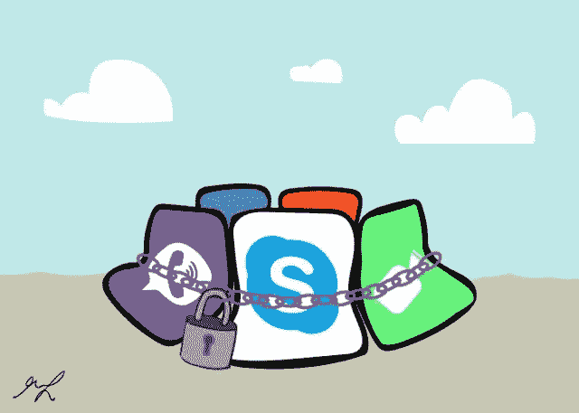
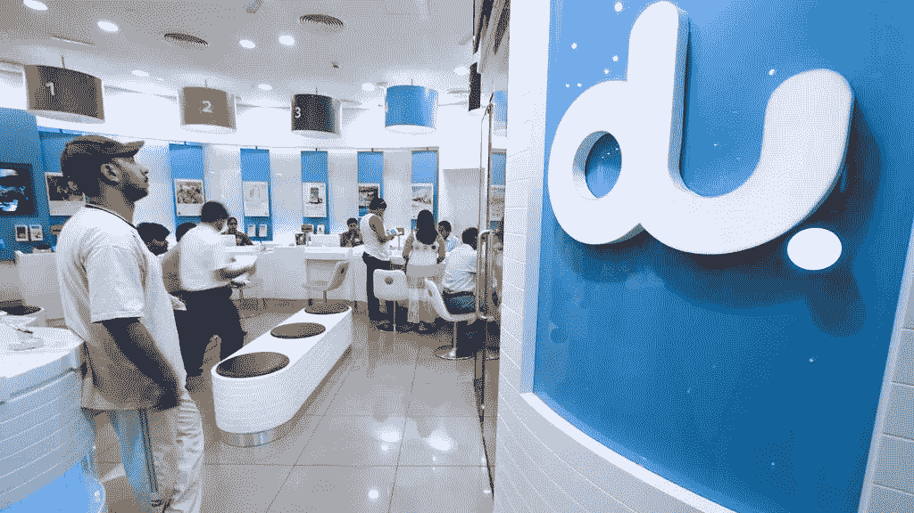

# 允许我们使用网络电话

> 原文：<https://medium.datadriveninvestor.com/allow-us-voip-348fc89b1f41?source=collection_archive---------8----------------------->

Artwork by Aalaa Albastaki(SAIL website)

如今，智能手机是人们之间交流的主要来源。全球各地的智能手机为我们提供了通过不同的社交媒体平台进行免费视频和语音通话的可能性，如 Facebook Messenger、WhatsApp、Viber、FaceTime、Skype 等。到目前为止，在我去过的所有国家，我都能使用不同的社交媒体平台打电话。然而，搬到阿联酋后，我注意到网络电话被禁止，目前唯一对我有效的平台是 Skype。但是，它只在使用大学 WiFi 网络时有效。起初，FaceTime 和 WhatsApp 视频通话可以用，但几个电话之后就被屏蔽了。阿联酋不是世界上唯一禁止 VoIP 服务的国家，沙特阿拉伯、摩洛哥和中国也有类似的限制。

Etisalat 和 du 是阿联酋的两家电信运营商，它们主要由政府所有。这些运营商都不提供 VoIP 服务。Etisalat 和 du 声称，在满足国家的许可要求之前，VoIP 服务将继续在阿联酋受到监管，但背后的真正原因是他们的目标是可持续的市场。根据 Econstore 的报告，2012 年至 2013 年间，国际通话时间有所增加，但短信和多媒体信息服务(MMS)却有所减少。Etisalat 和 du 在未获得监管机构批准的情况下提供预付费套餐。除了 Etisalat 和 du，母公司 du 旗下还有 Virgin，这是一家移动网络虚拟运营商(MNVOs ),它们也提供电信服务，但仍然缺乏竞争。此外，竞争水平非常低的事实影响了消费者的使用，因为它限制了在促销时向个人提供的优惠。更重要的是，所有这些都与定价策略直接相关，因为两家公司的价格相同或相似。

Sarah Dea / The National website

禁止网络电话，不允许通过社交媒体进行语音和视频通话，这迫使客户只能使用 TRA(电信监管机构)。这造成了消费者对电信业的不满意，他们不断寻找不同的选择。目前，阿联酋电信部门专注于通过移动数据、固定 VoIP 和固定宽带业务增加收入，而 4G 将在 2019 年取代 3G(John，2016)。

目前，阿联酋居民必须付费使用通话服务，而不是使用社交媒体平台提供的服务。Du 和 Etisalat 也提供包含在不同套餐中的国际分钟数，但它们非常有限且昂贵。此外，一些用户和商业公司正试图使用 VPN 服务来访问免费通话和视频，有时它的工作，有时它不工作。

Arabian Business

据美国消费者新闻与商业频道称，微软和苹果正在与阿联酋政府协商取消对 Skype 和 FaceTime 通话的禁令。据美国消费者新闻与商业频道报道，这次谈判发生在微软发布 2019 年在阿布扎比和迪拜建立两个数据中心的计划之后，这两个数据中心将被视为软件巨头在中东的第一个数据中心。沙特阿拉伯取得了进步，取消了禁令。据英国广播公司(BBC)和海湾新闻(Gulf news)报道，通信部表示，让沙特人接入网络电话的决定是沙特王国迈出的重要一步，因为这将提高客户满意度，促进数字创业。

通信和信息技术部部长 Abdullah Al Sawaha 表示:“沙特电信合作伙伴之间的这一卓有成效的合作是在‘客户第一’的大框架下进行的，在这一政策下，每个人都致力于为沙特的所有电信用户提供满足他们期望和需求的最佳服务。

迪拜以其多元文化而闻名，并因其发明和技术发展而成为吸引游客的地方。因此，为了提高该地区的客户满意度，并为游客和他们的家人提供更方便的沟通，启用 VoIP 是必要的。取消网络电话禁令也有利于商业交流和企业家精神的发展。

参考:

[1] BBC 新闻。(2018).*沙特解除网络通话禁令*。[在线]可在:【https://www.bbc.com/news/world-middle-east-41332743 获得

[2] Econstor.eu. (2018)。[在线]可从以下网址获得:[https://www . econ stor . eu/bitstream/10419/148655/1/Ameen-Willis . pdf](https://www.econstor.eu/bitstream/10419/148655/1/Ameen-Willis.pdf)

[3] Gokulan，D. (2018)。越来越多的阿联酋居民呼吁解除网络电话禁令。[在线]卡丽熙时报。请访问:[https://www . khaleejtimes . com/nation/Dubai/more-UAE-residents-join-/calls-to-lift-ban-on-VoIP-calls](https://www.khaleejtimes.com/nation/dubai/more-uae-residents-join-/calls-to-lift-ban-on-voip-calls)

[4]哈比卜·图米，B. (2018 年)。*沙特将解除互联网通话禁令*。[在线]Gulfnews.com。请访问:[https://gulf news . com/world/gulf/Saudi/ban-on-internet-calls-to-be-lift-in-Saudi-Arabia-1.2089878](https://gulfnews.com/world/gulf/saudi/ban-on-internet-calls-to-be-lifted-in-saudi-arabia-1.2089878)

[5]repository . cardiffmet . AC . uk .(2018)。【在线】可在:[https://repository . cardiffmet . AC . uk/bitstream/handle/10369/9662/2013 12 37% 20 sunil % 20 oommen . pdf？sequence=1 & isAllowed=y](https://repository.cardiffmet.ac.uk/bitstream/handle/10369/9662/20131237%20Sunil%20Oommen.pdf?sequence=1&isAllowed=y)

[6]图拉克，N. (2018)。*微软和苹果可能在阿联酋解除对 Skype 和 FaceTime 的禁令*。[在线]美国消费者新闻与商业频道。可在:[https://www . CNBC . com/2018/05/02/Microsoft-and-apple-could-get-Skype-and-face time-bans-lifted-in-UAE . html](https://www.cnbc.com/2018/05/02/microsoft-and-apple-could-get-skype-and-facetime-bans-lifted-in-uae.html)

[7]哈比卜·图米，B. (2018 年)。沙特阿拉伯将解除互联网通话禁令。[在线]Gulfnews.com。请访问:[https://gulf news . com/world/gulf/Saudi/ban-on-internet-calls-to-be-lift-in-Saudi-Arabia-1.2089878](https://gulfnews.com/world/gulf/saudi/ban-on-internet-calls-to-be-lifted-in-saudi-arabia-1.2089878)