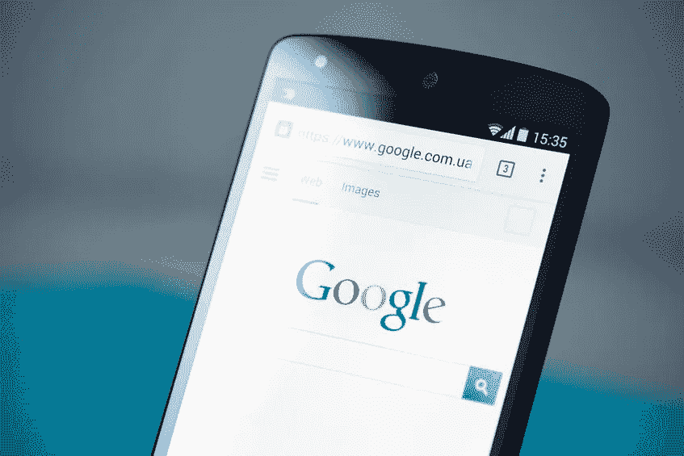

# 诱人的博客标题会让他们产生更多的渴望

> 原文：<https://medium.datadriveninvestor.com/alluring-blog-titles-to-leave-them-craving-more-in-3-easy-steps-cf8d8c7aebab?source=collection_archive---------20----------------------->

当你的读者会高兴地回应几个神奇的单词时，为什么要为吸引注意力而争斗呢？

“10 Jaw-Dropping Things She Said When She Thought No One Was Listening…”

*让我们实话实说。我们都想要、需要并渴望得到关注。这就是博客世界如此诱人的原因。突然之间，任何公司(或刚毕业的大学生)都可以成为行业专家，成千上万的读者等着阅读他们诱人的内容。只有一个问题…*

## **要脱颖而出很难！**

除了你，每个人都有一个吸引人的标题和一个猫的故事。任何人，更不用说一个企业，如何在与目标受众的联系上取得真正的进展？无数企业都面临着同样的难题，但解决方案却出奇的简单。

别再耍小聪明了。

信不信由你，任何人都可以设计出一个成功的博客标题，既能在谷歌上排名，又能在社交媒体平台上引领潮流。*以下是如何做到这一点，只需 3 个简单的步骤……*

“He Made the Crowd Erupt in Applause, With Just 5 Words.”

# 第一步:建立他们的期望

大学毕业后的两年里，我在一家受欢迎的快餐店工作，在那里管理收银机是我的“荣幸”。在特别繁忙的日子，队伍会延伸到入口通道之外。当客人来到我的收银台时，一些人已经准备好跳过柜台掐死我了。我帮他们点餐，收下他们的钱，平静地把他们带到客人用餐的地方。

## 接下来发生的事情将决定客人离开时是满意还是愤怒。

"您点的菜大约 5 分钟后就会好."这一句话解除了许多在我们疯狂的早晨和午餐时间的定时炸弹。通过设定客人的期望值，我让他们放松下来，将注意力转移到其他地方。当我忘记这样做的时候，你总是能看出来，因为两分钟后，那个人会焦急地回到柜台，要求我检查他们的订单。

当构思一个有效的博客标题时，从写一句话开始，准确地告诉你的读者你将要谈论什么。

**A.** 不要逞强；尽可能让这个句子变得不发音。[“你的猫比你聪明，我来告诉你怎么做，笨蛋。”]

从你将在博客中发表多少要点、例子或建议开始。 [" *5 个理由*为什么你的猫比你更成功"]

使用括号，你还可以包括你的博客将要涵盖的内容类型。{ "你的猫打算杀你的 18 个征兆*[信息图表]* "}

This is where we engage in tantalizing wordplay.

# 第二步:做辣的！

一旦你对你的标题设定了期望，*是时候让它变得性感了*。使用**粗体** **动词**和*诱人的* *形容词，*将你的标题提升一个档次。将你的简单句子转换成一个可行的标题最多只需要 10-15 分钟。

**记住，这不需要一点点。少校转到**[**Thesaurus.com**](https://www.thesaurus.com/browse/exciting?s=t)**并键入“令人兴奋”一词。**

使用能抓住文章味道的措辞。你指的是第三世界国家令人恼火的腐败事实吗？使用煽动性的词语来激起(适当的)愤怒。

*   *委屈*
*   *侵权*
*   *医疗事故*
*   *压迫*

如果你想描绘一幅激动人心的画面，试试这些:

*   *喜出望外*
*   *激动万分*
*   *欣喜若狂*

## 避开过时的，或者更糟的，误导性的措辞。

创造一个过分激烈的标题是很容易的，如果你的读者发现了过时的术语，他们会像受惊的兔子一样逃跑。想把你的千禧一代目标文章拍在脚上？将 *festal、*convivial、或 *jocund* 放在标题中。

过度销售文章内容会进一步伤害你的读者群。如果你的标题是“一夜暴富的三种简单方法”，祝你好运！标题设定的未实现的期望只会损害你的信誉。确保你的内容的质量和影响力符合你的期望。*确保这一点后，你就可以安全地进入最后一个关键步骤了……*

“12 Ways Google’s New Search Algorithm Could Hurt Your Rankings”

# 第三步:优化搜索和社交

*聪明好，还是成功好？SEO 的残酷现实是，最机智的标题并不总是最成功的。如果你想让你的文章表现出色，你需要优化。*

这意味着您需要发现两条关键信息:

1.  你的目标市场的热门关键词
2.  你的目标市场的首选社交平台

为了在谷歌和其他主要搜索引擎上获得最佳搜索结果，请将标题控制在 70 个字符以内。这可以确保你的标题不会在搜索引擎结果页面中被截断(这会损害你的整体性能)。确保你把你的热门关键词放在字符限制之内。如果你不知道如何找到所说的关键词，有大量的在线工具(如 [**【塞姆拉什**](https://www.semrush.com/) **)来指导你的研究。**当然，你的内容应该也需要用关键词、照片、元数据等进行优化。

在你为谷歌优化了你的标题之后，你(可能)需要采取额外的步骤来为社交网站进行优化。对于在社交媒体平台上制作标题的想法， [Hubspot](https://blog.hubspot.com/marketing/types-of-blog-headlines) 为脸书友好和“可在推特上发布”的标题提供了几个很好的模板。

# 整理想法

不要让机智的欲望阻止你构思一个实用的、高性能的博客标题。通过上面的步骤，你可以很容易地制作一个吸引人的标题，然后让你的内容带来惊喜。如果你在开始时仍有问题，试着看看业内其他热门博客在做什么。毕竟，向比你更成功的人学习是最简单的成长方式！