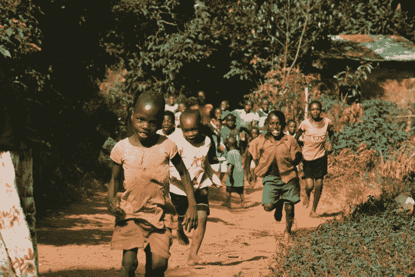
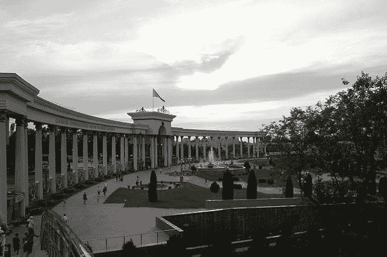
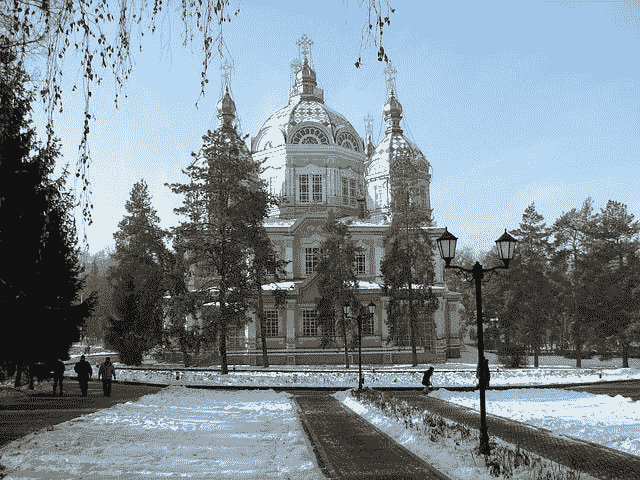

# “人人健康”阿拉木图宣言

> 原文：<https://medium.datadriveninvestor.com/alma-ata-declaration-of-health-for-all-a-generation-old-quest-with-trivial-conquest-2b27cf9b4c4?source=collection_archive---------7----------------------->

## 一代人古老的探索和琐碎的征服

健康是每个人最宝贵的财富，因为我们都有权生活在一个身体、精神和社会和谐的完整状态中，没有痛苦和折磨。但是，时至今日，并不是每个人都喜欢这种神圣的东西。[据联合国统计](https://www.compassion.com/poverty/poverty-around-the-world.htm)估计，截至 2019 年 11 月，目前世界人口为 77 亿。根据《柳叶刀》杂志 2015 年发表的另一份报告，超过 95%的世界人口存在健康问题，超过三分之一的人患有五种以上的疾病。世界人口的 10%目前生活在贫困之中，没有足够的医疗保健和干净的水。它包括 10 亿生活在世界银行每天 1.90 美元贫困线以下的人。

虽然【2000 年至 2016 年全球预期寿命增加了 5.5 岁，达到 72.0 岁，健康预期寿命提高了 4.8 岁，达到 63.3 岁，但进展受到了阻碍，或者说对于特定人群而言，趋势朝着错误的方向发展。五岁以下儿童超重的比例、疟疾发病率、有害使用酒精、道路交通伤害死亡以及水部门官方发展援助。

[贫困是健康不足和健康不良的推动力](https://https/www.healthpovertyaction.org/news-events/key-facts-poverty-and-poor-health/)它以传染性疾病伏击匮乏的社区；和被忽视的疾病，同时每年杀死和削弱数百万最贫困和最脆弱的人，造成疾病和经济灾难的恶性循环。失去的生命是一个受到攻击的经济，破坏生产力和个人价值。

在受影响严重的国家，每年都有数十亿美元的经济活动因艾滋病毒、结核病和疟疾导致的疾病和死亡而损失，除非实施根本解决方案，否则即使是最慈善的基金会也无法维持下去。这让我们想起了 1978 年 9 月在哈萨克斯坦阿拉木图举行的初级卫生保健国际会议(PHC)，当时《阿拉木图宣言》在前哈萨克苏维埃社会主义共和国获得通过。1978 年的宣言被认为是二十世纪公共卫生倡议的重要里程碑，它将初级保健医学定义和定位为实现全球“全民医疗保健”的关键部分。初级保健模式受到 20 世纪 30 年代中国农村重建运动([赤脚医生](https://www.datadriveninvestor.com/2019/11/25/barefoot-doctors-%e8%b5%a4%e8%84%9a%e5%8c%bb%e7%94%9f-and-their-impact-on-launching-chronological-evolution-of-primary-care-medicine/))的启发，该运动通过培训乡村卫生工作者进行初级保健，作为协调系统的一部分。因此，它在 1965 年后正式通过。今天，我们可以欣赏各种当代版本的赤脚医生，如护理人员、执业护士和医生助理。组织该宣言是为了使各国政府、国际组织，包括世界卫生组织(世卫组织)、儿童基金会、各机构、非政府组织、供资机构、卫生工作者和国际社会支持国家和全球对初级卫生保健的承诺。因此，它旨在为其事业，特别是发展中国家的事业提供更多的技术和财政支持。

阿拉木图宣言代表了历史上第一个此类倡议，提出了“人人健康”的愿景，2004 年，微软创始人[再次强调了这一愿景；比尔·盖茨](https://en.wikipedia.org/wiki/Health_For_All)，他建立了全民健康基金会，其使命是复兴叙利亚和非洲等饱受战争蹂躏的地区。虽然这个项目的启动时间表是在 20 年前制定的，但它在 2004 年 1 月 4 日才开始存在。不断发展的全民健康运动的普遍愿景主要是帮助人们生活得更健康、更长寿、更繁荣。尽管直觉具有共同性，但在流行的鉴赏家之间，这一使命是广泛多样化的。

指向当今争议的原因是国际教会之间的社会政治差异。这种差异是关于定义什么是平等、健康、疾病、权利、国家角色和初级保健，就像每个人、文化和社会都有其对化身的解释一样。

总的来说，全民健康是一个解释全球共同使命的合理术语，但我认为无国界医疗从长远来看更为现实。它迫使我们在个人的社会意识形态框架内，将这个定义实际应用到我们打算用于这个使命的每一个短语中。

Image by selyutinm from Pixabay

# 健康和疾病的定义

世卫组织将健康定义为“一种完全的身体、精神和社会福祉的状态，而不仅仅是没有疾病或虚弱。”考虑到资源的可利用性和技术的发展，其目的在于使健康和疾病的常识性内涵在 20 世纪普遍适用的规范中现代化。因此，定义包括社会和经济部门，以实现健康，并重申健康是一项基本人权。今天，我们正生活在 21 世纪的生活方式中。然而，我们不仅要走很长的路才能完成 1978 年开始的旅程。由于科学、技术和通信的世界翻了两番，这就要求对预期、合理和可实现的定义和改革进行重新审视。

# 健康和保健服务的平等以及现实的期望

《阿拉木图宣言》耐人寻味的一面是，它控诉了发展中国家和发达国家在医疗救助方面的不平等。宣言明确强调了这种不平衡的刺激是出于政治、社会和经济动机，因此不符合任何标准。该条约似乎忽略了什么是平等，以及它将是多么的经验性！

在我看来，两个人、两个实体或两个社会之间的平等是由修辞驱动的，因为实际上没有两个主体是完全相同的。此外，它并没有削减每个人都有权享有平等机会的事实。追索权是通过赋予个人最终缩小质量差距的特殊因素。机会的不平等在社会政治上是不恰当的。

需要进一步阐明的一个关键点是承认现实期望的重要性。无论作为负责任的选民或个人，我们的集体壮举可能仍然是多么强大，每个灵魂内的核心个人主义将平衡质量的复制品。我们都必须认可并记住特定背景下的平等，无论是在发达国家还是发展中社会，这绝不是医疗保健质量良好的反映。

# 健康、社会经济和政府在卫生保健服务中的作用

1978 年宣言中的另一段强调了政府在提供适当的健康和社会标准方面的作用。它旨在确保实现“人人健康”；重点是在 2000 年前完成他们的责任。后者演变为世卫组织在次年的后断言运动。它将人人享有健康定义为到 2000 年全世界所有人的成就。在世卫组织的支持下，然而，截至 2019 年，这一使命远未完成。该法令还敦促各国政府、国际组织和全世界的选民将这一目标作为友好正义本质中的一个重要的公民标志。

Image by David Mark from Pixabay

# 初级保健，是医学还是官僚主义？

根据世卫组织采用的 1978 年时代的标准定义，初级卫生保健被认为主要是以科学为基础的基本卫生保健系统。一种合理的、社会可接受的、包括技术在内的医疗实践，使社区中的所有个人和家庭都能获得普遍的医疗保健。它仅仅包括由具有更广泛技能的医生对常见问题的标准治疗，这些技能包括家庭实践、儿科、内科、妇产科。虽然这种战略在理论上可能有一个令人失望的标准，但在 21 世纪的应用中，它面临着重大挑战。

初级保健是一个管理式的保健概念，它仅仅关注于将大部分的责任负担放在具有广泛技能基础的医生身上，而不是放在短的子专业上，希望降低成本并创建一些组织。初级保健的概念适用于 20 世纪，因为患者对信息的获取受到限制，受到有限的科学和技术水平的限制，因此期望较低。相比之下，今天，即使是社会经济条件差的人也能获得信息。

护理标准已经多样化；初级保健医生将承担更广泛的职责。更不用说遵循传统医疗实践的庞大官僚机构了。初级保健在美国已经存在了三十多年，仍然是引起医生职业倦怠的重要争议话题。这一趋势可能会面临更多的挑战；以及[价值基础报销](https://link.medium.com/4SiOXl8As1)模式的出现。在过去的几十年中，普遍的误解是通过扩大[联盟医疗保健提供者的范围来改善初级保健服务的供应，以涵盖最初由医生承担的一些基本职责](https://link.medium.com/On1n0KyCs1)。但是，让执业护士、医师助理等联合提供者减轻负担并没有起到多大作用，因为它只代表了不同功能下能力的扩大。

受过教育的人不渴望在恶劣、贫困的条件下工作，生活在服务水平低下的社区。他们期待更好的生活。让服务不足的社区成为一个更好的居住地总是更可取和必要的。它正在创造一个健康的环境，培养他们并为他们提供获胜所需的后勤支持，而不是不分青红皂白地零零碎碎地资助这项事业，并在没有适当战略来增强该群体中每一个成员的权能的情况下执行协议和任务。

# 对《阿拉木图宣言》的批评和反应

主要的挑战是缺乏选择和机会，而不是可用性和财政援助不足。可以理解的是，财政支持和规划资源在初始阶段至关重要，但如果没有解决方案和监管措施的支持，来管理选区手中储备金的适当分配，这又有什么用呢？

联合国儿童基金会、世卫组织和其他世界组织可以利用捐赠和临时劳动力通过组件提供 Kickstarter。然而，底线在于政府向他们的公民伸出援手，不是通过强迫的千篇一律的命令，而是高级别的监督和行政监视。

人人享有健康是一种美化了的观点，认为人人都有保持健康的平等机会。没有社会经济和地理界限的医疗保健是一个实用的术语，因为在现实世界中没有人能保证健康的生活。因为即使有所有的选择和资源，每个人有限的能力支撑着强大的野心。医生的角色正在不经意间向内疚者转变，从积极的参与转变为过时的官僚协议的被动奉献者。这仅仅是在他们应该扩展思维，将技术和数据科学纳入其中的时候发生的事情。相反，医生的实践已经被公司官僚所接管。

人口健康协议不能满足当代医疗实践。在医生短缺的[错误假设下，它未能试图处理在给定时刻日益增长的期望和医生权力的不良分配。《阿拉木图宣言》是官僚解决方案不足的一个明显例子，这不是因为它不切实际或装饰性，而是因为它已经过时，而且适应其他行业变化的步伐缓慢。该条约将创造一个真空，让更多的迫切愿望面临挑战。结果就是我们今天看到的；支出、成本高、交付差，甚至成本更高的恶性循环。值得一提的是，在没有考虑到每个社区独特性的重要性的情况下，将精确的解决方案应用到每个人身上是失败的。](https://link.medium.com/1P2424ABs1)

在人口健康领域应用实用模型还需要一种民粹主义的态度，以及政策的[威权主义氛围。在系统向社会自治转变的时代，面对互联网和数据自由，这种方法注定会过时。](https://link.medium.com/GN85ZoECs1)

# 个性化是公平灵活的选择，而不是义务。

没有人有义务确保他人的护理质量，即使它是好的！考虑到这一点，由当局的客观授权或其成员的主观责任感所驱动的事业最终注定是短暂的，并倾向于伤害个人，因此适得其反。需要扭转影响人们的受害循环，通过不带偏见地提供选择和机会来增强他们的权能。面对必要的启示，选择和选择的多样性培养了好奇心。反过来，好奇心是所有诱惑和自我实现之母。奖励善行是健康生活的关键，这是上一次宣言中所没有的特征。《阿拉木图条约》将义务和责任的重担放在了组织、政府和行政部门身上，在大多数情况下，这些组织、政府和行政部门首先是造成社区卫生保健可及性差的因素。

《宣言》将贫困归入需要更高权威来帮助他们忍受的不负责任和不聪明的人群。然而，我不同意！任何人生来都有生存和战胜一切困难的能力。每个人都拥有自己独特的天赋，不管他们是否受过正规教育。但是他们仅仅是被偏执和法西斯主义的垄断文化所统治的环境的受害者。在通过多方面的合作紧紧抓住改革之前，必须切断循环。这可以通过[去中心化和](https://link.medium.com/IY9xQGYAs1)个性化来实现。

*原载于 2019 年 11 月 29 日*[*【https://www.datadriveninvestor.com】*](https://www.datadriveninvestor.com/2019/11/29/alma-ata-declaration-of-health-for-all-a-generation-old-quest-with-trivial-conquest/)*。*

 [## Barefoot Doctors (赤脚医生), and their impact on launching chronological evolution of primary care…

### 医学是治愈和超越的科学。它仅仅是传达身体的综合状态…

medium.com](https://medium.com/datadriveninvestor/barefoot-doctors-%E8%B5%A4%E8%84%9A%E5%8C%BB%E7%94%9F-and-their-impact-on-launching-chronological-evolution-of-primary-care-fbcbb26be0b0)