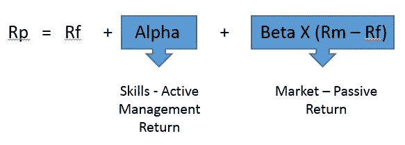
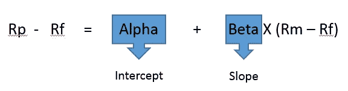
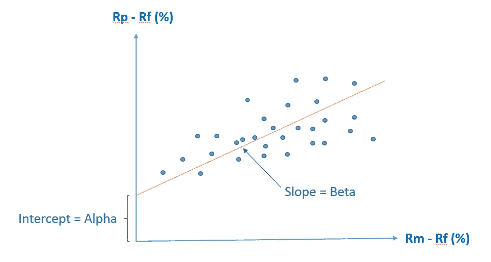
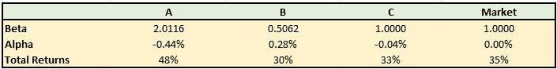
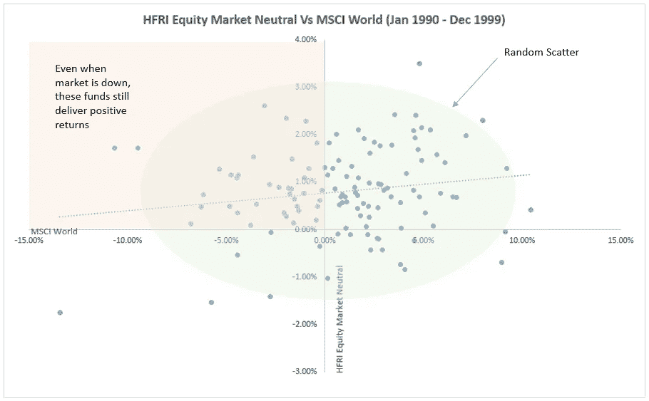
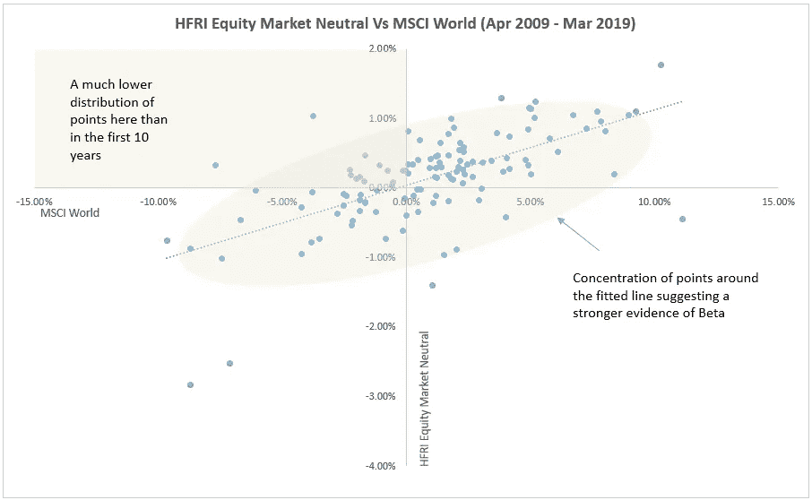

# 阿尔法和贝塔——评估你的投资经理

> 原文：<https://medium.datadriveninvestor.com/alpha-and-beta-sizing-up-your-investment-manager-bb0390641c09?source=collection_archive---------5----------------------->

Image by [Jens S.](https://pixabay.com/users/juvonse-2196580/?utm_source=link-attribution&utm_medium=referral&utm_campaign=image&utm_content=1250626) from [Pixabay](https://pixabay.com/?utm_source=link-attribution&utm_medium=referral&utm_campaign=image&utm_content=1250626)

阿尔法和贝塔是两个非常常用的希腊术语。尤其是对冲基金，每天都在使用这些术语。甚至媒体都用这些词，好像每个人都知道它们是什么。有时候，你想知道你要忍受投资专业人士多少胡言乱语。

幸运的是，你不需要有火箭科学学位就能理解这些术语的意思。它们是相对简单的概念。α和β都是密切相关的。投资专家将它们用于各种目的，如衡量风险、构建投资组合和评估投资业绩。这篇文章关注最后一点。

 [## 股票市场投资的机器学习——数据驱动的投资者

### 当你的一个朋友在脸书上传你的新海滩照，平台建议给你的脸加上标签，这是…

www.datadriveninvestor.com](https://www.datadriveninvestor.com/2019/01/30/machine-learning-for-stock-market-investing/) 

# 我们如何获得回报很重要

人们往往过于强调绝对回报。但是更高的回报并不一定意味着更好的表现。如果你读了我之前关于[风险调整回报](https://investmentcache.com/risk-adjusted-returns/)的文章，你就会明白我的意思。

例如，投资经理可以利用杠杆买入一篮子标准普尔 500 股票。在股市同比上涨的牛市中，他的绝对收益将超过标准普尔 500。但实际上，在繁荣时期，增加风险并获得比市场更高的回报没什么大不了的。我们想知道的是，他是否提供了更多物有所值的东西，而在这种情况下，他没有这样做。任何人都可以做他所做的。因此，如果我们不深究，只看结果，我们可能会过早地认为这位经理拥有一些高超的技能。

另一方面，另一个投资经理从标准普尔 500 股票宇宙中选择股票并构建自己的投资组合。他没有使用任何杠杆，表现不如标准普尔 500。在这一点上，我想大多数人会很快认为他不称职。但这不是一个公平的评估。因为我们不知道他承担了什么样的风险，是什么推动了他的回报。他很可能承担了比市场低得多的风险，并提供了比这些风险的预期更多的回报。

那么阿尔法和贝塔在所有这些中处于什么位置呢？阿尔法和贝塔是另一种简单的方式来呈现风险和回报，以进行更客观的评估。让我们看看它是如何工作的。

# 阿尔法和贝塔——分离被动和主动回报

假设我们管理着一个从标准普尔 500 成份股中挑选出来的股票投资组合。那么是什么推动了这个投资组合的回报呢？直观地说，我们可以把它分成两个部分——来自市场风险敞口的被动回报部分；以及我们通过投资策略增加的价值中的积极回报部分。我们可以很好地总结如下:

其中 Rp 是投资组合回报率，Rm 是市场回报率，Rf 是无风险利率。这只是著名的[资本资产定价模型(CAPM)](https://en.wikipedia.org/wiki/Capital_asset_pricing_model) 的延伸。

由此，猜测α和β是什么意思应该不会太难。先说 Beta。贝塔系数是衡量投资组合对市场的风险敞口。作为回报，投资组合按比例获得市场风险溢价，即市场给出的超过无风险利率的超额回报(Rm-Rf)。如果投资组合的贝塔系数为 1，那么市场每变动 1%，它就会变动 1%。如果贝塔系数是 0.5，那么市场每波动 1%，投资组合就会波动 0.5%。现在，投资组合回报的任何其他差异都不能用这些市场运动和无风险利率来解释，而是归因于投资经理的技能或策略。这就是阿尔法。

# 我们如何计算α和β？

α和β可以使用历史数据作为线性回归参数进行统计估计。让我们重新排列前面的等式。

如果我们对此进行回归，β就是拟合线的斜率或梯度。它告诉我们投资组合回报对市场的敏感度。α是截距。一个正的阿尔法值表明经理在增加价值时可能有一些技能。当然，负α表示相反的情况。

# 简单的虚构插图

为了了解我们如何使用 Alpha 和 Beta 来评估投资经理，我创建了 3 个虚构的投资经理 A、B 和 c。他们都是在同一市场交易的股票经理。但每个人都有自己的风险偏好、股票选择和加权方法。所以，最后，这三种方法都会产生不同的结果。我们不知道他们的确切方法，也不知道他们的投资组合构成。假设我们只有市场和他们的月度回报序列。基于这些，我们可以运行一个回归，并估计他们各自的阿尔法和贝塔。见下表。

Results are based on regression of monthly returns

**解读数字**

经理 A 咄咄逼人。他的贝塔系数最高。他的投资组合可能集中在高贝塔股票上，或者他可能在利用杠杆放大他的回报。这也是他的绝对总回报高于市场和其他经理人的原因。但是不要急着让他成为冠军。因为他的阿尔法值为负，表明他可能缺乏关键的选股和投资组合构建技能。如果经理 B 和 C 使用和他一样的风险水平，他们可以轻而易举地击败他。

经理 B 似乎是最保守的。在这三个人中，他的绝对回报率最低，只有 30%。但是在你解雇他之前，他实际上也是给我们带来最大收益的人。在此期间，他只使用了 A 所承担风险的四分之一和 C 所使用风险的一半。除此之外，他是唯一一个阿尔法值为正的人，并且遥遥领先。这表明经理 B 可能比 A 和 c 都有更好的技能

经理 C 看起来与市场紧密相关，贝塔系数为 1，绝对回报和阿尔法系数略低。一种可能的情况是，他只是在复制市场。这可以解释为什么他的 Beta 接近 1.0。表现稍差可能是由于费用和任何其他相关成本。

# 真实世界的插图

现在，让我们把它扩展到一个使用股票市场中性对冲基金的真实例子。这些基金出售自己的选股技巧，并致力于在任何市场条件下实现盈利。从数学上来说，他们希望去除贝塔，几乎完全依靠阿尔法生存。为此，他们选择好股票做多，坏股票做空。多头仓位给你一个正 Beta，而空头仓位则相反。当这些位置被仔细校准时，总β可以为零。剩下的就是阿尔法，这在很大程度上取决于他们选股的技巧有多好。实际上，这并不容易，因为 Beta 不是一个静态的数字。但就我们的目的而言，我们将只是回顾历史，看看他们的进展如何。

在这项研究中，我们使用以下指数:

1.股票市场中性——代表市场中性对冲基金

2.世界—代表股票市场*

*   *请注意，鉴于对冲基金在策略和构成上的广泛自由度，为它们选择一个合适的基准或市场并不简单。大多数对冲基金采用绝对回报目标或同行策略基准。*

**36 个月滚动阿尔法和贝塔**

我们来分析一下 1990 年 1 月至 2019 年 3 月期间的市场中性资金。如果你还记得，我之前提到过α和β不是一些永恒的静态数字。它们随着市场环境而变化。事实上，无风险利率也不是一个常数。但是，除了变化本身，市场几乎没有什么是不变的。因此，对我们来说，在整个 30 年期间进行单一的回归分析没有多大意义。这两种方法都不可行，因为我们需要这些数字来合理估计α和β。因此，让我们在 36 个月的滚动基础上这样做。为简单起见，我们还假设在整个练习中，无风险利率保持在每年 1%。下面的情节是我们得到的。

从图表中我们可以确定一些事情。首先，它向我们表明，市场中性基金几乎名副其实。他们运行一个相当低的 Beta 值，在-0.1 到 0.2 之间。但是有一个明显的趋势，他们的 Beta 在增加。第二，他们确实在大部分时间提供了正 alpha。然而，阿尔法显然也在往南走。此时，他们的阿尔法几乎不存在，回报由贝塔驱动。

**回归图**

一幅画胜过千言万语。所以有时候看回归图也是有用的。我们可以从中收集有用的信息，而不需要进行复杂的统计分析。我加入了更长时间的数据来得到这些图。基本上，我为 1990 年 1 月至 1999 年 12 月的前 10 年做了一次，为 2009 年 4 月至 2019 年 3 月的后 10 年做了一次。这只是为了看看事情是如何变化的。这里的重点不是绝对的阿尔法数或贝塔数，而是分布。

仅仅通过观察两个图中的点的分布，就不难注意到差异。在第一幅图中，这些点看起来更加随机地分散。这符合市场中性经理人想要实现的目标，即与市场不相关的回报。但更令人印象深刻的是，他们的大部分月回报率都位于正的上半部分。如果我们放大红色部分，我们会发现这些人即使在摩根士丹利资本国际全球市场下跌时，也能带来大部分正回报。第二幅图展示了一幅截然不同的画面。这些点明显地集中在拟合线周围，在正负区域上分布更加均匀。

这与滚动的阿尔法和贝塔向我们展示的相吻合。但是为什么会出现α变差，β增大的情况呢？管理者是否丧失了技能？或者，这可能是发达股市中大型股和中型股过度拥挤的结果，要想获得像样的回报，唯一的办法就是接受贝塔。

# 阿尔法和贝塔不会告诉你一切

在这一点上，我必须提到，没有一个单一的指标是完美的。所有这些都有自己的一套假设，但没有一个能告诉我们完整的情况。阿尔法和贝塔也不例外。

首先，我们不能随便挑选一个市场，或者根据你计算阿尔法和贝塔的一时兴起来形成一个综合基准。例如，我们不能用固定收益指数作为纯股票基金的市场。这没有任何意义。显示股票基金相对于不相关的固定收益指数的贝塔系数较低的结果是没有意义的。无论我们得到什么阿尔法值，都被未被解释的消极股票市场回报所污染。我们选择的指数应该尽可能地代表基金投资的内容。

然而，知道我们需要正确的市场并不意味着我们总能找到它。并非所有基金都在一个明确界定的范围内奉行狭隘的只做多策略。尤其是对冲基金，它们经营着大量跨越不同地区、资产类别和时间框架的策略。这些会随着时间的推移而演变，使得基准选择成为一个巨大的挑战。

例如，由于缺乏更好的选择，我们在研究中使用摩根士丹利资本国际世界指数作为市场。但这是否是一个合适的基准值得怀疑，尤其是在 90 年代早期。在那段时间里，没有多少市场中立或大型对冲基金，如果许多基金管理着名字集中的小型投资组合，我也不会感到意外。相比之下，摩根士丹利资本国际世界是一个大型多元化指数，有超过 1000 只成份股。他们的作文可能会相差甚远。

# 离别的思绪

我们看到的适用于单一资产的基金。采取多资产策略的基金怎么样？那么单一因素模型不再足够。然而，我们总是可以将其扩展到一个多因素模型中，每个因素代表特定资产类别的风险溢价。概念保持不变。我将留给你一些时间来消化这些信息。在那之后，恭喜你，你可以在你的词汇中增加两个希腊单词了。

*原载于 2019 年 4 月 26 日*[*【https://investmentcache.com】*](https://investmentcache.com/alpha-and-beta-sizing-up-your-investment-manager/)*。*