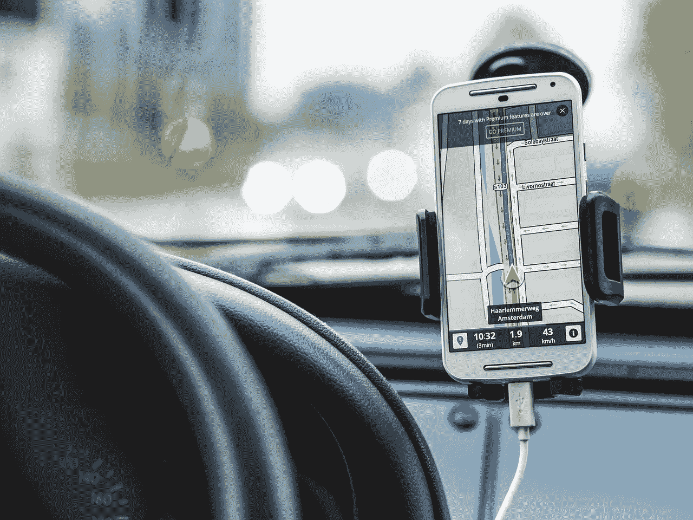
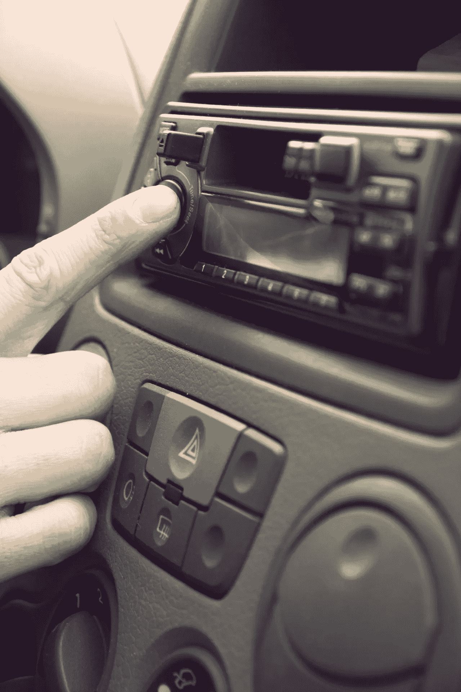

# Alphabet 想把你的汽车变成一个安卓设备

> 原文：<https://medium.datadriveninvestor.com/alphabet-wants-to-turn-your-car-into-an-android-device-19d07a974de8?source=collection_archive---------5----------------------->

**Alphabet(纳斯达克股票代码:GOOG)** 想把你的汽车变成一个安卓设备。因此，谷歌可以在几年内从你的车上收集数据。

解释一下， **Alphabet (NASDAQ: GOOGL)** 正在向第三方应用开放其 [Android Automotive](https://source.android.com/devices/automotive) 操作系统， *Business Insider* [报道](https://www.businessinsider.com/google-opens-android-automotive-os-third-party-apps-2019-5)。因此，汽车应用程序的开发者可以把它们卖给司机。

 [## 在自动驾驶汽车发生事故的情况下，谁应该承担法律责任？-数据驱动型投资者

### 我仍然认为自动驾驶汽车是一种奢侈品，而不是必需品…

www.datadriveninvestor.com](https://www.datadriveninvestor.com/2018/11/02/who-is-legally-accountable-in-the-case-of-an-autonomous-vehicle-accident/) 

目前，只有媒体应用；像 Spotify 一样，司机也可以使用。然而，沃尔沃正在 Polestar 2 电动汽车中安装 Android Automotive。

# **克莱斯勒、吉普车和道奇将很快成为安卓设备**

此外，Alphabet、**菲亚特克莱斯勒(NYSE: FCAU)** 、和三星正在合作将 Android Automotive 添加到菲亚特克莱斯勒的所有车辆中，*底特律自由新闻* [报道](https://www.freep.com/story/money/cars/chrysler/2019/04/30/fiat-chrysler-google-samsung/3621796002/)。

重要的是，[菲亚特克莱斯勒](https://marketmadhouse.com/fiat-chrysler-has-more-value-than-you-think/)，或 FCA，拥有几个主要品牌；包括道奇、公羊卡车、玛莎拉蒂、阿尔法罗梅罗和吉普。具体来说，到 2022 年，所有 FCA 车辆都将采用 Android Automotive。

这可能会为 Alphabet Auto 带来一个巨大的市场，因为菲亚特克莱斯勒 2018 年在美国销售了 223.5 万辆汽车。而且， *FCAuthority* [预估](http://fcauthority.com/fiat-chrysler-automobiles/fiat-chrysler-automobiles-sales-numbers/)，FCA 2019 年第一季度销量为 4984.35 万辆。

最后，Alphabet 的自动驾驶汽车子公司 [Waymo](https://waymo.com/) ，正在亚利桑那州的 rideshare 实验中使用克莱斯勒 Pacifica 小型货车。因此，菲亚特克莱斯勒将很快成为 Alphabet 平台的一部分。

# **安卓汽车如何杀死无线电台**

因此，Alphabet 将在北美与**Sirius XM Holdings(NASDAQ:SIRI)**展开直接竞争。

解释一下，[天狼星](https://marketmadhouse.com/will-sirius-and-pandora-make-money/)；该公司向美国的司机出售音频娱乐产品。然而，Sirius 可以通过提供 Pandora 和 Android Automotive 上的 Sirius 应用程序来赚钱。

此外，Android Automotive 可以通过向所有司机提供免费服务来扼杀美国的无线电台；或者低价获得大量的娱乐。例如，司机可以从 Spotify 上的数万首歌曲中进行选择，而不是从当地的音乐节目中选择。或者如果你喜欢喜剧，你可以从成千上万的单口喜剧中选择。

# 【Spotify 能拯救地方电台吗？

此外，驾驶员可以在英国广播公司、NPR、福克斯和其他几个音频新闻源之间进行选择，而不是收听当地新闻。最后，那些寻求评论的人可以听数百名音频专家，而不仅仅是 T4 的拉什·林堡。

另一方面，本地新闻将受到影响，因为内容提供商将没有什么动力去报道地区或本地事件。因此，小型和地区性企业的广告选择将会减少。

然而，Spotify 可能有一个“通勤播放列表”的部分解决方案，该播放列表融合了播客和音乐，音乐:)Ally [报道](https://musically.com/2019/05/02/spotify-tests-commuting-playlist-blending-podcasts-and-music/)。因此，以当地新闻、交通、音乐或评论为特色的播客可能是合乎逻辑的结果。有一点是肯定的；如果拉什·林堡想在五年内找到工作，他现在就需要上 Spotify。

# 【Alphabet 如何从 Android Automotive 中赚钱

Alphabet 可以通过许多方式从 Android Automotive 赚钱。

例如，Alphabet 可以收集关于司机和驾驶习惯的数据。我认为保险公司、营销商、汽车制造商、政府和许多其他人会购买这些数据。值得注意的是，保险公司如 **Progressive(纽约证券交易所:PGR)** 和 GEICO 已经通过 Wi-Fi 设备如 [Snapshot](https://www.progressive.com/auto/discounts/snapshot/) 监控驾驶习惯。

此外，开发人员可以创建应用程序并将其出售给司机。例如，一个帮助司机找到镇上最便宜的燃料的应用程序。此外，麦当劳(NYSE: MCD) 可以提供一个免费的应用程序，引导饥饿的司机到其免下车窗口。

迪士尼可以为孩子们提供视频娱乐，让他们坐在妈妈的小货车后座上观看。同时，**腾讯控股(OTC: TCEHY)** 或**电子艺界(NASDAQ: EA)** 可以向公交车或拼车乘客出售游戏。拼车用户甚至可以在去机场的路上完成亚马逊[机械土耳其](https://www.mturk.com)上的微任务来赚取额外的现金。

# 【Android Automotive 如何帮助您在未来赚钱

理论上，优步或 Waymo 可以提供一款应用，将你的无人驾驶 SUV 变成拼车。解释一下，SUV 早上开车送你去办公室。

然而，你的 SUV 不会在停车场积灰，而是花一整天的时间在镇上运送付费乘客，或者为 Instacart、 [Jetblack](https://www.jetblack.com/about) 或 [Ocado](https://marketmadhouse.com/ocado-tests-driverless-grocery-delivery-supervalu-teams-with-instacart/) 递送包裹。因此，你的自动驾驶汽车可以自己付钱。

要么是人工智能；或者使用像 Aitheon 这样的系统的远程驾驶员，可以驾驶车辆。值得注意的是，Aitheon [在 2017 年展示了](https://marketmadhouse.com/revolutionary-blockchain-platform-aitheon-contracted-ride-sharing-concept-carsmartt-build-driver-less-delivery-vehicle-fleet/)一辆由 FCA 制造的无人驾驶 Jeep Rubicon。重要的是，Aitheon 的吉普车在遥控下完成了加州危险的 Rubicon Trail 越野课程。

# **Android Automotive 和 Aitheon 如何通过区块链赚钱**

一个媒体帖子透露, [Aitheon 的最终目标](https://medium.com/@AitheonOfficial/aitheons-pilot-program-is-a-proof-of-how-ai-and-robotics-can-create-jobs-292dd50855)是一个[区块链生态系统](https://aitheon.com),它将让承包商通过作为“Aitheon 飞行员”操作遥控车辆来赚钱。因此，在几年内，你可以雇一个“数字司机”开着你的小货车送你的孩子去练习足球。

此外，有一天你可以通过把优步从你的沙发上赶走来赚取额外的现金。解释一下，[虚拟现实](https://onezero.medium.com/oculus-quest-is-vr-for-normal-people-cfc322d6ba84)将让你看到你遥控的汽车通过摄像机“看到”的东西。

在这种情况下，我认为 Android Automotive 可能会成为 Alphabet 的一个巨大的赚钱机器。此外，Android Automotive 可以提升使用其平台的公司的价值。因此，投资者和开发者需要密切关注安卓汽车。

*原载于 2019 年 5 月 6 日 https://marketmadhouse.com*[。](https://marketmadhouse.com/the-revolt-against-culturism-explains-modern-politics/)**