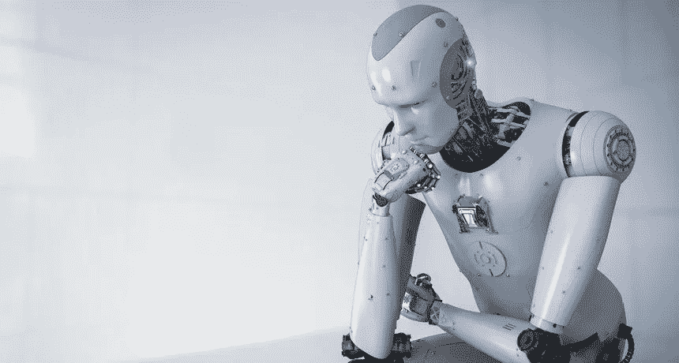
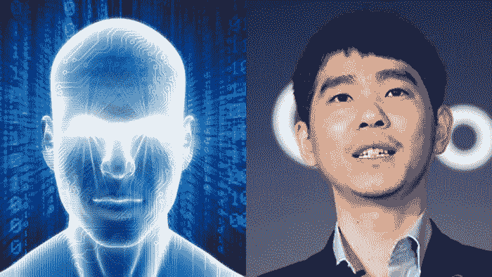
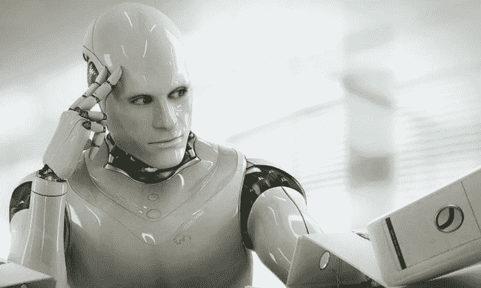
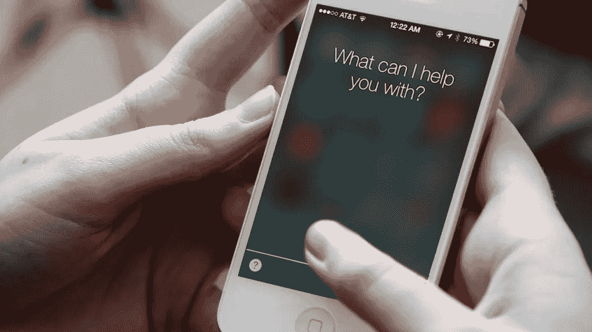

# AlphaGo vs Siri:性别刻板印象如何应用于人工智能

> 原文：<https://medium.datadriveninvestor.com/alphago-vs-siri-how-gender-stereotype-applied-to-artificial-intelligence-72b0dcbd61c6?source=collection_archive---------2----------------------->

Alphago vs Lee Sedol 是人类历史上最具纪念意义的比赛之一。这场比赛证明了人工智能可以打败人类，这勾起了我们对在不久的将来被机器人取代的焦虑。在比赛期间，媒体将 AlphaGo 描绘成一个超级聪明、有能力、最重要的是“具有威胁性”的人工智能体。媒体报道中使用的 AlphaGo 的实际图像代表了人们对强大的人工智能的看法。

在谷歌图片搜索上搜索‘人工智能’，你得到的就是这些照片。我发现，即使这些图像有细微的差异，但它们有一个共同点。**他们看起来都像男性**。他们具有典型的有魅力男性的身体特征:平衡的宽肩膀，平坦的胸部，像下巴这样的男性面部特征，等等。

另外，如果你仔细看他们的脸，你会发现他们肯定既不是亚洲人也不是黑人。非常有趣的是，大多数图像看起来像一个高加索人。

## **那么，为什么人们会把一个高加索男性形象和 AlphaGo 这样强大的人工智能联系在一起呢？**

智能人工智能具有更多男性特征而非女性特征的说法是有争议的。因为大多数常用的代理如 Siri 或 Alexa，女性特质多于男性。那么，为什么 AlphaGo 被描绘成男性，而 Siri 是女性呢？

## 答案很简单:性别刻板印象

Siri 和 AlphaGo 的主要区别在于它们的角色。AlphaGo 旨在击败一名人类围棋选手，Siri 旨在帮助人们的日常生活。竞争和争斗被认为是更男性化的活动，但几千年来，照顾他人一直是女性的家务活。因此，这表明人工智能的性别与人们对其期望的角色密切相关，因此，这表明人工智能的性别与人们对其期望的角色密切相关，而这些期望通常基于人类社会的性别刻板印象。

此外，在媒体中，专业和知识分子角色通常由男性演员扮演，而温暖/顺从的角色则由女性扮演。因此，像 AlphaGo 或 Watson 这样高度发达的技术有一个男性名字并被塑造成男性，而像 Siri 和 Alexa 这样的人工智能助理或秘书身份则有一个带有女性身份的女性声音。

公平地说，公司和媒体试图将人工代理放入人类社会的等式中是有原因的例如，当新技术与他们自己的刻板印象不匹配时，用户更有可能感觉到更多的负担。一方面，人工智能的性别刻板印象可以有效地使用户接受和熟悉代理，但另一方面，它可能会通过强化社会刻板印象产生负面影响。

我认为现在是质疑这个问题的时候了。如果技术的发展是为了人类更好的生活，那么基于偏见的 AI 技术会改善我们的生活吗？公司不仅应该考虑技术的有效性，还应该从长远角度考虑它将如何影响我们的生活和思想。