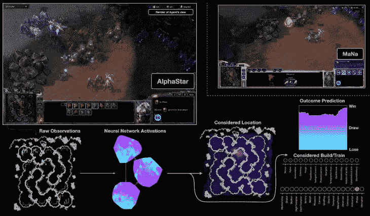
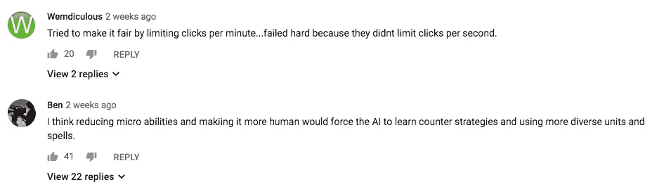

# AlphaStar 的策略可能对星际争霸 2 不好，但对人工智能很好

> 原文：<https://medium.datadriveninvestor.com/alphastars-strategies-might-be-bad-for-starcraft-2-but-they-re-great-for-ai-c0a879564da2?source=collection_archive---------2----------------------->

无论你是星际迷还是对人工智能感兴趣，观看 AlphaStar 以 10 比 1 击败 pros 都非常酷。

最酷的时刻，如果你知道星际争霸，你会跳起来说“哇！它能做到吗？!"就像我下面链接的视频中的部分。

我先解释一下正在发生的事情。蓝色蜘蛛模样的机器人是追踪者，受阿尔法星控制。他们是相对较弱的单位，但是他们拥有短距离传送的能力，并且拥有可以随时间充电的护盾。

所以 AlphaStar 正在做的是让它的一些潜行者受到伤害，然后立即使用传送能力旋转到后面，同时将新的潜行者旋转到前面。这使得战斗中的潜行者可以重新充能护盾，然后消耗掉人类玩家的力量。

现在看下一分钟左右的视频(听听评论员的声音有多惊讶):

这种潜行者轮换是真正高水平的人类玩家才会做的事情，但每次只有几个潜行者。没有人能如此完美、如此快速地微观管理如此多的单位。

如果你观看了所有的比赛，难以置信的微观管理(或者我们在星际争霸圈内称之为微观)显然是 AlphaStar 的核心优势。它同时对许多单位进行完美指挥的能力意味着，AlphaStar 会一次又一次地陷入人类可能会输掉的战斗，然后取得胜利。

如果你带着一群基本上不可杀的单位跑来跑去，你可以在战略层面弥补很多愚蠢。这也是最终 MaNa(人类职业)的原因，尽管他经常处于更好的战略位置——他不断将单位带入可以战胜人类对手的战斗中，然后被 AI 撕成碎片。

在评论板和 reddit 上，我看到很多“它赢了，因为它能更快地点击！”"我们应该把它限制在人类 APM[每分钟动作数]！"“让它使用键盘和鼠标！”“Nerf 神族！”(好吧好吧没人说最后一个虫族还是 OP)。

这个论点有一定的价值。这将迫使 AlphaStar 更加依赖长期战略和高层思维，并有可能产生

但我认为，这其中一定程度上是基于自我，一种想说“这不公平！如果它受到和我们这些肉包一样的限制，我们会打败它的！”这有点跑题了。

是的，如果一个人工智能本质上能够发现并执行无与伦比的、打破游戏规则的策略，这对星际争霸 2 来说确实有点糟糕。但是让我们退后一分钟。尽管我们可能会有不同的想法，但谷歌 Deepmind 不会为了世界电子竞技社区的利益而在 R&D 上花费数百万美元。

研究星际争霸的全部目的是推动人工智能在解决困难、复杂问题方面的发展。从这个角度来看，如果人工智能能够找到一个无与伦比的策略，那就太棒了。

目标是能够将这种研究应用于其他领域的问题，在这些领域中，你希望计算机利用其所有的优势来找到解决挑战性问题的最佳方案。你认为如果一个人工智能提出了无与伦比的群体空战战术，军方会抱怨吗？或者，如果一个人工智能发现了如何部署成群的无人机来遏制快速蔓延的森林大火，那会更和平，也更与加州相关？

AlphaStar 的魅力和令人兴奋之处不在于它能够使用比人类玩家更快、更准确的点击策略来获胜。而是它能够在第一时间提出这个策略。

理解已经取得的进步的一个方法是做一个历史比较。早在 2010 年，我是一个团队的成员，为一场人工智能比赛制作了一场星际争霸赛。巧合的是，目前 Deep Mind 团队的负责人 Oriol Vinyals 也是这项工作的一部分。

[那个被称为伯克利超人的 AI 赢得了比赛](https://arstechnica.com/gaming/2011/01/skynet-meets-the-swarm-how-the-berkeley-overmind-won-the-2010-starcraft-ai-competition/)。它也依赖于不虔诚的微观技能。特别是它使用了飞龙，这是一种快速但脆弱的飞行单位，会造成很大的伤害。

人工智能成功的关键也是一种打破游戏规则的利用。游戏中其他用来对抗飞龙的单位依赖于飞溅伤害，这种伤害会伤害小范围内的所有单位。

这是因为飞龙数量多的时候最致命，但是为了让人类玩家有效地控制它们，他们必须聚集成一个群体。一个人不可能同时独立控制几十个独立的单元。人工智能没有这种限制。

你可以在下面看到一个结果的例子:飞龙能够成群结队地飞来飞去，挑选出它们在人与人的比赛中不可能击败的强大敌人。

我们甚至使用了一种简单的学习算法:控制飞龙的人工智能依赖于控制何时分散开来以避免伤害以及何时集中攻击的势场。控制这些潜在场的参数是通过在我们称为瓦尔哈拉的系统中运行人工智能经过数百次重复的战斗来找到的，以找到参数的最佳组合。如果你足够仔细地看，这就像是 AlphaStar 与它自己的变体反复比赛的原始版本。

但是伯克利超人和阿尔法星之间有一个非常关键的区别。主宰的策略是人类精心设计的。团队成员中的许多人都是星际争霸的狂热玩家，他们看了游戏后决定飞龙是人工智能控制的理想选择。它们会飞，所以它们不需要寻路来躲避障碍，游戏中对它们的平衡依赖于人类注意力的极限。

这就是我们决定使用飞龙的原因。然后我们设计了用于控制变异体的潜在场控制器。此外，一旦巨大的穆塔死亡之球滚动起来，它几乎不可能被击败，但在它产生足够数量的飞龙之前，聪明的玩家有许多方法可以扰乱人工智能的策略。所以我们必须手工编写一些早期游戏策略的计数器。

伯克利的“超人”,当它开始滚动的时候，是一个美丽的东西。但整个建筑是由人类专家在很长一段时间内精心手工建造的。它很脆，不太柔韧。

AlphaStar 的美妙之处在于，随着时间的推移和重复，该系统能够发现并掌握获胜策略，而不是让人类监督员选择精心挑选的策略。它不仅限于一个动作。相反，它能够发现多种方式来玩和赢。

我会给你们留下一些动作，这些动作可能是我完全控制人工智能的高潮。阿尔法星不仅完成了完美的跟踪者旋转，它同时从多个方向攻击马纳的军队，直到他完全被撕碎。

所以是的，如果你是星际争霸 2 的粉丝，看到一个人工智能通过做只有人工智能才能做的事情而获胜可能会有点沮丧。但是，如果你对人工智能如何被用来寻找重要、困难问题的新颖解决方案感兴趣，那么未来确实是光明的！