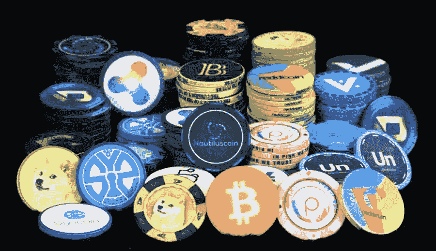
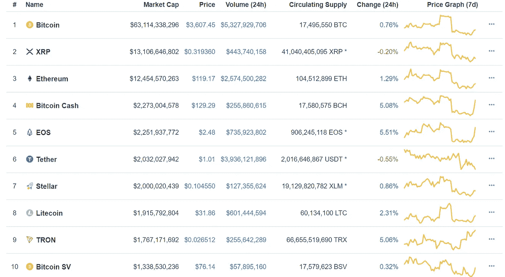

# 死后替代硬币

> 原文：<https://medium.datadriveninvestor.com/altcoins-post-mortem-88cd41f4a8ff?source=collection_archive---------27----------------------->

## -重新定义替代货币-

> 改变我的想法…

比以太坊本身更古老的术语“替代币”已经被加密社区用来指代任何和所有不是比特币的数字资产。这包括估值高达 1330 亿美元的项目(以太坊大约在 2018 年 1 月)，以及价值从未超过 1 万美元的项目(只需滚动到 [Coinlib.io](http://coinlib.io) 或【Coinmarketcap.com】T2 的无底深渊)

考虑到今天市场参与者有可能使用加密货币*而不是*比特币进入加密世界(更不用说除了购买之外的累积方法【请查看 [LOOM networks 关于游戏奖励采用的概念](https://medium.com/loom-network/games-will-be-the-catalyst-for-blockchain-mass-adoption-628f818c6c87))；或许是时候让我们用新的视角来看待数字资产，重新定义替代货币了。

似乎自从 2018 年的秘密投降以来，整个秘密世界都开始唱关于替代硬币的死亡之歌。围绕 ALT 的不信任和否定实际上变得如此极端，以至于创造了一个全新的身份来解决它们；也许你可能听说过“史*币”这个术语。

这是可以理解的。很明显，过去的一年让人们疲惫不堪。见鬼，我自己也被几袋金币困住了。

但是，让市场扭曲和被操纵的情绪状态来判断价值是不公平的。

让我试着描述一下:

听说过**以太坊**吗？——(如果没有，请参考:[**https://www.ethereum.org/**](https://www.ethereum.org/)**)**

听说过 **Tron** 吗？——(如果没有，请参考:[**https://tron . network/**](https://eos.io/)**)**

听说过 **EOS** 吗？——(如果没有，请参考:[**https://eos.io/**](https://eos.io/)**)**

今天，**以太坊，EOS，** *和* **Tron** 是一些最突出和成功的加密生态系统。**(证明我错了)**

然而，事情并不总是这样。如果你在 2018 年 1 月之前参与了加密，那么你已经经历了困扰围绕 ***Tron & EOS*** 的加密生态系统数月的巨大仇恨！他们被戏称为:死、垃圾、骗局、石*币等。快进到今天，他们两个(+以太坊)都在密码世界的前 10 名精英中。

CoinMarketCap.com — January 22, 2019 — 3:06 PM (New York TimeZone)

而我要为比特币 SV &比特币现金出现在同一个名单上道歉；我必须消除我们的偏见(哪怕只有一秒钟)，明白罗马不是一天建成的，不管怎么说，十大项目都是在为我们铺平道路。

问你一个问题:

Tron 在 0.20 美元时比在 0.026 美元时更没有技术价值吗？或者以太坊在一年前价值 1000 美元，而今天价值 120 美元，这是否意味着它的技术能力较弱？

不可否认的是:资产价格即使不是唯一的原因，也是造成身份密码系统不景气的最主要原因。

与价格下降并行的是技术的不断发展。背离——告诉我逻辑:某样东西变得更大、更好、更强、更快，然而价格却显示相反的结果。

是否需要政府的参与才能让数字资产被认为不仅仅是一种“另类数字货币”？

***俄罗斯正在与和开采以太坊*** (这是一篇可以追溯到 2017 年 9 月的文章):[https://futurism . com/ether eums-founder-strike-a-deal-with-a-Russian-bank-to-create-ether eum-Russian](https://futurism.com/ethereums-founder-struck-a-deal-with-a-russian-bank-to-create-ethereum-russia)

如果你想要更多的信息:谷歌俄罗斯和以太坊，资源的数量太多了，无法一一列举。(或者点击这段文字查看谷歌版；)

开发人员在 GitHub 上对一个加密项目的投入会比开发人员的平均工资高吗？为了最终获得某种超越另类货币范畴的资格？

> **创**提交:[https://github.com/search?q=tron&类型=提交](https://github.com/search?q=tron&type=Commits)
> 
> **EOS** 提交:【https://github.com/search?q=eos】T2&类型=提交
> 
> 【以太坊提交:[https://github.com/search?q=ethereum&类型=提交](https://github.com/search?q=ethereum&type=Commits)
> 
> **莫内罗**提交:[https://github.com/search?q=monero&类型=提交](https://github.com/search?q=monero&type=Commits)

平均开发人员工资:$ **76，850**

提交:

tron-**16.9 万**+EOS-**94.2 万+** 以太坊-**38.4 万+** 莫内罗-**9.4 万+**

这里有四个竞争者。

我的观点不是比特币必须丧失其王者地位。一点也不。我只是属于那种认为一些项目和概念足够强大，足够复杂，而且完全准备好了，可以被归类为它自己的力量来考虑。

> **大约 2019 年&之后**

一年过去了，这是重新发明和发展数字生态系统的又一个机会；一个重新评估我们的处境并继续前进的机会。

现在是时候废除 ALTcoin 这个术语了，或者至少建立一些资格框架，将一系列非常具体的密码纳入其中。例如:

*   提交量少于 1K，但超过 500 的项目。
*   价值超过 100 万但低于 7500 万的项目
*   资本化水平高于 500 但低于前 200 的项目

低于这一门槛的项目将被视为 Shi *币。

高于此阈值的项目将被视为数字商品/资产/ __________________

你开始明白我想做什么了吧？