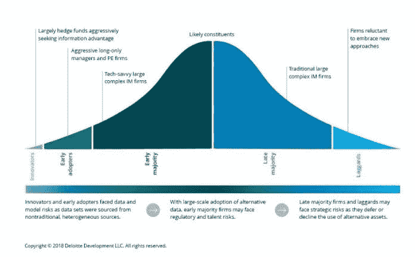
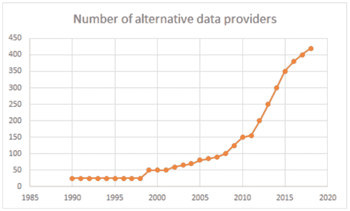
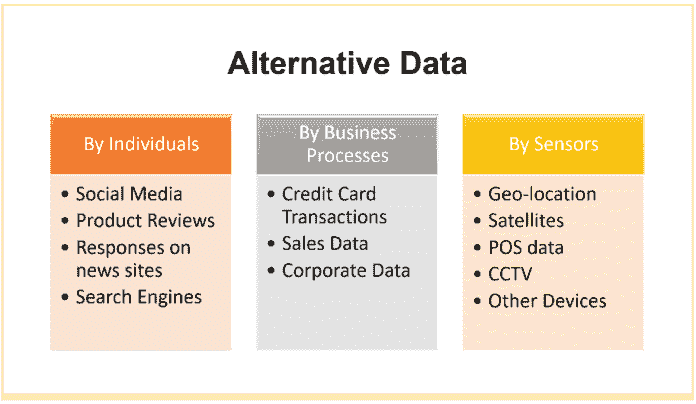
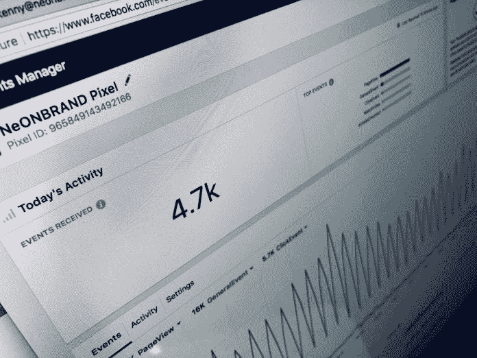

# 替代数据—初学者指南|数据驱动型投资者

> 原文：<https://medium.datadriveninvestor.com/alternative-data-a-beginners-guide-data-driven-investor-d713e56a9ff8?source=collection_archive---------8----------------------->

如今，另类数据在对冲基金经理和金融机构中越来越受欢迎。尽管它在资产选择过程中开辟了新的挑战和复杂性层面，但替代数据确实给其他积极投资场景带来了新的承诺和兴奋。

传统数据源，如财务报表、演示文稿、SEC 文件、销售数据等。虽然有价值，但通常不能给出完整和足够及时的描述。在这个数据驱动的时代，投资者在对投资领域做出推断之前，需要更多可操作的见解。

 [## 为什么数据将改变投资管理|数据驱动的投资者

### 有人称之为“新石油”虽然它与黑金没有什么相似之处，但它的不断商品化…

www.datadriveninvestor.com](https://www.datadriveninvestor.com/2019/01/25/why-data-will-transform-investment-management/) 

为了填补这一空白，许多公司已经迅速从非传统来源收集、清理、分析和解释有用的数据。这些来源包括金融交易、传感器输入、网络流量、移动设备、卫星、公共记录和新闻网站。通常情况下，这些来源就是有问题的公司。

替代数据为投资者提供了一套独特而及时的见解，有助于识别最佳投资机会。这些见解，经过适当的提炼，在你从流行的金融新闻渠道了解事件之前就已经预测到了。

# 替代数据的增长

最初，人们对替代数据及其有用性持怀疑态度。随着时间的推移，越来越多的组织，尤其是投资公司，看到了它的好处，并开始接受这个想法。在过去的十年里，许多数据经纪人和整合商专门向投资者提供另类数据。如今，一个公认的事实是，替代数据可以提供传统数据无法提供的见解。收集替代数据的方法，结合[机器学习](https://www.datadriveninvestor.com/glossary/machine-learning/)和计算的新技术，有助于轻松获得早期见解。

当摩根大通(J.P. Morgan Chase)和高盛(Goldman Sachs)等巨头认可替代数据的力量并加大对该领域研究的支持时，替代数据受到了更多关注。此外，[彭博](https://www.bloomberg.com/professional/product/alternative-data/)最近宣布，他们也准备向需要的组织出售替代数据集。

*   据摩根大通称，资产管理公司正在投资 20-30 亿美元用于获取和处理替代数据。
*   投资于替代数据的资金可能每年增长 20-30%。
*   预计在 2025 年，全世界产生的总数据将增加到 163 ZB！
*   数据科学家的数量一直在增加，在过去 5 年中几乎翻了两番。

在过去的几年中，越来越多的组织预见到了替代数据的爆炸，并加入了这一潮流。据 YipitData 称，如今有 400 多家替代数据提供商。而这些还只是考虑到了大的。

# 替代数据是如何生成的？

替代数据如此繁荣的真正原因是数据收集方法和用于处理这种巨量数据的技术的增强。除此之外，[物联网](https://www.datadriveninvestor.com/glossary/internet-of-things/)的进步进一步增加了日常可用的数据量。

生成替代数据有三种方式:

# 由个人:

个人生成的大部分数据往往是非结构化的，相对来说更难处理。个人每分钟都会产生海量的数据。创建的一些数据包括社交媒体互动、亚马逊或其他[电子商务](https://www.datadriveninvestor.com/glossary/e-commerce/)群体上的产品评论，以及谷歌、必应等搜索引擎上的趋势。

# 按业务流程:

企业生成的大多数数据往往是结构化的，可以为财务决策提供很好的见解。这种形式的替代数据也被称为“耗尽数据”，因为它主要以不同业务流程的副产品的形式出现。创建的一些替代数据包括信用卡交易、销售交易和来自政府机构的数据。

传感器生成的数据大部分是非结构化的。在当前的科技和物联网时代，传感器无处不在。它们不断地接收信号，并将信号从一个设备传输到另一个设备。像闭路电视、机器、 [POS](https://www.datadriveninvestor.com/glossary/proof-of-stake/) 系统、甚至停车场传感器这样的设备提供了大量重要的商业数据。替代数据也可以由[卫星成像](https://www.datadriveninvestor.com/2018/09/18/looking-to-the-skies-for-alpha/)和[地理定位](https://www.datadriveninvestor.com/2018/10/17/your-mobile-phone-as-a-gold-mine-for-hedge-funds/)设备生成。这种形式的数据对于衡量某个商店被访问的频率或者某个产品被运送到某个位置的频率非常有价值。

# 替代数据的主要类型

让我们仔细看看生成的一些不同类型的替代数据:

这种类型的数据包括与网络流量、流行的网络搜索、人口统计、点击率等相关的信息。这种类型的数据在衡量广告活动的结果或网站或产品的受欢迎程度时非常有用。它还为市场研究和电子商务提供了极好的见解。

# 社会情绪:

这包括处理社交媒体帖子和评论产生的数据。这也包括公众对新闻、产品广告等的反应。这些数据可以以文本帖子、数字图像或视频的形式出现。这也可以包括人们在社交媒体网站上的任何形式的在线互动，如 Twitter、脸书、LinkedIn 等。这些数据有助于了解当前的趋势和品牌传播。

例如，twitter 情绪分析是一种衡量公众对产品发布、事件或公告的反应的流行方法。这些数据大多是非结构化的，需要预处理。

# 地理位置数据:

从电子设备(尤其是移动设备)接收的用于跟踪其物理位置的数据被称为[地理位置数据](https://www.datadriveninvestor.com/2018/10/17/your-mobile-phone-as-a-gold-mine-for-hedge-funds/)。除了 GPS 信号，这种类型的数据也可以从 WiFi 或蓝牙信号中接收。这种类型的替代数据为基于位置的决策提供了大量信息。因此，组织可以更好地了解哪些位置对某些产品或活动的需求最大。零售店可以利用这些信息来决定扩大业务的最佳领域。随着物联网技术的扩展，这种形式的替代数据将变得越来越有用。

# 信用卡交易:

从信用卡和借记卡交易中获得的数据对于跟踪零售收入非常有用。这也可以洞察个人支付账单的频率，表明他们是否有可能按时偿还贷款。这种形式的替代数据非常准确，也非常有见地。然而，为它们获得许可可能相当昂贵。

# 电子邮件收据:

电子邮件收据是在交付购买的产品或服务时获得的电子收据。这通常是对选择加入电子邮件、从奖励应用程序收到的奖励、发票等的回应。这种形式的数据对于跟踪零售收入非常有用。

这里有一个有趣的事实:

2016 年 11 月，超过 300 万封电子邮件收件箱的产品收据经过评估后得出结论，GoPro 的销量正在下降。这反过来又导致了他们市场份额的下降！

# 销售点交易:

销售点的交易提供了大量信息，这些信息不仅与销售量和价格趋势有关，还与消费者偏好和产品受欢迎程度有关。

# 卫星图像:

这种形式的替代数据越来越受欢迎，尽管价格昂贵。从[卫星或者低空无人机](https://www.datadriveninvestor.com/2018/09/18/looking-to-the-skies-for-alpha/)获得。在原始形式中，数据以图像的形式提供，然后对其进行处理以提取所需的信息。

这是一个很好的应用:

一些投资公司正在使用这种形式的数据来评估当地经济的健康状况。他们从停车场的图像中提取信息，看看在不同的时间点有多少辆车停在那里。这让他们对该地区的经济状况有了深入的了解。

卫星数据的其他用途包括供应链中断跟踪或跟踪金属生产和储存。

与卫星数据类似，关于天气模式的数据在做出广泛的经济决策时非常有用。这种形式的数据是从各种传感器收集的，如降水传感器、压力传感器、温度计等。这些数据可用于分析一个地区的预期农产品产量或种类，或者可获得的商品类型。

# 如何获得替代数据

主要有三种方法可以获得替代数据:

# 网页抓取:

这也被称为。这通常是由程序员完成的，他们编写代码让*网络采集* [从互联网上获取信息](https://www.datadriveninvestor.com/2018/11/12/web-scraping-hedge-fund-strategy/)。这个过程包括从一个链接到另一个链接浏览网页，并通过一系列文本处理功能从相关网页下载必要的信息。

这样提取的信息然后被保存到电子表格中或者被转换成易于解释的形式。例如，可以构建一个 web scraper 来从不同的网页中提取和分析有关合同和招标的信息。

事情变得越来越简单。许多应用程序现在无需编程就能为用户完成任务。

# 原始数据的获取:

原始数据是从任何来源获得的未经处理的数据。例如，从传感器获得的数据(主要由数字组成)是原始数据的一种形式。该数据以原始格式提供。这意味着数据没有经过任何形式的清理、去噪或任何其他形式的处理。

# 第三方许可:

有些公司获得了恢复“耗尽”数据的许可证，如信用卡交易、POS 交易等。来自不同的公司。然后，他们将这些数据处理成易于使用的格式，并将数据出售给其他组织。该领域的主要参与者包括 Quandl、YipitData 和 iResearch 等组织。

# 如何使用替代数据(在金融和投资领域)

有一点是肯定的:

替代数据在金融和投资领域的应用越来越多。基本面和量化投资公司都在用它来寻找新的阿尔法来源。

这些公司使用各种形式和各种来源的替代数据。例如，像 *Orbital Insight* 这样的组织通过卫星图像持续监控超过 260，000 个停车场，然后出售卫星数据，以提供关于人们何时何地购物的见解。这些图像也有助于预测一年中什么时候购物趋势可能会激增。这类信息可以让投资者在季度回报之前提前了解销售收入。

像这样的公司整合信用卡和借记卡交易，然后卖给对冲基金。这些数据集的成本高达一百万美元。但它们有助于发现欺诈检测、零售趋势、消费习惯等领域的重要见解

*乐天智能*使用他们的“Unroll.me”应用程序获取电子邮件收据数据。该应用为用户提供垃圾邮件服务，帮助他们摆脱垃圾邮件或垃圾邮件。这个应用程序可以检测用户收件箱中的商业邮件。然后，它使用这些电子邮件来收集关于用户购物偏好的见解，并将这些信息出售给投资者。

最后，众所周知，社交媒体网站喜欢并允许你抓取用户帖子。他们甚至提供自己的 API 来帮助抓取网页。该数据然后可以用于执行情感分析。事实上，twitter 情绪分析正被广泛用于洞察公众对零售品牌、事件或热门话题的情绪。

# 结论

替代数据被贴上了新油的标签。投资者和对冲基金总是在寻找提高 alpha 的新方法，替代数据可以给他们洞察力，引领他们实现这一目标。该领域仍处于起步阶段，但已经变得越来越受欢迎。需要进行更多的研究来寻找更好的方法来处理获得的大量替代数据。还需要考虑如何将这些数据整合到投资决策中的新策略。20 年后，它的价值将是无限的，目前，这种新时尚的可能性只是让好奇的人着迷。

*原载于 2019 年 8 月 1 日*[*【https://www.datadriveninvestor.com】*](https://www.datadriveninvestor.com/alternative-data/)*。*