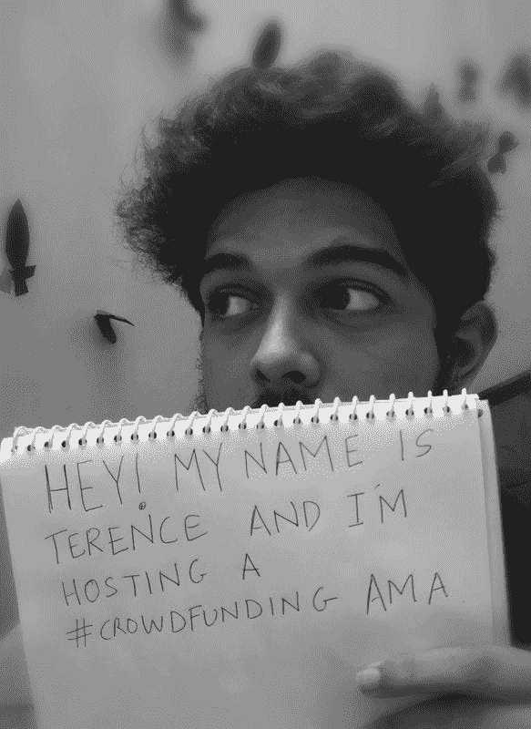
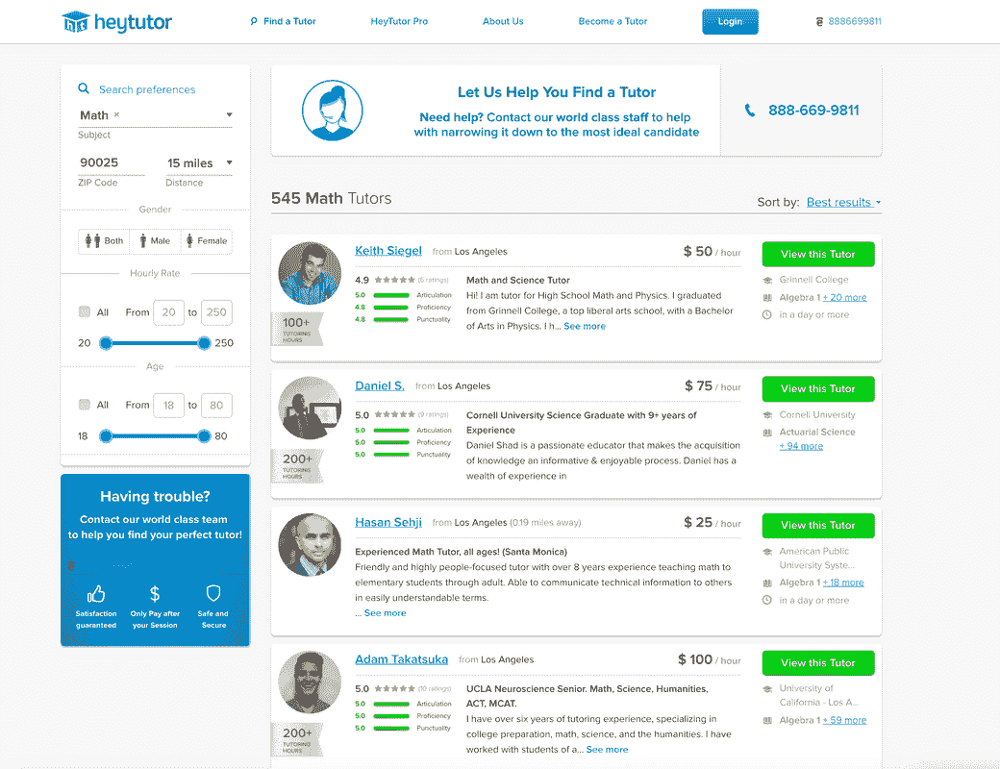
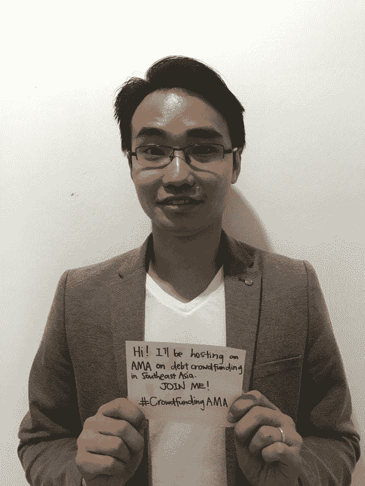

# 如果你预算不足或没有预算，你可以选择其他方式为自己的企业或项目融资

> 原文：<https://medium.datadriveninvestor.com/alternative-ways-of-funding-your-own-business-or-project-if-you-got-low-to-no-budget-4e5227d03d21?source=collection_archive---------7----------------------->

开始一个像商业或项目这样大的事情是相当冒险的，它需要一些关键因素，包括时间、材料、供应商、营销、合作伙伴和资金，尤其是资金。鉴于这一点，大多数企业家关注预算方面，在启动他们的企业并取得良好结果之前，花大量的时间。

如果你有兴趣给它一个开端，但没有足够的资金开始呢？对你来说一切都结束了吗？

*我们认为不会。*

即使没有行业巨头那么大的预算，你仍然可以把你的商业计划变成成果！这是肯定的，因为我们已经列出了实际可行的方法来满足维持运营和保持运营所需的资金量，并附有利弊，因此您可以选择哪种方法最适合您和您的钱包！

**1。众筹**

**最适合…** 一文不名的有志企业家

**优点:** **启动**需要绝对*零*现金

众筹的决定很快就做出了，过程也很迅速，几乎没有痛苦。事实上，我们已经成功地为《追星儿童》的后期制作筹集了资金，我们可以在如何进行后期制作方面有更多的自由。”— [特伦斯·费尔南德斯，电影制作人](https://crowdfundingama.amafeed.com/my-name-is-terence-fernandes-and-i-successfully-crowdfunded-for-my-short-film-468067)

**缺点:** **它提供绝对*零*保证**

*“我们其实尝试过众筹，惨败。在旅行的最后，我们得到了朋友和家人的帮助，但不多。我认为众筹很棒，但显然我对它了解不够，无法让它为我的项目服务。”*——[瑞特·格拉米鲍尔，作家、导演和企业家](https://authorsama.amafeed.com/ive-published-a-book-and-produced-a-documentary-with-no-budget-both-are-on-499937)

**2。自举**

最适合… 愿意积攒手头存款的群体

**优点:投资资本并不是一个很大的要求**

*“我和我的合伙人在 2013 年创立了这家公司，当时他 19 岁，只有 800 美元。我们设法在不增加任何资本的情况下，将公司收入提高到 7 位数。”*——[Ryan Neman，HeyTutor 创始人兼总裁](https://amafeed.com/i-dropped-out-of-ucla-at-19-years-old-to-pursue-a-startup-that-connects-503783)

**缺点:** **拥有低到零的资本会导致未来的重大问题**

*“我觉得，没有资金，没有经验去创业，就是自找灾难。一路上我犯了很多错误，但好消息是，在早期我没有什么可失去的——只有我的骄傲。如果我在一笔现金上犯了这些错误，我的业务的单位经济学将会大不相同，而且可能无法持续。”*——[Ryan Neman，HeyTutor 创始人兼总裁](https://amafeed.com/i-dropped-out-of-ucla-at-19-years-old-to-pursue-a-startup-that-connects-503783)

**3。自筹资金**

**最适合…** 第一次创业，每天有稳定的工作

**优点:** **储蓄可以作为你自己的资本**

老实说，这部纪录片没有预算。我攒了一些钱，比赛门票一发售就开始买，并粗略估计了 4 个月的旅程需要多少汽油。我已经拥有了一台 DSLR 相机、三脚架、单脚架、GoPro 和几个麦克风。参与这个项目的每个人都是志愿者，要么想成为故事的一部分，要么想在电影中占有一席之地。”——[瑞特·格拉米鲍尔，作家、导演和企业家](https://authorsama.amafeed.com/ive-published-a-book-and-produced-a-documentary-with-no-budget-both-are-on-499937)

**缺点:** **它直接来自你自己的*财务状况——而且看不到任何备份***

*最大的经济挑战是我自己的口袋！Lol。调查加密货币*以及运输行业将会受到影响，这真的很有意思，我希望看到*经济*格局的未来转变中*生态负载*——[Jordan Panos，连续创业者，Ecoloads 创始人](https://amafeed.com/aussie-entrepreneur-family-man-invested-in-climate-action-recently-launched-508045)**

****

****4。个人关系(即家人、朋友和熟人)****

****

****最适合……**年轻创业者**

****优点:** **它们都触手可及****

***“在这段旅程中，我的朋友们一直给予我大力支持，无论是他们是我的模特还是给我产品的反馈。他们帮助我选择了我们的名字，测试了我们的头带，并来拍照*拍摄*，因为没有他们，Happi 头饰就不会有现在的样子！从在活动中帮助我到打包订单，我的父母一直 100%参与并支持 Happi 头饰的冒险！我的老师也支持这个过程，他们中的一些人甚至买了发带！”—* [Alyssa Feinberg，Happi 头饰创始人](https://amafeed.com/im-17-and-i-started-a-business-happi-headware-a-headband-company-dedicated-508503)**

****

****缺点:** **不是每个人都有一个支持系统，更不用说一个在经济上亲力亲为的人了****

***“我没有家人和朋友来问。我没有能力获得投资资金。我第一次尝试银行贷款很快就被拒绝了。”*——[大卫·弗格森，连续创业家，5000fish 首席执行官](https://businessama.amafeed.com/im-david-ferguson-with-tech-smart-boss-i-talk-about-how-businesses-can-465441)**

****

****5。银行贷款****

****

**最适合… 任何想开始的人，请尽快**

****优点:比其他融资方式成本更低****

**真相是:如果银行贷款满足了中小企业的需求，中小企业应该选择银行贷款，因为银行贷款更便宜。— [Kelvin Teo，投资协会的首席执行官和联合创始人](https://crowdfundingama.amafeed.com/debt-crowdfunding-or-peer-to-peer-lending-in-southeast-asia-supporting-479486)**

****

**缺点:条款并不总是可行的**

**对一些人来说，这可能是他们的第一笔商业贷款，因为他们没有资格申请银行贷款。对于其他人来说，他们可能已经有了银行贷款，但他们正在寻找充值，因为基于他们有限的抵押品，银行贷款太小了。” — [Kelvin Teo，投资协会的首席执行官和联合创始人](https://crowdfundingama.amafeed.com/debt-crowdfunding-or-peer-to-peer-lending-in-southeast-asia-supporting-479486)**

****

**开始一项业务或一个项目可能会让你倾家荡产，但它*可能*也可能*不会:*这完全取决于你*希望*如何去做。最重要的是，一旦创业开始，就要保证可持续性和投资回报。如果你尝试了列表中的方法，或者至少还在计划中，只要通过 AMA 会议分享你所知道的，给我们一个提示就行了！**

**由我们的牛逼朋友 Maria 根据我们在#StartupAMA 的优秀主持人的建议撰写，最初发表在[www.AMAfeed.com](https://amafeed.com)**