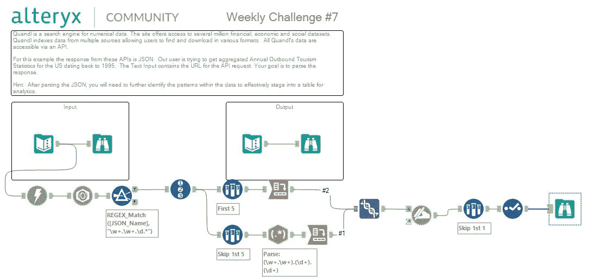

# 如何用 Alteryx 下载数据并解析 JSON

> 原文：<https://medium.datadriveninvestor.com/alteryx-download-data-and-parse-json-eb485d5f794e?source=collection_archive---------3----------------------->

## Alteryx 内部

[Alteryx](https://medium.com/u/14c3615546ef?source=post_page-----eb485d5f794e--------------------------------) @alteryx.

每周挑战#7 的目标是从 Quandl 的 JSON API 下载和解析数据，并将其与提供的数据集进行完全匹配。

使用以下工作流程解决了这一难题，使用的工具有:

1.  **从**开发者**标签下载**工具；
2.  **JSON 解析**工具来自**开发者**标签页；
3.  **从**准备**标签中过滤**工具；
4.  **从**准备**页签记录 ID** 工具；
5.  *(第一分支)* **样品**工具从**准备**选项卡；
6.  *(第一个分支)* **交叉表**工具从**转换**选项卡；
7.  *(第二分支)* **样品**工具从**准备**选项卡；
8.  *(第二个分支)* **RegEx** 工具从**解析**选项卡；
9.  *(第二个分支)* **交叉表**工具从**转换**选项卡；
10.  **接头**工具从**接头**拉环中取出；
11.  **动态重命名**工具来自**开发者**标签；
12.  **从**准备**标签中取出**工具；
13.  **从**准备**选项卡中选择**刀具；
14.  **从**进/出**选项卡浏览**工具。

 [## 2019 年最值得学习的编码语言——数据驱动的投资者

### 在我读大学的那几年，我跳过了很多次夜游去学习 Java，希望有一天它能帮助我在…

www.datadriveninvestor.com](https://www.datadriveninvestor.com/2019/02/21/best-coding-languages-to-learn-in-2019/) 

## 请观看下面链接的教程，了解如何使用 Alteryx 下载和解析 JSON 数据的完整解决方案。