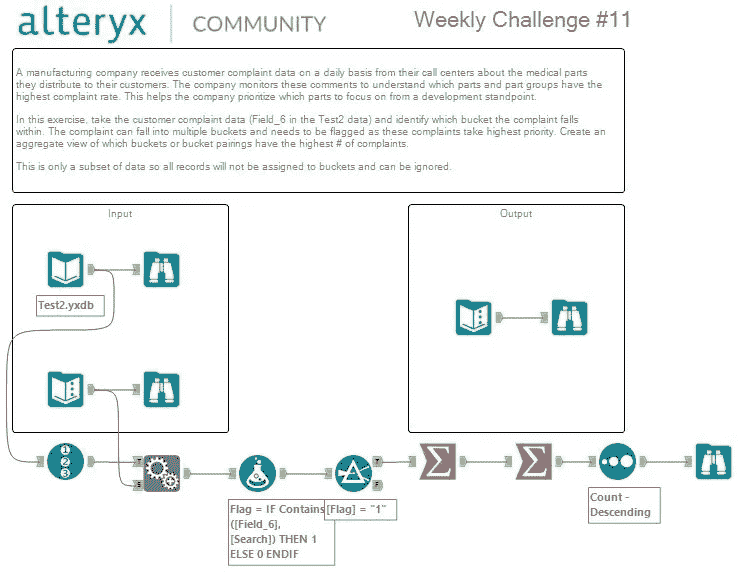

# Alteryx:识别逻辑组

> 原文：<https://medium.datadriveninvestor.com/alteryx-identifying-logical-groups-21f0f12054ef?source=collection_archive---------5----------------------->

## Alteryx 内部

[Alteryx](https://medium.com/u/14c3615546ef?source=post_page-----21f0f12054ef--------------------------------) @alteryx.

一家制造公司每天都会收到来自呼叫中心的客户投诉数据，这些数据是关于他们分发给客户的医疗零件的。公司监控这些意见，以了解哪些零件和零件组的投诉率最高。这有助于公司从开发的角度优先关注哪些部分。

每周挑战#11 的目标是为数据集中的每个客户投诉确定逻辑组(桶)。

 [## 幸福的算法？-数据驱动型投资者

### 从一开始，我们就认为技术正在使我们的生活变得更好、更快、更容易和更实用。社交媒体…

www.datadriveninvestor.com](https://www.datadriveninvestor.com/2019/03/08/an-algorithm-for-happiness/) 

使用以下工作流程解决了这一难题，使用的工具有:

1.  从**准备**页签记录 ID 工具；
2.  **从 **Join** 选项卡追加字段**工具；
3.  **准备**选项卡中的**公式**工具；
4.  **从**准备**选项卡中过滤**工具；
5.  **从**变换**选项卡中汇总**工具；
6.  **从**变换**页签汇总**工具；
7.  **将**工具从**准备**标签中分类；
8.  **从**输入/输出**选项卡浏览**工具。

## 请观看下面链接的教程，了解如何使用 Alteryx 识别逻辑组的完整解决方案。