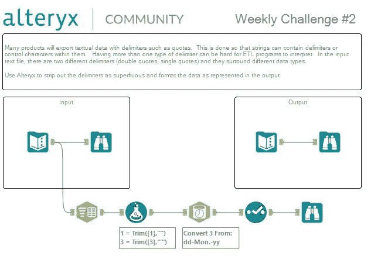

# Alteryx:准备分隔数据

> 原文：<https://medium.datadriveninvestor.com/alteryx-preparing-delimited-data-8fd2b0efdda5?source=collection_archive---------5----------------------->

## Alteryx 内部

[Alteryx](https://medium.com/u/14c3615546ef?source=post_page-----8fd2b0efdda5--------------------------------) @alteryx.

对于我的第一个视频教程，我将解决 Alteryx 社区发布的每周挑战#2。正如我在教程中提到的，在视频上解释和分享我的 Alteryx Designer 知识似乎是突出软件功能和用户友好性的最好和最有效的方式。

使用以下工作流程解决了这一难题，使用的工具有:

1.  从**解析**选项卡中的**文本到列**工具；
2.  从**准备**选项卡中选择**公式**工具；
3.  **解析**选项卡中的**日期时间**工具；
4.  **从**准备**选项卡中选择**工具；
5.  **从**输入/输出**选项卡中浏览**工具。

 [## 2019 年最值得学习的编码语言——数据驱动的投资者

### 在我读大学的那几年，我跳过了很多次夜游去学习 Java，希望有一天它能帮助我在…

www.datadriveninvestor.com](https://www.datadriveninvestor.com/2019/02/21/best-coding-languages-to-learn-in-2019/) 

请观看下面链接的教程，了解如何使用 Alteryx 准备分隔数据的完整解决方案。