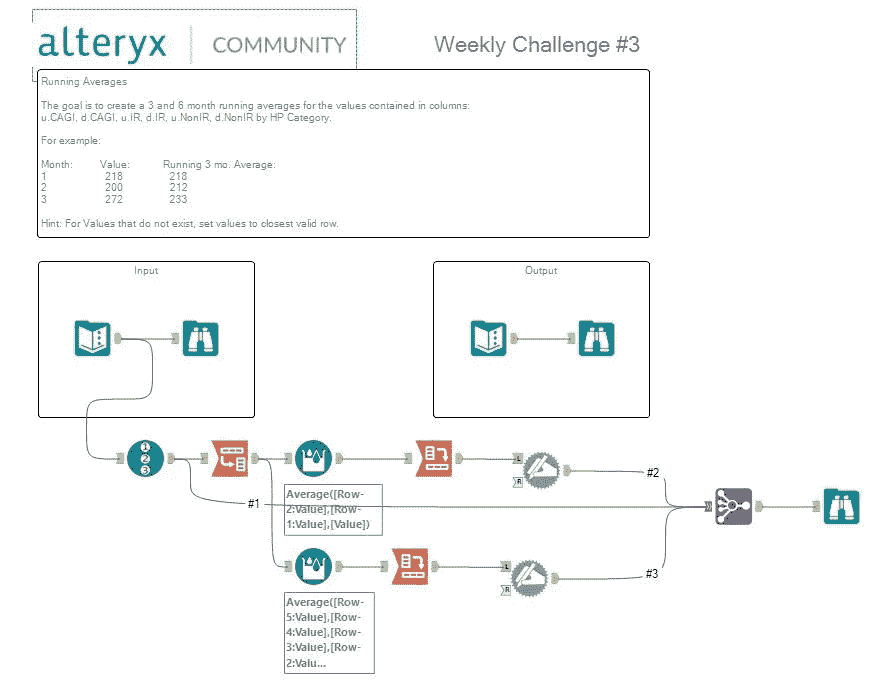

# Alteryx:运行平均值

> 原文：<https://medium.datadriveninvestor.com/alteryx-running-averages-e995f4329ad5?source=collection_archive---------10----------------------->

## Alteryx 内部

[Alteryx](https://medium.com/u/14c3615546ef?source=post_page-----e995f4329ad5--------------------------------) @alteryx.

每周挑战#3 的目标是计算 u.CAGI、d.CAGI、u.IR、d.IR、u.NonIR、d.NonIR 列中包含的值的 3 个月和 6 个月的运行平均值，并按马力(HP)类别对它们进行分组。

使用以下工作流程解决了这一难题，使用的工具有:

1.  从**准备**页签记录 ID 工具；
2.  **从**变换**选项卡转置**工具；
3.  **准备**选项卡**中的多行公式**工具；
4.  **十字标签**工具从**变换**标签；
5.  **动态重命名**工具来自**开发者**标签页；
6.  **从**加入**选项卡中加入多个**刀具；
7.  **从**输入/输出**选项卡中浏览**工具。

 [## 2019 年最值得学习的编码语言——数据驱动的投资者

### 在我读大学的那几年，我跳过了很多次夜游去学习 Java，希望有一天它能帮助我在…

www.datadriveninvestor.com](https://www.datadriveninvestor.com/2019/02/21/best-coding-languages-to-learn-in-2019/) 

请观看下面链接的教程，了解如何使用 Alteryx 计算移动平均值的完整解决方案。