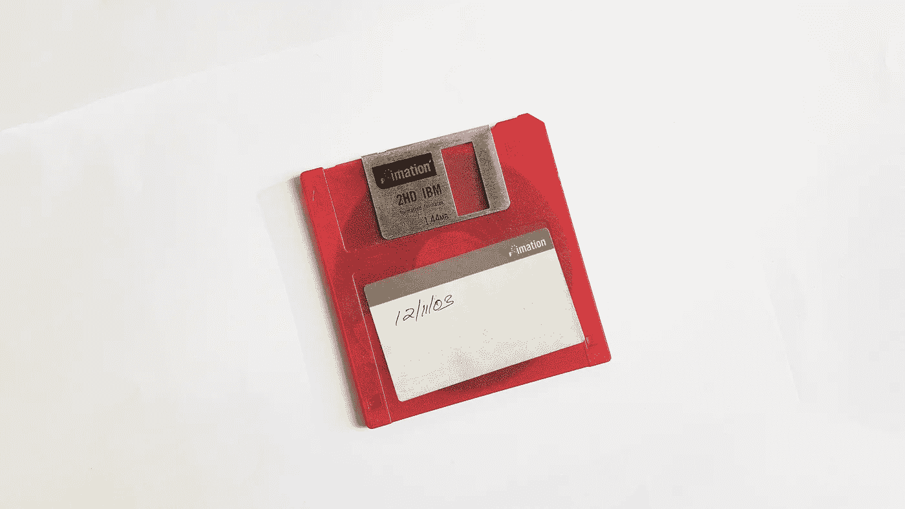
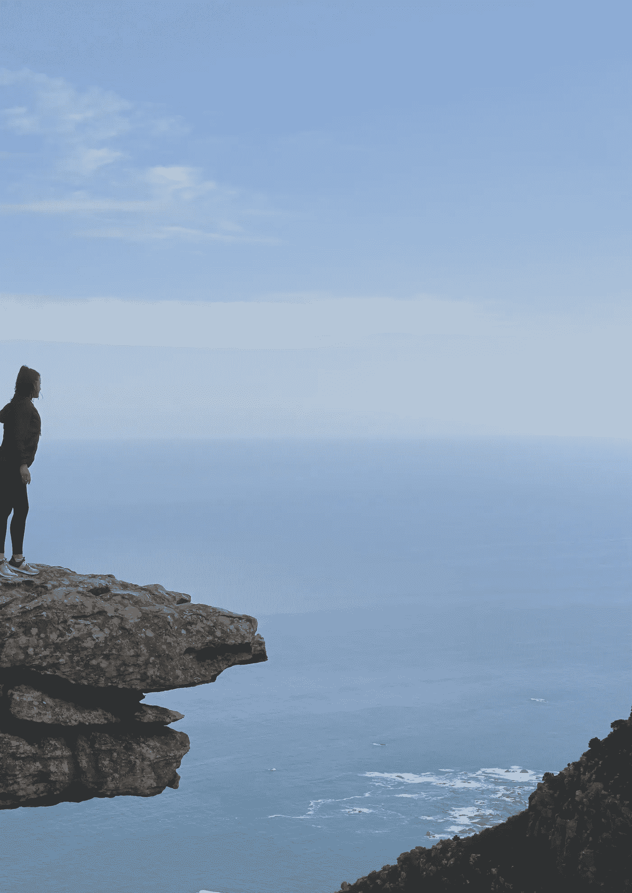

# 我是不是把记忆外包了？

> 原文：<https://medium.datadriveninvestor.com/am-i-outsourcing-my-memory-ab594f07e4f0?source=collection_archive---------17----------------------->

自从在新石器时代创造了早期的表意语言以来，人类就一直试图记录生活。从公元前 3000 年埃及人描绘古代象形文字祈祷到一个年轻女孩记录她在二战中的噩梦般的现实，书面语言让记忆超越了经历过它们的人的生活。

1816 年照相机的发明进一步增强了这种从时间中窃取记忆并保存下来的能力。在过去的 200 年里，照相机技术变得如此强大，以至于照片有时比人类记忆更准确。语言容易受到主观性的影响，但照片不会说谎。虽然图片和视频只是代表了时间的快照，但其准确性却大大超过了人脑。

具有讽刺意味的是，照片是准确性和模糊性的结合。

## 一张图胜过千言万语

一张照片告诉我们在一个难以置信的特定时间空间中一瞬间的无限多细节。如果体育摄影师多等一秒钟，他们可能会捕捉到一个完全不同的场景。如果一个编辑裁剪了捕捉到的空间，他们可以改变一幅图片最初讲述的整个故事。例如，看看这张鼓舞人心的照片，照片中一位年轻女子望着大海:

这张照片实际上是裁剪过的，它讲述了一个与原始照片完全不同的故事:

对于任何时间快照也是如此。相机的准确性使人们倾向于认为照片不会说谎，但即使是照片也不能摆脱轻微的主观性。虽然一张照片胜过千言万语，但这些话在很大程度上取决于拍摄的时间和空间。

## 照片有助于唤起我的记忆

如果你曾经上过脸书、Snapchat、TimeHop、Google Photos、Apple Photos，或者大多数拍照应用；你会注意到，新功能试图将无数照片整合成一个伪照片日记。“记住这一天”提示用户回顾他们多年前拍摄的照片，这是对过去快照的怀旧致敬。

普通观众，包括我自己，可能会认为所有这些应用程序都有助于提高记忆力。如果我的谷歌照片助手没有修补我短暂的记忆，我根本不可能记得 2014 年 10 月 16 日午餐吃了什么。或者我童年时家庭度假时拍的那组照片怎么样？那一瞬间要不是被抓拍，早就湮没在时间里了！不可否认，照片可以刺激记忆。甚至有这样的例子，老年痴呆症患者用照片来修补记忆中的空洞。

在这一点上，似乎照片和记忆一起工作。随着思维的老化，我们对过去的个人描述中细微的细节丢失了，图片就成了第二存储空间。我们几乎已经创建了一个虚拟海马体，它能够上传我们不想忘记的经历，作为云中的图片。

## 有没有可能拍照这个行为实际上是对记忆有害的？

在最近的一项研究中，这被认为是正确的。在艺术博物馆的导游带领下，参与者被要求拍照或观看展览中的作品。结果显示**为真。这一效应解释了拍照行为是如何导致人们不太注意此刻的，因为他们更专注于拍照。在这项研究中，被要求为展览拍照的人对艺术品的记忆明显比那些以传统方式体验的人少。**

> **“有时候我不[拍照]。如果我喜欢一个瞬间，对我个人来说，我不喜欢有镜头的干扰。我只想待在里面。”—肖恩·奥康奈尔(沃尔特·米蒂的秘密生活)**

**去马丘比丘旅游，凝视埃菲尔铁塔，或者开车去尼亚加拉大瀑布；你会看到同样的事情。一群人，看着他们的手机屏幕。现在似乎是问这个问题的合适时机，拍照手机是什么时候从强化记忆转为抑制记忆的？**

**最初是有限的心理数据库的延伸，慢慢演变成一种无意的依赖，从一开始就分散了对事物的体验。有人可能会看一张他们在尼亚加拉瀑布时的自拍照，但那会引发什么样的记忆呢？看着手机屏幕拍尼亚加拉瀑布照片的记忆？如果人类可以向他们的手机询问他们生活的细节，比如他们在 2014 年 10 月 16 日午餐吃了什么…甚至还需要记忆吗？**

> **“这种记忆外包的一部分，并不是一件愚蠢的事情。它让我们有时间去关注下一件正在发生的事情。但是如果我们不断地生活*咔嚓咔嚓咔嚓*【用我们的相机】，从一个经历到下一个经历，我们永远不会为我们想要珍惜和记住的时刻停下来。”——琳达·汉高，记忆错误中的心理学教授&扭曲**

**我依稀记得高中时的自己上传了数百张照片和数十本相册到社交媒体网站，希望未来的自己会感谢我。我拍摄并上传的每一张照片都让我的大脑少了一份记忆。回想起来，我可以诚实地说，如果没有这些照片的帮助，他们捕捉的大部分记忆都会在时间中丢失。**

**当我十几岁时，我的照片上传率与我写日志的时间成反比。随着我拍的照片越来越多，写下我的经历的需求稳步下降。虽然我童年时写的日记是原始和真实的，但这些社交媒体相册对现实的描述并不准确。每一张照片都唤起了一段记忆，但是我脸部的快照永远无法描绘出隐藏在微笑姿势背后的真实情感。**

**似乎有一个小的临界点。一方面，照片可以点燃大脑中原本会永远丢失的细节。相反，拍照的行为会减少记忆，影响体验人类最初试图记忆的生活。应用程序正在重新定义怀旧的含义，但代价是什么？数十亿字节的照片是否值得一个看似没怎么活过的生命？父母应该把相机拿开，看着孩子的眼睛吗？如果最终目标只是一幅画，那么参观一个地方值得吗？**

**我是不是把记忆外包了？还是我只是在伤害它？**