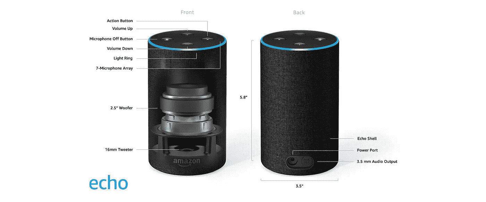
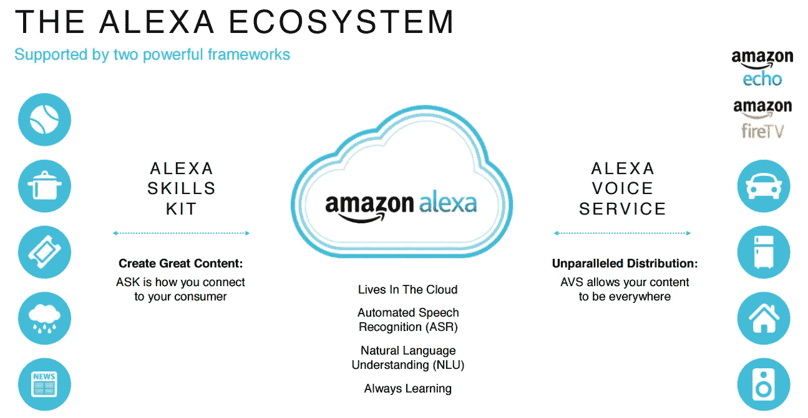
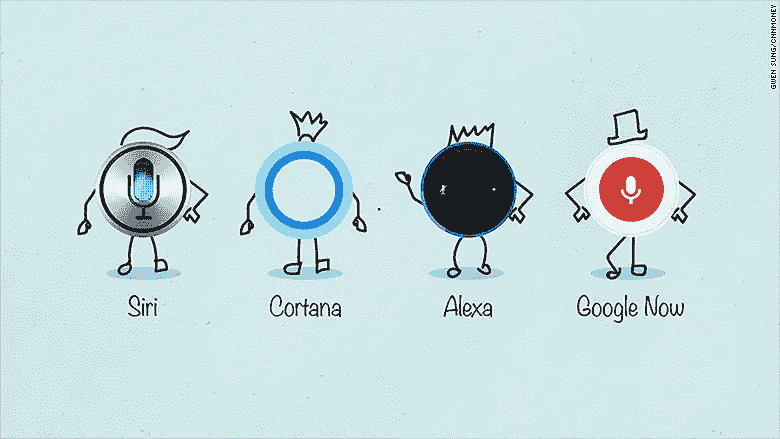
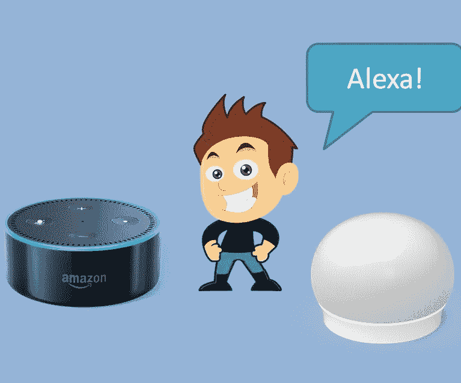

# 亚马逊 Alexa

> 原文：<https://medium.datadriveninvestor.com/amazon-alexa-aaeb0dca9274?source=collection_archive---------9----------------------->

# 声音优先革命的开始

大约四年前，2014 年 11 月，亚马逊推出了 Alexa，开创了语音技术的革命。

今天，她无处不在，每小时、每分钟、每一秒都变得更加聪明。但 Alexa 到底是什么，它如何在我们与技术交流的方式上创造一场革命？让我们来了解一下 Alexa，以及亚马逊为何如此大力投资 Alexa。

# Alexa 是钢铁侠的贾维斯吗？

看完《钢铁侠》后，我们都被托尼·斯塔克在电影中的“贾维斯”所吸引，无论他去哪里，都帮助他做他想做的一切，无论是在房子里还是在保护世界免受致命的漫威恶棍的攻击。

感谢亚马逊将虚拟生活贾维斯带入现实生活 Alexa。她总是在那里帮助你，只需要一个语音命令就可以完成你的事情。她可以帮助你计划你的一天，预订一个旅程，订购一个比萨饼，搜索最近的购物中心，为你的智能家居供电，等等。你要做的就是说 Alexa，问你的问题。

# 亚马逊 Alexa 是什么？

Alexa 是一种基于云的语音服务，亚马逊在数百万台设备上使用。语音是最自然的交流方式，通过 Alexa，亚马逊简化了我们与技术互动的方式。帮助你计划你的一天，让你走出家门，控制你的智能家居，获得最新的新闻更新，或者听你最喜欢的歌曲，只需说出 Alexa，然后回答你的问题。在 Alexa 上观看这个介绍性视频。

# Echo 到底是什么？

Alexa 生活在云中，为了与她交流，我们需要回声。ECHO 是亚马逊推出的一款智能声控扬声器，内置网络智能，始终开启并连接到 Alexa。使用 Alexa 语音服务，您可以高效地完成您的事情。回声家庭有许多不同的品种。回声点，回声加，回声，回声点，回声显示，点击，等等。

# 亚马逊为什么给它起名，Alexa？

Alexa 单词有一个硬辅音“X ”,与其他单词相比，它在任何地方都具有很高的识别精度。

# 为什么是 Alexa？

我们正在走向一个万物都在进步的世界，从我们用来在纸上写字的小笔，到我们在手机和平板电脑上使用的触控笔，再到无人驾驶汽车等更大的东西。在物联网生态系统下，事物正在与互联网相连。只需在手机上点击几下，就能远程控制一切。控制你的空调、电视、微波炉和几乎所有的电子设备。

Alexa 生态系统由两个强大的框架驱动，Alexa 技能工具包和 Alexa 语音服务(我将在下一篇博客中详细介绍)。它有望成为未来的游戏规则改变者。

想象一下你可以用语音命令控制一切的生活。说开灯，灯就亮了，不是很酷吗？语音是最简单的交流方式，Alexa Amazon 使与该技术的交流更加简单和自然。现在只需通过语音命令就能控制你的整个家。

# Alexa 能做什么？

Alexa 可以做很多事情。Alexa 的一些主要功能是

1]播放音乐、收听新闻和获取天气更新

2]获得简单网络查询的答案

3]在亚马逊、[达美乐](https://www.dominos.co.in/)、Zomato 上订购商品

4]预订优步之旅，Ola

5]控制您的智能家居

这可能听起来像一个奇怪的组合，但它是市场上最智能的扬声器。说“Alexa，播放音乐”比拿起手机做同样的事情要容易得多。

# Alexa 还有前途吗？

Alexa 只需一个语音命令就能做出惊人的事情。它受到自然语言理解和自动语音识别的推动，但最重要的问题是它是否有未来。答案肯定是肯定的，智能助手将完全掌控未来。Alexa 现在用于一些基本任务，但在未来，我们将见证 Alexa 的声音发生一些奇妙的事情。

# 使用 Alexa 安全吗？

Echo 带有一个永远在线的麦克风，有一个基本问题:使用 Echo 安全吗？没有人想被监视，拥有一个永远在线的麦克风可以让这个噩梦成真。

但在隐私和安全方面，你可以永远信任亚马逊。即使 Alexa 和 Echo 一直开着，他们也只会在说出那个词后听你说话，Alexa。在说出唤醒词 Alexa 后，它会听你说什么，然后使用语音识别软件将其发送到亚马逊服务器；它决定了你想要什么，并给你所需的输出。

# 竞争对手

没有竞争对手在身边就没有乐趣，Alexa 与谷歌助手、微软的 Cortana、Siri、三星的 Bixby 都有一些艰难的竞争。顾客有许多不同的品种可供选择。Alexa 是亚马逊创造的一场革命。现在，它的作用更加突出，不仅要把事情做好，还要做得更快更有效，因为已经有许多竞争者在名单上排队了。

# 是什么分隔了 Alexa？

Alexa 正与其他智能个人助理展开激烈竞争。尽管如此，Alexa 与其他智能助手的区别在于其做事的方式和 Alexa 的技能，这些技能增强了 Alexa 有效地做越来越多事情的能力。开发者已经为 Alexa 做出了一些令人兴奋的有价值的技能，这个选择每天都在增长。

# 你为什么要为你的房子买一个 Echo 和 Alexa？

亚马逊一直做的很完美。这是创新的完美例子，展示了想象力的真正力量——从创办网上书店到成为电子商务巨头，再到为爱书人制造最具代表性的设备，包括亚马逊 kindle，当然还有亚马逊网络服务。通过 Alexa，亚马逊想让你先睹为快。它只是一天比一天聪明。它独自一人时充当同伴。你可以和她谈任何事情。请她播放音乐，获取新闻和天气更新，在亚马逊上购物，等等。

Alexa 是未来语音连接家庭的一瞥，它比你想象的要好得多。你应该为你的智能家居买一个。

# 接下来:-

# Alexa 如何工作