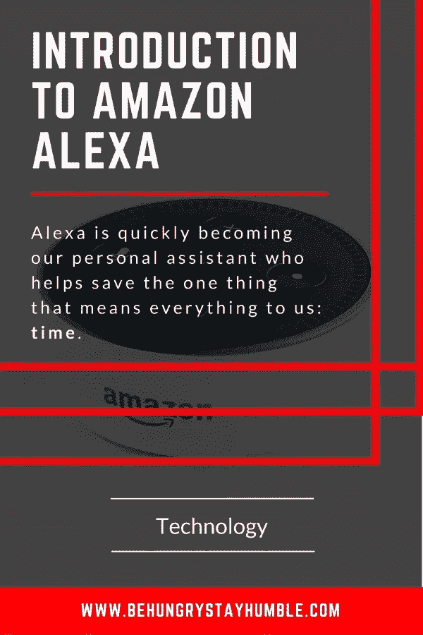

# 亚马逊 Alexa 及其对商业的影响

> 原文：<https://medium.datadriveninvestor.com/amazon-alexa-and-its-effects-on-business-f4e9679dfda8?source=collection_archive---------1----------------------->

到目前为止，我相信大多数阅读这篇文章的人至少在某种程度上听说过亚马逊的 Alexa。到目前为止，当谈到 Alexa 时，我遇到了三种不同的意见。

1.  人们对此了解不多，因此并不担心
2.  人们非常喜欢它，并且经常使用它
3.  人们不想与它有任何关系，因为“它总是在听”

我的观点是，不管你对人类隐私的现状有什么看法，或者缺乏这种看法，至少了解一下这项技术以及它如何有潜力改变我们的生活方式是明智的……因为这正是我相信它会做的。

首先值得了解的是亚马逊 Alexa 和亚马逊 Echo 设备的区别。Echo 设备是亚马逊的智能扬声器，它连接到云中的 Alexa，因此用户可以与之互动。把 Echo 设备想象成 Siri 的 iPhone。

更重要的是，亚马逊 Alexa 不是语音领域的唯一玩家。谷歌 Home 和苹果 HomePod 等产品也在争夺同样的位置。然而，到目前为止，亚马逊似乎占据了上风，占据了大约 70%的市场份额，这很可能是因为亚马逊的强大功能和支持。

虽然与竞争对手相比，Alexa 已经有了很大的领先优势，但 Alexa 最终肯定不会成为获胜的平台。尽管如此，我确实相信，毫无疑问，Alexa 或类似的语音助手*将在未来几年成为家用产品。*

我相信 Alexa(或另一个语音助手)会变得如此主流的最大原因是因为**它节省了我们的时间。**

出于本文其余部分的目的，Alexa 将是重点。

# 什么是 Alexa？

Alexa 是亚马逊的语音控制人工智能助手，用于人们的家庭以及其他环境，如他们的汽车。这实际上让我想起了钢铁侠电影中机器人贾维斯的一个不太先进的版本，他就像真人一样和它说话。

信用:[硅天使](https://siliconangle.com/blog/2016/01/03/mark-zuckerbergs-2016-goal-is-to-build-an-ai-butler-like-jarvis-in-iron-man/)

想象一下，有一个随时准备好让我们要求他们做某事的私人助理。这就是 Alexa 试图成为的人。纯语音激活意味着用户可以与她交流，只要他们在她附近，这取决于他们说话的声音有多大。

已经有无数的事情可以使用 Alexa，每一个都是通过两个主要组件实现的:Flash 简报和/或 Alexa 技能。

# 快速简报

快速简报是对新闻、天气、即将发生的事件等的快速概述。把快速简报当作一天的开始:旧报纸、早晨的办公室简报或早间新闻节目。

你可以简单地在早上起床，冲个澡，同时问:“Alexa，给我我的 flash 简报”或“Alexa，告诉我今天的新闻”，而不是看手机、看报纸或看电视。然后 Alexa 会读出你的日程安排、新闻亮点、天气、上班通勤时间等。，基于预先输入的信息或相关技能。

# 技能

理解“技能”的最佳方式是将它们视为亚马逊版本的智能手机应用程序，但对于 Alexa 而言。技能组成了 flash 简报，并允许用户以无数不同的方式与 Alexa 互动。用户可以搜索几乎任何类别的技能，并将其添加到他们的 Alexa 帐户中。

不言而喻，用户的亚马逊账户也将连接到 Alexa。通过连接他们的账户，用户可以通过 Alexa(拥有 Prime 会员资格)从亚马逊购买任何东西。虽然一开始这看起来不像是人类行为的巨大变化，但它肯定会发生。

# 对消费者的影响

当人们现在有能力在淋浴时，意识到他们需要更多的洗发水，可以简单地说“Alexa，给我点更多的洗发水”，几秒钟内就完成了，这改变了很多事情。虽然它显然节省了时间，使它更方便，但它也影响了市场。

让我们以最近的洗发水为例更进一步。最终，我相信人们会开始通过 Alexa 和亚马逊为经常需要的家居用品设置自动购买。这些是消费者在购买前不一定要看的产品，而只是指定正确的品牌。

鉴于上述例子，Alexa 将如何影响零售市场？

Alexa 本身并不是一个市场，而是与亚马逊在线市场互动的另一种更方便的方式。因此，Alexa 最有可能只是加速亚马逊加班的增长。有几种方法可以做到这一点。

第一，只有 Prime 会员才能完全通过 Alexa 购买产品。普通会员可以将产品添加到购物车中，但他们仍然需要登录亚马逊并完成结账。这种情况未来可能的结果是，更多的人会选择升级到 Prime 以换取便利。

其次，Alexa 使消费者能够更快地访问亚马逊产品。当易用性与亚马逊不断增加的交付基础设施相结合时，将周日的杂货店之旅转变为 5 分钟的 Alexa 订单似乎更加实际。

毕竟，谁会自愿选择单独去一趟拥挤的杂货店，四处寻找，排着长队，口头下单，然后送货上门？不多。

# 对品牌的影响

毫无疑问，Alexa 也会给亚马逊上的销售业务带来一些变化。尽管它仍处于 Alexa 生命的早期，但这项技术可能会在在线品牌之间创造新的竞争和机会。

例如，当人们不指定他们更喜欢哪个品牌的产品时，亚马逊将如何决定哪个品牌是首选？这是消费者开始学习更具体和更好地理解如何在 Alexa 上搜索的地方，就像他们在谷歌上学习如何在那个平台上搜索时获得更好的结果一样。

最终，毫无疑问，Alexa 将变得更加智能，并开始了解消费者的偏好，但企业也将有办法在亚马逊和 Alexa 中营销自己——就像在脸书、Instagram、谷歌等网站上一样。

不过，在 Alexa 上做广告的方式可能会与 Instagram、脸书和谷歌等其他平台非常不同。漂亮的图片、完美的文案和蓝色链接在全语音平台上不会有太大帮助。

相反，营销人员必须深入了解消费者与 Alexa 互动的方式——这很可能是通过对话的方式，就好像 Alexa 是一个真人一样。

因此，当消费者下订单时，营销人员必须想办法让 Alexa 推荐他们的产品。一种可能的方式是，当有人订购新的纸巾时，例如，它可能会推荐一个不同的品牌，因为它正在打折或进行一些促销活动。

随着 Alexa 越来越聪明地知道每个消费者更喜欢哪个品牌，外部品牌的营销将变得更加困难。例如，当耐克想要获得阿迪达斯的客户时，它必须具有创造性，因为 Alexa 最终会知道特定用户更喜欢耐克还是阿迪达斯。

如果历史上他们总是订购阿迪达斯的产品，Alexa 很可能不会推荐耐克，除非亚马逊有某种类型的广告机会。

只有时间会告诉我们这一切是如何进行的，但目前一个确定的事实是，为了在未来保持竞争力和相关性，在亚马逊上存在是绝对必须的。

# 例子

以下是消费者通过各种技能与 Alexa 互动的一些方式:

**来电/短信**

*   **Alexa 技能:**这个不需要技能。只要安装 Alexa 应用程序，它就会使用你智能手机上的电话簿。
*   **描述:**用你的声音打电话或发短信。
*   **怎么说:**“Alexa，叫妈妈。”或者“阿莱克莎，给爸爸发短信，说我晚饭要迟到了。”

**闹钟**

*   **Alexa 技能:**亚马逊音乐、Spotify、Pandora、TuneIn、SiriusXM、iHeartRadio
*   **描述:**使用 Alexa 作为你的闹钟，让她播放你最喜欢的歌曲
*   **说什么:**“Alexa，明天早上 8 点叫醒我去佛罗里达乔治亚边境线。”

**优步**

*   **Alexa 技能:**优步
*   描述:从优步请求搭车。
*   **怎么说:**“亚历克莎，问优步要不要搭车，”或者“亚历克莎，问优步从家搭车去上班要多少钱。”

**家庭音乐流媒体**

*   **Alexa 技能:**亚马逊音乐无限或 Prime 音乐
*   **描述:**通过多个 Echo 设备在家中播放音乐。
*   **说什么:**“Alexa，放今天的安打。”

**披萨**

*   **Alexa 技能:**达美乐披萨
*   **描述:**点你最喜欢的达美乐披萨。
*   **怎么说:**“Alexa，打开多米诺骨牌。”

**烹饪**

*   **Alexa 技能:**坎贝尔的厨房
*   **描述:**找到新的好玩的食谱在家尝试。
*   **怎么说:**“Alexa，问问坎贝尔的厨房晚饭吃什么。”

**练习**

*   **Alexa 技能:** 7 分钟锻炼
*   **描述:**开始你的日常锻炼。
*   **怎么说:**“Alexa，开始七分钟锻炼。”

**桌游**

*   **Alexa 技能:**桌游答案
*   **描述:**丢失了手册？获取您最喜爱的棋盘游戏规则，如大富翁等。
*   **怎么说:**“Alexa，问问桌游有多少人能玩大富翁。”

**仪器**

*   **Alexa 技能:**吉他调音师
*   **描述**:给你的吉他调音，从低 E 到高 E 开始。
*   **怎么说:**“Alexa，告诉吉他调音师弹音符 a。”

**天气**

*   **Alexa 技能:**Alexa 应用程序内置了一个基本版本，但你也可以使用大天空技能根据你的街道地址进行超级当地天气预报
*   **描述:**获取全国和本地天气。
*   **怎么说:**“Alexa，开大天。”

**饮料**

*   **Alexa 技能:**调酒师
*   **描述:**学习如何混合 12，000 种不同的饮料，或者随机选择一种让你尝试，让它给你惊喜。
*   **怎么说:**“Alexa，让酒保挑一杯。”

**帮助**

*   **Alexa 技能:**问我哥们
*   **描述:**给朋友或家人发短信或打电话，让他们知道你需要帮助，而不必拿起手机。这不是 911 的替代品，但是可以让你所爱的人知道你需要帮助。
*   **怎么说:**“Alexa，让我的朋友提醒大家。

**新闻**

*   **Alexa 技能:** CNN，NPR，福克斯，ABC，NBC，BBC，CBS
*   **描述:**每天早上获取最新消息，作为每日简报的一部分。
*   **怎么说:**“Alexa，有什么新闻。”

**智能家居**

*   **Alexa 技能:** WeMo
*   **描述:**无需起身即可打开或关闭灯。你需要一个智能插头来连接 Alexa。
*   **怎么说:**“Alexa，打开走廊灯。”

**智能汽车**

*   **Alexa 技能:**福特帕斯、宝马互联、奔驰 me、现代蓝联
*   **描述:**远程启动车辆，锁止和解锁车门，改变车内温度，打开喇叭&灯，等等。目前奔驰、宝马、福特和现代都有这款车。
*   **怎么说:**“Alexa，告诉 FordPass 用 pin 1234 解锁我的车。”

**音频**

*   Alexa 技能:缝纫师
*   **描述:**听你喜欢的播客
*   **怎么说:**“Alexa，让 Stitcher 来演乔·罗根的经历。”

**温度**

*   **Alexa 技能:** Nest 恒温器、霍尼韦尔 Total Connect 舒适、霍尼韦尔 Lyric、Ecobee Plus
*   **描述:**只用声音就能控制家里的温度。你必须有一个智能恒温器连接到 Alexa，如:Nest Learning 恒温器，Honeywell Lyric，或 Ecobee3。
*   **怎么说:**“Alexa，把地下室调到 68 度。”

**体育**

*   **Alexa 技能:** NBC 体育更新，ESPN，福克斯体育电台
*   **描述:**关注你喜欢的运动队，看看他们表现如何。
*   **说什么:**“Alexa，播放 ESPN 电台。”

**灵感**

*   **Alexa 技能:**启发我
*   **描述:**感觉自己需要一点推动？聆听名人的励志名言。据说他们使用特定人的声音，而不是 Alexa 的声音。
*   **说什么:**“Alexa，启发我。”

**尝试新事物**

*   **Alexa 技能:** Alexa 的东西要试试
*   **描述:**从 Alexa 那里获得关于你可能不知道她能做的新事情的每日提示
*   **怎么说:**“Alexa，我的 flash 简报是什么？”

最终，我相信声音将成为我们生活中的一个重要部分。没有别的原因，只因为它使人类能够有效地多任务，节省时间，并加快否则卑微的任务。

最终，我真的相信每个美国家庭都会有一个 Alexa/谷歌语音/苹果 HomePod/其他竞争对手，就像个人电脑一样。成本已经超出了承受能力，我预测即使是最关心隐私的个人最终也会适应。毕竟，随着互联网和手机的出现，真正的隐私就被抛到了九霄云外。

参考资料:

普洛斯彼罗，男(2018 年 02 月 01 日)。2018 年最佳 Alexa 技能——Alexa 能做的 50 件最酷最有用的事情。检索 2018 年 3 月 17 日，来自[https://www . toms guide . com/us/pictures-story/806-best-Alexa-skills . html # s33](https://www.tomsguide.com/us/pictures-story/806-best-alexa-skills.html#s33)

郝凯(2018 年 01 月 08 日)。亚马逊 Echo 在智能音箱市场的主导地位是抢先一步的美德的一个教训。检索于 2018 年 3 月 17 日，来自[https://qz . com/1157619/Amazon-echos-dominance-in-the-smart-speaker-market-is-a-lesson-on-the-德性至上/](https://qz.com/1157619/amazon-echos-dominance-in-the-smart-speaker-market-is-a-lesson-on-the-virtue-of-being-first/)

谭，J. (2018 年 1 月 19 日)。Alexa 上的广告:品牌如何确保在语音助手上的存在？检索于 2018 年 3 月 17 日，来自[http://www . marketing-interactive . com/advertising-on-Alexa-how-can-brands-ensure-presence-on-voice-assistants/](http://www.marketing-interactive.com/advertising-on-alexa-how-can-brands-ensure-presence-on-voice-assistants/)

Weinswig，D. (2017 年 5 月 02 日)。Alexa，你会对零售业产生什么影响？’检索于 2018 年 3 月 17 日，来自[https://www . Forbes . com/sites/deborahweinswig/2017/05/01/Alexa-what-impact-will-you-have-on-retail/# 6 BC 3 ed 4b 5 ed 1](https://www.forbes.com/sites/deborahweinswig/2017/05/01/alexa-what-impact-will-you-have-on-retail/#6bc3ed4b5ed1)