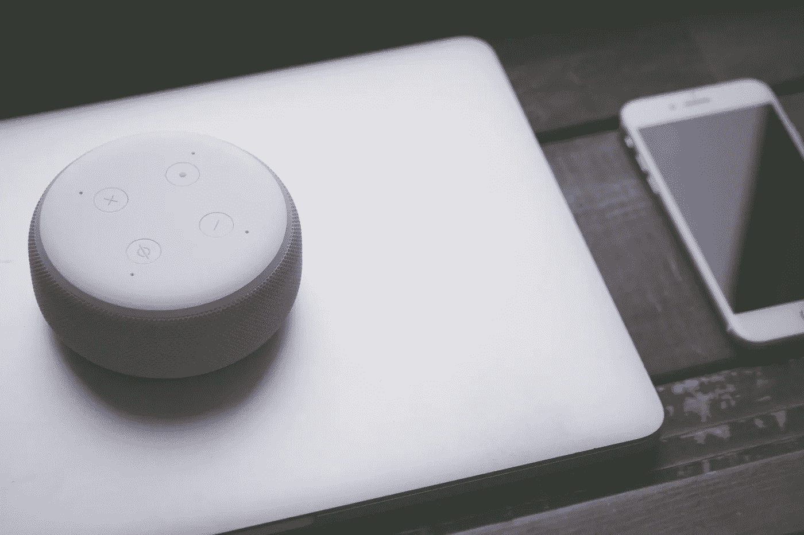
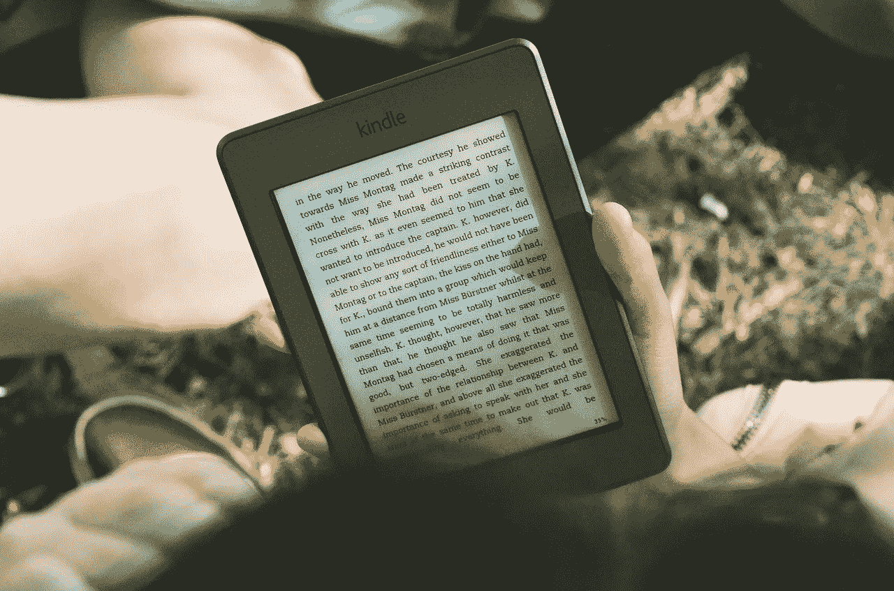
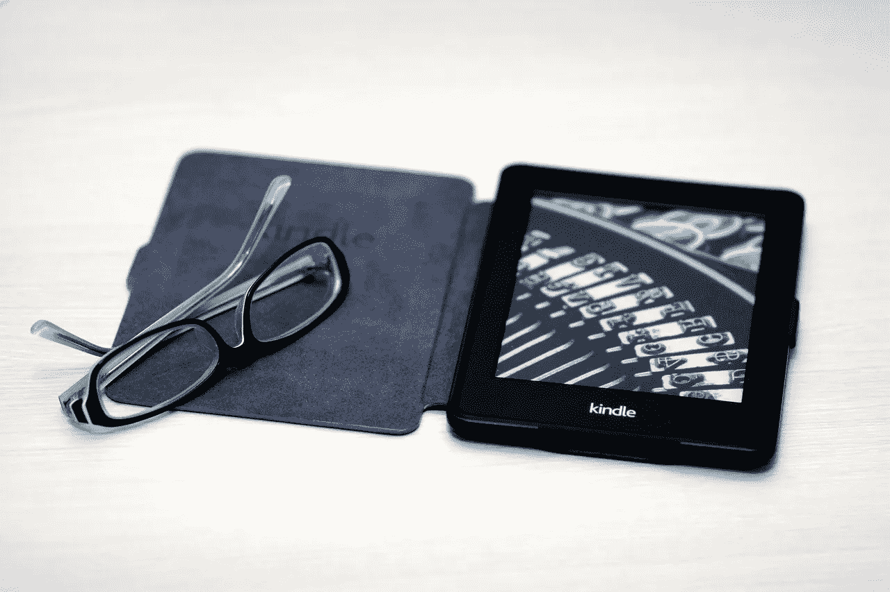
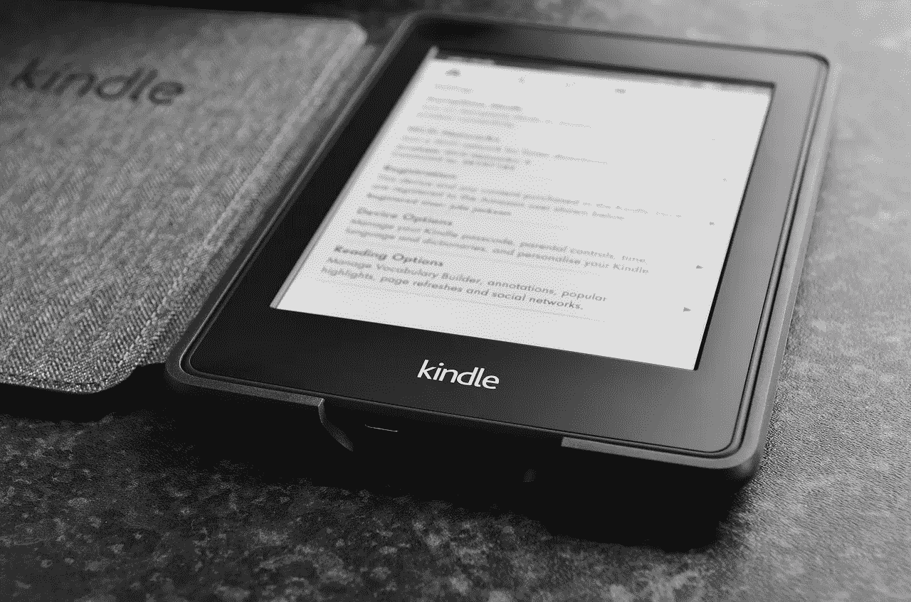
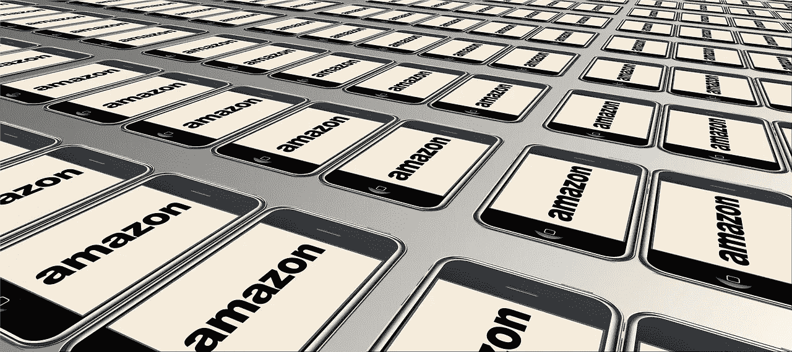

# 亚马逊拥有 412.5 亿美元现金

> 原文：<https://medium.datadriveninvestor.com/amazon-amzn-has-41-25-billion-in-cash-205e364e0388?source=collection_archive---------5----------------------->

亚马逊(Amazon)有 412.5 亿美元现金可供支配。具体来说，亚马逊在 2018 年 12 月 31 日报告了 317.5 亿美元的现金和等价物，以及 95 亿美元的短期投资。

因此，**亚马逊(NASDAQ: AMZN)** 在 2018 年底拥有 412.5 亿美元的银行存款。因此，亚马逊的现金储备超过了几个最著名的竞争对手的市值。

首先，**美元通用(NYSE: DG)** 在 2019 年 2 月 11 日的市值为 307.2 亿美元。其次， **Target(纽约证券交易所代码:TGT)** 当天市值 365.1 亿美元。

第三，**梅西百货(NYSE:M)**2019 年 2 月 11 日市值 77.83 亿美元。最后，**克罗格(NYSE:KR)**；美国最大的独立杂货商，2019 年 2 月 11 日的市值为 221.49 亿美元。

# **亚马逊可以用现金收购梅西百货、Dollar General、克罗格或塔吉特百货**

因此，亚马逊可以用现金收购塔吉特、梅西百货、Dollar General 或克罗格。

事实上，杰夫·贝索斯可以同时买下美元通用和梅西百货，或者克罗格和美元通用。贝佐斯之所以能做出这样的收购，是因为亚马逊(Amazon)拥有 412.5 亿美元的现金。

然而，由于政治后果，贝佐斯不太可能做出这样的举动。我认为，如果亚马逊进行此类收购，它将面临反垄断诉讼、总统诉讼，还可能面临国会立法。

# 亚马逊(Amazon)的现金增长迅速

另一方面，亚马逊的现金增长很快。例如，亚马逊在 2018 年 9 月 30 日报告了 284.25 亿美元的现金和等价物以及 93.4 亿美元的短期投资。

因此，亚马逊的现金在短短三个月内增长了 114.85 亿美元。事实上，亚马逊在 2019 年 9 月 30 日的银行账户中有 297.65 亿美元。因此，亚马逊可能会在 2019 年 5 月用现金收购塔吉特和达美。

我认为现金是亚马逊力量的真正来源，而且它正在急剧增长。例如，亚马逊的运营现金流从 2018 年第三季度的 85.88 亿美元增长到 2018 年第四季度的 164.77 亿美元。此外，亚马逊的自由现金流从 2018 年第三季度的 60.61 亿美元增长到 2018 年第四季度的 133.57 亿美元。

# **亚马逊正成为完美的现金投资**

因此，我认为亚马逊正在成为完美的现金投资，但它在其他金融领域表现如何。

值得注意的是，亚马逊报告 2018 年第四季度的毛利为 275.97 亿美元。此外，亚马逊 2018 年第四季度的营业收入为 37.86 亿美元，净收入为 30.27 亿美元。

令人印象深刻的是，Stockrow 基于第四季度 723.83 亿美元的收入，增长率为 19.73%。最后，亚马逊 2018 年第四季度的毛利率为 38.13%。

因此，以传统的价值投资参数衡量，亚马逊现在是一家非常赚钱的公司。然而，亚马逊(Amazon)不是传统的零售商或公司。

# **为什么其他零售商无法与亚马逊竞争**

我认为目前的财务数据表明其他零售商无法与亚马逊竞争。

例如，Target 在 2018 年第四季度的收入为 178.21 亿美元，现金和等价物为 8.25 亿美元。此外，在同一时期，Target 记录了 9 亿美元的运营现金流和-9300 万美元的负“自由现金流”。

因此，Target 只有 8.25 亿美元的额外现金，而亚马逊有 412.5 亿美元可供使用。因此，亚马逊的商业模式优于塔吉特百货。

值得注意的是，Target 需要在美国运营 1，850 家商店和 39 个配送中心，才能积累 8.25 亿美元。不出意外，目标是在 2019 年 2 月关闭 6 家门店，*商业杂志* [报道](https://www.bizjournals.com/twincities/news/2018/10/30/target-will-close-six-stores-in-early-2017.html)。

# 亚马逊(Amazon)如何比目标公司赚得更多

Target 无法与亚马逊竞争的一个原因是，它只有在顾客走进来购买时才赚钱。

另一方面，亚马逊通过 Amazon Prime 产生了大量的浮存金和销售额。具体来说，亚马逊向每位普通 Prime 会员收取每年 119 美元的费用。

令人难以置信的是，Statista 计算出亚马逊 Prime 客户平均每年在 Everything Store 消费 1400 美元。相比之下，非 prime 会员每年在亚马逊消费 600 美元。

因此，杰夫·贝索斯想出了如何向顾客收取在亚马逊花更多钱的特权。因此，贝佐斯是人类历史上最伟大的零售天才。

# 亚马逊拥有中产阶级购物者吗？

亚马逊 Prime 威胁到了像 Target 这样的零售商，因为它锁定了最富裕和最活跃的客户，让他们从 Everything Store 购买。因此，亚马逊垄断了中上层消费者的业务。

因此，像塔吉特百货、**沃尔玛(纽约证券交易所:WMT)** 和 Dollar General 这样的零售商可能很快就只能争夺穷人和未受过教育的人的生意了。与此同时，那些有钱受教育的人会在亚马逊进行大部分购物。

亚马逊拥有中产阶级购物者，因为它让他们有义务用 Prime 订阅从其网站上购物。解释一下，一个每月花 12.49 美元购买 Prime 的人会从亚马逊购买，以证明这笔支出是合理的。正如许多人在**Costco Wholesale(NASDAQ:COST)**购物来证明俱乐部商店的订阅。

# **亚马逊如何威胁每个人，甚至麦当劳和星巴克**

此外，亚马逊凭借快速交付、流媒体视频、轻松退货和大量库存，让 Prime 备受青睐。此外，亚马逊正在向 Prime 添加食品杂货、外卖和电器等产品。如果这还不够，亚马逊正在研究提供处方的可能性。

因此，Prime 现在对 Kroger 这样的超市，GrubHub(纽约证券交易所代码:GRUB) 这样的外卖服务，以及像**麦当劳(纽约证券交易所代码:MCD)** 这样的潜在餐馆构成了威胁。亚马逊可以通过在其全食超市门店做饭并让亚马逊餐厅送货上门来威胁麦当劳。

也不是麦当劳进入了亚马逊的视野。亚马逊甚至用它的无收银便利店威胁**星巴克(纳斯达克股票代码:SBUX)** 。Go 威胁星巴克，因为它出售咖啡和各种各样的预制食品。

# **亚马逊如何从 Go 中赚钱**

对星巴克的一个主要威胁是亚马逊向 Go 和全食超市的 Prime 会员提供咖啡折扣。更大的威胁将是从 Amazon Go 递送咖啡和饭菜的 Prime。

美国消费者新闻与商业频道[报道](https://www.cnbc.com/2018/12/14/heres-how-starbucks-plans-to-boost-us-sales-in-five-charts.html)，我认为亚马逊将提供咖啡外卖，因为星巴克声称它从外卖订单中多赚了 250 万英镑。因此，[亚马逊餐厅](https://www.amazon.com/restaurants/landing?sourceUrl=/restaurants&ref_=amzrst_ob_z)和 Go 以及亚马逊餐厅和全食超市的结合将会是有利可图的。

因此，亚马逊可以通过 Go 进入另一项高价业务。一个显而易见的赚钱方法是让商业客户通过 Go 订购咖啡和办公用品。值得注意的是，亚马逊有 412.5 亿美元的现金可以花在 Go 上。

# **亚马逊如何摧毁星巴克(SBUX)**

此外，亚马逊还可以通过亚马逊餐厅和全食超市的送餐咖啡来赚更多的钱。因此，我认为亚马逊可以迅速消灭星巴克的大部分业务。

并非巧合的是，前星巴克首席执行官[霍华德·舒尔茨](https://www.forbes.com/sites/jonbird1/2019/02/10/schultz-for-president-hot-water-for-starbucks-or-pure-froth/#37453cea4968)本可以选择一个好时机出售他的股份并进入政界。解释一下，如果舒尔茨竞选总统，他将不得不卖掉他的星巴克股票。

因此，舒尔茨的“公共服务”背后有一层非常愤世嫉俗的利己主义。他的真正动机可能是在亚马逊消灭咖啡帝国之前，找个借口卖掉他的星巴克股票。

# **亚马逊拥有 412.5 亿美元现金，因此它应该支付股息**

我认为亚马逊应该支付股息。具体来说，用于派息的资金以 412.5 亿美元的现金和等价物的形式存在。

然而，当亚马逊的股票交易价格为每股 1593.33 美元时，它没有理由支付股息。这是 2019 年 2 月 11 日的价格。解释一下，股息的标准原理是给人们一个为股票支付更多的理由。

因此，我认为杰夫·贝索斯批准分红还需要很长时间。然而，亚马逊仍然是一家伟大的公司，一只优秀的股票。尽管我认为市场先生高估了 AZMN 每股 1593.33 美元。

万物商店产生现金的能力证明了我们生活在亚马逊时代。因此，哲学家、政治家、神学家、政治学家和其他思想家将不得不决定亚马逊时代是否是一件好事。

这个故事最早出现在 [*商场疯人院*](https://marketmadhouse.com/) 。

## 来自 DDI 的相关故事:

 [## 为什么数据将改变投资管理——数据驱动的投资者

### 有人称之为“新石油”虽然它与黑金没有什么相似之处，但它的不断商品化…

www.datadriveninvestor.com](https://www.datadriveninvestor.com/2019/01/25/why-data-will-transform-investment-management/)  [## 股票市场投资的机器学习——数据驱动的投资者

### 当你的一个朋友在脸书上传你的新海滩照，平台建议给你的脸加上标签，这是…

www.datadriveninvestor.com](https://www.datadriveninvestor.com/2019/01/30/machine-learning-for-stock-market-investing/)