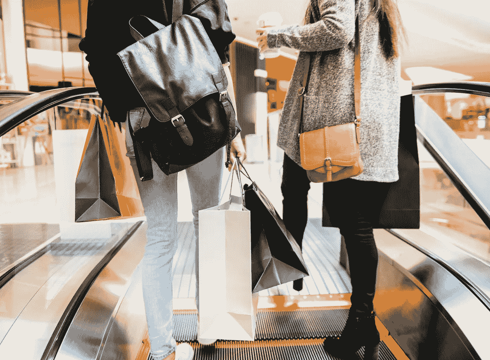
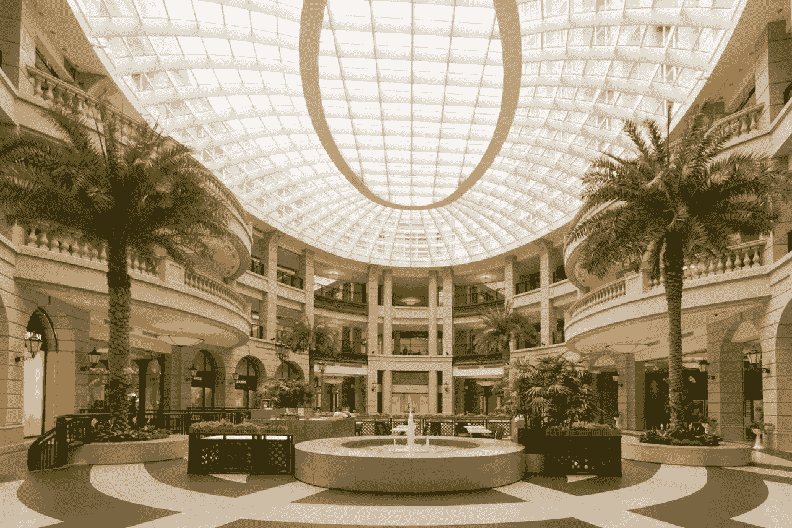
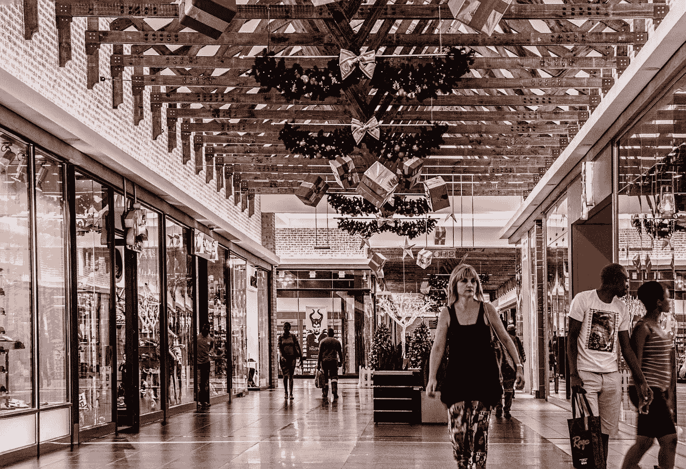
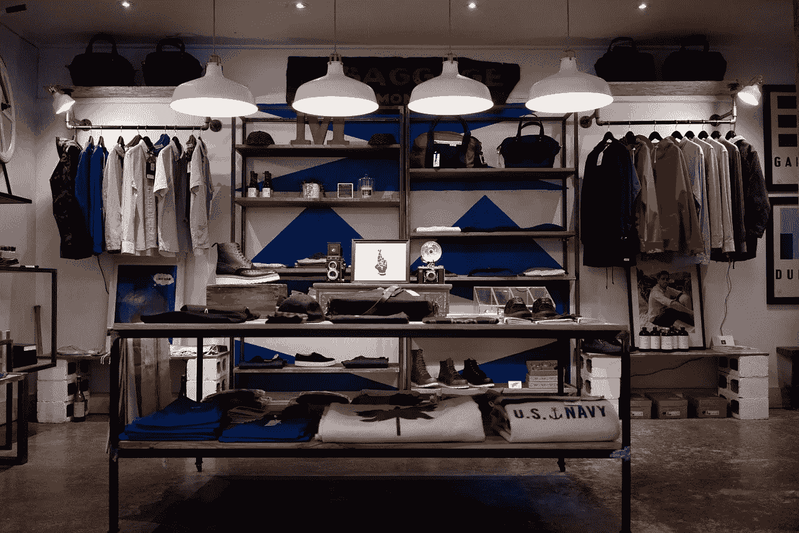

# 亚马逊(Amazon)拥有零售业务，有人能与之竞争吗？

> 原文：<https://medium.datadriveninvestor.com/amazon-amzn-owns-retail-can-anybody-compete-120fb8e0d60f?source=collection_archive---------21----------------------->

这些数字清楚地表明，亚马逊(Amazon)在 21 世纪拥有零售业。因此，我们需要问，有人能与亚马逊竞争吗？

那些怀疑亚马逊拥有零售业务的人需要看看数字。财务数字、电子商务数据和排名都在讲述同一个故事。亚马逊(NASDAQ: AMZN) 现在在线下都拥有美国零售业。

例如，Amazon.com 是美国最大的在线商店，2017 年销售额为 528 亿美元，Statista [估计](https://www.statista.com/chart/14043/top-10-online-stores-in-the-us/)。很明显，亚马逊的销售额几乎是最接近的竞争对手**沃尔玛(纽约证券交易所代码:WMT)** 的五倍。为了澄清统计数据，Walmart.com 在 2017 年的销售额为 140.1 亿美元。

只有沃尔玛能与亚马逊竞争

此外，美国九大在线商店 2017 年的总销售额比亚马逊的销售额少近 90 亿美元。具体来说，这些零售商是沃尔玛、**苹果(纳斯达克:AMZN)** 、**家得宝(纽约证券交易所:HD)** 、**梅西百货(纽约证券交易所:M)** 、**塔吉特(纽约证券交易所:TGT)** 、**美国柯尔百货公司(纽约证券交易所:KSS)** 、**好市多(纳斯达克:COST)** 和 Wayfair。

因此，在美国，唯一能与亚马逊竞争的公司是沃尔玛。因此，担心美国零售业垄断或双头垄断的批评家们说得有道理。因此，两家大型公司占据了网上零售的主导地位，其他任何公司都无法与之竞争。

值得注意的是，沃尔玛 2017 年的收入是第二大在线零售商苹果的两倍多。根据记录，2017 年，Walmart.com 的销售额为 140.1 亿美元，苹果的销售额为 62.7 亿美元。

可怕的是，一家公司必须是世界上最大的零售商，或者是地球上最有价值的公司才能与亚马逊竞争。愤世嫉俗者会说，如果苹果和沃尔玛无法与亚马逊竞争，其他零售商就没有机会了。

亚马逊会发展自己的实体零售吗？它应该会吓到实体零售商，因为 Amazon Go 可以产生类似于亚马逊本身的利润。

例如， *Brick meets Click* , [声称](https://www.brickmeetsclick.com/amazongo-s-retail-productivity--at-least--2700-sq-ft-selling-area---50-inventory-turns-year)Amazon Go 每平方英尺的年销售额可达 2700 美元。相比之下，Costar 估计沃尔玛 2018 年每平方英尺的年销售额为 325 美元。

因此，Amazon Go 每平方英尺的销售额可能是沃尔玛的七倍。然而，2017 年苹果商店每平方英尺的销售额是亚马逊 Go 的近两倍，为 5546 美元。

**亚马逊 Go 的销量真的超过了沃尔玛吗？**

如果 Brick Meets Click 的说法是真的，杰夫·贝索斯就有了一台新的赚钱机器，可以像亚马逊一样赚钱。

解释一下，Amazon Go 是亚马逊在美国推出的无收银员便利店。目前的计划是在未来几年内开设 3000 家亚马逊 Go 商店。

Brick Meets Click 的数字是有问题的，因为它们代表了西雅图的一个 Amazon Go 位置的销售额。因此，新奇可能会推动 Amazon Go 的大部分销售。因此，亚马逊可能不会复制西雅图的数据。

Amazon Go 的数字令人印象深刻，因为它只是沃尔玛超市的一小部分。此外， *Motely Fool* 撰稿人里奇·杜普利[指出](https://www.fool.com/investing/2018/11/10/the-incredible-amazon-go-number-that-only-apple-ca.aspx)，Amazon Go 出售有限的食品杂货和即食食品。

相反，Amazon Go 不卖沃尔玛超市里随处可见的高价商品。例如，在 Amazon Go 上没有电视机、冰箱、洗衣机、珠宝、智能手机、电锯和割草机。

还有，亚马逊 Go 地点屈指可数，美国有 5358 家沃尔玛。Statista [估计，具体来说，沃尔玛经营着 597 家山姆会员店、400 家折扣店、800 家社区市场和 3561 家购物中心。](https://www.statista.com/statistics/269425/total-number-of-walmart-stores-in-the-united-states-by-type/)

因此，亚马逊的数字令人印象深刻，但要赶上沃尔玛每平方英尺的销售额还有很长的路要走。然而，鉴于 Everything Store 在电子商务领域的记录，我对 Amazon Go 持认真态度。杰夫·贝佐的公司是一个强劲的竞争对手，习惯于兑现承诺。

**其他零售商已经在模仿 Amazon Go 了？**

Amazon Go 并不像博客圈宣称的那样具有革命性。值得注意的是，亚马逊正在用 Go 模仿美国零售业的一个长期趋势。

趋势是发展较小的专业商店，集中销售特定的利润丰厚的商品。有趣的是，这里的领导者是苹果商店，它像激光一样专注于高端电子产品。

事实上，像**特斯拉汽车公司(纳斯达克:TSLA)** 、**克罗格公司(纽约证券交易所:KR)** 、**梅西百货公司(纽约证券交易所:M)** 、**百思买公司(纽约证券交易所:BBY)** 、**微软公司(纽约证券交易所:MSFT)** 和**诺德斯特龙公司(纽约证券交易所:JWN)** 这样形形色色的公司都在模仿苹果商店。例如，多年来，特斯拉一直通过诺德斯特龙的[特斯拉商店和画廊](https://www.tesla.com/findus/list/stores/United%20States)以及购物中心销售汽车。

此外，梅西百货还经营着一家高端水疗和化妆品商店。此外，Nordstrom 正在开发 [Nordstrom Local](https://shop.nordstrom.com/c/nordstrom-local) ，它将 spa 和剪裁与送货到店订单的取货结合起来。

克罗格不甘示弱，在其市场上经营着弗雷德·迈耶斯珠宝店。与此同时，百思买允许苹果商店进入其电子产品商店。甚至微软也经营实体店[微软商店](https://www.microsoft.com/en-us/store/locations/find-a-store)。

在这种情况下，Amazon Go 是长期零售趋势中一切商店的参与者。因此，亚马逊是一个创新的零售商，而不是一个革命性的力量。

亚马逊给零售商带来的危险

Amazon Go 对传统零售业是一个巨大的威胁，因为 Everything Store 有足够的资金来实现这一概念。

例如，亚马逊在 2018 年 9 月 30 日记录了 204.25 亿美元的现金和等价物。相反，克罗格在 2018 年 8 月 18 日记录了 3.61 亿美元的现金和等价物。

因此，亚马逊有钱装备、配备员工、储备和开设数千个 Go 地点。重要的是，Everything Store 不用借钱就能开几百家 Go 店。

锦上添花，如果亚马逊要发债；或者借钱，因为有现金，利率会更低。亚马逊的借贷成本低；因为它在 2018 年 9 月 30 日记录了 93.48 亿美元的短期投资。因此，亚马逊当天在银行有 297.65 亿美元。

因此，如果 Kroger 的管理层想开设无收银员便利店，它将不得不借钱或出售资产。此外，Nordstrom 将不得不借款开设大量的当地分店。

很明显，Nordstrom 在 2018 年 8 月 4 日记录了 13.43 亿美元的现金和等价物。此外，Kroger 和 Nordstrom 都没有报告在 2018 年第三季度末有任何短期投资。

**零售商如何与 Amazon Go 竞争**

在这种情况下，来自 Amazon Go 的真正威胁不是新技术、概念或 Amazon 名称。反而是亚马逊的现金。

因此，百思买和 Nordstrom 与其他零售商合作的策略比开设独立的小型商店更有意义。例如，Best 在其商店中销售苹果手机和亚马逊电视。

因此，Kroger 的一个聪明策略是邀请特斯拉商店、微软商店、Nordstrom Local、Bluemercurry、苹果商店和潜在的 Amazon Go 或者一个亚马逊消防电子商店，进入它的[市场](https://www.kroger.com/topic/kroger-marketplace)。此外，Nordstrom 的一个明智之举是在城市地区开发 Nordstrom Local/Apple 或 Nordstrom Local/Amazon 商店。

亚马逊凭借其规模和资金正在改变美国零售业的面貌。投资者必须注意，因为 Amazon Go 可能会彻底扰乱美国及其他地区的实体零售业。因此，在可预见的未来，亚马逊在美国拥有零售业。

*原载于 2018 年 11 月 15 日*[*marketmadhouse.com*](https://marketmadhouse.com/amazon-amzn-owns-retail-can-anybody-compete/)*。*

