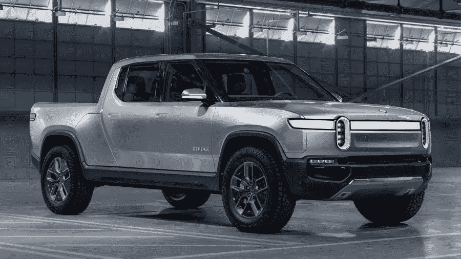

# 亚马逊和通用汽车可能会创建下一代汽车操作系统。

> 原文：<https://medium.datadriveninvestor.com/amazon-and-possibly-gm-to-create-next-vehicle-os-1bf1b7994cad?source=collection_archive---------7----------------------->

2019 年 2 月 15 日星期五，宣布亚马逊是 Rivian Motors 7 亿美元融资轮的领投人。此前，有一个来自路透社的传言说，通用汽车也参与了这一轮，所以这方面可能尚未公布。

这一声明在汽车行业具有非常重要的意义，对我来说，它表明亚马逊和通用汽车可能正在合作创建下一代汽车操作系统。通用汽车拥有一家名为 Cruise Automation 的初创公司，该公司花了数年时间开发汽车自主软件，亚马逊正在开发汽车 Alexa，以及亚马逊 Prime 音乐和亚马逊 Prime 视频内容形式的内容。这一声明对软件开发商也具有重要意义，因为亚马逊 Alexa 语音 UI 要求为所有互联网接入构建全新的应用程序——它成为了一个全新的语音互联网。虽然亚马逊 Echo(家庭扬声器)已经部分做到了这一点，但应用程序(称为技能)的质量仍有待提高，汽车的加入(通过购买 API 进一步商业化)将在未来显著提高质量。

虽然苹果也花了几年时间在他们名为 Titan 的秘密项目中开发类似的东西，但我仍然认为他们仍然需要一年左右的时间才能推出任何东西——这不太可能是一辆汽车，正如一些人所说的那样，但更有可能是一个汽车操作系统，可以授权给现有的汽车制造商，像汽车的 Home Pod 一样，或许称为 Car Pod，作为内置硬件，Siri 用于语音访问内容以及控制汽车。

这一领域的另一个参与者是 Alphabet(谷歌)，他们的 Waymo(自动驾驶软件)产品目前被添加到现有的汽车上，用于 Waymo 出租车服务和谷歌 Home/谷歌助手产品，用于语音应用程序和内容。

与此同时，特斯拉正在为他们的汽车自己构建这些汽车操作系统组件。鉴于他们在 2012 年从 Model S 开始，并为所有车型实施相同的软件，他们正在为自己的汽车创建自己的操作系统。他们能把这个软件授权给其他制造商吗？有一个与梅赛德斯合作生产面包车的传闻，但时间会告诉我们这是否会发生。

我觉得这四个汽车操作系统是所有汽车的未来解决方案。大型汽车制造商可能会尝试自己实现这一功能，但从长远来看，他们不太可能成功，因为他们无法跟上这四大公司提供的所有功能。看看这个星期，特斯拉在他们的操作系统中增加了两个新功能，称为“狗模式”和“哨兵模式”，可以为独自留在车内的狗提供空调，并在空车时对汽车进行软件监控(高级汽车警报)。每隔几周，特斯拉就会用新功能升级他们的汽车。

对于个人电脑和手机来说，世界开始时有多个操作系统，但随着时间的推移，这种情况已经减少到只有两个操作系统。有一种观点认为，汽车操作系统也会发生同样的情况，但我认为，相反，它会从 4 个以上减少到 4 个以上，因为这 4 家公司都已经在自己的软件世界中占据主导地位。

目前还不清楚亚马逊的声明如何有利于通用汽车，但它显然有利于他们的全资子公司 Cruise Automation，如果他们使用 Rivian 滑板硬件(这是电池电动汽车硬件)，他们可以比现有计划更快地建立一个电动汽车家族。或许更极端的预测是，亚马逊将在 5-8 年内收购通用汽车。对于其他现有的汽车制造商来说，这些变化，以及电池电动汽车的出现，将产生巨大的影响——将会出现整合，仅仅是因为汽车产量将会减少(因为许多所有者将是出租车公司，而不是普通消费者)。采用新技术最慢并试图创建自己的汽车操作系统的公司将会破产，幸存下来的公司将很快采用四大汽车操作系统之一，并停止生产旧的内燃机汽车。

对于汽车操作系统来说，现在还为时尚早，因为这个概念仍处于萌芽阶段，但我相信这个概念将在未来几年内成为一个广为人知的概念，现有汽车制造商的这些巨大变化将与过去 20 年印刷行业和音乐行业的技术变化一样极端。