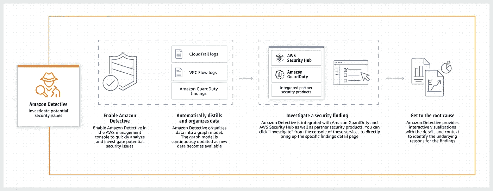
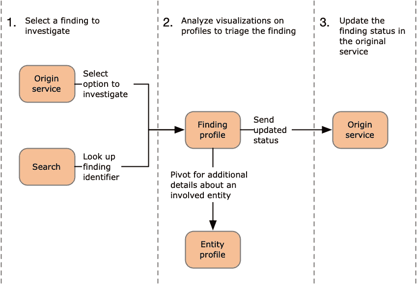

# 亚马逊侦探——安全调查的新服务

> 原文：<https://medium.datadriveninvestor.com/amazon-detective-new-service-in-security-investigation-42e979243eef?source=collection_archive---------6----------------------->

另一个有趣的 AWS 服务是在 2019 年拉斯维加斯亚马逊大会上推出的——亚马逊侦探，它的名字揭示了它执行的功能。

 [## 今年值得关注的 5 大人工智能趋势|数据驱动的投资者

### 预计 2019 年人工智能将取得广泛的重大进展。从谷歌搜索到处理复杂的工作，如…

www.datadriveninvestor.com](https://www.datadriveninvestor.com/2019/02/19/artificial-intelligence-trends-to-watch-this-year/) 

Amazon Detective 可以轻松分析并快速发现潜在保护问题或可疑活动的根本原因。Amazon Detective 自动从您的 AWS 资源中收集日志记录，并使用机器学习、统计分析和图形概念来建立一组相关的事实，允许您毫无困难地进行更快的行为和额外的安全调查。

除了共犯安全产品之外，Amazon GuardDuty、Amazon Macie 和 AWS Security Hub 等 AWS 保护服务可用于感知能力保护问题或发现。这些服务实际上是有益的，当某些东西不准确时，它们会提醒你，并告诉你如何修复它。确定保护发现的根本原因可能是一项包罗万象的技术，通常需要收集和混合来自许多独立事实资源的日志，使用提取、转换和加载(ETL)工具或自定义脚本来组织信息，之后安全分析师必须研究事实并进行长时间的调查。
AWS Detective 简化了这一系统，使您的安全小组能够毫不费力地查看并快速找到发现的基本目的。Amazon Detective 可以分析来自几个信息资源以及虚拟私有云(VPC)流量日志、AWS CloudTrail 和 Amazon GuardDuty 的数万亿次活动，并自动创建一个统一的交互式视图，显示您的资产、用户以及它们之间多年来的交互。有了这个统一的视图，您可以在一个地方可视化所有的细节和上下文，以了解调查结果的潜在动机，深入了解适用的历史活动，并快速确定根本原因。

# 它是如何工作的？

*   01 第一步是选择要分类的发现。在 GuardDuty 或 AWS Security Hub 中查看发现时，分析师可以选择在 Detective 中调查该发现。
*   02 在 Detective 中，分析师可以使用 Detective 搜索功能查找并选择要分类的结果。选择调查结果会将分析师带到 Detective 中的调查结果配置文件。
*   03 发现配置文件包含一组可视化。可视化是从行为图生成的。行为图是从日志文件和其他输入到 Detective 的数据中创建的。大多数可视化显示与发现中涉及的一个或多个实体相关的活动。分析师使用这些可视化来回答对完成调查结果的分类至关重要的问题。
    为了帮助指导分类，分析师可以使用为每个可视化提供的检测指导。该指南概述了显示的信息，建议分析师提问，并根据答案提出后续步骤..
    从调查结果概要信息中，分析师可以透视到实体概要信息，以更深入地了解调查结果中涉及的特定资产。
*   04 一旦他们确定一个发现是真还是假阳性，分析师就在原始服务中更新发现状态。对于警戒调查结果，侦探提供了一个选项来存档调查结果。你可以在亚马逊官方网站上找到关于该产品及其文档的更完整的信息。

*原载于***。**