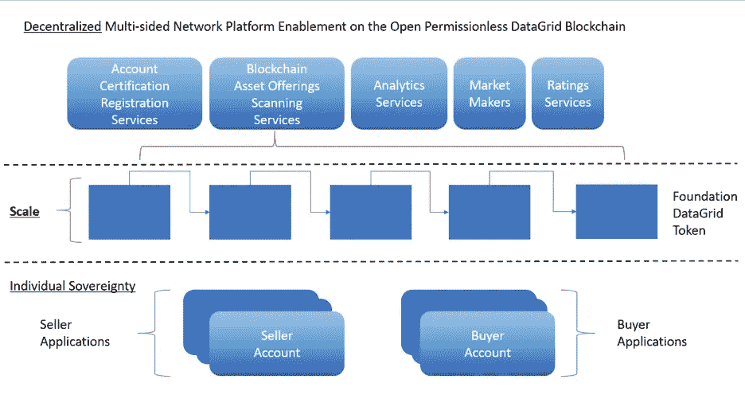

# 区块链上的亚马逊、易贝、纳斯达克？

> 原文：<https://medium.datadriveninvestor.com/amazon-ebay-nasdaq-on-a-blockchain-5ec7ece41f05?source=collection_archive---------9----------------------->

# 构建分散、分布式、开放的多租户、多边市场支持平台

作者:首席技术官大卫·贝伯曼

在 Tren Griffin 在他的博客 25iq 上发表的一篇文章“我学到的关于多边市场(平台)的十几件事”[【1】](https://medium.com/@michael_11858/amazon-ebay-nasdaq-on-a-blockchain-ed56383c0626#_ftn1)中，他将多边市场定义为多个参与者相互直接互动的平台。他举了 LinkedIn、优步、易贝、Airbnb 等例子。这些都是多边市场(“MSM”)的例子，但我们将它们进一步区分为多边市场集中平台。

随着可扩展区块链对象模型 TM(“xbo MTM”)和可扩展智能对象资产 TM(“XSOAtm”)在数据网格区块链 TM(“DG btm”)上的创新，现在可以创建多边市场去中心化使能平台。

 [## Azbit 旨在连接传统金融和加密货币-数据驱动的投资者

### Azbit 是下一个提供交易平台的加密项目，该平台提供保证金和算法交易。一样多…

www.datadriveninvestor.com](https://www.datadriveninvestor.com/2019/03/20/azbit-aims-to-connect-traditional-finance-and-cryptocurrency/) 

下文概述了广义资产(如实物、金融工具等)多边市场的分散平台。).

**DGB-亚马逊湾**

为了给出一个去中心化的 MSM 可能是什么样子的概念，让我们使用一个虚构的 MSM 公司，它的显著特征，以及它们如何在一个去中心化的支持平台 DGBtm 上运行。让我们称这家公司为 DGB 亚马逊公司。DGB 亚马逊希望其多边市场具有以下特征:

搜索待售商品(实物产品、数码产品、服务等)。)

o 这些东西的定价

购买——支付物品的交换方式

法规——指遵守法律、法规和规则，以便在卖方和买方可能互动的任何和所有司法管辖区开展商业活动

评级——对卖方和买方的质量进行评级的方法

分析——各种统计、算法、机器学习等。应用于关于市场的“元数据”

个人主权——市场不控制(即保管)待售商品、付款或卖方的“商店”

可扩展性——分散式支持平台必须扩展以支持全球市场和社区

让我们分别来看看这些特性。

**搜索**

发现待售商品是任何商务活动的先决条件。在集中式在线市场中，待售物品被上传并存储在集中式数据库服务器中。发现由集中式市场服务器的客户端的数据库查询组成。

对于分散的 DGB-亚马逊湾，销售项目由卖家账户单独添加到区块链。然而，我们虚构的 DGB-亚马逊湾需要为买家提供一种找到待售商品的方法。为此，它会持续扫描区块链，并提供一个可供客户端查询的搜索工具。

与集中市场相比，分散的 DGB-亚马逊网站的搜索服务可以组织这些项目，但不控制任何项目或账户。

**采购**

一个集中的网上市场在物品的买卖双方之间扮演中间人的角色。例如，它可以为买方提供多种支付方式。它还可以用多种货币为商品定价，也许在内部提供货币兑换。它还为买方存储关于支付信息的信息，这产生了隐私责任。

对于我们虚构的分散的 DGB-亚马逊湾，所有的购买和销售交易都直接发生在区块链上的商品的卖方和买方之间。由于所有商品都以区块链的本地加密硬币 DGTtm 定价，因此支付方式简化为将硬币从买方转移到卖方账户。通过消除中间人，分散的 DGB-亚马逊湾市场对物品的转移或付款都没有责任。也就是说，DGB-亚马孙河流域公司从来不保管这些物品或付款。

**法规**

集中式在线市场必须遵守其运营所在司法管辖区的法律、法规和规则。要做到这一点，它必须登记其市场中的所有参与者，并对其经营所在的每个管辖区进行管理。所有相关信息必须存储在其中央数据库中，供所有参与者互动使用。

我们虚构的分散的 DGB-亚马逊湾也必须遵守管辖区的法律、法规和规则。然而，遵守是基于帐户授权认证，这是卖方和买方帐户的一部分。对于一个商业实例，DGB-亚马逊湾不承担管辖权、卖方和买方账户的责任，相关的智能对象资产管理直接管理这些责任。然而，DGB-亚马逊湾可以向卖方和买方提供关于司法管辖区的咨询信息。

**收视率**

一个 MSM 需要一些评估市场参与者(即卖家和买家)的方法。这是通过某种形式的评级系统来实现的。从抽象的角度来看，这可能是一个实际的数字评级，张贴评论，或其他一些手段。集中式在线市场提供评级系统，该系统可以针对市场中的一种或多种类型的参与者(即，卖方、买方或两者)。集中式市场维护其自己的带有评级信息的集中式数据库，并且可以自行编辑和审查该数据库。

我们虚构的分散的 DGB-亚马逊湾使用直接来自区块链的信息提供各种形式的评级。此类信息可包括销售数量、账户寿命以及对评估卖方和买方账户有用的其他类型的数据。此外，它可以为参与者提供独立的服务，以提供账户的审查和评级。在这种情况下，DGB-亚马逊湾作为一个混合的分散和集中的服务。

**分析**

一个集中的在线市场直接或通过出售对其数据的访问来创建所有自己的分析。中央市场自行控制、编辑和审查。到现在为止，这听起来应该很熟悉。

与此同时，我们虚构的分散式 DGB-亚马逊湾直接使用来自区块链的信息提供分析服务。它可能向区块链账户持有人或其他客户提供分析服务。由于它使用去中心化的区块链，账户和其他客户并不依赖 DGB-亚马逊湾作为唯一的分析来源。

**个人主权**

在 MSM 的上下文中，我们所说的个人主权[【2】](https://medium.com/@michael_11858/amazon-ebay-nasdaq-on-a-blockchain-ed56383c0626#_ftn2)是指账户所有人对自己的资产和货币拥有控制权。一个集中的在线市场不提供个人对用户账户的主权。集中式在线市场可以随时终止、审查或以其他方式影响用户的账户。

我们虚构的去中心化的 DGB-阿马兹贝不拥有任何账户的所有权。因此，它不直接控制任何相关资产或货币。它促进区块链多边市场的个人主权。

**交易可扩展性**

一个成功的 MSM 期望有越来越多的用户和越来越多的交易。如果使能平台不能随着用户和交易而扩展，市场可能会到达一个失败点。集中式市场通过集中式服务器解决方案解决了这个问题。这包括分布式数据库服务器、负载平衡和类似的支持平台解决方案。

如果我们虚构的去中心化 DGB-亚马逊湾想要成功，它的去中心化支持平台必须与账户和交易一起伸缩。幸运的是，DGBtm 亚马逊湾碰巧选择了 DGBtm 作为其在区块链的支持平台。因此，DGBtm 内置了交易和账户可伸缩性，DGBtm 亚马逊海湾可以专注于自己的运营，而无需担心这一点。

**可分性和竞争性多边市场**

我们为虚构的 DGB-亚马逊湾描述的特征还有一个方面，即可分性。每一个功能:搜索、购买、评级、分析和监管都是相互独立的。建立在一个分散的平台上使得市场业务之间能够竞争。竞争环境促进进步。每一项功能都可以被想象成竞争环境中完全独立的业务。

**应用于多边市场的分散式支持平台**

综上所述，下图描绘了所涉及的各种组件的框图。还包括做市商的概念。根据 MSM，可能有一个或多个做市商的机会。也就是说，在需要的时候，通过站在交易的对立面来促进有效的分散市场的实体。

**分散的多边市场 vs 扁平的多边市场和个人主权**

加密货币被认为是法定货币的答案。随着这篇黑客 noon 的文章《比特币:客厅革命》[【3】](https://medium.com/@michael_11858/amazon-ebay-nasdaq-on-a-blockchain-ed56383c0626#_ftn3)所描述的对法定货币的担忧，作者 Farbood Nivi 指出，法定货币的货币政策是在政府(民主、独裁者、君主等)的控制之下。).

我们同意加密货币是对法定货币的一种回答。但我们认为，这只是关于个人主权的更广泛答案的一部分。为了让一种货币作为商业手段被接受，企业和个人必须愿意接受它。如果市场不接受货币作为商业手段，那么这种货币就不能在社会上使用，不管它是加密的还是法定的。

我们认为，现存的所有集中的多边市场形成了一种寡头政治。人们可以把它们看作集中的菲亚特 MSM。在这种情况下，术语“法定”既意味着 MSM 接受法定货币，也意味着作为一个中央市场，它通过自己的内部法定货币来控制接受何种货币。

由于只有少数在线商务网站占据着巨大的主导地位，禁止接受加密货币会极大地限制其被广泛接受。请进一步注意，政府可以通过法令禁止其管辖范围内的企业接受加密货币。

上述分散的多边市场概念可以通过两种方式帮助提高加密货币的接受度:如果集中的多边市场寡头本质上抵制加密，则分散解决方案的启用将有助于打破表面上寡头的控制；并且如果政府通过法令禁止加密 MSM，个人对资产的主权使得私人资产交易能够继续。

我们并不建议或期望取消或绕过司法法规。相反，我们认为去中心化的 MSM 是促进个人主权和更公平、更包容的社会的另一个方面。

DataGrid Blockchaintm、DGBtm、DataGrid Tokentm、DGTtm、Extensible block chain Object model TM、XBOMtm、Extensible Smart Object Assettm、XSOAtm、Smart Objecttm、Extensible Signature Objecttm、XSIGtm 是 Prasaga，LLC 的商标。保留所有权利。【www.prasaga.com】info@prasaga.com

[【1】](https://medium.com/@michael_11858/amazon-ebay-nasdaq-on-a-blockchain-ed56383c0626#_ftnref1)[https://25iq . com/2016/10/22/a-打-things-ive-learn-about-multi-sided-markets-platforms/？subscribe = success # blog _ subscription-2](https://25iq.com/2016/10/22/a-dozen-things-ive-learned-about-multi-sided-markets-platforms/?subscribe=success#blog_subscription-2)

[【2】](https://medium.com/@michael_11858/amazon-ebay-nasdaq-on-a-blockchain-ed56383c0626#_ftnref2)[https://en.wikipedia.org/wiki/Self-ownership](https://en.wikipedia.org/wiki/Self-ownership)

[【3】](https://medium.com/@michael_11858/amazon-ebay-nasdaq-on-a-blockchain-ed56383c0626#_ftnref3)[https://hacker noon . com/bit coin-the-living-room-revolution-9 acdf 521295 e](https://hackernoon.com/bitcoin-the-living-room-revolution-9acdf521295e)

*原载于 2019 年 6 月 20 日*[*https://medium.com*](https://medium.com/@michael_11858/amazon-ebay-nasdaq-on-a-blockchain-ed56383c0626)*。*